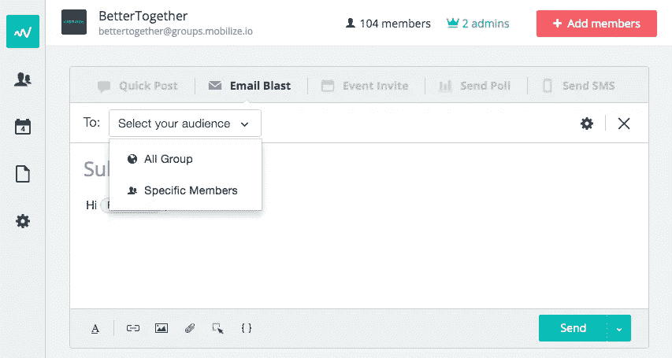
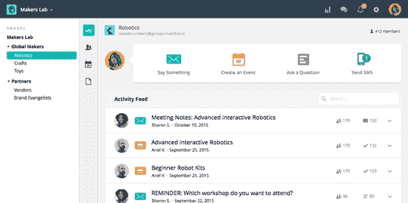
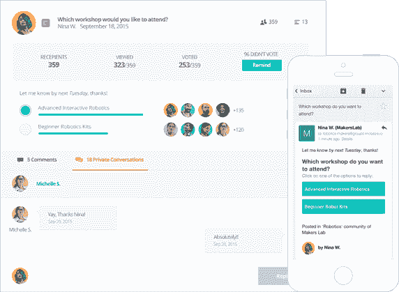
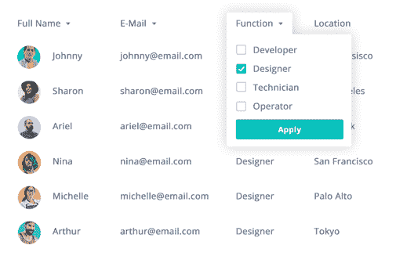
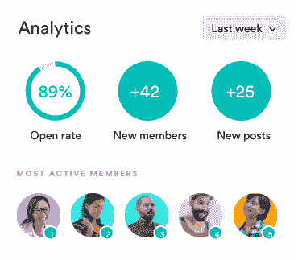

# 移动——谷歌群组的更好选择

> 原文：<https://medium.com/hackernoon/mobilize-a-new-alternative-to-google-groups-186f2c3a5204>

如果你正在管理一组成员/合作伙伴，我的初创公司[**Mobilize(Mobilize . io)**](https://www.mobilize.io/?utm_source=medium.com&utm_medium=referral&utm_campaign=ggroups)将 CRM+消息传递+强大的权限结合在一起。

这就像取代了[谷歌](https://hackernoon.com/tagged/google)群组、Mailchimp、[脸书](https://hackernoon.com/tagged/facebook)群组、谷歌注册表格、电子表格、活动、涂鸦投票、群组短信和文件共享**，所有 9 个整合为一个**，加上内置的分析。

## *有史以来第一个为群组通信设计的平台，从独立群组到企业网络。*

适用于专业网络、市场/点播网络、共享经济、经销商、开发者关系、学生或校友团体、奖学金、加速器或风投、共同工作空间、Hoa、众包公司、企业专家计划、志愿者以及合作伙伴或供应商管理。

Mobilize 的群体交流平台正在帮助客户(微软，谷歌，Etsy，Prezi，Seedcamp，Vinted，甚至特奥会家长社区！)来组织和联系成员或合作伙伴，方式远比 Google Groups 复杂。

Rebecca Saylor, SF Etsy, Team Lead

> 我已经准备好了一个简单的方法来管理所有当地的 Etsy 卖家，活动日历，并进行有意义的社区讨论。

# [**链接此处报名**](https://www.mobilize.io/?utm_source=medium.com&utm_medium=referral&utm_campaign=ggroups)

或者给我发个纸条，michelle@mobilize.io:)

**通信**仪表板的快速预览:

以下是**电子邮件**在平台上的样子，以及收件人在普通电子邮件中的样子(人们也可以通过电子邮件回复调查):

在**数据库**端，你可以拥有无限的字段和标签，它们被嵌入到电子邮件系统中:

您还可以获得整个网络的分析数据(如果您有多个子组，这很好)

# 来看看， [mobilize.io](https://www.mobilize.io/?utm_source=medium.com&utm_medium=referral&utm_campaign=ggroups)

> [黑客中午](http://bit.ly/Hackernoon)是黑客如何开始他们的下午。我们是 [@AMI](http://bit.ly/atAMIatAMI) 家庭的一员。我们现在[接受投稿](http://bit.ly/hackernoonsubmission)，并乐意[讨论广告&赞助](mailto:partners@amipublications.com)机会。
> 
> 如果你喜欢这个故事，我们推荐你阅读我们的[最新科技故事](http://bit.ly/hackernoonlatestt)和[趋势科技故事](https://hackernoon.com/trending)。直到下一次，不要把世界的现实想当然！

