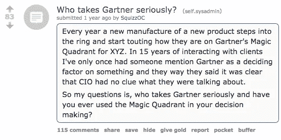

# 嘲笑魔力象限，后果自负

> 原文：<https://medium.com/hackernoon/mock-the-magic-quadrant-at-your-peril-fb4b0e1752a5>

*由* [*米卡*](https://twitter.com/micahjay1) *，搭档*

IT 咨询公司 [Gartner](http://www.gartner.com/technology/home.jsp) 每年都会发布一系列的“[魔力象限](http://www.gartner.com/technology/research/methodologies/research_mq.jsp)”报告，对几十个模糊的产品类别进行详细分析，从*单实例 ERP*到*集成工作场所管理系统*。

A “Magic Quadrant” classifies vendors as Leaders, Challengers, Visionaries, or Niche suppliers and plots them according to the robustness of their offering and the company’s ability to execute. Dumbledore is unimpressed.

对于 B2B 社区的许多人来说，这些报告是“成功或失败”的，然而该图表的陈腐名称和初创公司对待它的严肃态度使得嘲笑[魔力象限](https://twitter.com/chrissyfarr/status/522187852663123969)成为[时尚](https://twitter.com/hondanhon/status/887180435268157441)。

Two startups worth a combined $35B, that’s who. [Source](https://www.reddit.com/r/sysadmin/comments/4qgcmv/who_takes_gartner_seriously/?st=j7kreakm&sh=831d8dc4).

这样做后果自负。

对于许多 B2B 公司来说，在右上象限赢得一个位置相当于赢得一个海斯曼奖、一个奥斯卡奖和发现圣杯。记者们喜欢拿这个开玩笑，但是[帕洛阿尔托网络](https://www.paloaltonetworks.com/)和 [ServiceNow](https://www.servicenow.com/) ，这两个 2011-2015 年间最赚钱的 IPO[，总价值 350 亿美元，都把他们在著名的 2x2 地块上的位置作为他们的*主要卖点*。也许他们知道一些象限的批评者不知道的事情。](https://techcrunch.com/2016/10/15/overdosing-on-vc-lessons-from-71-ipos/)

Not only are they proud of being in the quadrant, they’re six-time champs!

ServiceNow, a company with an $18.6B market cap, rests their entire “above the fold” sales pitch on their placement on the Magic Quadrant.

就连以通过 Twitter 妙语提供商业建议而闻名的企业创始人艾伦·列维(Aaron Levie)在分析师电话会议上也对魔力象限表示了忠诚。

# 敢无聊

尽管名字很荒诞，但“魔力象限”却令人惊讶地司空见惯。你知道没有人会因为收购 IBM 而被解雇吗？魔力象限为财富 500 强中的 IT 购买者提供相同的“CYA”保护。

IT 领导者被来自组织各个角落的请求所困扰；对遗留 EDI 系统的修复，他们的营销人员对数据仓库集成要求和关键任务安全防御有疑问，以应对不断变化的威胁环境。随着软件变化的速度，很难期望任何人能跟上不断发展的软件环境。因此，在决定与谁合作成为长期技术提供商时，他们通常会求助于这些报告，这些报告有助于向首席执行官和首席财务官证明购买的合理性。

这里有值得学习的东西。初创公司的创始人喜欢追逐热门趋势，例如最近对 ico 的狂热，短暂的聊天机器人时刻，以及在一切之上喷洒“人工智能”。太多的创始人错过或忽视了乏味的产品开发、苦干的销售工作和老派营销带来的乏味但利润丰厚的机会。保罗·格拉厄姆称之为“[沉重的失明](http://www.paulgraham.com/schlep.html)”，这是一种让企业家损失数十亿美元的缺陷。

[一些批评家说](http://www.cmswire.com/cms/information-management/vendor-sues-gartner-over-magic-quadrant-pay-to-play-model-026133.php)魔力象限报告是“付费游戏”，但最终，公司会因为开发了强大的功能集和建立了能够为客户服务的组织而获得奖励。不需要魔法，公司只需要运送产品。

# **理解后产品狩猎世界**

每一代 B2B 软件都会产生一类新的企业工具来取代上一代。拿 CRM 来说。在我的第一家公司，我们用[金矿](https://www.goldmine.com/small-business-contact-management-crm/?gclid=CKLNwMvAoNYCFdGIswodZ_QOoA)。现在我们使用 Salesforce。Oracle 产生 Workday。随着越来越多的员工希望在自己的设备上工作，我们已经看到 Slack、Trello 和 Dropbox 等初创公司的爆炸式增长，以满足这些需求。变化的速度正在迅速加快。

公司的 IT 领导必须决定这些产品中的哪一个值得为变更管理、安全风险的增加等等付出努力。在达到逃逸速度之前，许多这些新服务的真正价值定位是不清楚的。例如，作为一名风投，我想如果我在早期听到 Dropbox 的推介，我(非常愚蠢地)不会被他们简单的存储解决方案所强迫。我敢肯定，IT 经理们的最初反应是一样的，数百万员工的情况更糟。这有助于拥有一个值得信赖的第三方，提供一个客观的视角。

# 搜索出你的“魔力象限”

B2B 领域有一场辩论，是专注于在现有市场内竞争更有意义，还是试图从头创建一个市场更有意义。你是应该努力提高你在魔力象限中的位置，还是建立一些与众不同的东西，以至于 Gartner 不得不创建一个新的？[卡拉·诺特曼](https://twitter.com/karanortman?ref_src=twsrc%5Egoogle%7Ctwcamp%5Eserp%7Ctwgr%5Eauthor)(来自[风险投资](https://upfront.com/))在推特上发布了以下建议:

向风投、媒体和员工讲述一个变革的故事来激发他们的热情是没问题的，但归根结底，你的工作是部署软件。即使你幸运地摆脱了魔力象限的判断，也很有可能会有一些基本的、潜在的令人厌烦的功能可以被构建出来，而这些功能将会带来意想不到的利润。在 B2B 中，[被祝福的是“无聊”](https://hackernoon.com/blessed-are-the-boring-9fb800eca775)

这些 B2B 的创始人没有酷消费者的创始人受到那么多的压力。你不会在播客上听到“保险理赔管理软件”的广告。(如果有，跳过它们！)但从许多方面来看，这是风险/初创企业世界最接近永恒不变的法则。随着技术栈和工人习惯的每一次改变，许多新的(看起来很无聊的)大型企业公司将被建立起来，并牢牢地扎根在魔力象限中。这些都是值得建立和加入的事业。

魔力象限帮助 Gartner 成为一家 110 亿美元的公司。事实证明，在淘金途中，不仅镐和斧很有价值，市场研究人员也很有价值！