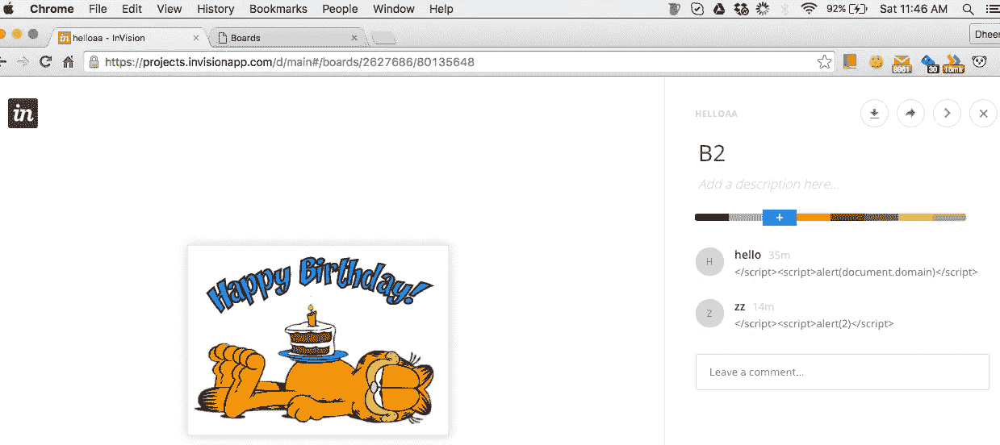
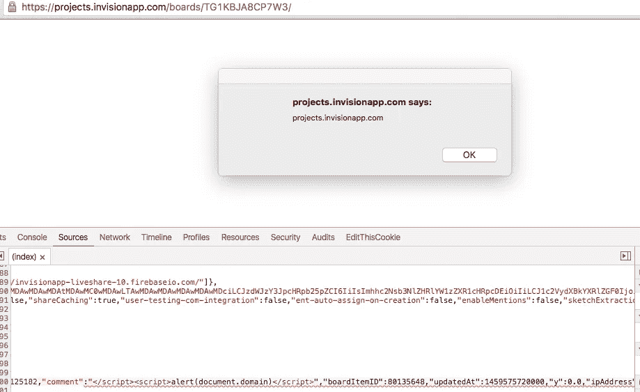

# 嘲笑模型——XSS 视觉

> 原文：<https://medium.com/hackernoon/mocking-the-mockups-invision-xss-5048617ba4de>

关于流行的 [Invision](http://invisionapp.com/) 应用中存储的跨站点脚本漏洞的文章

我是 InVision 应用的忠实粉丝，因为它惊人的 UX 和原型制作工具。对于那些不知道的人来说，[invisionapp.com](https://www.invisionapp.com/)有助于将**高** - **逼真度**的设计转化为可点击的交互式原型和模型。

I love Garfield

一个晴朗的日子，我开始在它周围玩耍，寻找一些有趣的弱点。当我用笔测试任何应用程序时，收集信息是我做的第一件事。很容易看出这个应用程序是使用 angular js framework 1.2 . x 版构建的。

> 在 AngularJS 中，有一个服务`**$sce**`提供严格的上下文转义。从版本 1.2 开始，Angular 默认启用 SCE。

> 休斯顿，我们有麻烦了。
> 
> 现在，我要么寻找任何可用的沙盒旁路，要么继续寻找一些糟糕的实现。哼。我现在需要一杯咖啡。

在尝试了不同的东西后，我偶然发现了一个共享板页面的源代码，它包含了用户输入的数据，如板名、用户评论等。

> 啊！是时候修改攻击向量了。现在让我们试着用下面的向量来评论一个上传的模型

Attack Vector on Board Image

> ***瞧！成功了！***

Payload

什么可能会出错？

存储的 [XSS](https://hackernoon.com/tagged/xss) —利用这个漏洞，攻击者可以窃取 cookies 并以受害者的身份进行验证，还可能危及用户帐户的安全。

**概念验证**

POC Video — Invision Stored XSS

**时间线**
> *Bug 上报*—2016 年 4 月 2 日
> *确认*—2016 年 4 月 7 日
> ***修复***

我使用他们在 H1 的 BB 程序向 Invision 团队报告了这个问题，并要求公开我的报告。

因为我不是第一个报告这个漏洞的人，所以我没有资格获得 Bug 奖金。但是那个“小弹出窗口”让我开心了一天:)

我在英国 2016 年的演讲中也展示了这个漏洞。在我的演示中，我展示了攻击者如何在拦截代理[打嗝套件](https://portswigger.net/burp/)的帮助下利用恶意评论修改设计，以及如何使用[牛肉](http://beefproject.com/)控制浏览器。

Video from my talk at SeleniumConf London

感谢阅读。如果您有任何问题或反馈，请告诉我。

> [黑客中午](http://bit.ly/Hackernoon)是黑客如何开始他们的下午。我们是 [@AMI](http://bit.ly/atAMIatAMI) 家庭的一员。我们现在[接受投稿](http://bit.ly/hackernoonsubmission)并乐意[讨论广告&赞助](mailto:partners@amipublications.com)机会。
> 
> 如果你喜欢这个故事，我们推荐你阅读我们的[最新科技故事](http://bit.ly/hackernoonlatestt)和[趋势科技故事](https://hackernoon.com/trending)。直到下一次，不要把世界的现实想当然！

