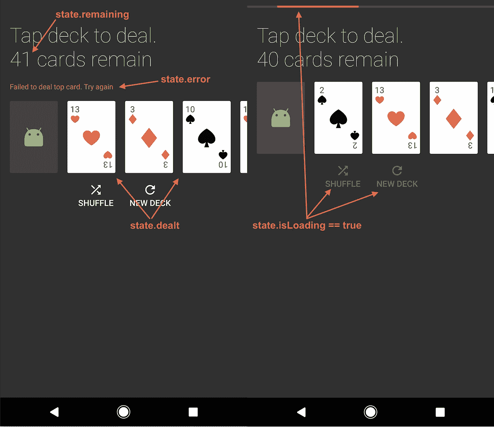
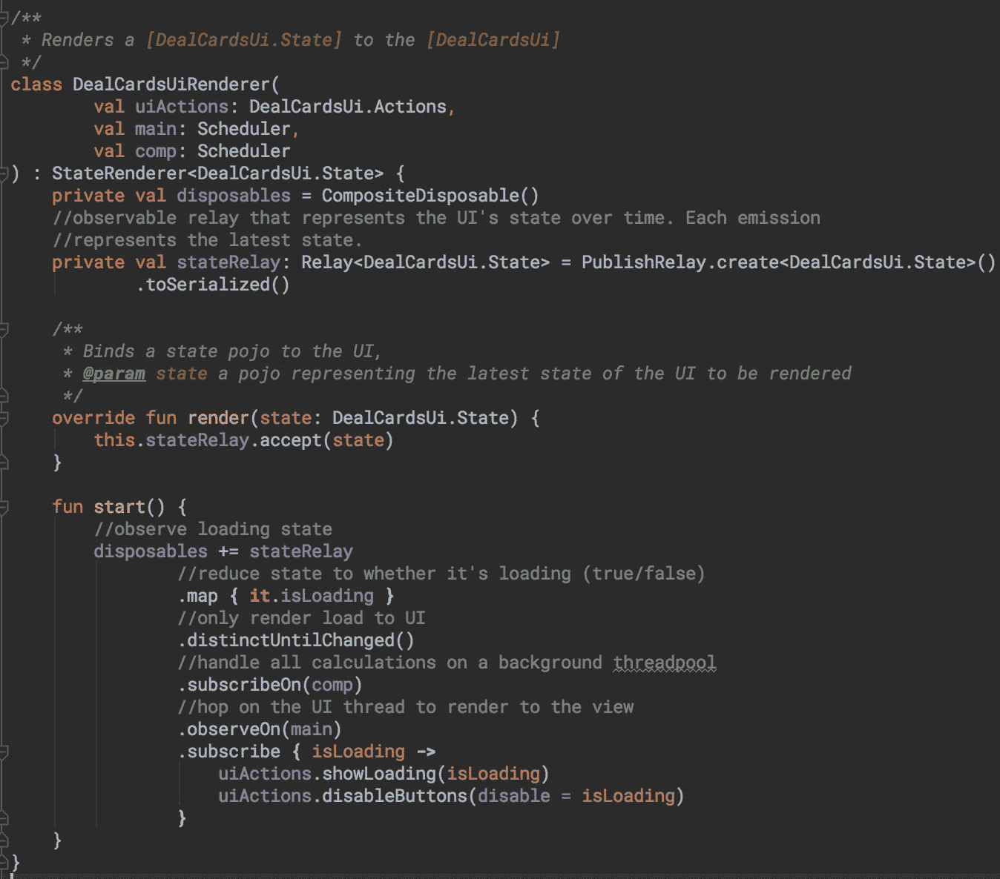

# 我对模型视图意图(MVI)的看法—第 1 部分:状态渲染器

> 原文：<https://medium.com/hackernoon/model-view-intent-mvi-part-1-state-renderer-187e270db15c>

## 脱离 UI 线程，以可预测的状态和灵活性自动进行 UI 测试

# 目标

1.  全自动 UI 测试(Android 上的 Espresso)
2.  在后台线程上完成的所有计算(视图访问除外)
3.  适合任何平台的前端架构。由于[react vex](http://reactivex.io/)的跨平台特性，同样的想法也适用于 iOS、Android 和网络。
4.  一个可以适应任何东西的 UI 层。边缘案例、新需求和增加的复杂性不需要重构

本文涵盖了目标 1 和目标 2。在以后的文章中，我会深入探究为什么第四条是正确的。

# 模型视图意图(MVI)

我强烈推荐看看汉尼斯·多夫曼在 MVI 和安卓系统上的令人惊叹的博客系列。我不会深入探讨什么是模型视图意图，而是我对它的具体实现。

> 简而言之，我们将合并来自数据层的输入和用户输入，以输出一个随时间不断更新的`ViewState`，将一个`ViewState`的每个新实例呈现到我们的`Ui` / `View`上。

# 演示应用——一副“纸牌”

Deal a deck, shuffle, or build a new deck.

## 成分

我的 MVI 实现有以下 7 个组件。注意:#2-5 是你的 UI/视图将要实现的所有接口。

1.  `ViewState` —一个简单的 POJO，表示*所有*在 UI 中显示的数据(`Activity`、`Fragment`、`ViewGroup`等)。
2.  `StateRenderer`—公开单个函数，该函数接受`ViewState`的实例，并可以将其呈现给`Ui`。这个单一入口点是修改用户可见内容的唯一方式。这个接口的实现将调用`Ui.Actions`方法(参见#4)。
    — `fun render(state: ViewState)`
3.  `Ui` —查看界面。这是 **MVP** 中的 **V** 。由您的视图(`Activity`、`Fragment`、`ViewGroup`等)执行。

```
*/**
 * The user interface for dealing cards.
 *
 ** ***@see*** *DealCardsActivity
 */* interface DealCardsUi : StateRenderer<DealCardsUi.State> {

    val state: ViewState

    override fun render(state: ViewState)
}
```

4.`Ui.Actions` —视图界面的子集。[哑巴被动查看方法](https://martinfowler.com/eaaDev/PassiveScreen.html)。由您的视图执行(`Activity`、`Fragment`、`ViewGroup`等)。

```
interface Actions {
  */**
   * Show or hide the loading UI
   ** ***@param*** *isLoading true to show the loading UI, false to hide it
   */* fun showLoading(isLoading: Boolean = true)
}
```

5.`Ui.Intentions` —视图界面的子集。一段时间内的用户输入流。由您的视图执行(`Activity`、`Fragment`、`ViewGroup`等)。

```
interface Intentions {
    */**
     * When the user requests to deal the top card from the deck
     */* fun dealCardRequests(): Observable<Unit>
}
```

6.`Presenter` —接收来自`Ui.Intentions`的输入和来自数据层的输入，以输出一个新的`ViewState`，它被渲染到视图上。 **MVP** 中的 **P** 。

7.**数据层** —你的磁盘和网络层。该层应输出任何事件，如`Presenter`发生的“数据加载”或“网络错误”。

本文的其余部分将从上面开始讨论组件 1-4(其他的将在后面的文章中讨论)。

# **视图状态&状态渲染器**

让我们更深入地了解一下`ViewState`。

```
*/**
 * The view state for [DealCardsUi]
 */* data class State(
        val deck: Deck,
        private val isShuffling: Boolean,
        private val isDealing: Boolean,
        private val isBuildingNewDeck: Boolean,
        val error: String?
) {
    val isLoading: Boolean = isShuffling || isDealing || isBuildingNewDeck
    val remaining: Int get() = deck.remaining.size 
    val dealt: List<Card> get() = deck.dealt
}
```

下面，您可以看到状态是如何影响屏幕内容的。



下面是`StateRenderer<DealCardsUi.State>`的简化实现。



使用 Rx 的调度程序并观察最新的`ViewState`，我们实现了目标# 2——尽可能远离 UI 线程。

# 自动化 UI 测试

我们所有的`Ui`类都有以下功能——向用户显示信息的单一入口点。

```
fun render(state: ViewState)
```

测试被简化为简单的输入/输出功能。

1.  **输入**—`ViewState`。抓取对您的`Ui`的引用，并调用`ui.render(viewState)`函数。
2.  **输出**—`Ui`。使用 Espresso 验证`Ui`看起来和预期的一样。

想要测试配置更改吗？调用`activity.recreate()`，再次验证输出不变。

满足以下要求以简化测试。

1.  在测试过程中，解除(禁用)每个`Presenter`的激活，和/或禁用您的磁盘/网络层。
2.  在没有演示者的情况下保持导航功能。通过意图导航简化了这一点。
3.  能够获取对您的视图的引用。这可能是一个`Activity`、`Fragment`、`ViewGroup`、`Controller`等等——但是你必须能够调用你的`view.render(state: ViewState)`函数。

# 结论

我真的相信这种建筑风格是 MVP，MVVM 等的自然进化。单个`ViewState`允许可预测的状态和最大的可测试性。

在以后的文章中，我将更深入地研究其他组件，比如负责`ViewState`的业务逻辑。

> 在 [Reddit](https://www.reddit.com/r/androiddev/comments/637vho/model_view_intent_mvi_part_1_state_renderer/) 上捕捉对话
> 
> 所有源代码都可以在 [GitHub](https://github.com/ZakTaccardi/deck-of-cards) 上获得。
> 
> 向许多使这种架构成为可能的反应式编程的先驱大声疾呼！
> 
> 其他资源—观看 Jake Wharton 关于管理 Rx 状态的精彩演讲[。](https://www.youtube.com/watch?v=0IKHxjkgop4)

[](http://bit.ly/HackernoonFB)[](https://goo.gl/k7XYbx)[](https://goo.gl/4ofytp)

> [黑客中午](http://bit.ly/Hackernoon)是黑客如何开始他们的下午。我们是 AMI 家庭的一员。我们现在[接受投稿](http://bit.ly/hackernoonsubmission)并乐意[讨论广告&赞助](mailto:partners@amipublications.com)机会。
> 
> 如果你喜欢这个故事，我们推荐你阅读我们的[最新科技故事](http://bit.ly/hackernoonlatestt)和[趋势科技故事](https://hackernoon.com/trending)。直到下一次，不要把世界的现实想当然！

