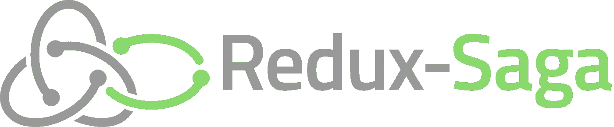

# 用 redux-saga 建模常见模式

> 原文：<https://medium.com/hackernoon/modelling-common-patterns-with-redux-saga-464a380a37ce>



*本帖假设基本熟悉*[*redux-saga*](https://hackernoon.com/tagged/redux-saga)*。下面是入门* [*教程*](https://redux-saga.js.org/docs/introduction/BeginnerTutorial.html) *。*

在这篇文章中，我将探讨如何使用 [**redux-saga**](https://github.com/redux-saga/redux-saga) 对应用程序控制流中的一些常见模式进行建模。

> [redux-saga](https://github.com/redux-saga/redux-saga) 是一个库，旨在使 React/Redux 应用程序中的副作用(即异步的事情，如数据获取和不纯的事情，如访问浏览器缓存)变得更容易和更好。

# 这些当中的第一个

这是一个[模式](https://hackernoon.com/tagged/pattern)，应用程序只是简单地等待不同种类的动作。收到的第一个动作决定了应用程序如何进行。也就是说*应用程序不关心第一个动作*之后的任何动作。

例如，假设我们正在编写一个关于创建和发送电子邮件的传奇故事。在这个故事中，我们在等待 2 个动作

*   `DISCARD_DRAFT`如果先收到这个动作，saga 将丢弃当前草稿，清理编辑状态&完成。
*   `SEND_EMAIL`如果首先收到此操作，则 saga 可能会进行一些验证(例如，有效的电子邮件地址等)。)，发送邮件，清理编辑状态&然后完成。

这个故事的流程是由哪个动作(`DISCARD_DRAFT`或`SEND_EMAIL`)最先被接收来控制的。这种情况可以通过简单地使用`[take](https://redux-saga.js.org/docs/api/#takepattern)`效果创建器来模拟。

```
function *emailSaga() {
    ...

    const action = yield take([ // (A)
        `DISCARD_DRAFT`,
        `SEND_EMAIL`
    ]); if (action.type === `DISCARD_DRAFT`) { // (B)
        //discard the draft
    } else {
        //send the email
    }
}
```

*   (A)`take`效果等待 2 个动作中的任何一个，传奇暂停，直到接收到其中一个。
*   (saga 检查接收到的动作&的`type`，然后相应地继续。

*注意:
这种情况也可以使用* `[*race*](https://redux-saga.js.org/docs/api/#raceeffects)` *效果来模拟，如下图*

```
function *emailSaga() {
    const { discard, send } = yield race({ // (A)
        discard: take(`DISCARD_DRAFT`),
        send: take(`SEND_EMAIL`)
    }) if (discard) {
        //discard the draft
    } else {
        //send the email
    }
}
```

*   (A)我们在 2 个`take`效果之间创建一个比赛，即当 2 个`take`效果中的任何一个完成时，比赛结束。

`take([...])`和`race`之间重要的语义区别在于

*   `take([...])`等待*第一个匹配动作到达*。
*   `race`等待*第一个竞速效果完成*。

# 一直做，直到

这也是一种常见的模式，我们希望让任务一直运行，直到收到停止任务的特定操作。

例如，假设我们正在编写一个向播放列表添加歌曲的传奇故事。传奇应该让用户添加他们喜欢的歌曲。然而，当接收到特定的动作时，它应该停止该任务(如`SAVE_PLAYLIST`)。

这种情况可以建模如下

```
function *addToPlaylist() {
    while (true) { //(A)
        const action = yield take([
            `ADD_SONG`,
            `SAVE_PLAYLIST`
        ]); if (action.type === `ADD_SONG`) {
            //add the song to the playlist
        } else {
            break; //(B)
        }
     }
}
```

*   (A)`while`循环保持任务运行。
*   (B)一收到`SAVE_PLAYLIST`，我们就中断循环，停止任务。

*注意:
这种情况也可以使用如下*所示的 `[*takeEvery*](https://redux-saga.js.org/docs/api/#takeeverypattern-saga-args)` *效果来模拟*

```
function *addToPlaylist() {
    const addTask = yield takeEvery(`ADD_SONG`, function*() { // (A)
        //add the song to the playlist
    }); yield take(`SAVE_PLAYLIST`); // (B)
    yield cancel(addTask); // (C)
}
```

*   (A)我们启动一个连续运行的任务`addTask`(使用`takeEvery`)，它接收每个`ADD_SONG`动作&并将其添加到播放列表中。
*   (B)传奇仍在继续&现在等待`SAVE_PLAYLIST`行动。
*   (C)一旦接收到`SAVE_PLAYLIST`,传奇[取消](https://redux-saga.js.org/docs/api/#canceltask)`addTask`,即停止监听`ADD_SONG`动作。

这种模拟情况的方式更简洁，但是前一种方式的意图更明确。

# 按部就班的

这是一种常见的模式，其中业务流被分解成更小的步骤。这些步骤以有序的方式呈现给用户，但是用户可以随时返回。

例如，考虑预订航班的过程。它可以分为以下 3 个步骤

*   *选择航班—* 这一步负责让用户选择航班。
*   *填写详细信息—* 该步骤从用户处收集必要的详细信息。
*   *付款—* 该步骤负责从用户处收取付款。

这些步骤按以下顺序显示给用户

```
Choose Flight ---> Fill Details ---> Payment
```

然而，用户也应该能够返回到上一步。

```
 --->              --->
Choose Flight      Fill Details      Payment
              <---              <---
```

这样的需求可以使用一个*父传奇*和多个*子传奇*对应每一步来建模。本质上，*父-传奇*控制进程的传播&为当前步骤执行正确的*子-传奇*。

考虑到我们正在为上面提到的预订航班的过程写一个传奇。

*   我们假设这三个步骤有以下*个儿童故事*。这些*儿童传奇*的内容与本次讨论无关。

```
function *chooseFlight() { ... } // (A)
function *fillDetails()  { ... } // (B)
function *paymentSaga()  { ... } // (C)
```

*   我们假设一旦一个*儿童传奇*结束，我们会自动进入下一步。
*   我们假设每次用户想回到上一步时，都会调度一个`BACK`动作。
*   我们现在将创建一个*父传奇*来控制传播&基于当前步骤执行正确的*子传奇*。

```
function *bookFlight() { // (A)
    let breakLoop = false;
    let step = 0; // (B) const backTask = yield takeEvery(`BACK`, function*() { // (C)
        if (step > 0) {
             step--;
        }
    }) while (true) { // (D)
        switch (step) { // (E)
            case 0: {
                yield call(selectFlight); // (F)
                step++; // (G)
                break;
            }
            case 1: {
                yield call(fillDetails);
                step++;
                break;
            }
            case 2: {
                yield call(paymentSaga);
                step++;
                break;
            }
            case 3: {
                breakLoop = true; // (H)
                yield cancel(backTask); // (I)
                break;
            }
        } if (breakLoop) { // (J)
            break;
        }
    }
}
```

*   (一)*亲子关系*称为`bookFlight`。
*   (B)将`step`设置为`0`，即从第一个*子故事* `selectFlight` *开始。*
*   (C)启动一个任务来监听每个`BACK`动作，并将`step`递减`1`。
*   (D)启动无限循环`while`以保持*父系列*持续运行。
*   (E)`switch`语句评估当前`step`并执行正确的*子事件。*
*   (F)为`step 0`执行`selectFlight` *子传奇*。
*   (G)将`step`增加`1`以进入下一步。
*   (H)如果`step`的值为`3`，即所有步骤都已完成，则*父-传奇*应该结束。
*   (I)取消任务以监听`BACK`动作。
*   (J)评估*亲子传奇*是否应该结束或继续。

*注意:
这是一个简单的例子，我们只支持单步传播。然而，在一个生产应用程序中，我们希望用户从一个步骤跳到另一个步骤(当然有一些检查)。*

*但是这种技术可以很容易地扩展来实现这样的需求(通过明确地为* `*step*` *变量提供下一个值，而不是增加或减少它)。*

*事实上，这就是我们如何使用 sagas 构建有限状态机。*

redux-saga 是一个有趣的控制流建模工具。我希望这些模式被证明是有用的。