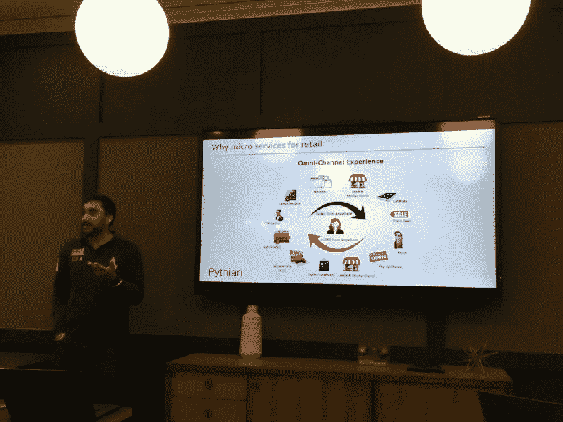

# 面向零售商的现代周期开发技术、DevOps 和敏捷

> 原文：<https://medium.com/hackernoon/modern-cycle-development-techniques-devops-and-agile-for-retailers-9f6314f5b423>

2017 年 7 月 12 日，DataArt 高级技术顾问 Anton Krasikov 在由 Mesosphere 组织并在伦敦举行的*零售商需要了解的微服务、容器&数据服务*峰会上发言。

此次峰会聚集了大型零售商公司的首席信息官、首席技术官和企业架构师，旨在提供关于现代开发周期技术的第一手见解，并分享零售商如何应对向消费者实时提供个性化服务的挑战的最佳实践。

其中一个主题是 ***在零售*** 中利用 DevOps，由 DataArt 的高级技术顾问 Anton Krasikov 主讲。Anton 拥有 15 年的 IT 经验，包括 4 年的项目工作经验(Java、DevOps)。

Krasikov 使用实际案例研究概述了 DevOps 的逐步发展及其在 Ocado 和其他零售公司等客户项目中的应用。他概述了公司如何从物理基础设施转移到虚拟机，然后转移到容器。安东还强调了当前在管理容器方面的挑战，并提供了潜在的容器编排解决方案和使用 DC/操作系统的基础设施管理方法。

Anton 首先介绍了 DevOps，并讨论了它在零售业中的用途。他强调 DevOps 与微服务方法非常契合..

他接着介绍了 DevOps 的概念，以及将开发和运营结合在一起的主要思想，开发人员理解基础设施，运营人员理解代码。

DevOps 方法的特点如下:

*   持续集成——当一个代码改变时，一个新的包被创建，测试被运行，如果有什么问题发生，它会立即变得明显，使得相应的反应成为可能。
*   持续交付——在您的包被持续集成之后，代码可以直接进入生产环境，或者更进一步的环境。对代码所做的任何更改都要经过测试，然后您就有了一个不可变的包，它可以从一个环境提升到另一个环境，直到生产环境。连续交付减少了人工交互的水平，以避免诸如忘记更新数据库或配置文件之类的风险。
*   DevOps 的核心概念之一是基础设施即代码，在这种情况下，您基本上是以简单易管理的文本格式定义整个基础设施，并将其保存在 Git 这样的版本控制系统中。

DevOps 概念有助于应对快速变化。它帮助团队一起处理各种微服务，非常适合敏捷。它不再是一个时髦的词，但是它仍然是实现迭代方法的一个非常好的选择。

当您在您的组织中应用 DevOps 时，人们理解基础架构能够并且应该是灵活的，这是一个巨大的文化转变。

安东还分享了他对 DevOps 未来的愿景。这是一个快速发展的概念，微服务也是如此，关于容器标准化存在巨大的争论。有一个开放容器倡议，很大程度上是基于 Docker 的，但是仍然有很多公司在尝试做自己的版本，包括 Google 和 Amazon。容器编排工具和方法也在积极开发中，我们可以期待这一领域的重大改进。

另一个话题是零售业中的微服务。*皮西安的解决方案架构师 Terry Dhariwal 讨论了微服务架构的剖析和成功实施的关键因素。特里还解释了为什么微服务与零售相关。*

*他提供了最佳实践范例，包括 Tesco、British Gas、Dixons Carphone Warehouse、Sky 和 Experian。*

*Terry 强调，微服务的一个关键方面是使事物在整个堆栈中高度可扩展。微服务的理念是将所有的产品功能拆分成小的组件，每个组件承担一项责任。例如，Tesco 有针对购物篮会话或购物车的微服务。送货上门也是微服务。这个想法是组件化，以避免创建一个单一的应用程序，因为这将阻止创新并导致中断。“一个架构—一个应用程序—一个步骤”的方法在今天的上市时间里不再有效，因为它阻止了团队快速创新。*

*微服务的理念是开发人员、DBA 和 DevOps 团队一起工作，不仅理解开发应用程序，也理解生产应用程序。*

*微服务对于零售业非常重要，因为它有许多移动部分，包括配送中心、客户服务、购物篮会话以及非常动态的环境中的价格变化。如果零售商没有微服务战略，他们就有陷入创新困境的风险。*

*成功的微服务的一个关键因素是使整个堆栈具有弹性和可伸缩性、高可用性、持续的高性能和快速创新的敏捷性。基础设施也需要支持这些特征。为此，你需要去云，那里的东西更加标准化和安全。*

**

*此外，就微服务而言，自动化是关键。当您必须处理许多服务和应用程序时，如果没有自动化，您在部署新功能时肯定会造成中断。数据库非常重要，利用 DevOps 也是如此。*

*演示结束后，Mesosphere 的 Richard Lawrence 简要演示了如何在几分钟内构建零售分析大数据堆栈，以利用实时客户数据和资料进行产品推荐。*

*Richard 展示了 DC/操作系统在调度程序(如 Marathon)之外的特性，并展示了 Mesos 作为 2 层调度程序、细粒度资源分配和理解其支持的应用程序的框架的优势。*

# *关于扬声器*

## *安东·克拉西科夫*

*Anton Krasikov 是 DataArt 的高级技术顾问，他在 IT 行业工作了超过 12 年，其中 10 年在 DataArt 工作。他作为开发人员、团队领导和解决方案架构师参与了零售、电信、旅游和金融服务行业的各种项目。安东对大数据和 DevOps 技术有着浓厚的兴趣，并乐于应对构建高可用性和弹性 IT 系统的挑战。他经常在 data art“IT talk”和“JavaDay”会议上发言，演讲主题从 DevOps 创新到客户沟通。安东拥有沃罗涅日州立大学的计算机科学硕士学位。[anton.krasikov@dataart.com](mailto:anton.krasikov@dataart.com)*

## *特里·德里瓦尔*

*Terry 是 Pythian 的解决方案架构师，具有实时分析和个性化背景，负责处理零售部门的大容量和高吞吐量数据处理系统。他支持客户交付企业应用，满足现代关键任务应用的性能、规模、可用性和灵活性需求。这些公司包括乐购、Dixons Carphone Warehouse、英国天然气公司、益百利公司和天空公司。*

**原载于 2017 年 7 月 12 日*[*http://blog . data art . com/modern-cycle-development-techniques-devo PS-and-agile-for-retailers/*](http://blog.dataart.com/modern-cycle-development-techniques-devops-and-agile-for-retailers/)*。**