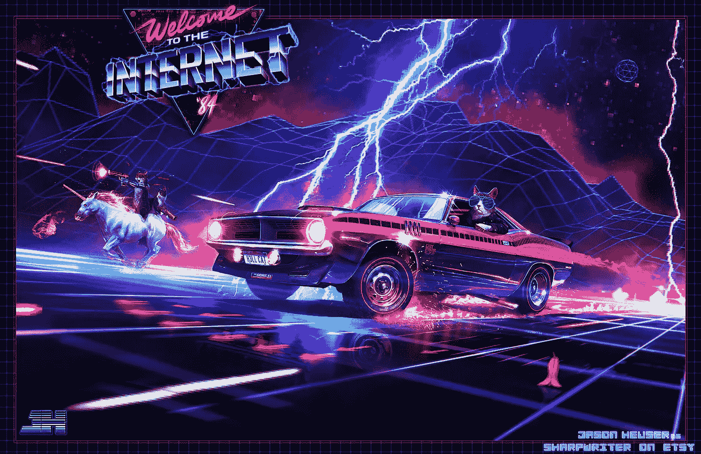
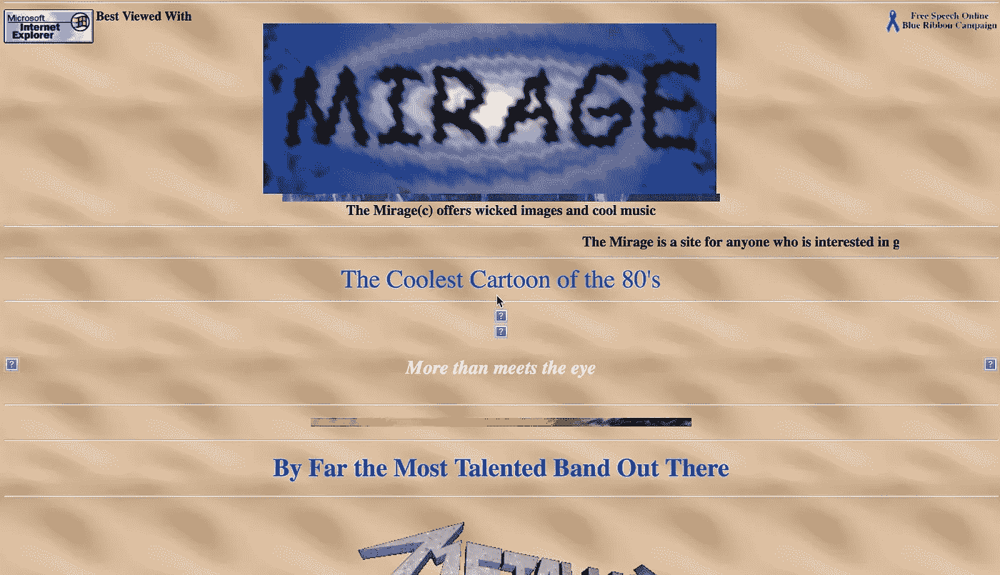
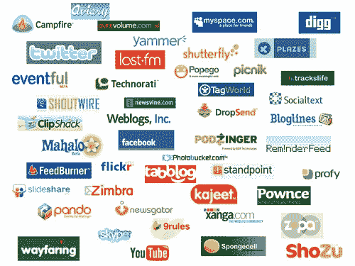
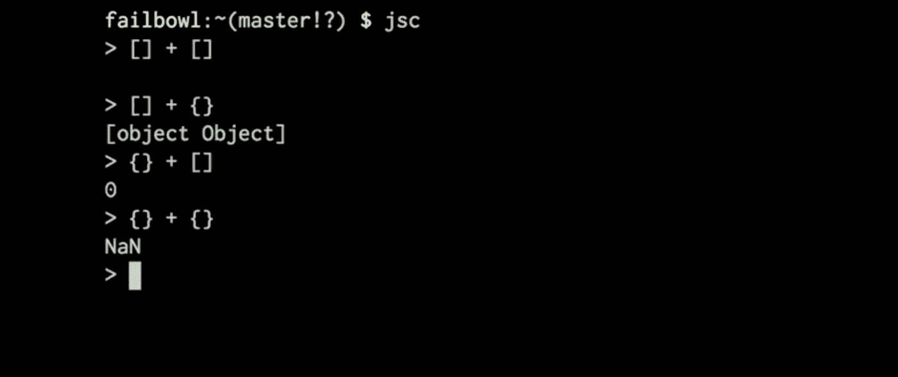
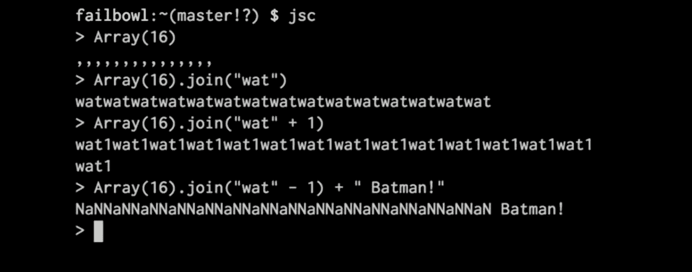
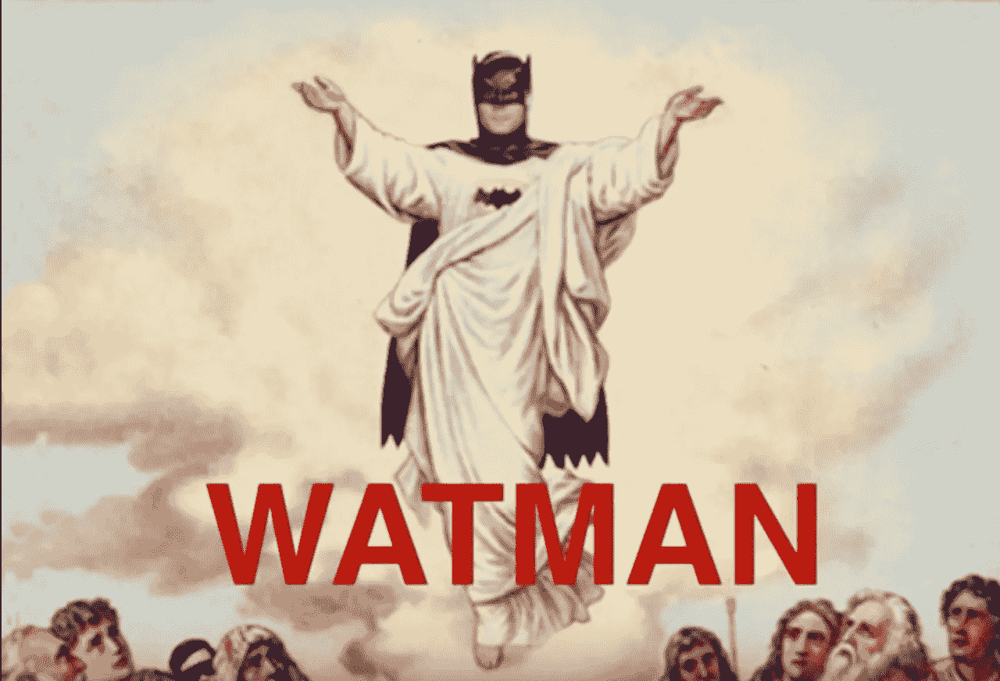
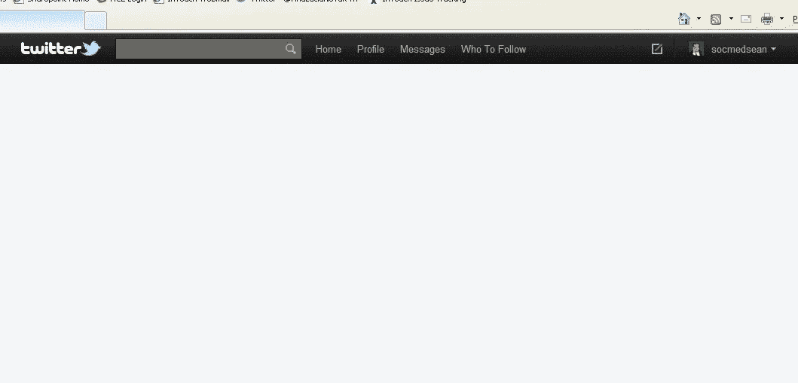
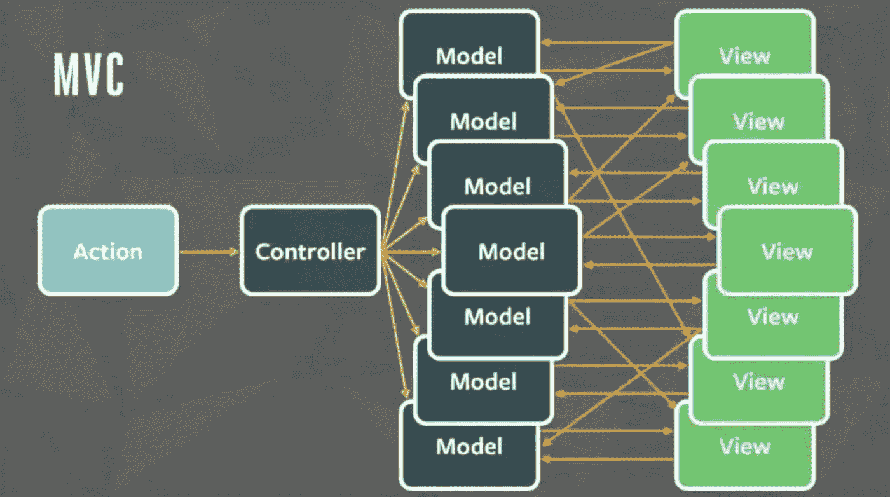

# 现代网络开发

> 原文：<https://medium.com/hackernoon/modern-web-development-bf0b2ef0e22e>

这是我在 2015 年 MN 的[*Google*](https://hackernoon.com/tagged/google)*Dev Fest 上演讲的脚本。这是一部轻松的网络发展史，也是对其* [*未来*](https://hackernoon.com/tagged/future) *的评论。*

## 下一件大事

从瑞士出来最重要的是什么？巧克力？钟表？中立？历史上最大、最昂贵的科学实验可能最终揭开宇宙的秘密，并统一我们对最小粒子和最大天体的理解？不，这些都不是。答案当然是互联网。

更确切地说，是使互联网普及的万维网。1980 年，当我还只是我母亲肚子里的一个胚胎时，互联网还只是物理学家蒂姆·伯纳斯·李头脑中的一个胚胎，他创造了一个简单的超文本程序，叫做 ENQUIRE，作为一个人和软件模型的个人数据库。

Actual Computer Used to Create the Internets

后来，Tim 的任务是发明一种聪明的方法，让在 CERN 工作的科学家们可以轻松地相互共享数据集和文档。所以在 1990 年，他用他超级酷的 NeXT 电脑(被称为“魔方”)，扩展了他的超文本思想，创造了 HTML 的第一个版本。目标是提供一种简单有效的方法来创建、共享和连接文档。然后，他创建了 HTTP(超文本传输协议)，第一个网络浏览器，想象称为万维网，和第一个网络服务器。

> 网络中涉及的大部分技术，像超文本，像互联网，多字体文本对象，都已经被设计好了。我只需要把它们放在一起。—蒂姆·伯纳斯·李

虽然他可能没有发明互联网(就像你知道谁)，但他的万维网是像野火一样蔓延所需的火花。

你还记得你第一次使用互联网吗？我知道。当这些基于文本的网络浏览器被创造出来的时候，我大约 8 岁，我还记得我哥哥向我展示如何使用其中的一个。我不确定这有什么吸引力，但几年后，我第一次登录 AOL，找到了一个实时聊天室。我仍然记得我写的第一条信息:

> “Socker 烂透了！”—马克·纳特，12 岁的足球迷

我对互联网的第一次贡献！不用说，我被迷住了。我还记得在我 14 岁的时候创建了我的第一个网站。其实我还是有原始出处的。看哪！

Notice the “Best viewed with Internet Explorer” disclaimer and fancy marque text

当然，以今天的标准来看，这似乎并不令人印象深刻。嗯，实际上，以 1994 年的标准来看，这也算不上令人印象深刻。但令人印象深刻的是，我把它加载到了最新版本的 Safari 上，除了一些丢失的 gif，它看起来和我在九年级创建它时几乎一模一样。这证明了 HTML 美丽的简单性和表现力。一个 14 岁的孩子可以在几个小时内学会如何在互联网上建立自己的小角落，在大约 20 年后仍然可以使用最新的技术提供“邪恶的图像和酷的音乐”,这是非常令人惊讶的。

蒂姆·伯纳斯·李将 HTML 建立在当时流行的标准通用标记语言(SGML)的基础上，这是一种国际公认的将文本标记为结构单元的方法，如段落、标题、斜体块等。除了不是简单地坚持文本，他想“为什么不添加链接，可以带你到其他文件？为什么不是可以显示图表、图形和猫的图像呢？”为什么不呢？

在他的个人笔记中，他首先将“百科全书”列为 HTML 的一种可能用途。我得说他几乎说对了。但是我们已经超越了维基百科。

那些日子简单多了。今天，现代 web 开发的前景似乎一直处于不断的[变化中。我们正快速接近一个岔路口，这可能会改变我们所知道的网络。Tim 最初的网络愿景是任何人都可以参与，而不需要花哨的工具或深厚的编程知识，这会受到威胁吗？还是网页浏览器正在成为一个应用平台；不断增长的“应用程序”海洋的编译目标。](https://facebook.github.io/flux/docs/overview.html)

为了理解未来，我们必须回顾过去。

## 浏览器大战

公元 1990 年，第一个网络浏览器万维网诞生了。那是一个和平、开明的时代，纯文本信息不受干扰地在知识分子之间流动，目的是推进科学发现的边界。

短短三年后的 1993 年，这段相对和平宁静的时期被浏览器大战打破了。第一个流行的图形浏览器 Mosaic 发布了，它推动了互联网的飞速发展。后来更名为网景，它在短短两年内击退了一群竞争浏览器，占据了所有互联网用户近 90%的份额。但是这样的成功不会被忽视。

1995 年，科技巨头和邪恶帝国微软发布了它的第一个网络浏览器，Internet Explorer 1.0，这是 Mosiac 浏览器的授权更名。网景公司和微软公司为了争夺互联网的主导权，展开了一场旷日持久的血战。在战争中，技术进步比比皆是，这场战争也不例外。微软创造了 CSS 和 iFrames。网景公司创造了惊人的<blink>和<marquee>标签。当然，我们不能忘记每个人最喜欢的网络语言..</marquee></blink>

## 第 11 天，他休息了

1995 年 5 月，Brendan Eich 在 10 天内创建了 JavaScript。第 11 天，他休息了。

实际上，它最初被称为 LiveScript，但他后来将名称改为 *Java* Script，尽管这与 Java 编程语言毫无关系。这很有趣，因为尽管它的保留字列表来自 Java，但它的语法是基于 c 的。它是一种面向对象的语言…但几乎不是。第一*和第二*它是一种函数式语言……但仅仅是勉强。

微软以真正的微软方式迅速做出反应，对 JavaScript 进行逆向工程，并在 Internet Explorer 3.0 中以“JScript”的形式发布。名字不是唯一不同的地方；*当然*它必须有实现的不一致性 CSS 和 HTML 也是如此。没有它们就没有 Internet Explorer 了。

最终，网景公司无法与微软这样的巨头竞争。毕竟微软控制了 Windows，Windows 主宰了电脑行业。当网景公司依靠公司许可来获取收入和免费个人版的明确下载时，微软只是强迫所有用户使用 IE。到 2002 年，网景的市场份额减少到所有用户的 4%以下。

互联网泡沫破灭了，随之而来的是围绕互联网的所有乐观情绪。微软的反垄断案仅仅是轻微的处罚。世界蒙上了一层阴影(环球网)。希望让位于冷静。网立在刀刃上。只要偏离一点点，它就会失败，走向毁灭。然而，希望依然存在，而公司是真实的。

一颗种子在混乱中被种下；1996 年，网景公司有远见地将 JavaScript 作为 ECMAScript 提交给了 ECMA International，当时他们与微软的斗争正处于高潮。这是一个将永远改变我们所知的网络命运的决定。

## 从灰烬中升起了一个..火狐？

就像达斯·维达的帝国(或者凯洛·伦给你们这些年轻人的第一个命令)一样，微软对互联网的控制看起来是不屈不挠的，绝对的。自从微软发布了臭名昭著的 Internet Explorer 6.0 之后，几乎所有的浏览器创新都停止了。就像某种反乌托邦政府发行的泥浆，网络开发人员被迫依靠被时间锁定的浏览器生存。微软将注意力转向其他险恶的项目，如 ActiveX、FrontPage 和 SilverLight。

但是乌云开始散去。大约就在这个时候，开源运动开始真正加速。Linux 证明了数以千计的分布式黑客在业余时间可以写出比世界上最大的科技公司更好的操作系统。网景公司已经将网景导航器的大部分代码开源，由非营利的 Mozilla 基金会负责管理。

FireFox 最初(更恰当地说)被称为“Phoenix ”,于 2002 年发布，将引入一些功能，如独立的内置搜索栏、标签式浏览、隐私浏览、内置拼写检查器和下载管理器。你知道，就像，我们今天认为理所当然的所有惊人的功能；微软*应该*一直致力于的惊人功能？全世界的极客们——厌倦了支持他们家庭成员充满间谍软件的电脑——开始安装和推广 Firefox，Mozilla 开始慢慢夺回互联网市场份额。

最重要的是，Mozilla 把 web 开发者放在第一位。他们提供了一流的调试能力；首先是集成的特性，然后是像 FireBug 这样的第三方扩展。突然间，再次成为一名 web 开发人员变得很酷。对可访问性、干净、语义标记和无表格布局的重新关注引发了网页设计的复兴。网络的潮流将再次改变。

## 新的希望

缓慢但稳定地，火狐开始从 Empi 手中夺回市场份额..呃，我指的是微软，在 2010 年达到顶峰，占全球市场份额的 30%。像大多数大型占领军一样，微软反应迟缓。在这个过程中，Mozilla 找到了一个强大的盟友，那就是一家名为**的小型互联网初创公司谷歌**，它为成为火狐的默认搜索引擎支付了不菲的费用。

我们进入了网络……**2.0！！！**

焦点从大量消费最有用的内容转移到大量创造最没价值的内容。博客、多媒体共享、公共 API、混搭和社交网络在 2004 年后的几年里大受欢迎。浏览器大战最激烈时期开发的开放技术现在开始被充分利用。像 ActiveX、Java 和 Flash 这样封闭的和侵入性的技术被抛到一边，取而代之的是更加开放、标准化和可访问的 web 技术。

网络不再仅仅是链接在一起的文档的网络。它可以被互动、贡献、混音、观看、播放、混合、发布。它开始颠覆那些固守垂死商业模式的整个行业。随着越来越多的人加入到这第二次复兴中，一批新的工具被创造出来，以帮助开发者创造更丰富的体验。

## 点击。等等。点击。等等。

现在我要说一些可能会让你们年轻人感到震惊的事情。你可能会认为这是一个又老又刻薄的守财奴的胡言乱语。

**曾经有一段时间，绝大多数网站根本不需要启用 JavaScript*。***

*(戏剧性停顿)*

90 年代末和 2000 年代中期的大多数 web 应用程序都是完全无状态的。换句话说，在每次点击时，浏览器呈现的所有内容都被丢弃并被大规模替换。对于开发人员来说，这太棒了。您只需要担心每个页面的状态，而且这种逻辑只存在于一个地方:服务器。

大约就在这个时候，我开始了我的网络开发生涯。我从英国大学毕业，获得了物理学学位，希望能在巴诺书店或时尚咖啡店找到一份工作。但就像我的许多大学同学一样，事情并没有按照计划进行(你至少需要一个硕士学位才能在巴诺书店找到工作)。

幸运的是，我聪明得多的哥哥建议我看一看一个叫做 Ruby on Rails 的新 web 框架。我无聊又失业，所以我想“为什么不呢？”尝试了一下。然后，我在两个月的时间里获得了比我在 m 大学 6 节 CSci 课上获得的更多的实用知识。

我被吸引住了，我继续学习自由职业开发的诀窍，并在我有能力的时候玩创业轮盘赌。Rails 是完美的伴侣——但话说回来，我是一个框架迷。我可以快速制作原型并按时交付多个项目，我只需要了解 Ruby 和一点 CSS 和 HTML 就可以做到。那是一段简单的时光。那是一段美好的时光。但是后来谷歌不得不通过创建 Gmail 和谷歌地图来毁掉它。

无状态 web 应用程序非常适合主要提供文本的网站，但是如果你在 21 世纪初使用过 Hotmail 或 Mapquest，你就会明白为什么 Google 的竞争产品标志着 web 开发社区的一个戏剧性的转折点。它们第一次高调展示了 JavaScript 和 AJAX 能做些什么。

AJAX——或者异步 JavaScript 和 XML——是一种在被利用之前已经休眠多年的技术。它的根源在于标签，具有讽刺意味的是，这是微软在 1996 年第一次浏览器大战最激烈的时候推出的。iframe 是不需要刷新整个页面就可以更新内容的唯一方法，但是它仅限于 iframe 本身。微软后来通过构建他们最初的 iframe 技术，增加了更新页面上任何内容而无需刷新的能力。

这意味着客户端 web 应用程序可以完全用 JavaScript 构建。这样，网站变得更像桌面应用程序，而浏览器变得更像应用程序平台。但与大多数平台不同，网络浏览器无处不在。这种用 10 天时间编写的有趣的小语言抢走了 Java 的名字，也即将抢走它的风头，成为第一种真正的“一次写遍所有地方”的语言。

## 任何可以用 JavaScript 编写的应用程序，最终都会用 JavaScript 编写

“JavaScript 10 天就写好了。”

“JavaScript 很慢。”

" JavaScript 是为没有计算机科学学位的人准备的."

“JavaScript 是网络的管道胶带”

“JavaScript 是一种可怕的语言”。

众所周知，JavaScript 是一种有争议的编程语言。你可能会争辩说，它是作为一个特性仓促推出的，它缺乏大多数现代语言所具有的特性，大型应用程序无法使用它来构建(更不用说维护了)，JavaScript 被广泛使用的唯一原因是因为它是 web 的默认语言；在这些问题上你都不会错。

但是你会忽略 JavaScript 更重要的一点——它是你能编写的唯一一种几乎可以在任何地方运行的语言。并不是说 JavaScript 没有任何真正的竞争对手；Flash 一度威胁要接管 web，Java 用它的小程序大举入侵，微软多次试图颠覆这种语言，将 web 引向自己的利益。

但尽管如此，JavaScript 还是挺了过来。JavaScript…找到了一种方法。

JavaScript 生态系统在这一点上相当不成熟，但随着 web 应用程序的复杂性被推到客户端，我们对现代工具和库的需求也在增加。从过多的这类库中，出现了一个明显的最爱；直到今天仍然影响着网络。

## 少写，多做

jQuery 上升到主导地位是因为它特别擅长提供 W3C 没有的直观 API。事实上，jQuery 引入的许多概念现在都被原生添加到浏览器中。

jQuery 还消除了浏览器 API 的不一致性，包括简化了越来越常用的复杂的 Ajax API。jQuery 让用 JavaScript 进行开发变得非常有趣，这也是 jQuery 在过去十年中大受欢迎的主要原因之一。

我们也开始看到网络组件化的第一瞥。jQuery 小部件和插件允许开发人员增强现有的 HTML 元素，其行为远远超出了 W3C 指定的标签。它们也是可以分享的。如果您有需要，可能会有 jQuery 插件或小部件来满足它；问题在于它们的布线和缺乏标准接口。

尽管 jQuery 方便地使用 JavaScript，但它仍然被认为是 98 款本田思域上的一个花哨的扰流板；华而不实，但最终是多余的。JavaScript 引擎的性能如此之好，以至于你真的必须是谷歌才能创建像谷歌地图这样的应用。当然，当我们把 4-banger 换成机械增压的 V8 引擎，用闪亮耀眼的铬合金包裹时，一切都变了。

## 兄弟，你做过水疗吗？

Chrome 就像一颗核弹一样闯入了网络世界。谷歌不再满足于依赖 Mozilla 和微软来推进网络浏览器技术，决定为了推动网络向前发展，它需要建立自己的浏览器。

所以在 2008 年，随着 Chrome 的发布，谷歌正式加入了这场大战。

有了 Chrome 及其异常快速的 V8 引擎，JavaScript 可能会被推向荒谬的新极限。每隔几个月，你就会看到关于 JavaScript 在 Chrome 中运行速度有多快的报告，这促使其他供应商提高了他们的 JavaScript 引擎速度。

然后有人灵光一现，把 V8 扯出来扔在服务器上，NodeJS 就诞生了。这催生了像 MongoDB 和 CouchDB 这样的 NoSQL 数据库，有史以来第一次，你可以成为一个全栈 JavaScript 开发人员。你认为人们讨厌 JavaScript？问他们关于 Node 的事。

这一切都为臃肿、过度设计的 web 应用程序铺平了道路。我记得我第一次尝试使用 jQuery 从头开始编写这样一个讨厌的东西。没过多久就有了俗称的“jQuery sphagetti 代码”。然而，我在这个过程中学到了一些东西。

1)不要那样做。

2)找一个比你聪明的人写的库或者框架。

作为一个 rails 爱好者，我被一个叫做 JavaScriptMVC 的框架所吸引。有了一些可以构建的结构，我终于开始了解构建一个单页面应用程序是什么样的了。

很快，每个人都开始加入 SPA(单页应用程序)的行列。它是否有意义并不重要。很明显，这是下一件大事，每个人*都有*去做。Twitter 是那些迫切希望进行 SPA 的公司之一。有了推特，人们的*想法*被一起上传到网络上。蒂姆·伯纳斯·李一定很自豪。当然，除非他尝试在禁用 JavaScript 的浏览器上加载该文件，并显示以下内容:

想一想 Twitter 有效地提供了什么样的服务: ***它让人们把文本放到互联网上让其他人阅读*** 。

差不多就是这样…

这个问题在 25 年前*就解决了*。

关键是，SPA 有好的候选人，也有不好的候选人。Gmail 和谷歌地图是不错的选择；Twitter 和 Gizmodo 之类的博客…就不那么好了。当你的整个商业模式围绕着向尽可能多的人显示文本时，最好保持简单(愚蠢)。

有人可能会说 SPA 的运行违背了网络的精神。

*   他们经常弄坏浏览器的后退键。
*   他们通常不可联系。
*   它们对于屏幕阅读器和网络爬虫来说几乎是不可见的。
*   他们对动力不足的设备提出不合理的要求。

网络曾经是一个充满活力的信息海洋，可以被索引、重新混合和混合，现在它慢慢变成了一个由围墙围起来的分散的花园。SPA 在所有方面都不如原生应用，但没有性能优势，也无法访问大多数操作系统级 API。

但是，这并没有阻止我们这些愚蠢的 web 开发人员继续用永无止境的工具、库和框架将我们完美的无状态 web 应用程序转换成 spa。所以，让我们卷起袖子，研究一下 Web 开发工具的现状。

## 库与框架

现代 web 开发的大部分景观都是伟大的库与框架之争的高潮。

虽然框架消除了选择麻痹和冒名顶替综合症，但它们可能太神奇，在抽象层后面隐藏了太多东西。库很容易理解，并且提供了选择的自由，但是您经常担心您是否在以正确的方式做事。

事实是，库和框架最终都变得同样复杂，因为构建大型应用程序的问题本来就很困难。框架使得项目的前 80%变得轻而易举，而把真正的工作留给了后 20%。我发现图书馆的情况正好相反。

真的，这都归结于个人喜好。问问你自己:

你是那种更容易相信自己比别人做得更好的人，还是像我一样，更容易听从那些你认为比你更有专长的人？

你是果断的还是为最小的选择而苦恼？

您是否迫切需要了解一切是如何工作的，或者您是否愿意完全信任其他人的系统？

你是那种把事情做完的人，还是那种把事情做对的人？

在我们研究目前最流行的两种产品时，要记住这些问题。

## 超越这个！

backbone . js——一个视图库，它的 api 占用空间很小——是第一个现代 JavaScript 工具，在 SPAs 时代广受欢迎。当时也有像 Ember 这样的包含电池的框架出现(Ember 是从苹果的 Sproutcore 框架中提取出来的)，但没有一个像 Backbone 一样流行。

然后，谷歌内部的一个小团队负责改造 DoubleClick 前端，开源了他们称为 Angular(以 HTML 中使用的尖括号命名)的框架的第一个版本。事实上，Angular 团队声明的目标是拥抱 HTML 并增强它，而不是将其抽象掉。他们还非常重视测试，这在当时对 JavaScript 应用程序来说是闻所未闻的。作为一个 Rails 的人，这对我来说是一股新鲜空气。

有了像 jQuery 和 Backbone 这样的库，标记就与 JavaScript 完全分离了。元素必须手动更新，在组件之间传递信息也是一团糟。使用 Angular，html 元素可以封装它们自己的行为；允许它们像任何其他 HTML 标签一样被组合。这实际上是 Web 组件的梦想(但是我们将在后面讨论)。

Angular 的双向模板绑定感觉很神奇。它将我们开发人员从不得不编写相同的样板逻辑来一次又一次地更新 DOM 中解放出来，就像我们已经习惯于使用 jQuery 这样的库一样。

Angular 的受欢迎程度飙升，并作为新的热门选择工具享有短暂的至高无上的地位。但这是前端，人们——没有什么东西能保持几年以上。

虽然当时围绕 Angular 的炒作震耳欲聋，但它也有严厉的批评者，他们批评它的大型 API，使用“transclusion”和“directive”等古怪的术语，以及相对较高的学习曲线。命名一直是 Angular 社区反复出现的问题。它的受欢迎的测试跑步者 Karma 最初被称为“Testacular ”,之前它引起了太多的关注。双向绑定也被广泛批评为可能导致国家管理地狱的反模式。

然后，棱角分明的团队发现自己处于进退两难的境地。因为他们在 Chrome 核心开发团队的几个办公桌下工作，他们敏锐地意识到即将到来的 Web 组件规范。问题是他们没有编写 Angular 1.0 来兼容它们——而是把它当作一个权宜之计。尽管它很受欢迎，但他们做出了艰难而有争议的决定，即放弃整个框架，从头开始创建一个新版本，名为 Angular 2.0。

没有向后兼容性或清晰的升级路径的消息震惊了整个社区。如果不是因为脸书发起的一个小小的开源项目，Angular 可能已经度过了这个不确定的时期。

## 对于每个动作…

React 背后的故事是这样的:从前，一些脸书前端工程师很难让通知图标工作。

MVC 在很大程度上辜负了他们(或者他们辜负了 MVC，我忘了是哪一个)。

不管怎样，他们召集了公司最优秀的前端人员来研究这个问题。他们得出的结论是“MVC 没有伸缩性”。众所周知，不可伸缩性是 OSS 库的七宗罪之一(就像没有大型软件公司支持的罪或者已经存在了 4 年以上的罪)。

因此，他们做了任何合理、务实的软件开发团队在面对一个已经被更有经验的开发人员解决了很多次的常见问题时都会做的事情:他们采用一个经过验证的现成库，并按照行业标准和最佳实践对其进行集成。

..不，只是开玩笑。这是前端，人们—他们推出了自己的框架！

显然，这是对创建 React 和 Flux 背后的推理的一种不屑一顾的半开玩笑的过度简化，但重要的是退一步问我们自己为什么我们使用的工具最初是被创建的。事实往往比你想象的要微妙得多。让不同组件的通知图标保持一致的问题是创建和维护大型动态单页面应用程序时存在的一个更大问题的症状:管理状态。

在 JavaScript 出现之前，状态管理很容易，因为 web 应用程序是无状态的。它们是在服务器上构建的，浏览器只是一个渲染目标。每一次点击都将保证由单个权威机构提供的用户界面的新的批准状态。然而，随着 web 客户端变得越来越厚，ajax 的使用越来越频繁，应用程序的任何不为人知的地方都有可能在不考虑一致性的情况下修改被称为 DOM 的全局状态。正如每个优秀的开发人员都知道的那样，全球状态确实是一件非常糟糕的事情。

在一个足够小的团队构建一个足够简单的 SPA 时，这些问题可以通过良好的沟通和工程过程来缓解。但是当你有几十个团队在同一个应用程序上工作时(例如在脸书的规模上)，你将很难不踩到对方的脚趾。如前所述，脸书是一家 PHP 商店，它的工程师渴望过去的美好时光，那时你可以简单地用全新的内容刷新页面——保证一致和正确。但是他们知道他们不能回到老的点击等待模式，用户已经没有耐心了。所以他们从一个非常激进的提议开始。

他们问自己“如果每次使用 innerHTML 检索新数据时，我们都用整个更新的 UI 替换整个 DOM 主体，会怎么样？”。听起来很贵？嗯，确实是。但没有你想象的那么贵。出于好奇，他们从这个结论开始逆向工作，精心制作了一个非常复杂的区分算法，他们巧妙地将其命名为“VirtualDOM ”,本质上就像对 innerHTML 的一次调用，但它只替换实际发生变化的元素，而不是整个元素树。通过这样做，他们能够模拟无状态 web 应用程序依赖的相同机制来呈现服务器上生成的模板。不再担心那些讨厌的通知图标，服务器现在回到了司机的座位上。

React 引发了一场不断发展的面向 web 的函数式编程运动。纯函数只接受输入并返回输出——就像 React 组件只接受属性并返回 DOM 元素一样。这种方法的美妙之处在于，您可以将整个应用程序定义为对这些函数的一系列调用，从而将应用程序的当前状态降低到新的状态。

Redux 是我目前最喜欢的 JavaScript 库，它将应用程序的整个状态存储为一个大对象，并简单地调用其上的 reducers 来转换到下一个状态，以响应来自服务器或用户的输入。这是管理应用程序状态的一种非常简单的方式。像 Clojurescript 和 Elm 这样的纯函数式语言也越来越受欢迎。不用说，如果你是一名 JavaScript 开发人员，就没有理由感到无聊。

## Web 组件和 Web 的组件化

事实是，React、Angular、Ember 以及某种程度上的 jQuery(通过其“小部件”模式)在某种程度上都是 web 组件的美化填充。但是 web 组件到底是什么，你为什么要关心它呢？当 HTML5 登陆时，它带来了一批新的标签，如

<canvas>和，允许创建更加丰富和更加语义化的网站。它还带来了更多与操作系统级 API 接口的 API，如地理定位、实时发布/订阅消息的 websockets、对离线应用程序的支持、web 存储等。</canvas>

但是，包括谷歌 Chrome 核心团队在内的许多开发人员清楚地认识到，定制标签实际上应该由更广泛的网络开发社区来创建，而不是由行动缓慢的标准委员会来决定，并由浏览器供应商从周日开始以六种方式实现。这是更广泛的 web 开发社区几年前得出的结论，当然，这也是 jQuery、Angular、Ember 和 React 等工具被发明的原因。

Web 组件实际上是对创建和共享定制 HTML 元素的标准的更广泛需求的正式化。虽然独立的努力让开发人员能够组件化他们自己的应用程序是一件好事，但是他们经常是互不兼容的。这导致了大量的重复创建相同的组件 X 次。

Web 组件由四种关键技术组成。

1.  定制元素——这是大多数人想到 web 组件时想到的东西。到目前为止，我们可用的标签集是有限的，由 W3C 指定。有了 web 组件，我们现在可以告诉浏览器一个全新的标签，它将继承标准 HTML 元素的基本原型以及我们想要包含的任何附加行为。最后，互联网可以有自己的<cat>元素。</cat>
2.  模板——由于缺乏一种合理的方法来轻松剔除使用 JavaScript 手动添加到 DOM 中的大量标记，近年来出现了一批模板解决方案。有了模板标签，一种标准化的方法出现了。
3.  阴影 DOM——不要与 React 的虚拟 DOM 混淆。基于组件的软件工程的一部分是关注点分离的概念。CSS 本质上依赖于对全局范围的划分。这就是它“级联”的方式。但是当你想把你的应用程序分解成独立的组件时，你最不希望的就是其他元素的风格影响到其他组件的风格。Shadow DOM 允许在元素级别隔离样式。外面的款式进不来，里面的款式不漏出来。通过这种方式，web 组件可以传输到任何 web 应用程序中，并保持其外观。
4.  HTML 导入——这是 web 组件规范中比较有争议的特性之一，也是主要供应商花了这么长时间才就 1.0 web 组件规范达成一致的重要原因。它基本上提供了一种方法，通过一个 require 标签轻松地导入所有 web 组件的依赖项，这样任何人都只需要包含一个标签就可以将其他人的 web 组件添加到他们的页面上，然后就可以将该元素添加到他们喜欢的页面上。然而，该规范与 ES6 模块直接竞争，更广泛的 web 社区在依赖性管理的问题上仍然存在很大分歧。

虽然这些功能在当时对大多数业内人士来说听起来不错，但让主要浏览器供应商就如何实现它们达成一致则完全是另一回事。Web 组件在 2012 年首次提出，现在才开始出现在主要浏览器中，谷歌的 Chrome 处于采用的最前沿。事实上，直到去年 4 月(2015 年)在 W3C 峰会上，才就 Web 组件的 1.0 规范达成最终协议，而这只是因为有人把他们锁在房间里，告诉他们就规范中提出的每个功能达成妥协。午饭前，他们就四个中的三个实现达成一致，并在再次确认后否决了最后一个。

所以现在我们有了 1.0 规范，并且我们开始看到完整的 web 组件规范出现在主流浏览器中，我们可以停止围绕工具、框架和库的激烈争论。我们可以停止从一个解决方案跑到另一个解决方案，就像星星在塔尔上打喷嚏一样。我们终于可以分享我们的工作，把网络扩展成一个有凝聚力的社区。我们可以走过狂野的西部网络时代，在那个时代，唯一不变的是变化，轮子是被重新发明的，时尚驱动的发展是常态。对吗？

我的意思是…对…？

> “我绝对认为这是错误的编程范式；我真希望 web 组件不要成功”。— Pete Hunt，React 核心开发人员

哦哦..

> 当你构建时，有很多东西是免费的，就像浏览器不存在一样，这是 React 与 Web 组件和 Polymer 之类的东西的一个区别……它们离浏览器越来越近，而我们离浏览器越来越远。我认为从长远来看，我们的技术更具可持续性。—皮特·亨特

虚惊一场，各位。取下彩带，让我们继续工作。你看，Pete 在这里所说的与 React 生态系统的发展方向是一致的，并且很大程度上受到脸书和谷歌之间二分法的影响。谷歌是四大浏览器厂商之一。它的商业模式依赖于人们上网。任何将生态系统分割成围墙花园的行为，比如苹果应用商店或脸书，都会伤害谷歌。所以对他们来说，web 组件和 web 标准是一件大事。见鬼，Google 是第一个提出 web 组件的组织！这就是为什么谷歌在聚合物和材料设计项目上投入了如此大量的资源。他们说“继续为网络建设”，意思是“让用户留在网络上！”。

另一方面，脸书到处都是才华横溢的年轻工程师，他们发现自己的处境岌岌可危。他们既不控制主流浏览器，也不控制主流操作系统。他们完全听命于那些做广告的组织，这些组织只是碰巧在争夺脸书渴望的同样的广告收入。

因此，脸书的工程师们突发奇想，说“让 W3C 见鬼去吧，让最佳实践见鬼去吧！”并决定完全抽象掉浏览器，在他们的 javascript 文件中加入 html，狗和猫住在一起，大规模歇斯底里。正如一句古老的谚语所说，“当生活给你柠檬时，把它们抽象成柠檬水！”

当然，无论他们是否选择在下一个项目中使用 React.js，他们都可以将集体工程技术的力量用于改善主要浏览器的渲染性能，更广泛的开发社区都将受益，但为什么要通过贡献宝贵的工程时间来帮助谷歌呢？反过来说，浏览器的 DOM 只是一个呈现目标，仅此而已。如果您想从服务器进行渲染，React 很乐意提供 DOM、画布图形、原生移动视图或普通的旧字符串。

这就是脸书方法的高明之处。他们的命运不再受制于他们无法控制的力量。只要他们的工程师在使用 React 满足所有 UI 编程需求方面保持一致，他们就可以面向所有平台，而不需要依赖不同的编程领域。JavaScript 突然看起来不像是一个糟糕的职业选择了，是吗？

那么这对一般的 web 开发人员的未来意味着什么呢？脸书关于网络浏览器是过去的遗物的观点是正确的吗？它应该被视为我们应用程序的另一个渲染目标吗？反应过度可以吗？

或者，我们是否应该以谷歌为榜样，在网络上加倍努力，用网络组件来构建我们的应用程序，并接受不断增加的功能被添加到网络浏览器中？你应该选择 Angular 2.0 还是 poly-fill-it-until-you-kill-it？我们到底该何去何从？

## JavaScript？我们要去的地方，不需要 Javascript

尽管 JavaScript 越来越受欢迎，但人们一直在尽最大努力避免使用它。人们只需要看看编译成 JavaScript 的语言的庞大数量就可以意识到，虽然它可能不是最好的语言，但它绝对不能被忽视。

如今，web 开发人员经常提到前端开发疲劳。对于许多人来说，库、工具、框架、规范和编程模式的庞大数量和多样性已经变得势不可挡。它会让你觉得脚下的土地在不停地移动。这种变化既是开放网络的美丽，也是它的悲剧。

当然，我们正在重新发明轮子，而不仅仅是一个患有老年痴呆症的穴居人，但是每隔一段时间，一些真正创新的东西就会从人群中涌现出来。像苹果的 iOS 和 OS X 平台一样，由一个仁慈的权威为我们规定工具，肯定会让生活变得更简单，但我们也可能会错过一些致命的创新。

到目前为止，这是一次真正迷人的旅程。JavaScript，这种可怕的、业余的、充满“水分”的语言，已经被证明比人们曾经期望的更加通用和强大。因为它跨越了 OOP 语言和函数式语言之间的界限，它允许更广泛的 web 开发社区探索这两种途径。心怀秘密渴望以编写 Lisp 为生的头发斑白的系统开发人员现在开始注意到这一点，并向新一代平台传播函数式编程的福音。

然而事实证明，JavaScript 是可选的。我们越来越多的 JavaScript 开发者甚至不再写 JavaScript 了，即使我们 T2 正在写 JavaScript。

我们穿越到了未来，带回了尚未完全规范的 JavaScript 版本来编写我们的代码，然后移植到 JavaScript 5.0。

我们写 coffeescript 是因为我们怀念 Ruby 带给我们的快乐。

我们写 ClojureScript 是因为我们想运用上帝和宇宙的力量。

我们用静态类型的 JavaScript 等价物比如 TypeScript 和 Flow 来写，因为用动态类型的语言写任何东西都是疯狂的*？*

*我们甚至使用 Emscriptn、LLVM 和 asm.js 编写 C 并将其编译成 JavaScript 字节码，并在浏览器中获得接近原生的性能，使运行虚幻锦标赛等应用程序和游戏成为可能。*

*很重要的一点是，我们需要在这里停下来，思考一下我们已经讨论过的所有内容。蒂姆·伯纳斯·李最初对网络的设想不包括传输、编译、缩小或虚拟空间，当然也不包括任何关于它是应用程序运行时的东西。*

*然而，我们在这里，尽最大努力使它成为一个。网络浏览器已经发展了 25 年，这些年来他们已经积累了很多包袱。它们不是为以每秒 60 帧的速度滚动成千上万的屏幕元素而设计的。它们不是为处理通知图标而设计的。它们不是为运行虚幻锦标赛或 Photoshop 而设计的。他们总是不得不与向后兼容性的麻烦作斗争。*

*从本质上来说，它们是文档渲染应用程序，但是比疯狂的麦克斯的套件多了更多的东西。他们从来没有被设计来做他们今天被要求做的事情，如果是，他们看起来会比现在做的事情大不相同。*

*因此，或许 React 核心开发者将浏览器抽象化是正确的。也许浏览器正在成为 Linux 想要成为的开放且无处不在的平台。但是如果是这样的话，为什么要用 React 呢？为什么还要为此编写 JavaScript 呢？如果我们现在可以将 C 编译成 JavaScript，并在浏览器中获得接近原生的性能，那么为什么不选择你更喜欢的基于 C 的语言来构建你的 web 应用呢？如果 WebAssembly 变得可行——看起来很有可能——它对 web 的发展到底意味着什么？事实上，如果网络不是世界上最广泛可用的应用平台，那么它到底是什么？*

## *你好网络，再见世界*

*我忽略了蒂姆·伯纳斯·李网络最初愿景的一个关键组成部分，这个部分很可能面临消失的风险；HTML 是为人们编写而设计的。不是程序员。不是程序。不是编译器。人们。实际的，普通的，每天都有人喜欢欧洲核子研究中心的科学家，地下室里的爱猫者，有争议观点的年轻作家，或者为自由而战的受压迫的政治活动家。那些有更好更重要的事情要做的人，而不是在黑客新闻上关注最新的潮人发展趋势。对他们来说，Twitter 在他们的国家被屏蔽或关闭不仅仅是一个简单的不便。*

*这就是万维网的全部意义。**任何人**都可以参与内容创作，不需要任何花哨的工具、编译器、框架、IDE、社交媒体账户、私人网络服务、闭源软件或大学学位。*

**那个*就是 90 年代的网络*的全部*。打开一个文本编辑器，把一些 HTML 标签和文本放入一个文件，链接到其他人的文件，然后把它放在网络服务器上。当然，它并不总是美好的，也没有很多十亿美元的估值，但它是开放和可访问的，因为它可能会再次。也许这就是为什么 Web 组件给了我希望。如果任何人都有可能拼凑一个丰富的、动态的 web 应用程序来解决他们的小问题，而不需要成为专业的程序员，那会怎么样？如果为网络开发软件被归入象牙塔中的代码奇才，我们会错过多少创新的创造？*

## *用进步的网络应用拥抱网络*

*越来越多的人开始追求丰富、动态的 web 应用程序，而不是把婴儿和洗澡水一起倒掉。寻求补救与单页面应用程序相关的一些常见问题的常识性指导方针开始受到关注。他们没有忽视浏览器或将其抽象化，而是拥抱它。它们不会抛弃设备，而是适应任何一组功能。他们不再生活在私人控制的商店里，而是生活在网络上。*

*它们被称为渐进式网络应用，它们被定义为:*

*   *渐进式—适用于所有用户，无论他们选择何种浏览器，因为他们以渐进式改进为核心原则。*
*   *响应迅速—适合任何外形规格，台式机、移动设备、平板电脑或未来的任何产品。*
*   *独立连接—增强了服务人员离线或在低质量网络上工作的能力。*
*   *类似应用程序—使用应用程序外壳模型提供应用程序风格的导航和交互。*
*   *新鲜—由于服务人员的更新流程，始终保持最新状态。*
*   *安全—通过 TLS 提供服务，以防止窥探并确保内容未被篡改。*
*   *可被发现——由于 W3C 清单和服务人员注册范围允许搜索引擎找到它们，它们可以被识别为“应用程序”。*
*   *可重新参与—通过推送通知等功能让重新参与变得更加容易。*
*   *可安装——允许用户在主屏幕上“保留”他们认为最有用的应用程序，而没有应用程序商店的麻烦。*
*   *可链接——最重要的是，为了保持万维网的初衷，应用程序必须是可链接的。*

*这个想法是，我们手边有各种各样令人印象深刻的浏览器技术，就像 AJAX 一样，我们不确定如何有效地利用它们。移动革命进一步搅浑了水，因为开发人员和用户蜂拥至本地应用程序以满足其计算需求。IE 6.0 发布后，移动浏览器和桌面浏览器一样停滞不前。像脸书这样引人注目的公司，以及与放弃 HTML5 作为商业策略有关的公司，对网络作为一个平台提出了进一步的质疑。*

*但是行业巨头们以前也赌过网络，而且总是自寻死路。难道我们正处于另一场网络复兴的风口浪尖，我们再次拒绝围墙花园和封闭平台，转而支持开放技术和信息共享？也许作为一个行业，我们需要的是有人站出来，向我们展示现代网络开发的真正可能性，就像谷歌对 Gmail 和谷歌地图所做的那样。*

*为了对这一未来有所了解，我们可以看看像 pokedex.org 这样的应用。它利用 web workers 来处理数据操作，而不会阻塞主线程中的 UI 逻辑。它首先离线，以保证更快的初始加载时间和不稳定连接期间的可用性。一个类似 react 的虚拟 dom 被用来有效地更新客户机上的 UI，并在服务器端预先呈现初始状态。*

*结果相当令人印象深刻。正如你们中的一些人无疑知道的，有很多种口袋妖怪。然而，这个不起眼的小进步网络应用程序像一个本地应用程序一样咀嚼它们。这当然不是一项微不足道的工作，开发者列出了几个有待克服的挑战，比如跨浏览器的不稳定 API 支持。但这与谷歌地图向世界展示可能性所必须克服的挑战没有什么不同。*

*当然，谷歌对这个版本的网络未来非常投入。它的 Chrome Dev Summit 网站遵循了许多先进的 web 应用指南。*

**

*用户可以像找到其他网站一样找到这个应用程序——通过网络浏览器的地址栏。它不是用气泡包装在原生包装中，而是通过专有商店提供。从那里，他们可以将它添加到他们的主屏幕上，在那里它可以像任何其他原生移动应用程序一样工作——顶级、全屏和离线功能。*

*我们可能正处于 web 开发的新复兴的尖端，类似于 Web 2.0，我们经历了开放标准、渐进增强和可访问性的回归。然而，我心中最迫切的问题是，这种复兴是否来得太晚了？*

## *不要是一个打喷嚏的人*

*作为 Web 开发人员，我们正处在一个有趣的十字路口。我经常与它作斗争，因为老实说，我不能肯定未来会怎样。如果我们可以使用已经存在了很长时间的语言、框架、编辑器和工具，并且拥有更强大的功能和跟踪记录，那么用 JavaScript、HTML 和 CSS 编写这些大型 web 应用程序还有意义吗？我们应该首先在网络上开发复杂的应用程序吗？什么时候一个网站变得足够复杂，足以被认为是一个网络应用程序？我们应该专注于学习什么，这样我们才不会落后？如果工艺本身总是变化如此之快，我们能真正掌握我们的工艺吗？*

> *有时我觉得我一下子看到了一切，这太多了，我的心像一个快要爆炸的气球一样充满了……然后我记得放松，不再试图抓住它，然后它像雨一样流过我的身体，我对我愚蠢的小生命的每一分钟都充满了感激……我肯定你不知道我在说什么。但是不要担心…有一天你会的。*

*我们都必须对未来做出最好的猜测。我的建议是专注于让你今天*富有成效的事情*，忽略所有关于即将发生的事情的噪音和炒作。忽略像我这样愚蠢到不稳定地站在流血边缘的人。不要做一个受时尚驱动的开发者。不要是一个打喷嚏！如果您使用 jQuery 很有效率，请使用 jQuery！如果谷歌网络工具是你的果酱，那么果酱！如果你想创建一个进步的应用程序，然后给我发一个链接。如果你想让你的网络应用程序完全无状态，并呈现在服务器端，你可能会做得很好(只需问 Craigslist)。为今天做准备，忽略宣传，当到达*时，拥抱未来。**

*有一件事我是肯定的:无论未来发生什么，抓紧了，因为这将是一个地狱般的旅程。*

********

> *[黑客中午](http://bit.ly/Hackernoon)是黑客如何开始他们的下午。我们是 [@AMI](http://bit.ly/atAMIatAMI) 家庭的一员。我们现在[接受投稿](http://bit.ly/hackernoonsubmission)，并乐意[讨论广告&赞助](mailto:partners@amipublications.com)机会。*
> 
> *如果你喜欢这个故事，我们推荐你阅读我们的[最新科技故事](http://bit.ly/hackernoonlatestt)和[趋势科技故事](https://hackernoon.com/trending)。直到下一次，不要把世界的现实想当然！*

**