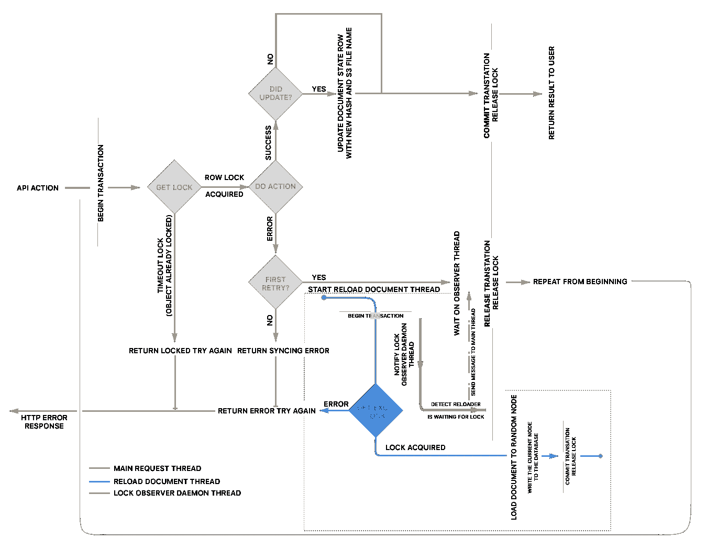

# 修改存储在 PostgreSQL 之外的文件，同时保持完全的事务安全性和无状态设计

> 原文：<https://medium.com/hackernoon/modifying-files-stored-outside-of-postgresql-while-maintaining-full-transaction-safety-and-d8b55327e679>

## 当事情变得**太大**而无法内联存储在数据库中，但我们仍然想要所有这些有趣的事务安全和读写锁，而不需要构建自己的看门人解决方案时，该怎么办？

*这是一系列文章的一部分，展示了我们如何构建* [*Paw Cloud*](https://paw.cloud) *同步后端，以便为团队* *提供既可靠又安全的文档共享服务。之前我写过:* [*AWS 作为云同步服务的无状态平台。*](https://hackernoon.com/aws-as-a-stateless-platform-for-cloud-syncing-services-7afe1908463c#.9wg8cayun)

我们这个系统的主要目标是[确保我们所有服务器的完全无状态操作](https://hackernoon.com/aws-as-a-stateless-platform-for-cloud-syncing-services-7afe1908463c#.lt7yl1pet)这包括能够在任何时候断开任何实例，而不会造成任何数据损坏或丢失。因为我们所有的 API 都包装在事务中，所以我认为我们应该为我们的云同步 API 做同样的事情。

由于我们选择使用 Git 的底层 C 库( [libgit2](https://libgit2.github.com/) )作为同步云项目的服务器端支持，在 PostgreSQL 数据库中存储数据并不容易。首先，它会非常昂贵，其次需要对 libgit2 进行许多定制和相当复杂的改编。因此，出于成本和方便的考虑，将项目存储在亚马逊 S3 上是有意义的。

在每次交互中从 S3 加载一个项目(即使在同一个 AWS 区域内)是很慢的，所以我们希望在加载到后台服务器上时有一个项目当前很热门的概念。由于我们在面向 web 的服务器上有不止一个 Django 实例(这些实例位于负载均衡器之后),所以我们需要一种通用的方法来确保即使请求来自不同的面向客户端的 API 服务器，也不会有并发的读或写操作与同一文档上的写操作同时发生。

## PostgreSQL [行锁](https://www.postgresql.org/docs/current/static/explicit-locking.html)来拯救！

Postgres 让我们显式地获得一个行锁。这个概念让我们可以为 Django 模型创建一个有用的抽象类，我们可能需要锁。

PostgreSQL 提供了两种行锁:**用于共享**一种**共享**锁，用于读操作，以及**用于更新**一种**独占**锁，用于写操作。可以同时获得多个共享锁，而独占锁不需要同时获得其他锁。

Implementation of an exclusive lock in a Django model. Just add another method to get the shared lock by replacing the **FOR UPDATE** with **FOR SHARE** (the the full abstract model [here](https://gist.github.com/hishnash/52e5622de571c10f4d5f12368b205620)).

Postgres 行锁在当前事务结束之前一直被获取。与咨询锁不同，如果不提交/撤销事务，就无法显式释放它们。

如果锁被另一个事务占用，这些锁也将阻止对相应行的标准更新，因此我们不直接锁定文档行，而是锁定指向文档的 *document_state* 实体。这是为了让文档周围的正常数据库活动(如重命名权限更改等)不会被行锁阻塞。在 *document_state* 实体上，我们只保存与同步操作相关的数据，比如版本散列和 S3 上持久化文件的名称。

有了基于用户交互类型的行锁，我们就可以在动作被发送到 worker 服务器实例之前获得一个共享锁或一个排他锁，在 worker 服务器实例中，文档处于 **HOT** 状态并准备好被处理。

为了确保我们总是在用户文档的正确版本上工作，对 worker 微服务的每个 API 调用都包含从数据库中读取的版本哈希(这被认为是真实的来源)。如果缓存在 worker 上的文件版本与数据库中的版本不匹配，我们需要从 S3 重新加载文档的存档。

当用户对项目进行写操作时，工作服务器生成一个新的 UUID 作为文件名，将更新的档案上传到 S3，并将这个文件名和文档散列返回给 Django 实例。更新后的文件信息保存在项目的 *document_state* 行(我们获得了排它锁的行)。

这确保了如果在任何时候写 API 调用失败(例如工作服务器在写入过程中关闭)，相应的事务将失败，因此下一组 API 调用将使用旧版本，因为数据库不会更新版本散列。

Exclusive lock decorator for our API view ([django REST framework](http://www.django-rest-framework.org)) . Our shared lock decorator is very much the same just swapping out the ***get_exclusive_lock*** *context call as well as some user permissions / logging differences.*

项目重装过程是我今天想谈的最后一个方面。因为我们在等待锁时阻塞了一个 [Python](https://hackernoon.com/tagged/python) 线程，所以我们需要在一个单独的线程上重新加载，以允许上面描述的重试(第 25 行)在重新加载后排在队列的第一位。然而，在重载器请求获得另一个锁之前，我们不想释放当前的独占锁(在第 21 行)。事实上，我们知道项目需要重新加载，所以如果有其他请求进来，它也会失败。因此，我们需要两个独立的线程:一个执行项目的重新加载，另一个监视项目上的所有挂起的锁，并在重新加载器在队列中有一个挂起的锁时发送一条消息，以便主线程可以释放它的锁。这里，在第 23 行，主线程等待这个消息。

Flow diagram of the threads and locks used durring an api action. (Some additional Postgres Advisory [**pg_advisory**](https://www.postgresql.org/docs/current/static/explicit-locking.html#ADVISORY-LOCKS) *locks are used on the Reload thread to ensure only one reload is pending per document)*

这里要注意:由于我们需要 Cpython 守护线程，我们意识到我们不能对 Django 实例使用 [greenlet](https://greenlet.readthedocs.io/en/latest/) 。事实上，greenlet 是一个 Python 库，它通过伪造线程来实现并行操作。在我们实现这个功能之前，我们使用的是 Python 服务器运行时[guni corn](http://gunicorn.org/)——它是基于 greenlet 的——但是我们需要切换回标准的 uWSGI 配置。

在 Django 中使用可锁定模型的额外好处是使我们的其他管理 cronjobs(计费、清理、电子邮件)在 Django 实例的无状态分布式集群上运行，同时确保单个数据库项不会被多个作业同时处理。例如，当运行我们的计费 cronjob 时，我们在一个团队数据库实体上获得一个排他锁。这既保护我们免于重复的信用卡费用，也确保团队的数据在计费处理期间不会改变，使得代码更加简单，因为我们不需要检查这种边缘情况。一旦获得了排他锁，就不会在该行上提交其他数据库事务。因此，我们大大降低了我们在计费 cronjob 中的更新由于冲突而被 PostgreSQL 拒绝的可能性。

我们已经注意到我们系统的一个明显问题，如果我们微服务节点上的任务突然开始花费很长时间，并且我们超时不够快，我们可能会以许多许多并发的[数据库](https://hackernoon.com/tagged/database)连接结束。随着 API 调用越来越频繁地失败，重载过程开始产生失控效应。为了防止这种情况，在调用微服务后端时有一个严格的超时很重要。

*P.S .所有代码片段均在* [*MIT 许可*](https://opensource.org/licenses/MIT) *下发布。*

> [黑客中午](http://bit.ly/Hackernoon)是黑客如何开始他们的下午。我们是 [@AMI](http://bit.ly/atAMIatAMI) 家庭的一员。我们现在[接受投稿](http://bit.ly/hackernoonsubmission)并乐意[讨论广告&赞助](mailto:partners@amipublications.com)机会。
> 
> 如果你喜欢这个故事，我们推荐你阅读我们的[最新科技故事](http://bit.ly/hackernoonlatestt)和[趋势科技故事](https://hackernoon.com/trending)。直到下一次，不要把世界的现实想当然！

