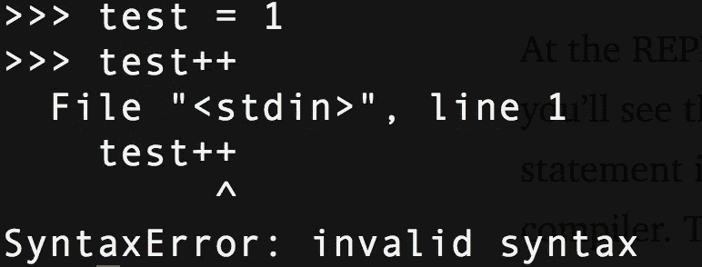
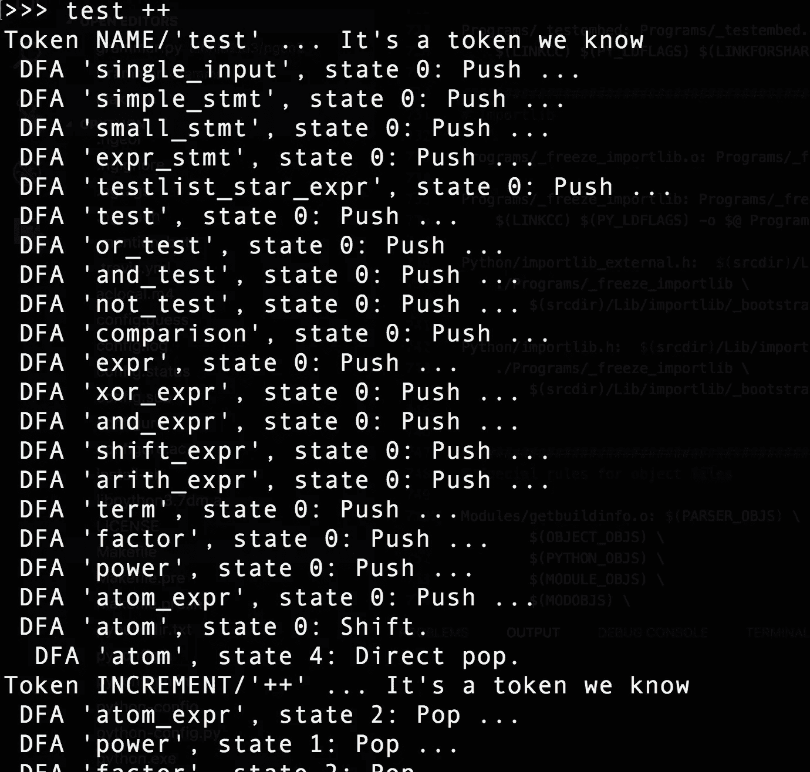
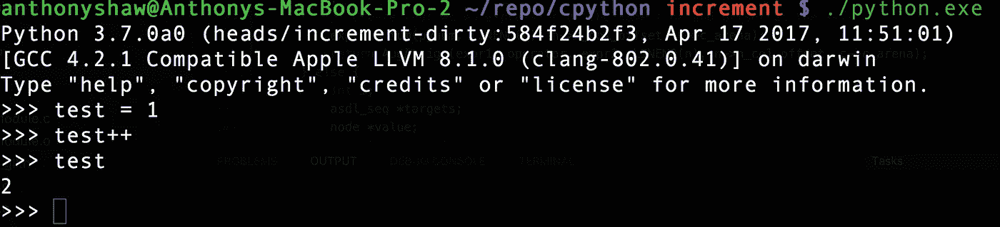
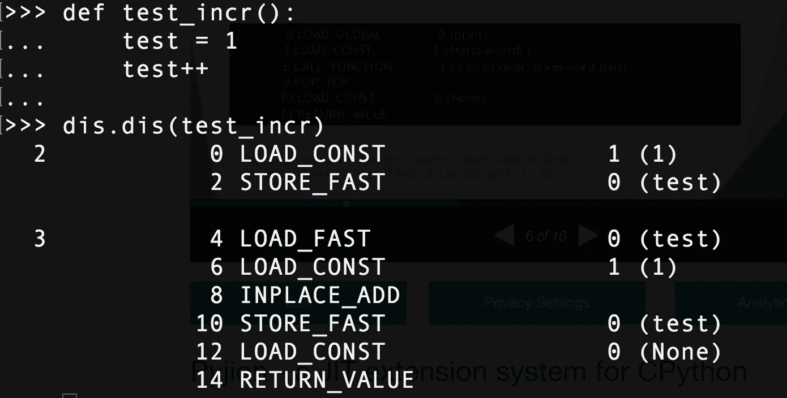

# 在 6 分钟内修改 Python 语言

> 原文：<https://medium.com/hackernoon/modifying-the-python-language-in-7-minutes-b94b0a99ce14>

本周，我向 CPython 核心项目提出了我的第一个 pull-request，但遭到了拒绝:-(为了不浪费我的时间，我写下了我对 CPython 如何工作的发现，并向您展示修改 Python 语法是多么容易。

我将向您展示如何向 Python 语法添加新的**特性**。该语法是递增/递减运算符，是大多数语言中的常见运算符。为了证明这一点，打开 REPL 试试吧。

# 第一级:pep

在改变 Python 语法之前，需要提出一个建议，包括一系列理由、设计和行为。所有语言更改都由核心 Python 团队讨论，并由 BDFL 批准。增量运算符不被认可(可能永远不会被认可)，这给了我们一个很好的测试。

# 第二级:语法

[语法](https://github.com/python/cpython/blob/v3.6.1/Grammar/Grammar)文件是描述 Python 语言所有元素的简单文本文件。不仅 CPython 使用这种方法，PyPy 等其他实现也使用这种方法来保持一致性，并就语言语义的类型达成一致。

在内部，这些键形成了令牌，由 lexer 解析。当你使用一个命令将它们转换成 C 头文件中的一组枚举和常量。这允许我们以后引用它们。

所以，`simple_stmt`是一个简单的语句，它可以选择有一个分号，就像你把`import pdb; pdb.set_trace()`放在新的一行`NEWLINE`中结束。一个`pass_stmt`是单词 pass，一个`break_stmt`是工间休息。简单吧？

让我们添加一个增量和减量表达式，这在语言中是不存在的。它将是表达式语句中的另一个选项，与 yields、augmented 赋值和 regular 赋值一起，即`foo=1`。

我们将它添加到可能的小语句列表中(这在 AST 中会变得很明显)。`incr_stmt`将是我们的增量方法，而`decr_stmt`将是减量方法。两者都跟在一个`NAME`(变量名)后面，形成一个小的独立语句。当我们构建 Python 项目时，它会为我们生成组件(还没有)。

如果您使用-d 启动 Python 并尝试使用它，您应该会得到:

> 令牌 <errortoken>/'++' …非法令牌</errortoken>

什么是代币？让我们找出答案..

# 第三级:Lexer

当您点击 return 时，Python 会执行四个步骤:词法分析、解析、编译和解释。Lexing 正在中断您刚刚输入到令牌中的代码行。CPython lexer 被称为`tokenizer.c`。它具有从文件中读取的功能(如`python file.py`、[一个字符串](https://github.com/python/cpython/blob/v3.6.1/Parser/tokenizer.c#L809-L824)(如 REPL)。它还处理文件顶部的特殊编码注释，并且[将你的文件](https://github.com/python/cpython/blob/v3.6.1/Parser/tokenizer.c#L827-L853)解析为 UTF-8，等等。它处理嵌套、异步和 yield 关键字，检测集合和元组分配，但只处理语法。它不知道那些东西是什么，也不知道如何处理它们。它只关心文本。

例如，允许您对八进制值使用`o`符号的代码在[记号赋予器](https://github.com/python/cpython/blob/v3.6.1/Parser/tokenizer.c#L1635-L1652)中。实际创建八进制值的代码在编译器中。

让我们给 Parser/tokenizer.c 添加两个东西，新的`INCREMENT`和`DECREMENT`标记，这些是标记器为代码的每个部分返回的键。

然后，我们添加 check 来返回一个`INCREMENT`或`DECREMENT`令牌，每当我们看到++或-。已经有一个用于 2 字符操作符的函数，所以我们扩展它以适合我们的情况。

这些在`token.h`中定义

> #定义增量 58
> 
> #定义减量 59

现在，当我们用-d 运行 Python 并尝试我们的语句时，我们看到:

> 这是我们知道的象征——成功！

# 第 4 级:解析器

解析器接受这些标记，并生成一个结构来显示它们之间的关系。对于 Python 和许多其他语言来说，这就是抽象语法树(或 AST)。然后，编译器获取 AST 并将其转换成一个(或多个)代码对象。最后，解释器获取每个代码对象并执行它所代表的代码。把你的代码想象成一棵树。顶层是根，函数可能是分支，类是分支，类方法是分支。语句是分支中的叶子。

AST 在 ast.py 和 ast.c 中都有定义，ast.c 是我们需要更改的文件。AST 代码被分成处理标记类型的方法，`ast_for_stmt`处理语句，`ast_for_expr`处理表达式。我们把`incr_stmt`和`decr_stmt`作为可能的表达式语句。它们几乎等同于增强表达式，如`test += 1`但没有右手表达式(1)，它是隐式的。

这是我们添加来处理增量和减量的代码。

这将返回一个扩充的赋值，而不是一个常数值为 1 的新表达式类型。根据令牌类型`incr_stmt`或`decr_stmt`，运算符为 Add 或 Sub(tract)。编译后回到 Python REPL——我们可以看到我们的新语句！

在 REPL，您可以试试这个:`ast.parse("test=1; test++).body[1]`，您将看到返回的`AugAssign`类型。AST 刚刚将语句转换成一个语句表达式，然后编译器可以处理它。`AugAssign`函数设置编译器使用的字段`Kind`。

# 第 5 级:编译器

编译器然后获取语法树并“访问”每个分支，CPython 编译器有一个访问语句的方法，称为`compile_visit_stmt`，它只是一个查看语句类型的大开关语句。我们的是一个`AugAssign`类型，所以它调用`compiler_augassign`来处理细节。然后，这个函数将我们的语句转换成一组字节码。这些是机器码(01010101)和语法树之间的中间语言。*字节码序列是缓存在。pyc 文件。*

输出将是 VISIT(load value——对我们来说是 1)、ADDOP(二元 OP 的加法运算，取决于操作符(subtract，add)和 STORE_NAME(将 ADDOP 的结果存储到名称中)。这些方法用更具体的字节码来响应。

如果您加载`dis`模块，您可以看到自己的字节码

# 第 6 级:口译员

最后一级是翻译。它获取字节码序列，并将其转换成特定于机器的操作。这就是为什么 mac 和 Linux 的 Python.exe 和 Python 都是独立的二进制文件。一些字节码需要操作系统特定的处理和检查。例如，线程 API 需要与 GNU/Linux 的线程 API 一起工作，这与 Windows 线程非常不同。

> 就是这样！

# 进一步阅读

如果你对解释器感兴趣，我做过一个关于 Pyjion 的演讲，这是一个 CPython 的插件架构，后来成为了 [PEP523](https://www.python.org/dev/peps/pep-0523/)

如果你还想玩，我把代码上传到了 [GitHub](https://github.com/tonybaloney/cpython/commit/fd7c20c3a3a02b4f2dae8ec7a90448627aa0d757) ，还有我对`await`记号赋予器的修改。

> [黑客中午](http://bit.ly/Hackernoon)是黑客们下午的开始。我们是 [@AMI](http://bit.ly/atAMIatAMI) 家庭的一员。我们现在[接受投稿](http://bit.ly/hackernoonsubmission)并乐意[讨论广告&赞助](mailto:partners@amipublications.com)机会。
> 
> 如果你喜欢这个故事，我们推荐你阅读我们的[最新科技故事](http://bit.ly/hackernoonlatestt)和[趋势科技故事](https://hackernoon.com/trending)。直到下一次，不要把世界的现实想当然！

