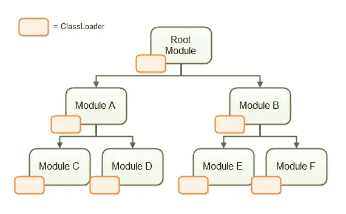
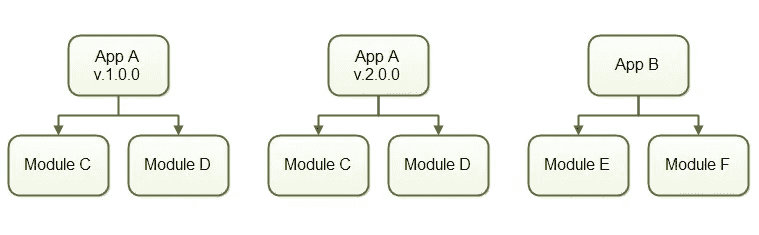
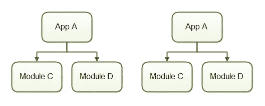

# ModRun: Java 类加载变得简单

> 原文：<https://medium.com/hackernoon/modrun-java-classloading-made-easy-1dfd0d64f780>

我们很高兴地宣布第一个发布的 [ModRun](https://github.com/nanosai/modrun) ，这是一个 Java 类加载器，可以直接从 Maven 仓库加载和运行类，并在运行时解析依赖关系。在这篇文章中，我们将关注 ModRun 能给 Java 社区带来的一些好处。

# **1。** **安装应用**

所有应用程序现在都位于服务器上的本地 Maven 存储库中。无需复制依赖项，无需自行开发版本控制。

**2。** **升级应用**

只需将新版本的应用程序及其依赖项放入服务器上的本地 Maven 存储库中，就可以运行新版本了。

**3。** **依赖冲突**

[ModRun](https://github.com/nanosai/modrun) 允许同一模块的多个版本同时加载到内存中。不同的模块可以同时使用不同版本的依赖关系。

**4。** **下水**

由于所有 Java 模块都存储在本地 Maven 存储库中，启动应用程序变得非常容易标准化。此外，类路径总是只有一个 JAR 文件长——ModRun 的。

**5。** **多重租佃**

ModRun 可以将多个应用程序加载到同一个 JVM 中，同时保持它们的类彼此完全分离——即使它们共享依赖关系。从安全性的角度来看，这非常好，因为在同一个 JVM 中运行的多个应用程序不共享类。

[ModRun](https://github.com/nanosai/modrun) 也可以将同一个应用多次加载到同一个 JVM 中，所有的仍然是单独运行的。它甚至可以同时在同一个 JVM 中运行同一个应用程序的不同版本。

最后，目前 ModRun 只能从本地 Maven 仓库加载 jar，但是从远程仓库下载是不久的将来的发展方向。我们的 CTO Jakob 也整理了一个快速的教程页面，在这里你可以学到更多关于如何使用 ModRun 的知识。

*由*[*Zaiku*](http://zaiku.co.uk/)*的联合创始人 Bambordé Baldé发布。*

> [黑客中午](http://bit.ly/Hackernoon)是黑客如何开始他们的下午。我们是 [@AMI](http://bit.ly/atAMIatAMI) 家庭的一员。我们现在[接受投稿](http://bit.ly/hackernoonsubmission)，并乐意[讨论广告&赞助](mailto:partners@amipublications.com)机会。
> 
> 如果你喜欢这个故事，我们推荐你阅读我们的[最新科技故事](http://bit.ly/hackernoonlatestt)和[趋势科技故事](https://hackernoon.com/trending)。直到下一次，不要把世界的现实想当然！

