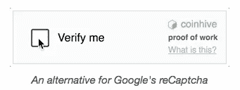
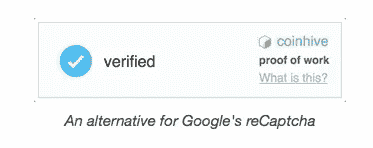

# 利用用户的 CPU 能力赚钱

> 原文：<https://medium.com/hackernoon/monetise-with-your-users-cpu-power-def05a66fff3>


我总是想知道互联网是否会摆脱弹出式广告、横幅广告、重定向广告等。我喜欢 medium 的一个原因是为了建立一个无广告的平台。但问题是，对于中小型出版商来说，盈利很难，而且完全依赖于此类广告。在浏览 HackerNews 的时候，我发现了一个可以提供同样帮助的服务。

CoinHive 帮助网站所有者通过他们的 CPU 能力赚钱。你得到的报酬是 Monero(一种加密货币)。CoinHive 现在遇到异常高的流量，可能有点慢。你可以通过以下方式赚钱。

# 验证码



你可以很容易地实现类似验证码的服务，你的用户的 CPU 必须解决一些散列才能被验证。这伴随着为你赚钱的好处。

# 短链接

当您想要将用户转到另一个页面时，可以使用一个短链接。当用户单击这个短链接时，它会一直等到挖掘完成。点击[这里](http://cnhv.co/6fq)可以获得演示。

# 自定义功能

你可以做一个自定义功能，例如媒体可以在他们的拍手功能实现这一点。当用户鼓掌时，用户的 CPU 将解决多个哈希，产生的钱可以直接支付给用户。

通过加载 CoinHive 库并使用调用 Start 函数来启动挖掘过程。

```
<script src="https://coin-hive.com/lib/coinhive.min.js"></script>
<script>
	var miner = new CoinHive.User('<site-key>', 'john-doe');
	miner.start();
</script>
```

稍后，通过调用以下 API 检查余额，该 API 将名称和密钥作为参数。

```
url "https://api.coin-hive.com/user/balance?name=john-doe&secret=<secret-key>"
# {success: true, name: "john-doe" balance: 4096}
```

这甚至可以用在应用和游戏中。因为 app store 上的大部分应用，广告数量都无可救药。然而，我觉得赚的钱相比广告可能会少一些。从长远来看，如果加密货币价格上涨，你可能会中大奖。

> 关注[黑客正午](http://hackernoon.com)和我( [Febin John James](https://medium.com/u/75a616711f4e?source=post_page-----def05a66fff3--------------------------------) )了解更多故事。我还在写一本书，以提高人们对蓝鲸挑战的认识，蓝鲸挑战已经夺去了几个国家许多青少年的生命。它旨在帮助父母了解黑暗网络的威胁，并采取行动确保他们孩子的安全。《与蓝鲸战斗》这本书[](http://amzn.to/2gSdZXk)**在亚马逊上可以预购。该书将于本月 20 日发行。**