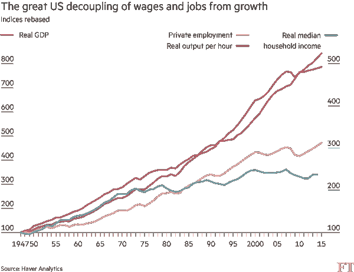

# 免费的钱，免费的踢

> 原文：<https://medium.com/hackernoon/money-for-nothing-kicks-for-free-f4b6e489922c>

也许有一天，也许很快，机器人会取代我们的工作。全部都是。对于普遍观点来说，这不是一个“T0”是否“T1”的问题，而是一个有多少工作和多快会有工作的问题。随着整个职业——律师、医生、飞行员——完全消失，人们熟悉的生活方式将会消失。“即使在良性的情况下，”埃隆·马斯克最近在代码大会上说，“我们也会变得像家猫一样。”确切地说，对我们来说，这并不是世界末日——喂养、宠爱、进出、清理垃圾箱——但我们也不会真正为这个世界贡献多少价值。

在面对其他令人烦恼的问题之前，我们不必回到解雇通知书的伟大时代。自 20 世纪 70 年代初以来，我们看到工资增长与整体经济增长脱钩。过去，随着馅饼越做越大，每个人的份额也越来越大。最近的历史并不公平:对一些人来说，面包皮还是老样子，但对最胖的人来说，水果馅越来越多。

因此，一些风险资本家变成了风险社会主义者。他们希望解雇通知书的年代与富足的年代一致。虽然机器人可能会让每个人都失业，但国家将变得如此富裕，以至于他们可以付钱给每个公民，让他们除了实现卡尔马克思(Karl Marx)的梦想(下午钓鱼，晚上评论诗歌)之外什么都不用做。YCombinator 的总裁山姆·奥特曼(T2)对此表示担忧，并开始了一项针对这一问题的研究计划。创业加速器计划[进行一项试点测试](https://blog.ycombinator.com/moving-forward-on-basic-income)，保证奥克兰一小部分人的收入。奥尔特曼希望这笔钱将“给人们追求进一步教育或培训的自由，找到或创造一个更好的工作，并为未来做计划。”

在其他问题上持反对意见的学者和作家(左翼和右翼)现在聚集在一座山上，就像可口可乐广告中唱的一样，唱着全民基本收入(简称 UBI)的欢乐。麻省理工学院教授、《第二个机器时代》一书的作者埃里克·布林约尔松预言了一个“数字雅典”的到来，在那里我们将自由地讨论哲学和练习绘画，因为勤劳的机器人将制造我们油田工人所需要的一切。自由主义社会科学家查尔斯·默里在《华尔街日报》上写道，普遍的基本收入将导致公民美德的重生，一种“以前所未有的规模恢复美国志愿努力满足人类需求的伟大传统”

在左边，一位进步的荷兰作家 Rutger Bregman，在荷兰写了一本畅销书，现在在世界范围内越来越受欢迎——现实主义者的乌托邦。这本书呼吁普遍的基本收入、开放的边界和每周 15 小时的工作制。芬兰政府——只是为了看看会发生什么——正在测试一个试点项目，在该项目中，随机选择的 10，000 名成年人将在两年内每月获得 550 欧元的免税。

这些是桌上的卡片。这种想法在美国已经成熟了吗？如果机器人做每件事都比我们做得好，那么政府每周支付的文莫报酬能提供足够的安慰吗？

我不这么认为，有几个原因，在进入更大的困难之前，我将在这里概述一下。简而言之，这会让这个国家破产。我们还不够富有。其次，如果不拖累许多设计拙劣、复杂的项目，就很难从这里走到那里，而简单的普遍基本收入就是为了取代这些项目而设计的。这一想法也引发了关于移民、民族国家以及谁将获得公民身份的好处等令人不安的问题。社会服务越强大，国家就越害怕与陌生人和新来者分享。

但我想把替代方案和可行性反驳放在一边，而是特别关注 UBI 的一个弱点:无偿发放金钱不会让少数人更幸福，而且会阻碍人类的繁荣。许多支持者，尤其是未来主义者，对什么能让人快乐做出了错误的假设。事实是许多人更喜欢工作而不是休闲，即使他们有钱。他们不想成为养得很好的家猫或拿着丰厚津贴的孩子。把有意义的工作换成对所有人的检查，将会在许多人找到目标和乐趣的地方钻一个大洞。

证据是什么？它始于间接但相似的想法。让我们开始摇摆吧。

“Giving an allowance is statistically associated with diminished financial literacy, lower levels of motivation and an aversion to work.” ([Time](http://business.time.com/2012/02/15/why-giving-your-kids-an-allowance-might-not-be-teaching-them-anything/))

荷兰著名社会学家鲁特·范荷文(Ruut Veenhoven)研究了不同社会制度下人们对生活的感受。[他写道](http://www.tandfonline.com/doi/abs/10.1080/13876980008412637)“与预期相反，福利国家的规模和福利水平之间似乎没有联系。在拥有慷慨社会保障计划的国家，人们并不比同样富裕、政府不那么慷慨的国家更健康、更幸福。”

那些从政府那里得到很多钱，却没有享受福利的耻辱的人呢？

1978 年《社会心理学》的一项经典、公认为古老的研究调查了三组人——彩票中奖者、控制组和瘫痪事故受害者——他们对生活的感受。调查说！彩票中奖者并不比对照组更快乐。调查还显示，彩票中奖者不像四肢瘫痪者和截瘫者那样欣赏日常生活中的小乐趣。尽管与事故受害者相比，他们的总体幸福感更高，但也不是很高。([2008 年荷兰的一项研究](http://escholarship.org/uc/item/07k895v4#page-1)得出了类似的结论。)来自天堂的甘露——给予的，但不劳而获——不会导致圆满。

更有趣的是，我们得出了吹牛老爹的深刻真理，“不要钱，不要问题。”彩票中奖会加速螺旋式下降。一位名叫马克·梅特卡夫的叉车操作员在 2000 年的肯塔基州彩票中赢得了 3400 万美元。他不得不与分居的妻子分享一半。他辞掉工作，买了一个 43 英亩的庄园，享受闲暇，收集老爷车，圈了一些马。不到三年，他和分居的妻子都死于酒精中毒和吸毒引起的并发症。梅特卡夫的第一任妻子[告诉《纽约时报》记者](http://www.nytimes.com/2005/12/05/us/instant-millions-cant-halt-winners-grim-slide.html)，“如果他没有赢，他会像普通人一样工作，也许还能活 20 年。但是当你把钱交到有问题的人手里，只会帮助他们自杀。”

这类故事已经形成了自己的风格，甚至还有《李斯蒂克尔斯》——十九个彩票中奖者都搞砸了。一项研究发现，彩票中奖并不会让幸运儿或他们的孩子变得更健康。

然而，总的来说，对于拥有高薪职业的彩票中奖者来说，这种情况很少见。对这些人来说，获胜意味着做更多他们喜欢的事情——他们工作。2004 年的一项研究发现，85.5%的美国人在获胜后继续工作，许多人从事同样的工作；[2009 年的一项研究发现 62%的瑞典获奖者继续工作。如果机器人在接受检查和休闲的同时接受他们的工作，情况不会更好，因为我们现在知道他们的偏好，即使他们期望有大量有保证的收入。](http://digitalscholarship.unlv.edu/grrj/vol13/iss2/1/)

不可否认，彩票奖金比典型的基本收入提案所显示的要多。有时赢家会一次性付清，而不是 20 年的付款计划。但是越多越糟？如果人们越来越乐于接受一点而不是很多，那才奇怪呢。[快乐跑步机](https://en.wikipedia.org/wiki/Hedonic_treadmill)让我们保持跑步。

# 有钱的老鼠赛跑

自 1950 年以来，美国经济增长了不少。当然，我们没有放火，但是我们比以前富裕多了。然而。自那以后，人均工作时间增加了。这提出了一个难题:为什么技术进步和经济增长没有降低每周工作时间？经济学家约翰·梅纳德·凯恩斯(John Maynard Keynes)在 1931 年写了一篇预测未来一个世纪的文章。它叫做“我们子孙后代的经济可能性”在大萧条的最深处，他写道，技术进步如此之快，由于自动化，现在我们——他的孙子们——将每周工作 15 个小时，在业余时间，我们终于可以面对如何利用我们的自由和度过我们的闲暇时间的“永久问题”。

但凯恩斯大错特错。尽管我们变得越来越富有，拥有更多节省劳动力的设备，但我们的工作时间并不比 1950 年少。就像今天的 UBI 支持者一样，凯恩斯设想了一个未来，我们将过着剑桥大学教师的生活，边喝啤酒边讨论哲学，在剑河上划船。但是相反的情况发生了，尤其是对收入最高的 1%的人来说。与凯恩斯的预期相反，在越来越高的工资水平下，人们工作的时间并没有减少；他们工作更多。经济学家泰勒·考恩(Tyler Cowen)在最近的一次演讲中说:“经济数据中的一大教训是，人们真的喜欢工作。”

想想动物园里既不害怕饥饿也不害怕凶猛的捕食者的动物:许多动物的预期寿命比它们在野外的朋友要短。或许这就是马斯克不满足于做家猫的原因。

人们需要模拟体验。他们需要有参与感，赌注必须是真实的。在挑战性的任务中锻炼他们的身体和头脑，这些挑战性的任务对比他们自身更大的东西，更有价值的东西产生重大影响——这似乎就是完整的人类。仅靠 Venmo 付款是不够的。维也纳精神病学家维克多·弗兰克尔在他的回忆录《人类对意义的追寻》中描述了他是如何在纳粹集中营中幸存下来的。帮助他活下来的不是一种坚忍的清静主义。这是一项有意义的工作:

> “在医务室的第四天，我刚被分配到夜班，这时主任医生冲了进来，让我志愿去另一个收容斑疹伤寒病人的营地执行医疗任务。不顾朋友们的紧急建议(尽管事实上几乎没有一个同事主动提供服务)，我决定去做志愿者。我知道在一个工作组里，我会在短时间内。但是如果我不得不死的话，我的死至少还有一些意义。我想，作为一名医生，努力帮助我的同志们，无疑会比像当时那样无所事事或最终失去作为非生产性劳动者的生命更有意义。”

金钱通过系统地平衡我们的目标来威胁我们。人可能不会饿死，但会觉得自己没用。也许政府——或者拥有机器人的人——需要启动历史上最伟大的制造工作项目。机器人看着人类笨拙而缓慢地堆砌石头的金字塔建筑。或者，也许，当我们所有人都被束缚在 Oculus 裂缝中时，虚拟现实可以将怀疑搁置足够长的时间，以创造一种成就感。或者，也许人类会发明商业来为他人创造新的引人入胜和以逆境为主题的体验。但是机器人并没有承担所有的工作…不管是什么情况，倡导者已经发现了一个问题，但他们应该承认，仅靠普遍基本收入并不能解决问题。

# 多方面的

在《黑道家族》最后一季的“追逐它”一集中(由马修·韦纳编剧)，托尼·索波诺的一个手下试图向他解释洛奇·瓦伦丁的命运告诉了我们什么是幸福。洛奇·瓦伦丁是*阴阳魔界*中的一个虚构人物，一名歹徒在 1960 年的一集《一个值得参观的好地方》的前几分钟被击毙死后，洛奇·瓦伦丁醒来后发现了一个他在赌博中不会输的世界。他可以得到任何他想要的女人或任何其他快乐。自然，瓦伦丁相信他已经死了，去了天堂。但是当发现他实际上在地狱时，事情发生了转折。他注定要永远得到他想要的一切。瓦伦丁保证获胜的空洞在托尼·索波诺的生活中回响。杀死他的侄子后，托尼飞往拉斯维加斯，在那里他赢得了轮盘赌，服用迷幻药，并与认识他侄子的脱衣舞娘发生了关系。这一集的结尾是托尼凝视着夕阳，说“我明白了。”

关于一项臭名昭著的研究:20 世纪 60 年代末到 70 年代，美国政府资助了一些社会实验来测试负所得税(其作用类似于 UBI)的影响。无论如何，参与者都将获得一定水平的收入，如果他们的收入低于预先设定的阈值，他们将获得最高收入，如果他们根本不工作，他们将获得全部收入。(例如，如果不工作，他们得到 8k 美元；如果他们让 4k 美元发挥作用，他们将获得 4k 美元。)试验在新泽西州、宾夕法尼亚州、爱荷华州、印第安纳州、北卡罗来纳州、西雅图和丹佛进行。

不幸的是，没有关于它对参与者快乐的影响的记录。此外，追踪的结果是模糊的。例如，在新泽西州，参与者仍然从已经存在的政府项目中领取福利支票和福利，因此混淆了效果。不过，总的来说，可以肯定地说，人们稍微放松了工作。这是有争议的，但在丹佛和西雅图，似乎家庭解体的速度加快了。 [FiveThirtyEight 声称](http://fivethirtyeight.com/features/universal-basic-income/)这是一个统计错误，但却用被动语态这样说，隐藏了是谁发现了“错误”以及错误是什么。这位 538 岁的作家也提到了“离婚率”,但是该研究把同居算作婚姻，把分居算作离婚，而不是真正的法律离婚事件。一项调查发现，如果你排除没有孩子的夫妇，离婚率并没有那么高。尽管如此，还是有人分手了。我说过了，模糊。

> [黑客中午](http://bit.ly/Hackernoon)是黑客如何开始他们的下午。我们是 [@AMI](http://bit.ly/atAMIatAMI) 家庭的一员。我们现在[接受投稿](http://bit.ly/hackernoonsubmission)并乐意[讨论广告&赞助](mailto:partners@amipublications.com)机会。
> 
> 如果你喜欢这个故事，我们推荐你阅读我们的[最新科技故事](http://bit.ly/hackernoonlatestt)和[趋势科技故事](https://hackernoon.com/trending)。直到下一次，不要把世界的现实想当然！

