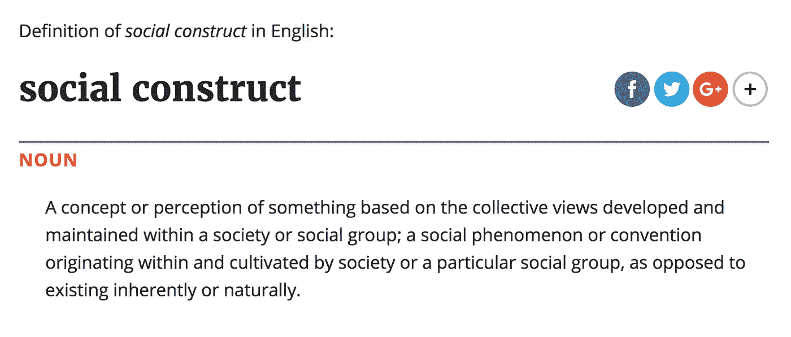
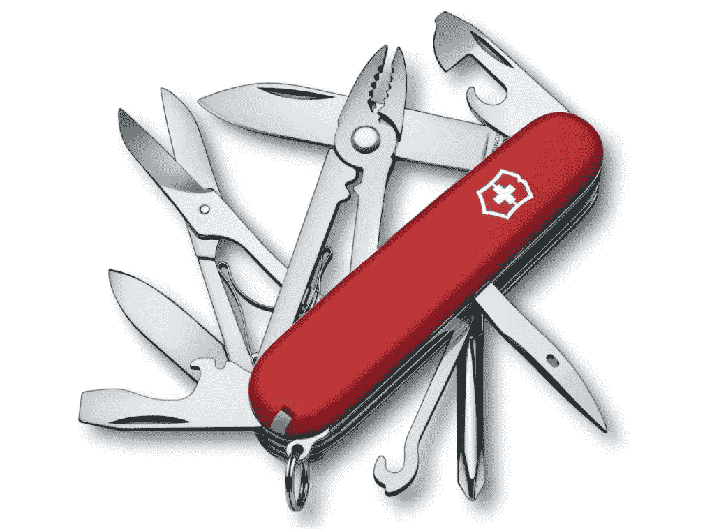
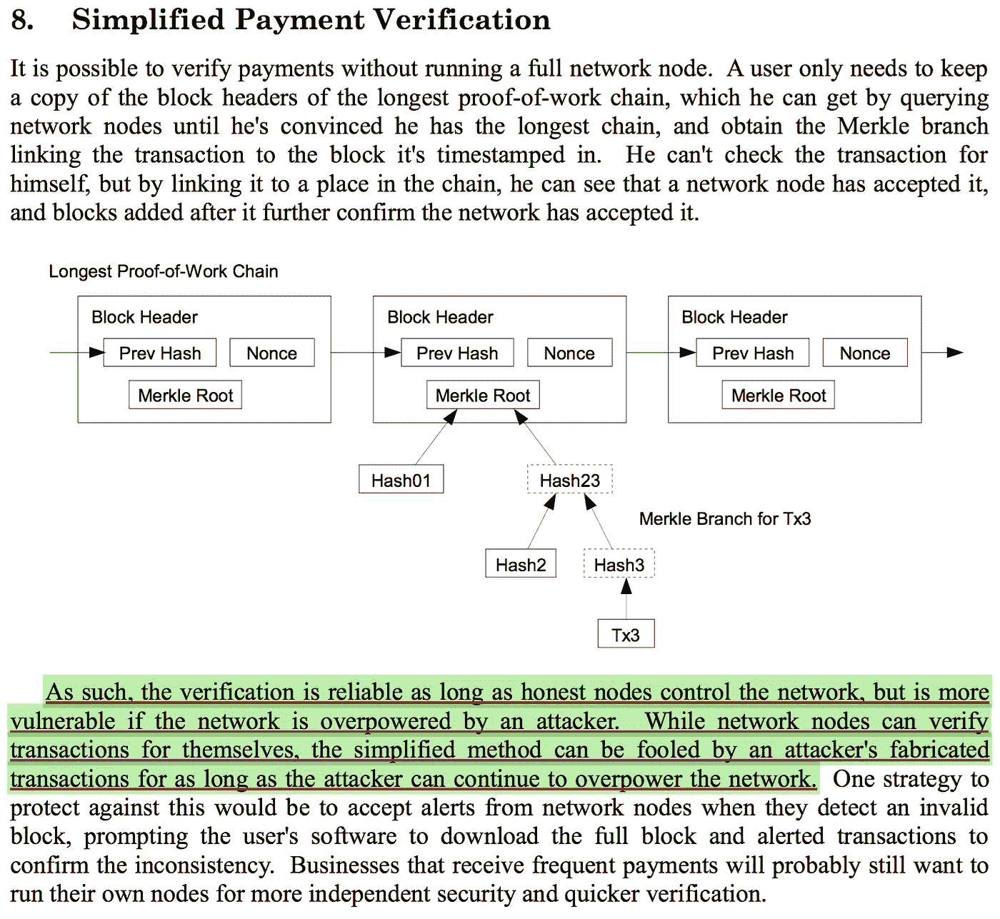
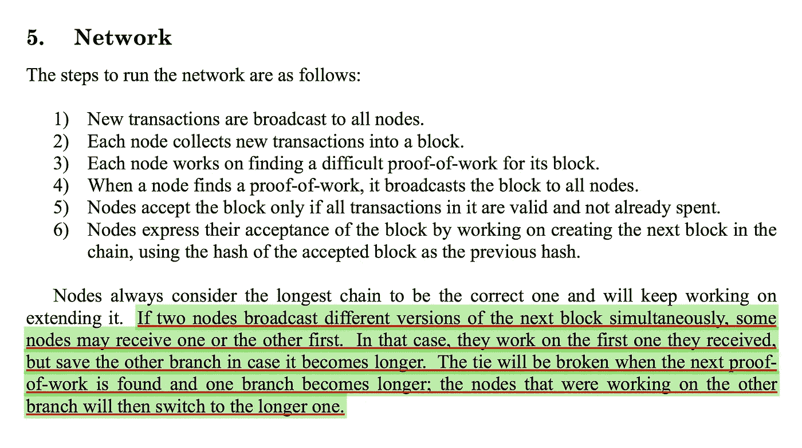
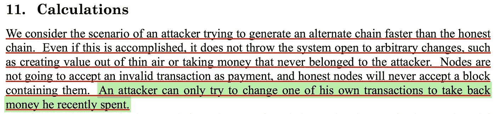
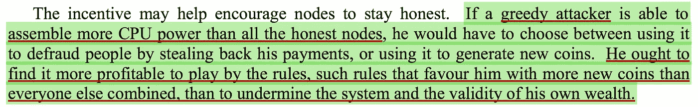

# 金钱是一种社会建构，这就是为什么你应该运行#比特币全节点

> 原文：<https://medium.com/hackernoon/money-is-a-social-construct-and-thats-why-you-should-run-a-bitcoin-full-node-ea0330cb69a5>

Rai Stones: a fascinating form of money

**比特币是一个有很多严格规则但没有任何统治者的系统。这之所以成为可能，是因为系统的每个用户都执行这些规则。改变现有的规则几乎是不可能的，但如果达成共识，可以增加新的规则。**

在没有统治者的情况下执行规则可能是比特币背后最大的创新。

但这并不意味着没有人试图成为统治者…

**出于这个原因，比特币的用户必须捍卫自己作为生态系统中规则实施者的地位。**

**Rules-without-Rules**是区别于所有其他货币体系的一个特征，单单这个特征就可能代表了比特币最初获得价值的主要原因。

不幸的是，比特币有点难以理解，甚至更难解释……
所以我们先来简化一下比特币的生态系统:

## 矿工是供给。
——用户就是需求。
-节点指定用户的需求。
-矿工们努力实现这一规范。

要理解比特币如何保值，我们必须先退一步问:

***什么赋予金钱价值？***

金钱首先是一种社会结构，所以让我们查一下字典:

Source: [Social construct](https://en.oxforddictionaries.com/definition/social_construct)

记住金钱只是一种社会建构，问问你自己:

***下图中的值在哪里？***

Money is a social construct

## 回答:

价值是水管工提供的服务质量和面包师制作的面包的味道。

这些都是市场有明确需求的价值观。

这个插图中的钱不是价值。

***但如果钱不是价值，那么钱是什么？***

钱**只是水管工和面包师使用的工具**:

-向**传达**服务和面包的价值。

-与**互相交换**他们产生的值

—**存储**(保存以备后用)他们创造的价值。

-**计算**管道工提供的服务与面包师生产的面包相比的价值。

一个有趣的问题是:

***如果管道工执行一项需要一个小时才能完成的服务；面包师必须生产多少面包才能产生相应的价值？***

金钱是一种工具，它允许对不同的价值进行测量，这样上述问题才能有一个令人满意的答案。

**上述所有特征适用于比特币，就像它们适用于美元(或任何其他形式的货币)一样**

Money is a useful multi-tool

(注意:为了简单起见，我将使用美元一词，而不是“法定货币”或“政府控制的货币”)

金钱本身没有价值**，但作为一种社会建构**(作为一种有用的工具)变得有价值

金钱的价值来自使用者的 T4 感知。接受金钱作为支付有实际价值的东西的媒介的行为；**赋予金钱价值。**

简而言之:

***——金钱的使用者赋予金钱它的价值。***

考虑到这一点，作为社会建构的 ***美元*** 和作为社会建构的 ***比特币有两个非常重要的区别:***

**#1:** 接受比特币是完全自愿的，而接受美元不是。

美元具有法定货币地位的优势。这意味着当提供美元作为支付手段时，法律要求管道工和面包师接受这种支付手段。

换句话说；法律要求他们给出美元价值

美元有一个固有的权威(国家)来执行美元的规则。

当水管工和面包师收到他们银行账户里的美元时，他们可以高度肯定地知道；这些都是合法货币，符合固有权力机构实施的规则。

Bitcoin is voluntarily while the dollar is not

任何接受比特币作为支付媒介的人都是完全自愿的。这意味着用户自愿选择**赋予比特币价值。**

但由于比特币没有固有的权威，接受比特币就伴随着一种特殊的责任:

***用户有责任独立检查一笔入局比特币交易的有效性。***

为此，用户必须连接到由个人用户拥有和控制的完全验证节点。

这是以完全不信任的方式使用比特币，不依赖任何第三方的唯一方式。

***比特币的规则由用户*通过*他们验证*** 的行为来执行

用户正在练习强制执行，因为他们只接受比特币作为有效支付，如果；

他们接收的比特币交易:
是由他们运行的个人节点指定的有效交易。

**用户通过只给用户眼中有效的硬币赋予价值来执行比特币的规则。**

***无有效性=无给定值***

这就是为什么矿工必须遵守用户强制执行的规则。

如果矿工不服从；那么他们最终会浪费大量的精力去开采在用户眼中一文不值的硬币。

## **控制圣杯**

很明显，某些势力非常渴望成为比特币的权威。他们为获得一定程度的控制而斗争..

这种对控制权的争夺，是现实中的；
***一个由用户给定的战斗控制值***

***这是一场控制社会建构的战斗***

The Holy Grail of Control

***比特币用户可以选择控制自己的社交结构，这就是验证节点的力量。***

只有一种方法可以让那些想要成为权威的人远离我们的系统；

***比特币用户必须继续执行他们社会建构的规则。***

验证节点，由用户自己运行；确保价值只给予在用户眼中有效的社会结构。

## 在一个多比特币分叉的世界里，如何定义真正的比特币？

不幸是，这个问题永远不会有一个确定的答案，因为没有固有的权威可以决定答案应该是什么。

也许问 ***一个定义*** 就是 ***问错了问题..(?)***

也许每个人都应该问问自己:

***我自己对比特币的认知是什么？***

Perception

作为用户，你的利益将得到最好的服务；如果你选择专门赋予你认为是真正比特币的比特币**版本价值。**

请记住:
**你可以通过独家接受该特定版本作为有效支付来做到这一点。**

作为这篇文章的作者，我只能代表我自己。

以下是一个思路，代表**我个人对*真实比特币的看法:***

**#1** 比特币是一种技术。

**#2** *比特币-货币*离不开*比特币-技术*。他们是一样的。

**#3** 因此，我投资比特币的价值是对特定技术的投资。

各种技术都依赖于维护。

要进行维护，必须有维护人员。

因此，我对这项技术的投资也是对技术维护者的投资

**#7** 我对真实比特币的看法；是最有资格的维护者所支持的

**#8** 我认为最有资格；那些最有可能成功让比特币在最重要的属性完好无损的情况下继续存在的人。

**#9** 在我看来，比特币最重要的属性是；
***成为不受审查的价值储存手段，可以在不依赖任何可信第三方的情况下保存和转移。***

通过用我自己的验证节点实施共识规则，我将只接受有效支付；这是我对真实比特币的看法

## **比特币白皮书和矿工可以改变规则的巨大误解:**

Satoshi 在比特币白皮书中特别提出了警告:

From the [bitcoin white paper](https://bitcoin.org/bitcoin.pdf) page 5

绿色突出显示的是反对使用 SPV 钱包的明确警告。
**在当前的环境下，这个警告不可掉以轻心。** SPV 是比特币的一种交易方式，无需对进来的交易进行独立验证。
SPV 客户端不执行任何规则，并且基本上只是信任它从随机节点接收的信息。

永远记住: **在比特币网络发生大规模攻击时，来自拥有总 hash-rate 50%以上的攻击者；
你的 SPV 钱包易受攻击，可能被忽悠收到假比特币。**

一些现代的 SPV 钱包(例如 [GreenBits](https://play.google.com/store/apps/details?id=com.greenaddress.greenbits_android_wallet) )让你能够专门连接到你自己的完全验证节点。该解决方案将强制执行的能力与移动钱包的便利性相结合，使您完全免受 Satoshi 在白皮书中警告的攻击。

从技术上来说，比特币区块链分裂成两个不同的链是可能的，同时在当前的共识规则(由用户执行的规则)下，这两个链仍被视为有效

事实上，这种情况每周都会发生，是比特币区块链的一种完全自然的行为。

由于这种现象，比特币区块链依赖于一种特定的解决方案(一种自动功能)，当拆分发生时，该解决方案会解决拆分问题。

***Satoshi 是这样设计比特币的，当两条有效链并行形成时，那么具有最多累积工作证明的链就是重要的链。另一条链会从历史中被删除。***

一个**有效链；**是一个链，其中所有块都符合创建每个块时存在的所有共识规则。

一条**无效链；**是包含至少一个不符合创建该区块时存在的共识规则的区块的链。

当谈到比特币的实际工作方式时，这种特殊的解决方案(或自动功能)不幸地成为了广泛误解的来源。

比特币白皮书谈到了这一功能，但**没有在任何地方**说矿工可以使用这一功能作为一种机制**改变生态系统的规则**。

但是，白皮书确实解释了并行形成两个* **有效*** 链的问题，然后继续解释说**“最大累积工作证明”**的参数是这个特定问题的解决方案

****

**From the [bitcoin white paper](https://bitcoin.org/bitcoin.pdf) page 3**

**白皮书还明确解释说:
***【一条备用链比诚实链更快】*** *会被网络认为****无效而；
***【不把系统抛开去任意改动】*******

********

****From the [bitcoin white paper](https://bitcoin.org/bitcoin.pdf) page 6****

****注意最后一句话(用绿色突出显示)****

*******“攻击者只能*尝试修改自己的一笔交易，以收回他最近花掉的钱”*******

****这句话特别重要，因为它表明 Satoshi 指的是网络规则内攻击者的能力**。******

****这里的要点是，攻击者无法使用他压倒性的哈希力量来有效地改变社会结构(生态系统的规则)****

****再多的杂凑力量也无法改变比特币的规则，**因为社交结构仍然由用户和他们的验证节点控制。**
那些验证节点只关心符合其规则的哈希幂。事实上，他们对任何破坏他们规则的链都完全视而不见，不管这个链包含多少杂凑力量。****

****虽然攻击者有可能造成一些短期的中断(在规则范围内)，但 Satoshi 解释说，这种特殊的攻击会给攻击者带来经济后果:****

********

****From the [bitcoin white paper](https://bitcoin.org/bitcoin.pdf) page 4****

******要了解更多关于验证节点的信息，请阅读:******

****[完整的节点和假新闻:比特币创造者的比特币入门](/colu/full-nodes-and-fake-news-a-bitcoin-primer-for-bitcoiners-47120b1a97bf)作者[乌迪·韦特海默](/@udiwertheimer)
[我对克雷格·赖特的审查问题](/@codeCrypto/my-censored-question-to-craig-wright-e8a3fe7034d)作者[Th⒇ο\ _[o]_/](/@codeCrypto)****

****[捍卫你的金融主权](/@lopp/securing-your-financial-sovereignty-3af6fe834603)作者[詹姆森·洛普](/@lopp)****

****[如何运行完整节点](https://bitcoin.org/en/full-node)****

****如果你喜欢这篇文章，那么**请分享******

****在 Twitter 上关注我:[@ 1 brand 7](https://mobile.twitter.com/The1Brand7)****

****米尔顿·弗里德曼:“铅笔的教训” (2 分钟)****

******米尔顿·弗里德曼预测 1999 年比特币崛起** (1 分钟)****