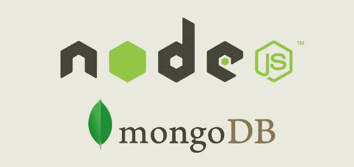
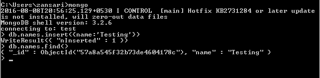
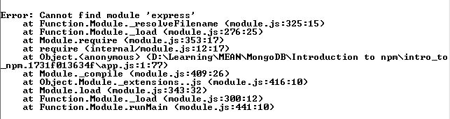
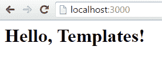

# MongoDB for node.js 开发者 jumpstart

> 原文：<https://medium.com/hackernoon/mongodb-for-node-js-developers-jumpstart-a1520182850e>



credit:[https://medium.com/@joelrodrigues/how-to-access-mongodb-from-node-js-e37c587f226a](/@joelrodrigues/how-to-access-mongodb-from-node-js-e37c587f226a)

**什么是 MongoDB？**

[MongoDB](https://hackernoon.com/tagged/mongodb) 是一个保存 JSON 格式数据的文档[数据库](https://hackernoon.com/tagged/database)。因为它不是基于连接，所以通过它的分片特性可以很容易地在服务器之间分发数据。

开发人员可以开发与部署无关的应用程序。MongoDB 支持横向扩展，而 RDBMS 支持纵向扩展。Mongo shell 是使用 C++ V8 编写的，用于管理 MongoDB。


credit: [http://coenraets.org/blog/2012/10/creating-a-rest-api-using-node-js-express-and-mongodb/](http://coenraets.org/blog/2012/10/creating-a-rest-api-using-node-js-express-and-mongodb/)

# 什么是 node.js

> `*node.js*` *基本上就是一个* `*C++*` *的程序，你用* `*V8 javascript*` *来控制。因此，你用* `*node.js*` *编写的任何应用程序都将在* `*javascript*` *中编写，它将控制这个* `*C++*` *应用程序(* `*node.js*` *)，你可以说他们请求了这个资源，而你的应用程序实际上在* `*javascript*` *中会说:好的，他们请求了这个资源，我不需要响应。现在做出相应的反应。*

`Node.js`使用驱动程序连接到`MongoDB`。应避免安装`32`位释放，因为它限制了使用默认存储引擎的数据的可寻址大小。

# JSON 是什么？

对于外行人来说，`[JSON](http://json.org/)`只是一个字符串。`JSON`对象由*键值*对组成。键必须是字符串，键和值必须用分号分隔。`JSON`对象内的字段用逗号分隔。`JSON`使用花括号打开和关闭对象:

```
{
  "string" : "sting value goes here",
  "date" : "2015-10-27T22:35:21.908Z",
  "number" : 123,
  "object" : {
    "key1" : "value1",
    "key2" : "value2"
  },
  "boolean" : true,
  "array" : [ 
    "test", 
    { "key1" : "a", "key2" : "b" },
    [ "abc", "xyz" ]
  ]
}
```

上面的例子显示了`JSON`支持多种数据类型。`object`字段显示了嵌套值的示例。正如我们所见，`object`和`array` - `MongoDB`数据模型通常使用嵌套，甚至我们可以称之为**深度嵌套**。`JSON`提供的灵活性使得实现不同的数据访问模式变得很简单，方法是创建包含呈现一个内容丰富的网页所需的所有数据的对象，或者为请求很少的用户提供另一种类型的数据视图。

# 什么是 BSON？

`MongoDB`将数据存储为`[BSON](http://bsonspec.org/)`(二进制`JSON`)。下面是对比:

```
// JSON
{
 "hello": "world"
}// BSON
"\x16\x00\x00\x00\x02hello\x00 \
x06\ x00\ x00\ x00world\ x00\ x00 "
```

`MongoDB`驱动程序以`BSON`格式发送和接收数据，当数据被写入`MongoDB`时，它被存储在`BSON`中。

在应用程序端，驱动程序将`BSON`映射到最合适的本地数据类型。它是

*   轻量级选手
*   可移动，支持编写、读取和索引`MongoDB`文档所需的各种操作
*   高效，这意味着可以非常快速地执行驱动程序所需的与 BSON 之间的数据编码/解码。

`JSON`不区分`integer`和`float` s。不支持`date`s。`BSON`扩展 JSON 值类型以包括`integer` s、`double` s、`date` s 和二进制数据，以支持图像和许多其他类型的数据。

# Windows 安装

要直接从 shell 访问`mongo`和`mongod`，请更改 MongoDB 的路径:

*   转到`System Properties`
*   转到`Advanced settings`
*   点击`Environment variables`
*   转到`System variables`
*   转到`Path`(这是 Windows 寻找可执行文件的地方)
*   添加`MongoDB`的启动位置(例如:`C:\Program Files\MongoDB\Server\3.2\bin`)

有时，你可能需要刷新系统来查看这些快捷键的工作情况

但是，在从终端使用`mongodb`之前，按照以下命令为`MongoDB`创建`C:\data\db`目录，以便**存储**数据:

`md \data\db`

注意，`data\db`前的`\`——这确保了目录仅创建在根目录中(在本例中为`C:\`)。

现在，如果你输入`mongod`并按回车键，它就会开始运行。如果你阅读终端上打印的日志，它说`MongoDB`正在监听`port=27017`和`dbpath=C:\data\db`，即默认路径——这是我们最近创建的。

现在，一旦`mongod`开始运行，我们就可以启动`mongo`来连接端口`27017`。

# 做一些脏东西

为了测试这个安装，我们将使用下面的代码做一个简单的文档`insert`:

使用以下命令的`db.names.insert({name:'testing'})`和`find`(或相关术语中的`select`):

`db.names.find()`



其中`{name:'testing'}`是文档的一个例子。此外，为了使`.find()`的结果更具可读性，我们可以链接`.pretty()`命令。

我们也可以将`MongoDB`作为[服务](http://stackoverflow.com/a/2438758/2404470)来运行。

在`MongoDB`中，文档存储在组织成数据库的集合中。要查看出现在`MongoDB`中的数据库，运行`show dbs`

要将文档插入到集合中，我们首先需要知道如何在命令中指定该集合。包含它的集合和数据库形成了一个名称空间**。在做`CRUD`操作时，我们引用全局变量`db`。这个变量保存了对我们当前使用的数据库的引用。切换到数据库名称**测试**类型 [MySQL 类命令](http://stackoverflow.com/a/5287027)T2。**

**插入操作也返回一个文档，其中`acknowledged`设置为 true 表示记录(或者更好地说，文档)被成功插入。所有文件必须有一个**下划线** _id 字段。集合中的每个文档都必须有唯一的文档 id。`MongoDB`的查询语言的核心是通过例子查询的策略。我们可以传递一个空白对象`{}`，键值对`{name: "Uber"}`。`find()`命令的结果不仅仅是一个文档数组，而是一个`cursor object`。我们可以看到这一点:**

```
var c = db.names.find();
c.hasNext() //returns true, meaning there is a document yet to be visited by this cursor 
c.next() //grabs that document
```

# **使用节点构建**

**要使用 [node.js](https://nodejs.org/en/) 构建应用程序，我们首先需要[安装它](http://xameeramir.github.io/install-node/)。**

**让我们创建一个简单的`http`服务器:**

```
// Source: howtonode.org/hello-node// Load the http module to create an http server.
var http = require('http');// Configure our HTTP server to respond with Hello World to all requests.
var server = http.createServer(function (request, response) {
  response.writeHead(200, {"Content-Type": "text/plain"});
  response.end("Hello World\n");
});// Listen on port 8000, IP defaults to 127.0.0.1
server.listen(8000);// Put a friendly message on the terminal
console.log("Server running at [http://127.0.0.1:8000/](http://127.0.0.1:8000/)");
```

**将上面的代码存储在一个`.js`文件中，比如说`app.js`**

> **我们如何开始呢？**

**在终端中，转到文件的位置并键入`node app.js`。要验证它是否正在运行，请访问 [http://localhost:8000](http://localhost:8000/) 。注意端口`8000`，我们已经在上面的代码中指定了这个端口**。****

# **什么是 NPM**

```
var express = require('express'), cons = require('consolidate'), mongodb = require('mongodb');
```

**`require()`是我们如何在`node.js`应用中添加外部库。如果我们通过`node`终端运行这段代码，我们会得到下面的错误:**

****

**要将这个缺失的`express`东西作为`node`包，我们可以使用`node`命令行`npm install express`。在真实的项目中，会有一堆包依赖。一个一个地安装它们将是一个巨大的痛苦。为了解决这个问题，出台了`package.json`文件。此文件包含关于依赖关系的元数据:**

```
{
  "name": "project name goes here",
  "version": "0.1.2",
  "description": "npm introduction",
  "main": "app.js",
  "dependencies": {
        "consolidate": "~0.13.1",
        "express": "~4.13.3",
        "mongodb": "~2.1.3"
  },
  "author": "ABC",
  "license": "MIT"
}
```

**在**位置**有了这个文件，简单地运行`npm install`就会为我们获得**项目的本地** `node_modules`目录下的所有包。还有一种全局安装包的方法。**

# **什么是 Node.js 驱动程序**

**驱动程序使用有线协议与`MongoDB`服务器通信。它处理诸如打开套接字、检测错误和管理到副本集的连接之类的事情。要在应用程序中包含驱动程序，使用代码`var mongodb = require('mongodb');`并使用`npm install mongodb`进行安装。正如我们所看到的，它只是一个节点包。尝试使用此包连接到`MongoDB`:**

```
var MongoClient = require('mongodb').MongoClient,
    assert = require('assert');var url = 'mongodb://localhost:27017/startup';MongoClient.connect(url, function(err, db) {assert.equal(null, err);
    console.log("Successfully connected to server");// Find some documents in our collection
    db.collection('startup').find({}).toArray(function(err, docs) {// Print the documents returned
        docs.forEach(function(doc) {
            console.log(doc.name);
        });// Close the DB
        db.close();
    });// Declare success
    console.log("Last call");
});
```

**为了使用`MongoDB Node.js driver`，对`javascript`中`IO`的**异步**本质有一个坚实的理解是很重要的，包括数据库请求。**

> ***`*mongo*`*shell 是同步的，这意味着当您发出 find 命令时，它会阻塞等待命令返回，然后再继续。* `*Node.js*` *驱动就不是这样了。无论您是在进行查询，就像我们在这里定义的调用一样，还是仅仅建立到数据库的连接。正如在* `*Javascript*` *应用程序中常见的，我们将要使用的* `*Node.js*` *驱动程序被设计成它的方法异步运行。这意味着我们不是等待我们调用的任何方法的返回值，而是传入一个回调函数。****

***上述`MongoClient.connect`调用中的第二个参数是一个回调函数。并将处理这个连接操作的结果。由于`node.js`的**任意非同步**性质，以下消息在任何数据库值之前打印:***

> ***`*Last call*`***

# ***什么是快递***

***`Express`是一个`node.js`模块，处理`HTTP`请求的路由、请求参数和其他细节。***

***下面是一个设置基本`Express`服务器的基本示例:***

```
*var express = require('express'),
    app = express();app.get('/', function(req, res){
    res.send('Hello World');
});app.use(function(req, res){
    res.sendStatus(404); 
});var server = app.listen(3000, function() {
    var port = server.address().port;
    console.log('Express server listening on port %s', port);
});*
```

# ***实现 HTML 模板***

***下面的例子展示了**如何实现**一个`HTML`模板:***

```
*//file: app.js
var express = require('express'), //set up the Express server
    app = express(), //use it to create an Express app
    engines = require('consolidate'); //use the wrapper libraryapp.engine('html', engines.nunjucks); //register nunjucks template engineapp.set('view engine', 'html'); //as being associated with the html extension, set the view engine app settingapp.set('views', __dirname + '/views'); //specify template locationapp.get('/', function(req, res) {
    res.render('hello', { name : 'Templates' });
});app.use(function(req, res){
    res.sendStatus(404); 
});var server = app.listen(3000, function() {
    var port = server.address().port;
    console.log('Express server listening on port %s', port);
});*
```

***和 html***

```
*//file: views/hello.html<h1>Hello, {{name}}!</h1>*
```

***在上面的代码中，`consolidate`基本上是一组用于`Express`的模板引擎的包装器。`Express`要求特定的库有特定的接口，而`consolidate`为我们处理这些。`__dirname`是一个`node.js`变量，它允许我们访问应用文件(在我们的例子中是`app.js`)所在的目录。因为，我们已经通过了`name : 'Templates'` -我们将看到下面的输出:***

******

***这里有一个更高级的版本，它也连接到数据库:***

```
*//file: app.jsvar express = require('express'),
    app = express(),
    engines = require('consolidate'),
    MongoClient = require('mongodb').MongoClient,
    assert = require('assert');app.engine('html', engines.nunjucks);
app.set('view engine', 'html');
app.set('views', __dirname + '/views');MongoClient.connect('mongodb://localhost:27017/startup', function(err, db) {assert.equal(null, err);
    console.log("Successfully connected to MongoDB.");app.get('/', function(req, res){db.collection('startup').find({}).toArray(function(err, docs) {
            res.render('startup', { 'name': docs } );
        });});app.use(function(req, res){
        res.sendStatus(404);
    });

    var server = app.listen(3000, function() {
        var port = server.address().port;
        console.log('Express server listening on port %s.', port);
    });});*
```

***和 html***

```
*//file: views/startup.html 
<h1>Hello, {{name}}!</h1>*
```

# ***使用 Express 处理 GET 请求***

```
*var express = require('express'),
    app = express(),
    engines = require('consolidate');app.engine('html', engines.nunjucks);
app.set('view engine', 'html');
app.set('views', __dirname + '/views');// Handler for internal server errors
function errorHandler(err, req, res, next) {
    console.error(err.message);
    console.error(err.stack);
    res.status(500).render('error_template', { error: err });
}app.get('/:name', function(req, res, next) {
    var name = req.params.name;
    var getvar1 = req.query.getvar1;
    var getvar2 = req.query.getvar2;
    res.render('hello', { name : name, getvar1 : getvar1, getvar2 : getvar2 });
});app.use(errorHandler);var server = app.listen(3000, function() {
    var port = server.address().port;
    console.log('Express server listening on port %s.', port);
});*
```

***`hello`模板是:***

```
*<h1>Hello, {{name}}, here are your GET variables:</h1>
<ul>
    <li>{{getvar1}}</li>
    <li>{{getvar2}}</li>
</ul>*
```

***这里是`error`模板:***

```
*<h1>Error: {{error}}</h1>*
```

***在上面的应用程序中，我们只注册了一条路线，即`/:name`。冒号表示获取 URL 的这一部分，并存储在一个名为`name`的变量中。***

***下周将分享进一步的笔记。***

***[照片](https://goo.gl/photos/Yuigw4S9mLXDpSZN6)***

****原载于*[*xameeramir . github . io*](http://xameeramir.github.io/mongodb-for-nodejs/)*。****