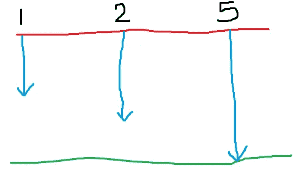
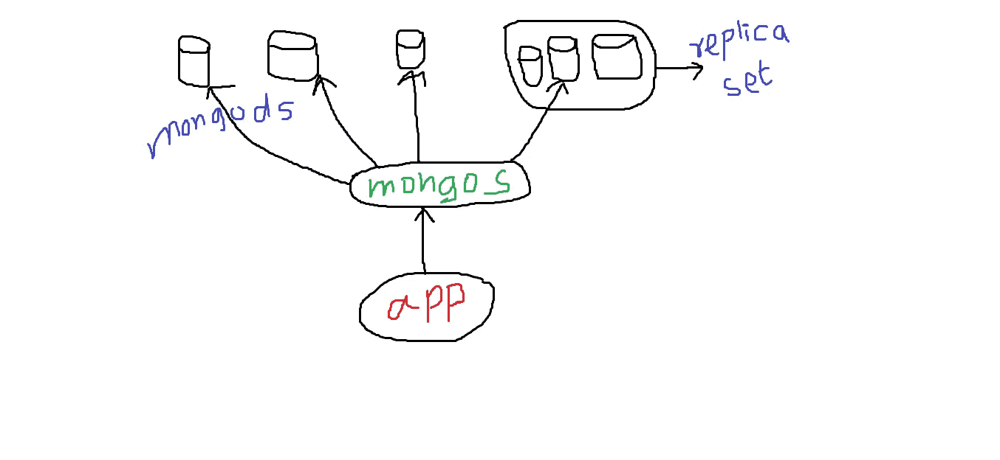

# MongoDB 索引和性能

> 原文：<https://medium.com/hackernoon/mongodb-indexes-and-performance-2e8f94b23c0a>


[credit](https://en.wikipedia.org/wiki/Speedometer)

# 存储引擎:简介

好吧，让我们来谈谈切分。分片是将数据库查询分布在多个服务器上。在此之前，让我们先了解一下存储引擎的概念。3.0 的新特性是他们提供了可插拔的存储引擎。存储引擎是持久存储和数据库本身之间的接口，持久存储将调用可能是固态磁盘的磁盘。


因此，数据库通过存储引擎与持久存储进行对话。现在，可能是存储引擎本身决定使用内存来优化进程。换句话说，磁盘速度非常慢。因为数据库的想法是持久地存储东西，所以存储引擎控制了计算机上的内存。它可以决定将什么放入内存，从内存中取出什么，以及什么时候将什么保存到磁盘。因此，数据库服务器本身将对服务器上的内存以及磁盘本身的处理委托给存储引擎。`MongoDB`提供可插拔的存储引擎，我们可以使用多个。使用不同的存储引擎，我们会得到不同的性能特征。对于`MongoDB`，提供了 2 个存储引擎:

**什么不是存储引擎？**

如果我们有一堆`MongoDB`服务器都在集群中运行，存储引擎不会影响这些不同的`MongoDB`服务器之间的通信。存储引擎不影响数据库呈现给程序员的 API。存储引擎直接决定数据文件格式和索引格式

# 存储引擎:MMAPv1

我们称它为 MMA pv1——最初的`MongoDB`存储引擎，因为它在内部使用`mmap`调用来实现存储管理。让我们看看 [MMAP](http://www.tutorialspoint.com/unix_system_calls/mmap.htm) 系统调用是什么样子的。在 Linux 上，它讨论内存分配，或者将文件或设备映射到内存中。使页面从文件描述符所描述的对象开始，以一个偏移量映射到起始地址，最大长度为字节。那么，这实际上意味着什么呢？

嗯，实际上需要一个放文件的地方。它将文档放入文件中。为了做到这一点，它首先分配一个大文件。假设它在磁盘上分配了一个 100GB 的文件。因此，我们最终在磁盘上获得了 100GB 的文件。在实际磁盘上，磁盘可能是物理上连续的，也可能不是，因为在该层下有一些算法控制磁盘上的实际空间分配。但是从我们的角度来看，它是一个 100GB 的连续文件。如果`MongoDB`调用`mmap`系统调用，它可以将这个 100GB 的文件映射到 100GB 的虚拟内存中。要获得这么大的虚拟内存，我们需要在 x64 机器上。而这些都是[页大小的](http://www.computerhope.com/jargon/p/pagesize.htm)。因此，操作系统上的页面大小可以是 4k 或 16k。所以，在 100GB 的虚拟内存中有很多这样的内存。操作系统将决定什么可以放入内存。假设机器的实际物理内存是 32GB，那么如果我们访问这个内存空间中的一个页面，它可能在任何给定的时间都不在内存中。操作系统决定这些页面中的哪些将在内存中。我们将内存中可用的显示为绿色。所以，当我们去读文档时，如果它碰到了内存中的某一页，那么我们就得到它。如果它碰到了不在内存中的页面(白色的)，操作系统必须从磁盘中取出它。


[来源](https://www.youtube.com/watch?v=os3591KviNM)

MMAPv1 存储引擎提供

1.  **集合级并发(加锁)**。`MongoDB`里面的每个收藏都是它自己的文件(可以在`~\data\db`里看到)。如果对同一个集合触发了多个`write`，其中一个必须等待另一个完成。这是一个多重阅读器。一次只能对特定集合进行一次写入。
2.  **允许就地更新**。因此，如果一个文档位于其中一个可用(绿色)页面中，我们对它进行更新，那么我们将尝试就地更新它。如果我们不能更新它，那么我们要做的就是将它标记为一个整体，然后我们将它移动到其他有空间的地方。最后我们会在那里更新它。为了能够在不移动文档的情况下更新文档，我们使用了
3.  **当我们为一个文档分配初始存储时，2 的幂的大小**。因此，如果我们试图创建一个 3 字节的文档，我们将得到 4 字节。8 个字节，如果我们创建 7 个字节。创建 19 字节文档时为 32 字节。通过这种方式，可以使文档增长一点。打开的空间，我们可以更容易地重复利用。

另外，请注意，由于操作系统决定什么在内存中，什么在磁盘上，我们对此无能为力。该操作系统在内存管理方面足够智能。

# 存储引擎:WiredTiger

对于许多工作负载，速度更快。它提供了

1.  **文档级并发**。我们不称之为文档级锁定，因为它是一种无锁实施，具有乐观并发模型，其中存储假设两次写入不会是同一个文档，如果它们是针对同一个文档，则其中一个会被解除，必须重试，并且对应用程序不可见。但是我们确实在 MMAP 存储引擎中实现了文档级并发而不是集合级并发，这是一个巨大的胜利。
2.  **支持索引和数据的压缩**。因为 WiredTiger 在想象它自己的存储空间。
3.  **不就地更新** —如果我们更新，它被标记为 ***不再使用*** 并且在磁盘上完成新的空间分配并写入其中。最终，空闲的空间被回收。为了调用 WiredTiger 存储引擎，我们将使用`mongod --storageEngine wiredTiger`。

# 指数

# 索引是有序的事物集合。数据库中的索引包含有序列及其引用(_ ids 或内存位置)。有序的东西搜索起来更快。这被称为 b 树索引。索引从最左侧开始工作。让我们假设索引在 3 列上:`A`、`B`、`C`。我们可以从左侧快速搜索到

*   `A`、`B`、`C`
*   `A`，`B`
*   `A`

但是索引不支持从右侧搜索。以下内容不会被加速:

*   `C`
*   `B`
*   埃切特拉


索引不是免费的，因为每当我们改变文档中影响索引的任何内容时，我们都必须更新索引。需要写到内存上，最后写到磁盘上。此外，很高兴知道索引会降低写入速度。是的，读起来更快。即使在高速计算机上，创建索引也需要时间，因为我们必须扫描整个集合。创建新的数据结构并将它们全部写入磁盘。

使用命令`db.collectionName.createIndex({A: 1, B: -1})`创建复合索引。其中`1`表示上升，-1 表示下降。要删除索引，请使用`db.collectionName.dropIndex({A: 1, B: -1})`。复合索引不能同时包含数组类型的列。如果我们尝试这样做，`MongoDB`将告诉我们它不能索引并行数组，原因是创建它的索引点激增，因为它必须为数组中各项的笛卡尔乘积创建索引点，而这是不允许的。当我们在索引键的文档中有数组时，就应用多键索引。要获取当前可用的索引，使用命令`db.collectionName.getIndexes()`。嵌套的键也可以被索引，例如:`db.collectionName.createIndex({'A.aa': 1})`。其中，`aa`是`A`中的子键。

# 索引创建选项，唯一

让我们创建一个包含重复条目的集合:

```
db.collectionName.insertOne(thing: 'apple'); db.collectionName.insertOne(thing: 'pear'); db.collectionName.insertOne(thing: 'apple');
```

为了确保条目是惟一的，我们可以应用惟一索引。要创建唯一索引，请使用`db.collectionName.createIndex({thing:1}, {unique:true})`。这个命令会给出一个错误，因为在`collectionName`中有多个苹果。要移除一个，使用命令`db.collectionName.remove( {thing:'apple'}, {justOne: true} )`。

该索引就位后，任何重复插入的尝试都将导致`duplicate key error`。要查看是否确实创建了索引，使用命令`db.collectionName.getIndexes()`。值得注意的一件有趣的事情是，`_id`上的索引显示为**唯一的**，尽管它是。

# 索引创建，稀疏

```
{a:1, b:5, c:2} 
{a:8, b:15, c:7} 
{a:4, b:7} 
{a:3, b:10}
```

让我们假设我们希望在上述文档上创建一个索引。在`a` & `b`上创建索引不会有问题。但是如果我们需要在`c`上创建一个索引呢？唯一约束对`c`键无效，因为**空值对两个文档重复**。这种情况下的解决方案是使用`sparse`选项。该选项告诉数据库不要包括缺少键的文档。相关的命令是`db.collectionName.createIndex({thing:1}, {unique:true, sparse:true})`。稀疏索引也让我们使用更少的空间。

> *注意，即使我们有一个* `*sparse*` *索引，数据库也会执行所有文档扫描，尤其是在进行排序时。这可以从* ***获胜计划*** *部分的* `*explain*` *中看出结果。*

# 索引创建，背景

有多个索引选项—前台(默认)和后台。前台相对较快，它阻止所有的作者和读者。我们还能找到其他数据库。这不应该在生产环境中进行。

后台索引创建有点慢，他们不会阻止读者和作者。使用`MongoDB` 2.4 和更高版本，您甚至可以在同一个数据库上并行创建多个后台索引。

从`MongoDB` 2.6 开始，在主节点的后台创建索引也会导致在辅助节点的后台创建索引。当主节点完成索引构建时，辅助节点将开始创建索引。

还有另一种方法可以在生产系统中非常有效地创建索引。也就是在用于服务大多数查询的不同服务器上创建索引。比方说，在多个数据库服务器协同工作的副本集中，可以去掉一个服务器，然后将请求路由到可用的服务器。前台索引创建可以在单独的服务器上完成。创建成功后，可以将其带回集群。

# 使用解释

`explain`命令显示了数据库在执行查询时采取的动作。它返回一个可解释的对象。它使用什么索引，扫描了多少文档。它几乎做了与实际查询类似的所有事情，但它不是查询的完整模拟。这个命令既可以在 shell 中使用，也可以在驱动程序中使用。它可用于多种情况:

*   `db.collectionName.explain().find()`
*   `db.collectionName.explain().update()`
*   `db.collectionName.explain().remove()`
*   `db.collectionName.explain().aggregate()`

但以下情况是不允许的:

*   `db.collectionName.explain().insert()`
*   `db.collectionName.remove({a:1, b:2}).exlain()`

要了解哪些功能可以与`explain`结合使用，请使用`db.collectionName.explain().help()`。在以前的版本中，可以将这个命令添加到一个光标上(记住`find()`返回一个光标)。例如:`db.collectionName.find().explain()`。这被改变为由一个可解释的对象的函数预先挂起。原因是不是所有的方法都返回一个游标。例如:`count()`会返回一个标量。

# 解释:冗长

`explain`命令可以在 3 种模式下运行:

*   `queryPlanner` -主要告诉数据库在索引方面会使用什么
*   `executionStats` -包括`queryPlanner`模式，也包括使用索引的结果
*   `allPlansExecution` -包括`queryPlanner` & `executionStats`模式。它执行查询优化器定期执行的操作，即运行所有可能用于特定查询形式的索引，并并行运行这些索引。然后决定哪一个最快。

```
var exp = db.collectionName.explain("executionStats"); 
exp.find();
```

在研究性能统计时，需要理解的一件事是查看返回的文档数量(`nReturned`)和检查的文档数量(`docsExamined`)。下面的数据表明查询扫描了 999，999 个文档，在 619 毫秒内返回 10，000 个。

```
> exp = db.example.explain("executionStats")
Explainable(test.example)
> exp.find( { a : 7 } )
{
    "queryPlanner" : {
        "plannerVersion" : 1,
        "namespace" : "test.example",
        "indexFilterSet" : false,
        "parsedQuery" : {
            "a" : {
                "$eq" : 7
            }
        },
        "winningPlan" : {
            "stage" : "COLLSCAN",
            "filter" : {
                "a" : {
                    "$eq" : 7
                }
            },
            "direction" : "forward"
        },
        "rejectedPlans" : [ ]
    },
    "executionStats" : {
        "executionSuccess" : true,
        "nReturned" : 10000,
        "executionTimeMillis" : 619,
        "totalKeysExamined" : 0,
        "totalDocsExamined" : 999999,
        "executionStages" : {
            "stage" : "COLLSCAN",
            "filter" : {
                "a" : {
                    "$eq" : 7
                }
            },
            "nReturned" : 10000,
            "executionTimeMillisEstimate" : 520,
            "works" : 1000001,
            "advanced" : 10000,
            "needTime" : 990000,
            "needFetch" : 0,
            "saveState" : 7812,
            "restoreState" : 7812,
            "isEOF" : 1,
            "invalidates" : 0,
            "direction" : "forward",
            "docsExamined" : 999999
        }
    },
    "serverInfo" : {
        "host" : "cross-mb-air.local",
        "port" : 27017,
        "version" : "3.0.1",
        "gitVersion" : "534b5a3f9d10f00cd27737fbcd951032248b5952"
    },
    "ok" : 1
}
```

# 涵盖的查询

覆盖查询是一种完全可以由索引满足的查询。因此，**零个文档需要被检查**以满足查询。这使得查询速度大大加快。所有的投影键都需要被索引。

# 指数有多大？

像任何其他数据库一样，将**“工作集”**保存在**内存**中是很重要的。工作集是客户端经常访问的数据。对于索引来说尤其如此。如果索引在磁盘中，那么每次查询都要从磁盘中获取索引，这是非常昂贵的。估计我们进行`MongoDB`部署所需的内存量。这可以通过使用命令`db.collectionName.stats()`找到，下面是相关的输出:


此输出随数据库引擎的不同而不同。还有一个快捷方式`db.collectionName.totalIndexSize()`给出了所需的尺寸细节。使用 WiredTiger 存储引擎，索引的大小要小得多，因为它支持一种称为前缀压缩的技术。但是这种压缩是以牺牲 CPU 为代价的。这个故事的寓意是，我们需要始终确保索引适合工作集，而工作集又需要适合内存。


# 索引条目的数量


**索引基数:**指`MongoDB`支持的每种不同类型索引的索引点数。

1.  regular——对于我们放入索引的每个键，肯定会有一个索引点。另外，如果没有键，那么在空条目下会有一个索引点。就索引基数而言，我们得到了相对于集合中文档数量的 1:1。这使得索引具有一定的大小。就指向文档的结束指针而言，它与集合大小成比例
2.  稀疏—当文档缺少被索引的键时，它不在索引中，因为它是空的，并且我们不在稀疏索引的索引中保留空值。我们将拥有可能小于或等于文档数量的索引点。
3.  多键—这是数组值的索引。每个文档将有多个索引点(对于数组的每个元素)。所以，它将大于文档的数量。

假设您用一个名为 tags 的键更新了一个文档，这个更新导致文档需要在磁盘上移动。假设您正在使用 MMAPv1 存储引擎。如果文档中有 100 个标记，并且标记数组是用多键索引来索引的，那么索引中需要更新 100 个索引点来适应这种移动。

# 地理空间索引

这些索引允许我们根据位置来查找东西。我们有两个选项: **2D** & **3D** 在 2D 中，我们有一个带有`x` & `y`坐标的笛卡尔平面和一堆不同的物体。


该文档需要用`createIndex({'location':'2d', 'type':1})`存储某种`x`、`y`位置。类型选项指定索引的方向，即升序或降序(这是可选的)。它可以是复合指数。使用命令`db.collectionName.find({location: {$near:[x,y]}})`查找附近位置。实际上，通常使用的方式是通过一个`limit`。为了将结果限制为 20 个，追加`.limit(20)`。

# 地理空间球形

地球上的位置用经度和纬度来表示。纬度是指离赤道有多远。赤道在纬度零度。我们可以从 **-90** 到 **90** 。一种称为 2d 球体的特殊索引类型。为了指定事物的位置，我们使用 GeoJSON。可以使用点或多边形来描述位置。`type` & `coordinates`是保留字。`type`的值是保留字。对于这种类型的数据，将使用`createIndex({'location':'2dsphere', 'type':1})`进行索引

对于名为“stores”的集合，返回位置纬度=39，经度=-130，1，000，000 米范围内的商店。假设 stores 集合在“loc”上有一个 2dsphere 索引。每个商店记录如下所示:

```
{
    "_id":{
        "$oid":"535471aaf28b4d8ee1e1c86f"
    },
    "store_id":8,
    "loc":{
        "type":"Point",
        "coordinates":[
            -37.47891236119904,
            4.488667018711567
        ]
    }
}
```

查询将会是`db.stores.find({ loc:{ $near: { $geometry: { type: "Point", coordinates: [-130, 39]}, $maxDistance:1000000 } } })`。

# 文本索引

要在键上创建基于文本的索引，使用命令`db.collectionName.ensureIndex({'textColumnName': 'text'})`。应用该索引后，使用搜索命令搜索一个单词，即`db.collectionName.find({$text: {$search:'your text here'}})`。有一个文本分数，根据它对结果进行排名，看看它在 score 键中的投影，就像这样:`db.collectionName.find({$text: {$search:'your text here'}}, {score: {$meta: 'textScore'}}).sort({score: {$meta: 'textScore'}})`。

如果我们在`movies`集合的`title`字段上创建一个文本索引，然后执行文本搜索`db.movies.find( { $text : { $search : "Big Lebowski" } } )`。将返回以下文档，假设它们在电影收藏中:

*   `{ "title" : "The Big Lebowski" , star: "Jeff Bridges" }`
*   `{ "title" : "Big" , star : "Tom Hanks" }`
*   `{ "title" : "Big Fish" , star: "Ewan McGregor" }`

这是因为，在`Big` & `Lebowski`上会有一个 ***逻辑或*** ing。

# 什么时候使用索引？

比方说，`MongoDB`在。假设它有以下索引:

1.  `b`，`c`
2.  `c`，`b`
3.  `d`，`e`
4.  `e`，`f`
5.  `a`、`b`、`c2`

`MongoDB`基于查询的形状，决定用于执行查询的索引选择。假设选择了 **1** 、 **2** & **5** 。然后，并行执行执行计划，索引如下:



对所有计划或分类阈值结果最快的人获胜。这个索引被缓存起来，供将来类似的查询使用。当集合上发生阈值写入时，该缓存的索引将从缓存中删除，截至此次写入时，该阈值写入为 1000 次。如果重新构建索引，那么也要重新构建缓存。或者，如果`mongod`进程重新启动，该索引信息将从缓存中删除。

# 设计/使用索引

像做任何更伟大的事情一样，设计索引需要一些前瞻性的思考。目标是:

*   效率—快速读/写操作
*   选择性—最小化记录扫描
*   其他要求—例如，如何处理排序？

选择性是决定索引使用效率的主要因素。理想情况下，索引使我们能够只选择完成结果集所需的那些记录，而不需要扫描大量的索引键(或文档)来完成查询。选择性决定了任何后续操作必须处理多少条记录。更少的记录意味着更少的执行时间。

考虑应用程序最常使用的查询。使用`explain`命令，具体参见`executionStats`:

*   `nReturned`
*   `totalKeysExamined` -如果检查的钥匙数量比返回的文件数量多？我们需要一些指数来减少它。

看`queryPlanner`，`rejectedPlans`。查看`winningPlan`,它显示了`keyPattern`,它显示了需要索引的键。每当我们看到`stage:SORT`，这意味着排序的键不是索引的一部分，或者数据库不能根据数据库中指定的排序顺序对文档进行排序。并且需要执行内存排序。如果我们添加排序所基于的键，我们将看到`winningPlan`的'`stage`从`SORT`变为`FETCH`。索引中的键需要根据它们的数据范围来指定。例如:**班**比**学生**的音量小。这样做需要我们有所取舍。虽然`executionTimeMillis`会很小，但是`docsExamined`和`keysExamined`会相对**小**大。但这种取舍是值得的。

还有一种方法可以强制查询使用特定的索引，但是不建议将这种方法作为部署的一部分。相关的命令是`.hint()`，它可以链接在`find`或`sort`之后，用于分类等。它需要实际的索引名或索引的形状。

通常，在为以下对象构建复合索引时:

*   **相等字段**:查询将执行相等测试的字段
*   **排序字段**:查询将指定排序的字段
*   **范围字段**:查询进行范围测试的字段

我们应该牢记以下经验法则:

*   范围字段之前的相等字段
*   在范围字段之前排序字段
*   排序字段之前的相等字段

`MongoDB`自动记录执行时间超过 100 毫秒的慢速查询。

# 压型

`MongoDB`具有复杂的剖析功能。记录发生在`system.profile`集合中。从`db.system.profile.find()`可以看到日志。有 3 个日志记录级别:

*   级别 0 —无日志记录
*   级别 1 —记录慢速查询
*   级别 2 —记录所有查询，这是一个调试功能，而不是性能调试选项

要查看数据库运行在哪个分析级别，使用`db.getProfilingLevel()`并查看状态`db.getProfilingStatus()`。要更改分析状态，使用命令`db.setProfilingLevel(level, milliseconds)`——其中`level`是指分析级别，而`milliseconds`是需要记录查询持续时间的毫秒数。要关闭记录，使用`db.setProfilingLevel(0)`。

在系统配置文件集合中查找所有耗时超过一秒的查询的查询(按时间戳降序排序)将是`db.system.profile.find( { millis : { $gt:1000 } } ).sort( { ts : -1 } )`。

# 蒙古顶

对于性能调优，我们已经看到了`explain`、`hint`和`profile`选项。但是如果我们想看看一个程序的高层，想知道它把时间花在了哪里，我们该怎么做呢？我们有`Mongotop`，以`Unix`命令`top`命名。要在 shell 上查看日志，使用命令`mongotop seconds` -其中`seconds`是秒数，在此之后将打印下一个日志条目。

例如:`mongotop 3`

# 蒙古统计局

`Mongostat`类似于`Unix`发出的`iostat`命令。它以 1 秒的间隔给出数据库统计信息。它显示了在那 1 秒钟内发生了什么操作。根据所使用的存储引擎，输出可能会有所不同。它的结果也显示了`getmore`是我们每秒钟运行的`getmore`命令的数量。这是我们从游标中获得更多信息的方式，如果我们正在做一个有大量结果的查询。getmore 列关注每个时间间隔内从游标获取附加数据的请求数。`command`显示每秒运行的命令数。`flushes`指磁盘每秒被刷新的次数。`mapped`是映射内存的数量。`res`指常驻内存。`faults`指的是我们每秒钟导致的页面错误的数量。这是一个重要的数字，因为页面错误意味着我们获得了更多的 I/O，而更多的 I/O 意味着更慢的数据库。`qr`和`qw`是请求或等待读写的套接字数量的队列长度。`ar`和`aw`是活跃读者和作家的数量。`netIn` & `netOut`是指在此时间段内发送到数据库和从数据库发出的数量。`dirty`指存储引擎已经写入并需要写回磁盘的缓存量`WiredTiger`。`used`是我们正在使用的总缓存大小。

# 分片

分片是一种在多个服务器之间分割大量集合的技术。当我们分片时，我们部署多个`mongod`服务器。而在前面，`mongos`也就是路由器。应用程序与该路由器对话。然后，这个路由器与各种服务器(T2)对话。应用程序和 T3 通常位于同一台服务器上。我们可以在同一台机器上运行多个`mongos`服务。还建议在每个服务器上保留多个`mongod`的副本集(统称为**副本集**，而不是一个`mongod`。副本集在几个不同的实例之间保持数据同步，这样，如果其中一个出现故障，我们就不会丢失任何数据。从逻辑上讲，每个副本集可以被看作是一个**碎片**。这对应用程序是透明的，`MongoDB`选择分片的方式是我们选择一个**分片密钥**。



假设对于`student`集合，我们将`stdt_id`作为分片键，或者它可以是一个复合键。而`mongos`服务器，是一个基于范围的系统。因此，基于我们作为碎片键发送的`stdt_id`，它会将请求发送到正确的`mongod`实例。

**那么，作为开发者，我们需要真正了解什么呢？**

*   `insert`必须包含一个分片密钥，所以如果它是一个多部分分片密钥，我们必须包含整个分片密钥
*   我们必须了解集合本身的碎片键是什么
*   对于一个`update`、`remove`、`find`——如果`mongos`没有给出一个分片密钥——那么它将不得不把请求广播给覆盖集合的所有不同分片。
*   对于一个`update` -如果我们不指定整个碎片密钥，我们必须使它多次更新，以便它知道它需要广播它

[照片](https://goo.gl/photos/Zap9QDfK48bqssgd6)

*最初发布于*[*xameeramir . github . io*](http://xameeramir.github.io/mongodb-indexes-and-performance/)*。*