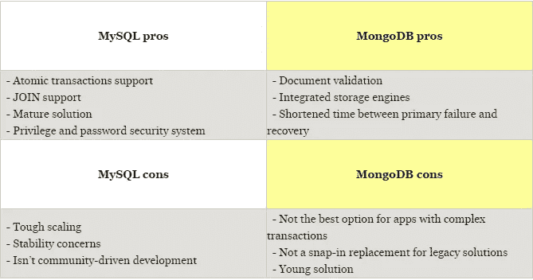

# MongoDB vs MySQL 对比:哪个数据库更好？

> 原文：<https://medium.com/hackernoon/mongodb-vs-mysql-comparison-which-database-is-better-e714b699c38b>

# 介绍

关系数据库占据了几十年的领导地位，当时的选择是显而易见的，不是 MySQL，Oracle，就是 MS SQL，仅举几例。它们是大量企业应用程序的基础，而现代应用程序需要更多的多样性和可伸缩性。非关系数据库，如 MongoDB，似乎满足了现有的需求，并取代了当前的关系环境。

# 什么是 MySQL？

[**MySQL**](https://www.mysql.com/) 是一个全功能的开源关系数据库管理系统(RDBMS)，最初由 MySQL AB 构建，目前归 Oracle 公司所有。它将数据存储在分组到数据库中的表中，使用结构化查询语言(SQL)来访问数据，并使用“选择”、“更新”、“插入”和“删除”等命令来管理数据。相关的信息可以存储在不同的表中，但是使用 JOIN 操作可以将这些信息关联起来，跨不同的表执行查询，并最大限度地减少数据重复的机会。

MySQL 几乎兼容所有的操作系统，即 Windows、Linux、Unix、Apple、FreeBSD 和许多其他操作系统。它支持各种存储引擎，如 InnoDB(这是默认的)、Federated、MyISAM、Memory、CSV、Archive、Blackhole 和 Merge。

# 什么是 MongoDB？

[**MongoDB**](https://www.mongodb.com/)**是一个流行的开源面向文档的数据库，由 10gen 开发，后来称为 MongoDB Inc .在这种情况下，文档以 BSON 文件、二进制 JSON (JavaScript Object Notation)格式创建和存储，因此支持所有 JS 类型的数据。既然如此，MongoDB 经常应用于 Node.js 项目。除此之外，JSON 支持使用人类可读的格式在服务器和 web 应用程序之间传输数据。就存储容量和速度而言，它也是一个更好的选择，因为它提供了更高的效率和可靠性。**

**MongoDB 提供的最大好处之一是使用动态模式，消除了预定义结构的需要，如字段或值类型。这种模型允许层次关系表示、数组存储以及通过简单地添加或删除字段来改变记录结构的能力。这种 NoSQL 解决方案具有嵌入、自动分片和板载复制功能，可实现更好的可扩展性和高可用性。**

# **MySQL vs MongoDB 2017:并列对比**

****

# **MySQL 与 MongoDB:利弊**

**比较 MongoDB 和 MySQL 的性能是很困难的，因为这两个管理系统都非常有用，并且它们的基本操作和初始方法存在核心差异。然而，MongoDB vs MySQL 是一个现在已经持续了一段时间的热门争论:成熟的关系数据库对抗年轻的非关系系统。两者都是开源的，很容易获得，而且两个系统都提供了带有大量附加功能的商业版本。**

****

# **选择哪个数据库？**

**MongoDB 以其开放和简单的理念，以及协作和有益的社区吸引了用户，而在 Oracle 收购 MySQL 后，用户报告了完全相反的情况。后者的另一个问题是业主对 MariaDB 开发的关注以及拒绝接受社区补丁和提供可持续发展计划。这些因素导致了停滞不前，尽管 MySQL 仍然是全球多家公司的首选解决方案。**

**将 MongoDB 速度与 MySQL 进行比较，开发人员注意到后者缺乏速度，并且在处理大数据量时会遇到困难，因此对于拥有较小数据库并寻求更通用解决方案的公司来说，它将是更好的选择。虽然这是 MongoDB 相对于 MySQL 的优势之一:处理大量非结构化数据的能力。**

**来回答主要问题:“什么时候用 MongoDB 代替 MySQL？”您需要考虑您的项目需求和进一步的目标。MySQL 以其高性能、灵活性、可靠的数据保护、高可用性和易管理性而闻名。适当的数据索引可以解决性能问题，促进交互并确保健壮性。但是如果您的数据是非结构化的和复杂的，或者如果您不能预定义您的模式，您最好选择 MongoDB。此外，如果您需要处理大量数据并将其存储为文档，MongoDB 将帮助您应对挑战。**

************

> **[黑客中午](http://bit.ly/Hackernoon)是黑客如何开始他们的下午。我们是 [@AMI](http://bit.ly/atAMIatAMI) 家庭的一员。我们现在[接受投稿](http://bit.ly/hackernoonsubmission)，并乐意[讨论广告&赞助](mailto:partners@amipublications.com)机会。**
> 
> **如果你喜欢这个故事，我们推荐你阅读我们的[最新科技故事](http://bit.ly/hackernoonlatestt)和[趋势科技故事](https://hackernoon.com/trending)。直到下一次，不要把世界的现实想当然！**

****