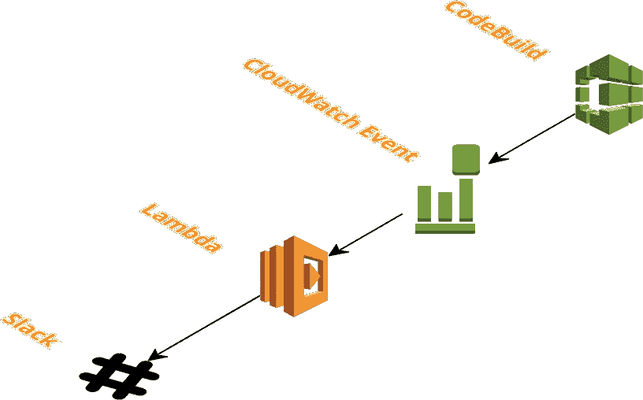

# 通过 Lambda 和 Slack 监控你的 AWS 代码构建

> 原文：<https://medium.com/hackernoon/monitor-your-aws-codebuilds-via-lambda-and-slack-ae2c621f68f1>



我最近设置了 AWS CodePipeline 和 CodeBuild 来执行持续集成和测试。开箱即用中缺少的部分是构建通知。我想知道我的构建是通过还是失败，如果失败了，错误是什么。

我能够使用 AWS CloudWatch Events、Lambda 和 Slack 快速解决问题。它是这样工作的…

CloudWatch 事件触发所有代码构建阶段的 Lambda。Lambda 帖子是给 Slack web hook 的消息。我得到了松弛的信息…现场直播是好的。

我使用 CloudFormation 来定义和部署堆栈。

## Lambda 权限和功能

```
*#
# Role that our Lambda will assume to provide access to other AWS resources
#* **IamRoleLambdaExecution:
  Type:** AWS::IAM::Role
  **Properties:
    AssumeRolePolicyDocument:
      Version:** '2012-10-17'
      **Statement:** - **Effect:** Allow
          **Principal:
            Service:** - lambda.amazonaws.com
          **Action:** - sts:AssumeRole
    **Path:** '/'

*#
# Create a Policy and attach it to our Lambda Role.
#* **IamPolicyLambdaExecution:
  Type:** AWS::IAM::Policy
  **DependsOn:** IamRoleLambdaExecution
  **Properties:
    PolicyName:** IamPolicyLambdaExecution
    **PolicyDocument:
      Version:** '2012-10-17'
      **Statement:** - **Effect:** Allow
        **Action:** - logs:*
        **Resource:** '*'
    **Roles:** - **Ref:** IamRoleLambdaExecution

*#
# Lambda Function
#*
**SlackFunction:
  Type:** AWS::Lambda::Function
  **Properties:
    Handler:** slack.handler
    **Timeout:** 5
    **Role:
      Fn::GetAtt:** - IamRoleLambdaExecution
        - Arn
    **Code:
      S3Bucket:** <your s3 bucket>
      **S3Key:** 'slack.js.zip'
    **Runtime:** nodejs6.10
    **Environment:
      Variables:
        SLACK_HOOK_URL:** <your slack url>
```

将下面的 lambda 函数作为 zip 文件上传到 S3 存储桶。替换上面 CloudFormation 代码片段中的 bucket 路径和 slack hook url。

## CloudWatch 事件

```
*#
# CloudWatch Event to trigger lambda for build slack notifications.
#* **BuildEventRule:
  Type:** 'AWS::Events::Rule'
  **Properties:
    Description:** 'BuildEventRule'
    **EventPattern:
      source:** - 'aws.codebuild'
      **detail-type:** - 'CodeBuild Build State Change'
      **detail:
        build-status:** - 'IN_PROGRESS'
          - 'SUCCEEDED'
          - 'FAILED'
          - 'STOPPED'
    **State:** 'ENABLED'
    **Targets:** -
        **Arn:** !GetAtt SlackFunction.Arn
        **Id:** 'BuildRuleLambdaTarget'

*#
# Permission for CloudWatch to invoke our Lambda
#*
**PermissionForBuildEventsToInvokeLambda:
  Type:** 'AWS::Lambda::Permission'
  **Properties:
    FunctionName:** !Ref SlackFunction
    **Action:** 'lambda:InvokeFunction'
    **Principal:** 'events.amazonaws.com'
    **SourceArn:** !GetAtt BuildEventRule.Arn
```

现在，当 CodeBuild 改变状态时，我们的 Lambda 将被调用。

## λ代码

就是这样！

如果您想将您的通知限制到特定的 CodeBuild 实例，您可以使用`project-name`将它添加到 EventPattern 中。例如:

```
**EventPattern:
  source:** - 'aws.codebuild'
  **detail-type:** - 'CodeBuild Build State Change'
  **detail:
    project-name:** - '<your CodeBuild name>'
    **build-status:** - 'IN_PROGRESS'
      - 'SUCCEEDED'
      - 'FAILED'
      - 'STOPPED'
```