# 使用 TIG Stack 监控您的基础设施

> 原文：<https://medium.com/hackernoon/monitor-your-infrastructure-with-tig-stack-b63971a15ccf>

在本教程中，我将向您展示如何为您的基础设施设置一个监控堆栈。所以你可以从你的**服务器**、 **docker 容器**和其他种类的**网络设备**收集数据，这样你就可以分析它的趋势或问题。

注:所有模板在我的 [**Github**](https://github.com/mlabouardy/telegraf-influxdb-grafana) 上都有。

**1 —它是如何工作的？**

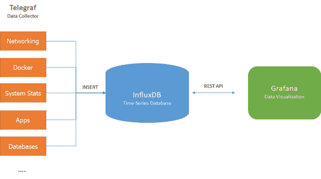

**1.1 — Telegraf**

在**中编写的数据收集器转到**中，用于收集、处理、汇总和写入指标。这是一个插件驱动的工具，我们将使用一些插件来实现我们的用例。

**1.2 — InfluxDB**

用于度量、事件和实时分析的可扩展时间序列数据库。

**1.3 — Grafana**

数据可视化和探索工具。它可以让你根据来自不同数据源的数据创建图表和仪表盘( **InfluxDB** 、 **Prometheus** 、 **Elasticsearch** 、 **Cloudwatch** …)

**2 —设置**

克隆存储库:

|git 克隆[https://github.com/mlabouardy/telegraf-influxdb-grafana.git](https://github.com/mlabouardy/telegraf-influxdb-grafana.git)

为了启动所有这些容器，我使用了 **docker-compose** :

docker-compose 调出 3 个容器:

**1 — Influxdb:**

由于容器的短暂特性。我们将 **InfluxDB** 数据文件夹暴露给我们的主机系统。因此，如果容器重启或停止，我们的数据不会消失。

端口映射包含 3 个端口:

**8083** :这是管理 web 服务器的端口，您可以通过[打开管理页面**http://localhost:8083**](http://localhost:8083)

**8086** :这是 **HTTP API** 端点端口，用于通过 **Telegraf** 向 Influxdb 发送查询

**2 —格拉夫纳**

端口 **3000** 是默认的网络服务器端口。

我们使用 docker 的 *link* 特性将 **Grafana** 容器与我们的 **Influxdb** 容器链接起来，这样 **Grafana** 就可以连接到 **Influxdb** 并从中查询数据。

**3 — Telegraf**

**Telegraf** 从“ [**输入**](https://github.com/influxdata/telegraf/tree/master/plugins/inputs) ”插件中收集指标，将其解析为正确的格式，然后发送给“ [**输出**](https://github.com/influxdata/telegraf/tree/master/plugins/outputs) ”插件。有很多输入和输出插件，你只需要在 **Telegraf 配置文件**中激活它们:

在这里，我使用 **Docker 输入**插件从 Docker 守护进程获取所有统计数据(每个容器的资源使用情况),使用**系统输入**插件获取服务器指标(磁盘、CPU、RAM……)

为了启动所有这些服务，我们将使用 **docker-compose** :

如果您键入**“docker PS**”，您应该会看到 **TIG 容器**:

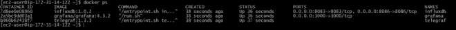

**3 —配置**

将你的浏览器指向[**http://SERVER _ IP:3000**，](http://SERVER_IP:3000,)你应该会看到 **Grafana 仪表盘:**

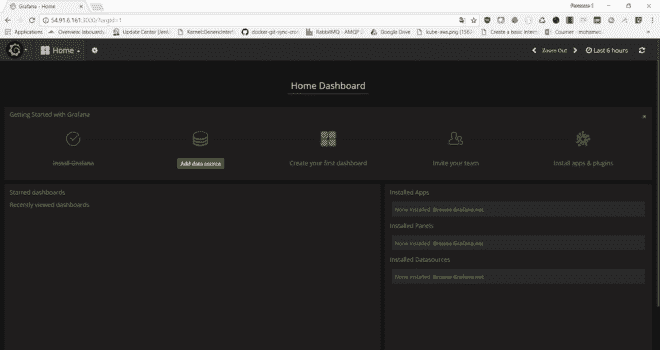

默认凭证是*管理员*，密码为*管理员*。你会想尽快改变这种情况。

现在我们需要创建一个指向 **InfluxDB** 容器的 **Influxdb 数据源**。

**3.1 —虚拟机数据源**

我们配置 **Grafana** 从 **vm_metrics** 数据库中提取数据:

**3.2 — Docker 数据源**

然后，我们创建另一个数据源，从 **docker_metrics** 数据库获取数据。

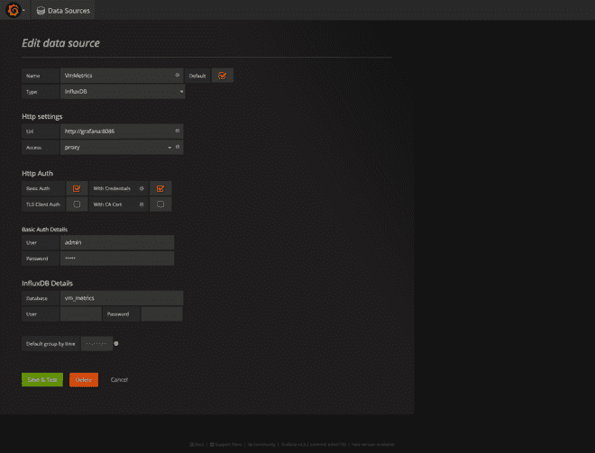

完成后，您就可以开始创建仪表板了。

**4 —仪表板**

在左上方的菜单中，点击“**添加新仪表板**，然后点击“**添加面板**”:

**4.1 —虚拟机**

**4.1.1 —存储器**

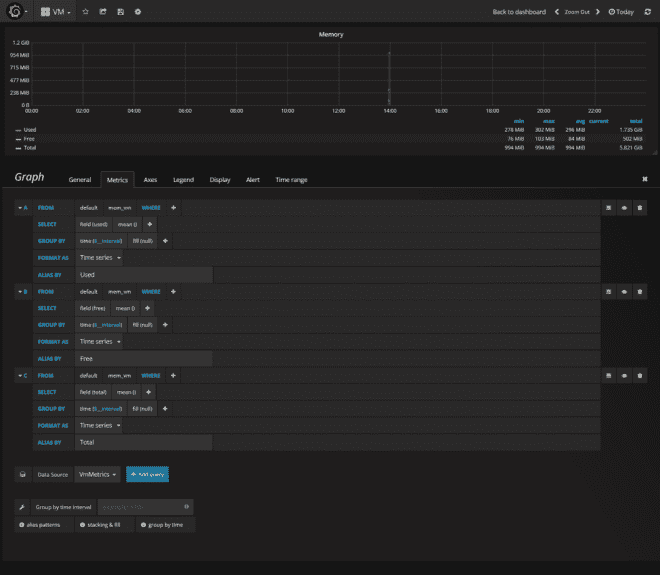

**4.1.1 —圆盘**

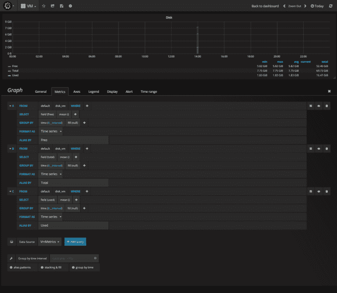

**4.1.3 — CPU**

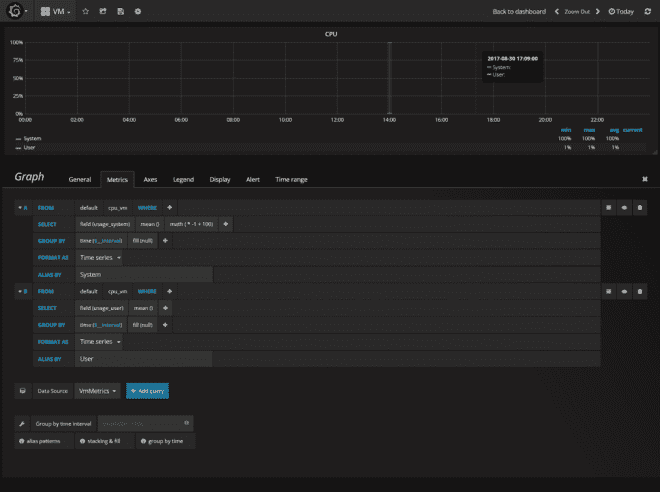

**4.1.4 —网络**

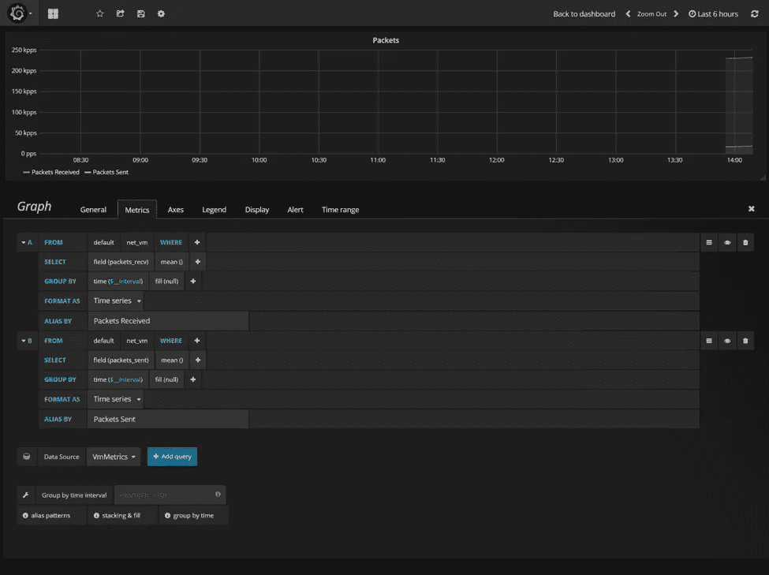

所有图形组合:

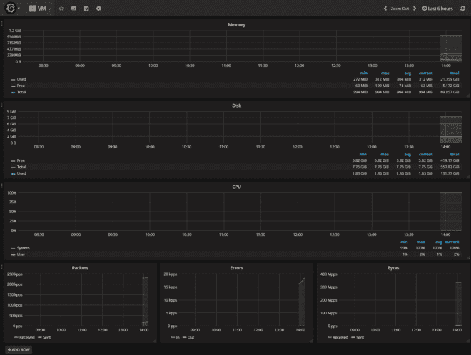

**4.2 —码头工人**

**4.2.1-创建容器过滤器**

为了通过容器名过滤我们的数据，我们将在 Grafana 中使用一个叫做模板化的概念，这使得我们的仪表板更具交互性和动态性。因此，我们不会在指标查询中硬编码容器的名称，而是使用一个变量。

所以要创建一个变量，点击**设置图标，**然后是**模板**:

点击“**新建**”，并按如下所述填写字段:

创建后，变量会显示为仪表板顶部的下拉选择框。这个下拉菜单可以很容易地改变你的仪表板上显示的数据。

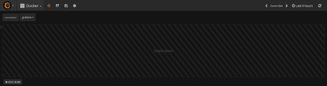

现在我们的过滤器已经创建，我们可以跳转到创建我们的第一个图表:

**4.2.1 —内存**

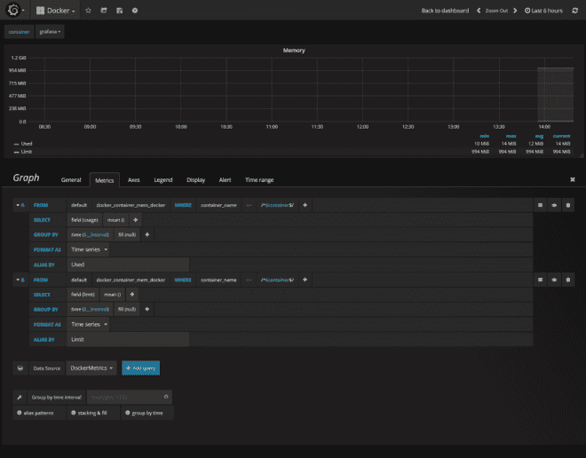

以下是结果截图:

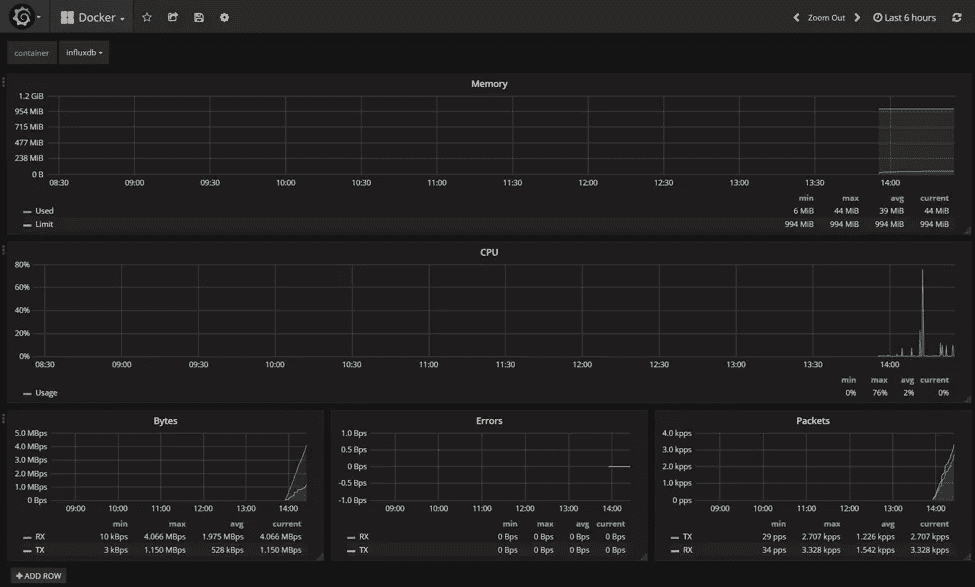