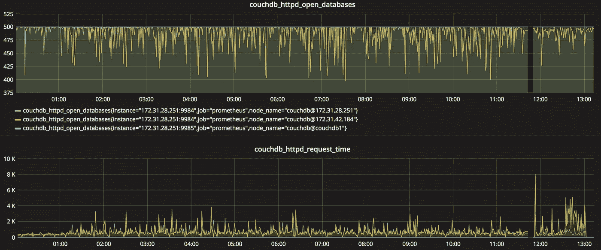

# 使用 Prometheus、Grafana 和 Docker 监控 CouchDB

> 原文：<https://medium.com/hackernoon/monitoring-couchdb-with-prometheus-grafana-and-docker-4693bc8408f0>


假设您已经让新的 CouchDB 集群在生产环境中工作，然后一个节点出现故障。如果你的设计是可靠的，并且有足够多的 CouchDB 节点还在运行，你的应用程序应该会继续运行。另一方面，您会想知道一个节点为什么会关闭，这样您就可以确定是否需要调整节点上的内存或 CPU。您可能还希望通过电子邮件或 slack 接收通知，以便可以实时诊断。

[Prometheus](https://prometheus.io/) 是一个开源监控系统，允许您将监控指标视为生成警报和报告的数据源。它最初是由 SoundCloud 创建的，后来加入了云原生计算基金会。围绕 Prometheus 有一个繁荣的社区，许多开发者为许多网络服务贡献了插件(被称为 [exporters](https://prometheus.io/docs/instrumenting/exporters/) ),包括 CouchDB。

乍一看，尝试设置 Prometheus 环境的所有部分可能有点困难，但使用 Docker，我们可以轻松地将它们放在同一个机器上，然后再将它们移动到其他机器上，以扩展我们的环境。

下面的教程将介绍 Ubuntu 上的设置，但它可以很容易地适应任何其他运行 Docker 的操作系统。

# 步骤 1 —安装 Docker

```
$ git clone [https://github.com/redgeoff/docker-ce-vagrant](https://github.com/redgeoff/docker-ce-vagrant)
$ cd [docker-ce-vagrant](https://github.com/redgeoff/docker-ce-vagrant)
$ sudo ./docker.sh
```

# 步骤 2—安装 AlertManager

AlertManager 是一种服务，它决定在生成警报时做什么。

让我们创建一个目录来存放我们的普罗米修斯配置文件:

```
$ mkdir /home/ubuntu/prometheus
```

现在，用下面的配置编辑*/home/Ubuntu/Prometheus/alert manager . conf*。我们的配置指示 AlertManager 通过 Gmail 帐户发送电子邮件，并向我们的 *#alerts* slack 通道发送消息。您需要启用[传入 Webhooks](https://api.slack.com/incoming-webhooks) 并用您的 slack webhook URL 替换 WEBHOOK-URL。你还需要更换 GMAIL 密码。为了提高安全性，您可能需要创建一个新的 Gmail 帐户，这样就不必使用您的主要 Gmail 密码。

```
global:
  slack_api_url: 'WEBHOOK-URL'route:
  receiver: 'all-alerts'
  group_by: ['CouchDBDownAlert', datacenter, app]receivers:
- name: 'all-alerts'
  email_configs:
  - to: '[to-example@gmail.com](mailto:to-example@gmail.com)'
    from: '[from-example@gmail.com](mailto:from-example@gmail.com)'
    smarthost: smtp.gmail.com:587
    auth_username: "[from-example@gmail.com](mailto:from-example@gmail.com)"
    auth_identity: "[from-example@gmail.com](mailto:from-example@gmail.com)"
    auth_password: "GMAIL-PASSWORD"
  slack_configs:
  - channel: '#alerts'
    send_resolved: true
```

当然，如果你不想要 email_configs 或 slack_configs 中的任何一个，你可以把它们注释掉。还有许多其他[支持的配置](https://prometheus.io/docs/alerting/configuration/)。

然后，使用以下命令运行警报管理器。该命令将在服务器重新启动或管理器崩溃时自动重新启动管理器。

```
sudo docker run -d --name alertmanager \
 --restart always \
  -p 9093:9093 \
  -v /home/ubuntu/prometheus:/alertmanager \
  prom/alertmanager \
  --config.file=/alertmanager/alertmanager.conf
```

如果您曾经更改过 alertmanager.conf，您可以用`sudo docker restart alertmanager`重新启动 alertmanager。(您还必须重启 Prometheus 服务器)

# 步骤 3—创建警报

Prometheus 使用规则来定义警报，当某个条件为真时就会触发警报。

编辑*/home/Ubuntu/Prometheus/Prometheus . rules*并创建一个*couchdbdownealert*，每当 CouchDB 节点没有报告其状态或被报告为停机时，就会触发该警报。

```
groups:
- name: example.rules
  rules:
  - alert: CouchDBDownAlert
    expr: absent(couchdb_httpd_up) or couchdb_httpd_up < 1
    for: 1m
    annotations:
      summary: CouchDB Node Down
```

# 步骤 4—安装 CouchDB 导出器

Prometheus 通过轮询不同的目标来收集指标。默认情况下，CouchDB 不提供普罗米修斯所需格式的指标，但幸运的是，Tobias Gesellchen 开发了令人敬畏的[couch db-普罗米修斯导出器](https://github.com/gesellix/couchdb-prometheus-exporter)！

由于导出器会自动报告每个节点的指标，因此只需要运行一个导出器实例就可以覆盖整个 CouchDB 集群。

让我们假设您的集群正在监听默认端口 5984。用以下方式运行导出器:

```
sudo docker run -d --name couchdb-prometheus-exporter \
  --restart always \
  -p 9984:9984 \
  gesellix/couchdb-prometheus-exporter \
  -couchdb.uri=[http://IP_OR_DNS_TO_ANY_COUCH_NODE:5984](http://IP_OR_DNS_FOR_ANY_COUCH_NODE:5984) \
  -couchdb.username=COUCH_USER \
  -couchdb.password=COUCH_PASSWORD
```

您需要运行导出程序的服务器的 IP 地址。在 Linux 上，通常可以通过以下方式获得:

```
/sbin/ip route | awk '/eth0  proto/ { print $9 }'
```

# 步骤 5—安装普罗米修斯

让我们配置 Prometheus 来轮询它自己和我们的 couchdb-prometheus-exporter。编辑*/home/Ubuntu/Prometheus/Prometheus . conf*:

```
global:
  scrape_interval: 15sexternal_labels:
    monitor: exporter-metricsrule_files:
  - 'prometheus.rules'alerting:
  alertmanagers:
  - static_configs:
    - targets:
      - [IP_OR_DNS_TO_ALERT_MANAGER_SERVER](http://IP_OR_DNS_TO_ALERT_MANAGER_SERVER:9093):9093scrape_configs:
  - job_name: prometheus scrape_interval: 5s static_configs:
      # These endpoints are scraped via HTTP.
      - targets:
        - 'localhost:9090'
        - 'IP-OF-EXPORTER-SERVER:9984'
```

然后运行普罗米修斯:

```
sudo docker run -d --name prometheus-server -p 9090:9090 \
  --restart always \
  -v /home/ubuntu/prometheus/prometheus.conf:/prometheus.conf \
  -v /home/ubuntu/prometheus/prometheus.rules:/prometheus.rules \
  prom/prometheus \
  --config.file=/prometheus.conf
```

这将在服务器重启或崩溃时自动重启 Prometheus。

至此，您现在可以访问[http://IP _ OR _ DNS _ TO _ PROMETHEUS _ SERVER:9090](http://IP_OR_DNS_TO_PROMETHEUS_SERVER:9090)查看 Prometheus UI。*图表*选项卡为您提供了一种快速查看特定指标图表的方式。然而，在下一步中，我们将更进一步，安装 Grafana，这样我们就可以轻松地构建漂亮的定制仪表板。

为了测试您的警报，停止您的 CouchDB 节点之一，您应该会收到一封电子邮件和一个 slack 通知。然后，重新启动节点，您应该会再次收到通知。相当酷！

# 步骤 6—安装 Grafana

[Grafana](https://grafana.com/) 是一个开放的平台，用于漂亮的分析和监控。Grafana 让我们能够创建自定义仪表板，并保存我们的数据。我们可以将我们的报告与历史数据进行比较，以确定什么时候事情正在发生或者甚至开始发生。



为 Grafana 创建一个卷，以便我们的数据在重新启动后仍然存在:

```
sudo docker volume create grafana-storage
```

运行 Grafana:

```
sudo docker run -d --name grafana -p 3000:3000 \
    --restart always \
    -v grafana-storage:/var/lib/grafana \
    grafana/grafana
```

然后，您可以通过[http://IP _ OR _ DNS _ TO _ GRAFANA _ SERVER:3000](http://IP_OR_DNS_TO_GRAFANA_SERVER:3000.)访问 web UI，并使用 admin/admin 登录。登录后，点击侧边栏中的齿轮图标，选择数据源，点击*添加数据源*按钮，然后填写以下详细信息:

1.  名称:普罗米修斯
2.  类型:普罗米修斯
3.  网址:[http://IP _ OR _ DNS _ TO _ PROMETHEUS _ SERVER:9090](http://prom.couchcloud.io:9090)
4.  访问:直接

然后，您可以创建一个新的仪表板，并添加一个度量图，如 *couchdb_httpd_up* 或*couch db _ httpd _ request _ time*。太酷了！

## 更好的安全性

您可能想知道如何阻止其他人访问您的报告。最简单的方法之一是将一切置于防火墙之后，确保所有容器都通过私有 IP 地址连接，然后[使用 VPN 服务器将流量](/@redgeoff/using-a-vpn-server-to-connect-to-your-aws-vpc-for-just-the-cost-of-an-ec2-nano-instance-3c81269c71c2)传输到虚拟云中。

我们可以做的另一件事是将我们的密码，例如 *couchdb.password* 移动到 [Docker。环境文件](https://docs.docker.com/compose/env-file/)。如果你碰巧在使用 Docker Swarm，一个更好的选择是使用 [Docker Swarm Secrets](https://docs.docker.com/engine/swarm/secrets/) 。

# 关于作者

杰夫·考克斯是 MSON 的创造者，这是一种新的声明式编程语言，它将允许任何人可视化地开发软件。他喜欢承担雄心勃勃但令妻子抓狂的项目，比如创建数据库和分布式数据同步系统。你可以在[redgeoff.com](https://redgeoff.com)或者 [@CoxGeoffrey](https://twitter.com/coxgeoffrey) 或者 [github](https://github.com/redgeoff) 上看到更多他的帖子。