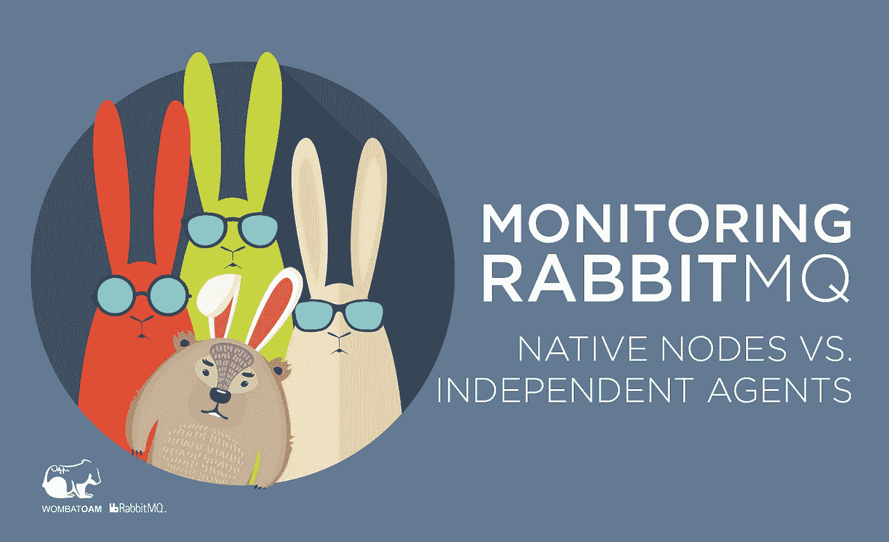
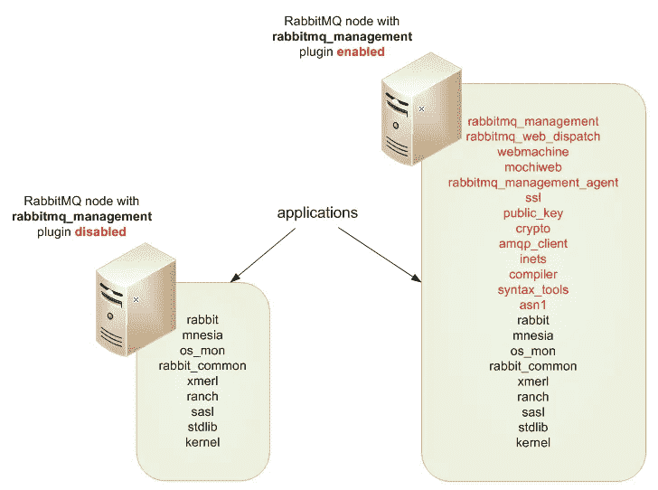
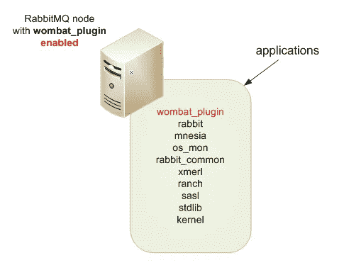

# 监控 RabbitMQ:本地节点与独立代理

> 原文：<https://medium.com/hackernoon/monitoring-rabbitmq-native-nodes-vs-independent-agents-70cbb90d8d44>

作者:阿扬达·杜贝

这篇博文节选自 Ayanda Dube 的 [**RabbitMQ 操作&维护使用 WombatOAM**](http://bit.ly/2hOGWog) 。点击 下载[的完整指南。](http://bit.ly/2hOGWog)

RabbitMQ 用户习惯于使用本地 RabbitMQ 管理[插件](https://www.rabbitmq.com/management.html)来监控和跟踪他们的 RabbitMQ 安装状态，或者使用第三方监控工具，如 [Sensu](https://sensuapp.org/) ，这些工具在内部使用 RabbitMQ 管理 [API](https://cdn.rawgit.com/rabbitmq/rabbitmq-management/rabbitmq_v3_6_3/priv/www/api/index.html) 来获取指标。

不管用户喜欢哪种工具，大多数现成工具的一个共同点是完全依赖 RabbitMQ 管理插件。换句话说，为了通过 web 界面监控和管理您的 RabbitMQ 安装，RabbitMQ 管理插件必须在 RabbitMQ 节点上一直处于**启用状态。**

这种方法的缺点主要在于 RabbitMQ 管理插件在每个启用它的节点上引入的开销。下图描述了当 RabbitMQ 管理插件启用时，在节点上引入的附带和必需的应用程序；

*Fig. 1: Applications introduced per node when the RabbitMQ Management plugin is enabled*

RabbitMQ 管理插件总共需要 **13** 个附加应用程序，这些应用程序与运行任何 AMQP 操作无关，也不是运行这些操作所必需的。

在内部，RabbitMQ 管理插件创建多个基于 RAM 的 Erlang ETS 表，以便存储、聚合和计算统计数据和各种 RabbitMQ 特定的节点指标。除非硬件的规模已考虑到这一点，否则它会对节点的内存提出巨大的要求，并可能在流量负载模式因峰而异时产生许多未知的副作用。

在理想情况下，RabbitMQ 节点应该专用于 AMQP 协议的交付，即连接的客户端之间的排队和消息交换逻辑。理想情况下，所有潜在的繁重操作，如 UI 监控和管理，都应该在一个完全独立的节点上处理；可部署在独立于 RabbitMQ 节点的物理机器上，用于所有 OAM 功能。几十年来，电信系统就是这样解决监控和运营问题的。

RabbitMQ 管理插件和其他依赖于它的 API 的监控工具的不灵活性揭示了使用 WombatOAM 的主要优势。下图是 WombatOAM 在 RabbitMQ 节点上引入的应用程序开销；

*Fig 2: Application overhead WombatOAM introduces on a RabbitMQ node*

# 用 WombatOAM 方法监控 RabbitMQ

那么 WombatOAM 监控 RabbitMQ 的方法有什么不同呢？

阅读这篇关于 www.erlang-solutions.com 的博客文章的其余部分。

这篇博文节选自 Ayanda Dube 的 [**RabbitMQ 操作&维护使用 WombatOAM**](http://bit.ly/2hOGWog) 。点击 下载完整指南 [**。**](http://bit.ly/2hOGWog)

*原载于*[*www.erlang-solutions.com*](http://bit.ly/2Ai8KrQ)*。*