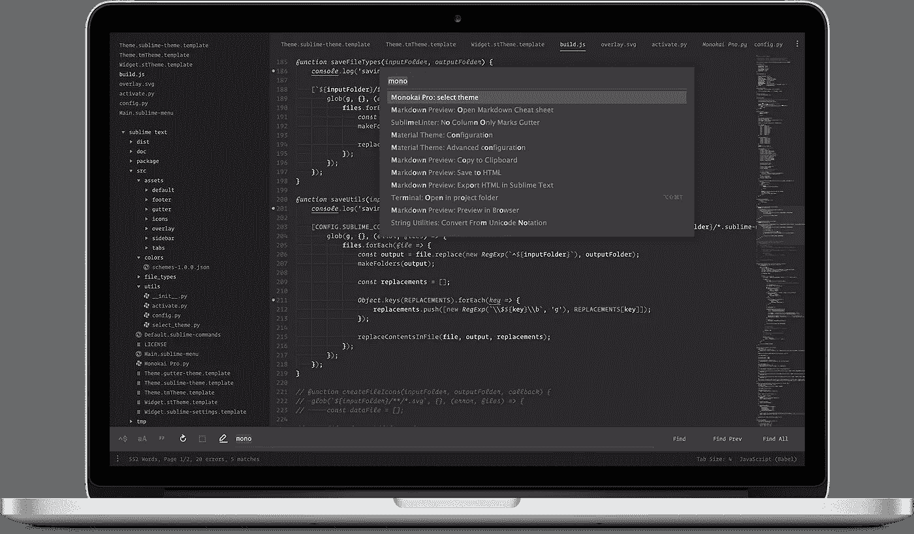
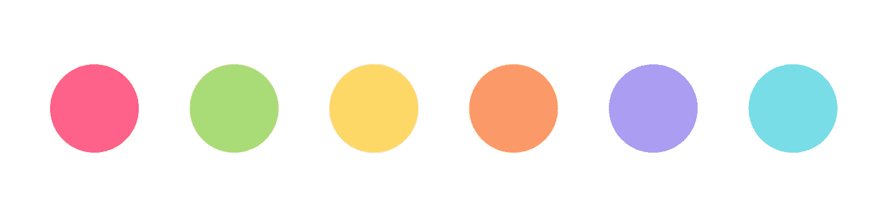
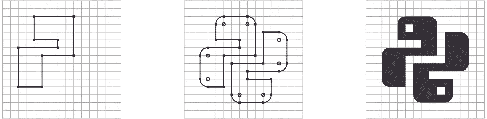

# Monokai Pro:专业开发人员的美丽功能

> 原文：<https://medium.com/hackernoon/monokai-pro-beautiful-functionality-for-professional-developers-a6b9b283f0b3>

## 在崇高的文本中创造理想的编码环境

早在 2006 年，我创造了莫诺凯颜色。今天我发布了[**Monokai Pro**](https://www.monokai.pro)**一个新的配色方案和用户界面主题。**

```
Install it like this:Step 1\. Package Control ‣ Install Package ‣ Theme — Monokai Pro
Step 2\. Quick panel ‣ Monokai Pro: select theme
```

****

**Monokai Pro coding environment for Sublime Text**

## **漂亮的功能**

**几乎每个代码编辑器都有 Monokai 预置。它已经被回收，重新混合，并在更多的软件产品中实现，我数都数不过来。十多年来，老款 Monokai 一直保持强劲势头。**

**新的 Monokai Pro 不仅是一个更新的调色板，它是一个*完整的视觉大修*的崇高文本。多语言语法突出显示的配色方案和不会妨碍您的用户界面主题。它包含 50 多个自定义图标。**

**Monokai Pro 的唯一目标是帮助您集中注意力。所有的设计决策都遵循*美观实用的原则。精心选择的色调是不妥协、不分散注意力的用户界面的基础。***

> **Monokai Pro 的唯一目标是帮助您集中注意力。**

## **彩色和谐**

**让 Monokai *Monokai* 与众不同的是它充满活力的颜色。色彩平衡是好设计的关键。这不是一个非常简单的数学过程。为了达到色彩和谐，你需要精心挑选最匹配的颜色。**

****

**The all new Monokai Pro accent colors**

**如果你回头看看旧的 Monokai 预置，你会注意到一些强调颜色比其他颜色更“流行”。粉红色之所以突出是因为它充满活力，但是那种粉红色的*感知亮度*实际上比其他颜色要低。这种差异，也许是不自觉的，感觉有些不平衡。Monokai Pro 通过更好地协调其颜色来解决这一问题。**

## **Monokai Pro 中的图标看起来像德古拉的尖牙一样锋利**

**文件类型图标帮助你快速浏览你的代码库。然而，创建图标并不等同于在文件名旁边按比例缩小徽标。这会导致图标模糊，因为这些形状与像素网格不完全一致。**

****

**Pixel perfect icon creation process**

**模糊的图标不仅看起来很糟糕，还会导致无法识别的图形。它们还会让你斜视，让你觉得你需要戴眼镜。Monokai Pro 中的图标是从零开始制作的。点对点的完美像素快感。那是 5 便士。**

## **颜色过滤器**

**Monokai Pro 配有一套五种颜色的滤镜，适合你的心情。它们都是标准调色板上的变体，它们都是 Monokai Pro。您可以在过滤器之间快速切换，侧边栏图标的颜色也会匹配。**

**Monokai Pro 还有一些其他的设计技巧，比如自动侧边栏字体同步、单色图标和“最小”设置。这是给专业人士的，你可以在网站上阅读: [**www.monokai.pro**](https://www.monokai.pro) 。**

***免费试用 Monokai Pro，€9.95 美元一个许可证，可以移除弹出窗口。***

***Wimer Hazenberg 是数字设计工作室*[*Booreiland*](https://booreiland.amsterdam)*的创意总监和程序员。他还经营着自己的公司，名为*[*Monokai*](https://www.monokai.nl)*，这是一家数字实验实验室。***

**[](http://bit.ly/HackernoonFB)****[](https://goo.gl/k7XYbx)****[](https://goo.gl/4ofytp)**

> **黑客中午是黑客如何开始他们的下午。我们是这个家庭的一员。我们现在[接受投稿](http://bit.ly/hackernoonsubmission)并乐意[讨论广告&赞助](mailto:partners@amipublications.com)机会。**
> 
> **如果你喜欢这个故事，我们推荐你阅读我们的[最新科技故事](http://bit.ly/hackernoonlatestt)和[趋势科技故事](https://hackernoon.com/trending)。直到下一次，不要把世界的现实想当然！**

****