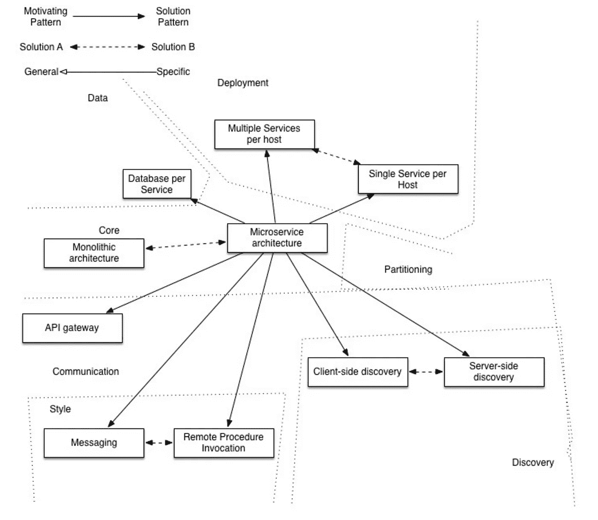

# 整体 M-Pesa 与微服务 M-Pesa

> 原文：<https://medium.com/hackernoon/monolith-m-pesa-vs-microservice-m-pesa-d1ee1d86b6a3>

Detailed illustration of the patterns adopted from microservices.io

每个对水平扩展感兴趣的人都在谈论这个街区的新成员。它是微服务设计模式。很久以前，在我重生进入技术领域之前，公司已经为他们的系统采用了整体设计模式。整体模式是一种模型，在这种模型中，所有的应用程序组件都作为一个工件被部署在生产环境中。

这种架构在相当长的一段时间里为大多数公司工作，我可以将此归因于“雅虎时代”组织采用技术的缓慢速度。但是随着新的开发方法开始出现，技术的采用迅速扩大，公司现在面临着威胁。要么是他们扩大了规模，要么是被运走了。因此，缩放意味着在你身边没有盒子的情况下思考，它必须是不同的和肤浅的。我相信通过这种方式，一种叫做微服务的新模式被创造出来了。这是“优步时代”，一代人有太多的成就。也许我们可以称之为工业革命 2.0。

看起来我谈得太多了，是时候深入了解微服务以及它们如何应用于这种环境了。微服务是一种软件架构模式，它坚持以松散耦合的方式构建系统组件。它包括将应用程序核心中的非依赖模块分离成可以独立运行和管理的独立系统组件。

为了以一种语境化的方式解释这个概念，我将采用一个 Mpesa 平台的案例和场景。会有很多假设。

# 作为一个整体的 Mpesa

我坚信 Mpesa 的第一个版本是一个单一的应用程序。这仅仅是我作为最终用户使用这些服务所获得的知识。根据我的观察，Mpesa G2 更有效，也更容易获得。为了指出单片应用程序的一些特征，我将根据我作为用户的经验来使用案例。

## 交易延迟

在系统升级到 Mpesa G2 之前的大部分时间里，客户常常会因为交易延迟而经历一系列挫折。它们是如此不可预测，以至于你宁愿携带现金或依靠你的卡来应对紧急情况。我记得有一次我和我的朋友出去，我为我的一个朋友点了一杯鸡尾酒，让我惊讶的是交易没有通过，我不得不开始向我的朋友要钱来结账。这不是一件有趣的事。

这主要归功于系统的架构。想象一下这样一个场景，所有请求都由一个应用程序处理，即使您要在很短时间内进行扩展，也会达到资源所能提供的上限。有趣的是，10%的人在查看余额，30%的人在进行 B2B 交易，60%的人在进行 P2P 交易。想象一下，如果所有这些都被归类为服务并独立运行…精神食粮。

## 系统停机时间

每当 Mpesa 进行重大升级时，这意味着您必须等待近 72 小时才能在平台上进行交易。我无法想象一个依赖移动货币进行 P2P 交易的国家经历了怎样的折磨。这主要是因为整体不能提供升级系统特定部件的平稳方式。因此，如果我添加了贷款和储蓄的新功能，这意味着我必须下载应用程序进行升级，然后将升级传播到所有冗余服务器。这是不可接受的，作为一名首席技术官，这有点麻烦，因为每个人都将在你的脖子上。

这几个案例可以让您了解维护一个整体应用程序是多么昂贵。

## 作为微服务的 M-Pesa

假设采用微服务架构作为 Mpesa G2 平台的一部分，那么它会带来以下好处:

## 有效性

自从升级后，我的担心已经化为乌有，我现在只知道 Mpesa 是一项 24/7 的服务。我不记得上一次我不得不等待 15 分钟来完成交易是什么时候了。就在周末，我在 Mpesa 和我的 KCB 帐户之间进行交易，我注意到 Mpesa 正在工作，但 KCB 似乎有问题。这是微服务的真实定义，系统的一些组件可以在不影响系统可用性的情况下开发或暂停。这在单片架构中是不可能的。

## 更快的交易处理

即使有些人不保证微服务的速度，我倾向于不同意。因为如果一个服务变得简单，就意味着更少的执行时间，从而保证速度。还要注意，微服务可以垂直扩展，以适应到来的请求。大多数与 Mpesa 交易的人都可以证明这一点，但这也归因于服务器从德国转移到肯尼亚。

## 集成

作为一名开发人员，与拥有 API 的平台一起工作一直是我的乐事，API 允许我执行任何与我正在解决的问题和平台特性相关的特定操作。在 Mpesa G2 之前，您与 Safaricom Mpesa 系统交互的唯一方式是通过 IPN(即时支付通知)。这是在服务端与一个“独裁者”的单线通信，这是非常不利的，因为你无法控制它。你甚至不能查询或验证客户的交易，因为你无法与系统对话。有了新系统，您就有了几个可以执行的集成。我相信大多数操作都被划分为微服务。这意味着，如果我已经集成了一个服务，那么另一个服务的失败不会导致我的平台无法运行。

## 可管理的代码库

企业扩张太快，这意味着他们的人员和代码库呈指数级增长。为了有效地利用现有资源，工作应该简化。因此，他们不用给一个开发人员整整 100 万行代码，而只需开发 1000 行代码的微服务。这最终改善了交付时间，也减少了完成工作所需的资源量。

## 多语言编程

这根本不是一个新概念，它涉及到应用程序开发中多种编程语言和多种模块化范例的使用。对于微服务，这意味着工程师有能力以一种适合当前问题需要的方式对某个服务进行编程。例如，Mpesa 的母亲 Safaricom 推出了一种新的打车服务，出于某种原因，我相信他们会将他们的支付和位置平台与 Little(即打车公司)集成在一起。这意味着我们需要对这两个平台进行不同的编程，以便利用不同平台的功能，从而提高系统性能。对于微服务架构，多语言编程工作良好，因为每个服务都是独立的，并且只通过标准接口进行通信，这意味着一个服务不需要知道另一个服务使用的架构或开发工具。

## 结论

微服务设计模式带来了很多东西，我只提到了一些与微服务捆绑在一起的高级组件。如果你需要了解内部结构，那么你必须进行大量的研究，并提出能够创建微服务架构的设计。

正如我所说的，微服务是一个热门话题，任何不听从召唤和采用这种架构的人都将被淘汰。这是简化公司 It 并让客户比以往任何时候都更开心的模式之一。

## ***如果你爱上这篇文章，请好心推荐给别人。*:-)**

**参考文献。**

 [## 微服务架构

### 这个网站描述了一个新的、替代的架构:微服务。采用微服务架构的应用程序…

微服务. io](http://microservices.io/) 

Polyglot Programming

> [黑客中午](http://bit.ly/Hackernoon)是黑客如何开始他们的下午。我们是 [@AMI](http://bit.ly/atAMIatAMI) 家庭的一员。我们现在[接受投稿](http://bit.ly/hackernoonsubmission)，并乐意[讨论广告&赞助](mailto:partners@amipublications.com)机会。
> 
> 如果你喜欢这个故事，我们推荐你阅读我们的[最新科技故事](http://bit.ly/hackernoonlatestt)和[趋势科技故事](https://hackernoon.com/trending)。直到下一次，不要把世界的现实想当然！

