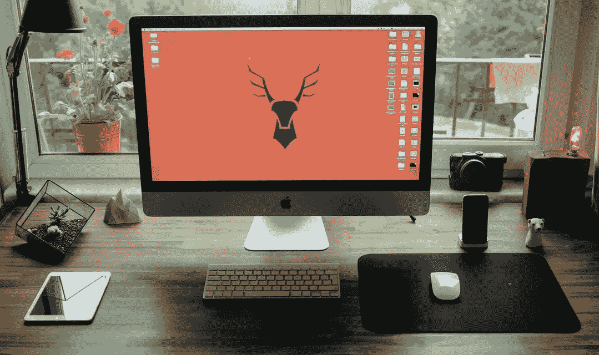
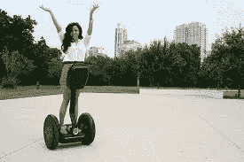

# 更多坏主意

> 原文：<https://medium.com/hackernoon/more-bad-ideas-c71511e30dea>

## [作者 C.J .亚当斯](http://www.iamcjadams.com)

你想疯狂[成功](https://hackernoon.com/tagged/successful)吗？你想有伟大的想法吗？

你当然知道。我们都是。

拥有伟大想法的第一步是拥有数百万个糟糕的想法。

你必须让那些[创意](https://hackernoon.com/tagged/creative)的汁液流动起来。你的大脑是一块肌肉，你必须锻炼它。所以，开始想办法吧。一大堆。写下来。

是啊，他们可能是坏的。甚至可能很糟糕。

*(侧栏…..我曾经想在大学校园里租赁赛格威，用赛格威女孩宣传公司…基本上是赛格威上的红牛女孩。)*

无论如何…在那里的某个地方，混杂着所有的坏主意，有着光辉…有一个好主意。

找到它的唯一方法是仔细检查所有的坏主意，所以开始工作吧。

非常感谢您的阅读！如果你喜欢，点击下面的心形按钮。对我来说意义重大。:)

> [黑客中午](http://bit.ly/Hackernoon)是黑客如何开始他们的下午。我们是阿妹家庭的一员。我们现在[接受投稿](http://bit.ly/hackernoonsubmission)并乐意[讨论广告&赞助](mailto:partners@amipublications.com)机会。
> 
> 如果你喜欢这个故事，我们推荐你阅读我们的[最新科技故事](http://bit.ly/hackernoonlatestt)和[趋势科技故事](https://hackernoon.com/trending)。直到下一次，不要把世界的现实想当然！

