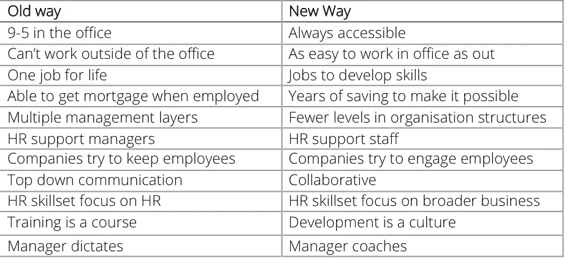

# (多)人力(少)资源

> 原文：<https://medium.com/hackernoon/more-human-less-resources-def49e09babd>

> 职业是攀登架，而不是梯子雪莉·桑德伯格

2006 年以前，在家工作是一个挑战，无论你在哪里，都要连接到互联网。连通性和相关技术已经改变了我们进行每一次互动的方式。我们已经进入了一个世界，在这个世界中，我们期望一切都是高度自动化的、集成的和不断改进的。

公司已经认识到这一点，并改变了与客户互动的方式；整合所有渠道的服务；大力投资数字技术以改善客户体验；让他们通过正确的渠道，并确保他们成为客户。公司已经拨出数十亿英镑来解决客户体验问题，他们的员工确实注意到了这一点。这一点尤其明显，因为与此同时，他们看到为他们做同样事情的努力有限。

移动技术已经融合了工作和休闲的世界——你的手机在哪里，你就可以在哪里工作。这促使员工更加关注他们在哪里工作、工作的目的以及他们的满意度。与此同时，劳动力市场对熟练劳动力的摩擦也在减少。

在组织内部，人力资源在过去的 150 年里发生了根本性的转变，从 19 世纪 90 年代作为福利官员开始，到人事管理，然后是我们现在所知的人力资源，以及人才、人员运营和人力资本等新兴职能。

人力资源领域的下一波进步必须基于对员工看到的客户使用的技术所导致的转变的理解。

公司需要改变他们对员工的看法和设计。

## 为人民而非员工设计

*   人们为你工作一段时间，不要假设他们永远是你的，而是尽你所能留住他们，并鼓励他们回来

## 让每个渠道协同工作

*   所有信息都必须得到整个组织的支持，无论来自谁

## 真实性是体验的决定性因素

*   抄袭谷歌并不会让你成为谷歌
*   如果你宣传一件你必须兑现的东西，员工就像顾客一样，不会等着

## 重新定义端到端的含义

*   从招聘前互动开始，到就业后互动结束
*   员工应该在正确的时间加入你，在正确的时间离开你。如果发生这种情况，他们会是你最好的支持者

我们需要从基本原则出发，重新思考组织与员工的关系，这就是 E|X。

> [黑客中午](http://bit.ly/Hackernoon)是黑客如何开始他们的下午。我们是 [@AMI](http://bit.ly/atAMIatAMI) 家庭的一员。我们现在[接受投稿](http://bit.ly/hackernoonsubmission)，并乐意[讨论广告&赞助](mailto:partners@amipublications.com)机会。
> 
> 如果你喜欢这个故事，我们推荐你阅读我们的[最新科技故事](http://bit.ly/hackernoonlatestt)和[趋势科技故事](https://hackernoon.com/trending)。直到下一次，不要把世界的现实想当然！

