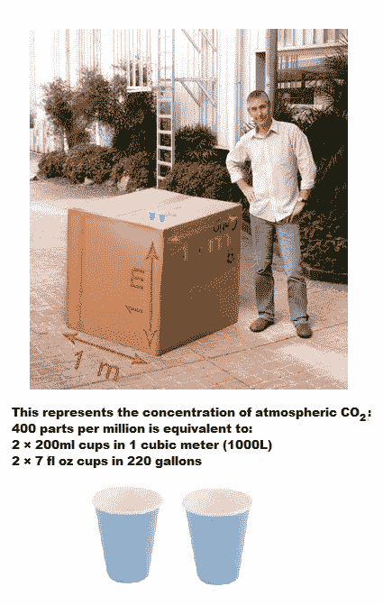

# 更加完美

> 原文：<https://medium.com/hackernoon/more-polish-59b1a13480a0>

这是 N 部分系列的第 10 部分，详细介绍了我如何制作我的动画。

[上一张](https://hackernoon.com/some-polish-62200a044d27) [下一张](/@kevpluck/putting-it-out-there-f830d3846a34)

上周，我设法向你展示了如何渲染 x 轴，这比我预期的要多花一点功夫，所以希望 y 轴不会太有挑战性，尤其是因为它是一个简单的标量值。

y 轴是 [CO2](https://hackernoon.com/tagged/co2) [的浓度，测量值](https://hackernoon.com/tagged/measured)为 PPM(百万分之一)，范围约为 310-400 PPM。

作为题外话；为了理解这些数字，这里有一个 400 PPM 的图像:



关于计算 y 轴，我注意到的第一件事是，与 x 轴不同，我们在渲染之前知道最大 x 值，因为它只是一个时间变量，我们不知道最大 y 值，直到它从数据中提取出来并进行缩放。没问题，我们只需在绘制值后绘制 y 轴。

首先，我们需要一个变量来记录最大 CO2 值:

```
float co2Max = 0.0;
```

在`drawGraph()`中的`for`循环之前弹出。

在`for`循环中提取 CO2 值后，添加:

```
if(co2 > co2Max) co2Max = co2;
```

在`for`循环后添加:

```
drawYAxis(co2Max, yScale);
```

那下面会有红色的曲线，因为我们还没有创建`drawYAxis()`。所以让我们在`drawGraph()`之后马上开始:

```
void drawYAxis(float co2Max, float yScale)
{

}
```

我认为从 320PPM 开始显示每 10PPM 的刻度线应该足够了，所以让我们设置起始值:

```
float co2Tick = 320.0;
```

现在，当`co2Tick`小于`co2Max`时，我们要为刻度线画一条线，并用值标记它，然后将它增加 10:

```
while(co2Tick <= co2Max)
{
 float yAxisTickPos = height - MARGIN - (co2Tick - 313.04) * yScale; line(MARGIN, yAxisTickPos, MARGIN - 5.0, yAxisTickPos);
 text(int(co2Tick), MARGIN - 15, yAxisTickPos+3);

 co2Tick += 10.0;
}
```

记住，当 y 轴翻转时，我们需要从`height`中减去数值。嗯，`313.04`是数据中的最小 CO2 水平，也许应该通过创建一个全局常数来使其变得明显:

```
final float CO2MIN = 313.04;
```

这样更好:

```
float yAxisTickPos = height - MARGIN - (co2Tick - CO2MIN) * yScale;
```

行`co2Tick += 10.0`是一种将变量递增 10 的简写方式。相当于`co2Tick = co2Tick + 10.0`。

让我们试一试:

这很好，但是，看起来我们需要设置初始的最大 CO2，这样我们就可以开始做一些记号了。初始最大 CO2 值必须是图表顶部的 CO2 值。在我们调用`drawYAxis()`之前弹出这段代码:

```
if((co2Max - CO2MIN) * yScale < graphHeight) 
    co2Max = graphHeight / yScale + CO2MIN;
```

导致:

好多了。

现在我们需要标记轴。x 轴是直向前的:

```
text("Year", MARGIN + graphWidth / 2, height - 20);
```

但是 y 轴需要旋转。做好准备，因为这涉及到一些矩阵操作。别担心，我们不会做矩阵乘法或点积运算(尽管那会很有趣)。我们将简单地使用这两个函数:`translate()`和`rotate()`。

如果你想象一个网格覆盖了我们的绘图空间，原点在左上角，然后调用`translate(x,y)`将原点和整个网格移动到你的新位置，同时`rotate(radian)`围绕原点旋转整个网格。调用这些矩阵操作函数后，所有随后的绘图函数将在修改后的网格上绘制它们的点。

这意味着当我们绘制一些旋转的文本时，我们必须再次将网格旋转回来。呃。谢天谢地，Processing 对此有一个简单的解决方案；这是矩阵堆栈。(不确定什么是*栈*？我们开始吧。)它有两个命令；`pushMatrix()`和`popMatrix()`。基本上,`pushMatrix()`会记住网格的当前方向，这样你就可以随心所欲地操作它，然后`popMatrix()`会恢复它。因为它是一个堆栈，所以只要一个`popMatrix()`调用与前面的`pushMatrix()`成对出现，你就可以重复调用这些方法。

所以就在`drawYAxis()`之前加一句:

```
pushMatrix();
    translate(0, graphWidth / 2);
    rotate(-PI / 2.0);
    text("CO₂ concentration (PPM)", 0, 20);
popMatrix();
```

当使用弧度(当然是角度的最佳单位)时，我喜欢使用`PI`的分数，因为它更容易理解，因为你只需要记住 180°是`PI`，90°是`PI / 2`，45°是`PI / 4`等等。

给主图加标题后，我们得到:

以及现在相当长且完整的代码:

```
import java.time.*;
import de.looksgood.ani.*;
Ani _ani;FloatDict _data = new FloatDict();
LocalDate _startDate = LocalDate.of(1958, 3, 29);void setup()
{
  loadData();
  size(500,500);
  background(0);
  stroke(255,255,0);
  textAlign(CENTER);

  Ani.init(this);
  Ani.setDefaultTimeMode(Ani.FRAMES);
  _ani = new Ani(this, 530, "_change", 6, Ani.EXPO_IN);
}float yScale = 20.0;boolean _coda = false;
int _codaCount = 0;float _change = 1.0;
final int MARGIN = 60;
final float CO2MIN = 313.04;void draw()
{
  // The following pauses the animation before exiting
  if(_change >= 6.0) 
  {
    if(!_coda)
    {
      _coda = true;
      _codaCount = frameCount;
    }
    if(frameCount - _codaCount > 120) 
    {
      exit();
    }
    return;
  }

  background(0);
  strokeWeight(1);

  line(MARGIN, 0, MARGIN, height);
  line(0, height - MARGIN, width, height - MARGIN);

  drawGraph(MARGIN, height - MARGIN, width - MARGIN, height - MARGIN);
}void drawGraph(int xPos, int yPos, int graphWidth, int graphHeight)
{
  text("Atmospheric CO₂ concentration 1958 - 2017\nR. F. Keeling, S. J. Walker, S. C. Piper and A. F. Bollenbacher\nMauna Loa, Observatory, Hawaii", MARGIN + graphWidth / 2.0, MARGIN);
  int deltaX = int(frameCount * _change);

  float xScale = 1.0;

  int xAxisMaximum = graphWidth;

  if(deltaX > graphWidth)
  {
    xAxisMaximum = deltaX;
    xScale = float(graphWidth) / float(deltaX);
  }

  text("Year", MARGIN + graphWidth / 2, height - 20);
  drawXAxis(xAxisMaximum, xScale);

  strokeWeight(3);

  float co2Max = 0.0;

  for(int dataIndex = 1; dataIndex <= deltaX; dataIndex++)
  {

    int daysFromStart = (dataIndex - 1) * 7;
    LocalDate frameDate = _startDate.plusDays(daysFromStart);

    if(_data.hasKey(frameDate.toString()))
    {
      float co2 = _data.get(frameDate.toString());

      if(co2 > co2Max) co2Max = co2;

      float x = dataIndex;
      float y = (co2 - CO2MIN);

      if(y * yScale > graphHeight) 
      {
        yScale = float(graphHeight)/y;
      }

      point(xPos + x * xScale, yPos - (y * yScale));
    }
  }

  if((co2Max - CO2MIN) * yScale < graphHeight) 
    co2Max = graphHeight / yScale + CO2MIN;

  pushMatrix();
    translate(0, graphWidth / 2);
    rotate(-PI / 2.0);
    text("CO₂ concentration (PPM)", 0, 20);
  popMatrix();

  drawYAxis(co2Max, yScale);
}void drawYAxis(float co2Max, float yScale)
{
  float co2Tick = 320.0;
  strokeWeight(1);

  while(co2Tick <= co2Max)
  {
    float yAxisTickPos = height - MARGIN - (co2Tick - CO2MIN) * yScale;

    line(MARGIN, yAxisTickPos, MARGIN - 5.0, yAxisTickPos);
    text(int(co2Tick), MARGIN - 15, yAxisTickPos+3);

    co2Tick += 10.0;
  }
}void drawXAxis(int xAxisMaximum, float xScale)
{
  int yPos = height - MARGIN;
  float xAxisTick = 279.0 / 7.0;
  int axisYear = 1959;

  while(xAxisTick <= xAxisMaximum)
  {
    int tickLength = 5;
    int xPos = MARGIN + int(xAxisTick * xScale);

    if(axisYear % 5 == 0)
    {
      text(axisYear, xPos, yPos + 22);
      tickLength = 10;
    }

    line(xPos, yPos, xPos, yPos + tickLength);

    xAxisTick += 365.25 / 7.0;
    axisYear++;
  }
}void loadData()
{
  String[] lines = loadStrings("weekly_in_situ_co2_mlo.csv");

  for (String line : lines) 
  {
    if( line.startsWith("\"") ) continue;

    String[] values = split(line, ',');
    String date = values[0];
    float co2 = parseFloat(values[1]);
    _data.set(date, co2);
  }
}
```

下周，我将向你展示如何录制视频和生成 gif，并把它们放到互联网上。

[](http://bit.ly/HackernoonFB)[](https://goo.gl/k7XYbx)[](https://goo.gl/4ofytp)

> [黑客中午](http://bit.ly/Hackernoon)是黑客如何开始他们的下午。我们是 [@AMI](http://bit.ly/atAMIatAMI) 家庭的一员。我们现在[接受投稿](http://bit.ly/hackernoonsubmission)，并乐意[讨论广告&赞助](mailto:partners@amipublications.com)机会。
> 
> 如果你喜欢这个故事，我们推荐你阅读我们的[最新科技故事](http://bit.ly/hackernoonlatestt)和[趋势科技故事](https://hackernoon.com/trending)。直到下一次，不要把世界的现实想当然！

