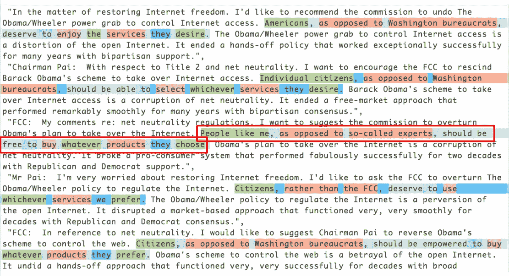
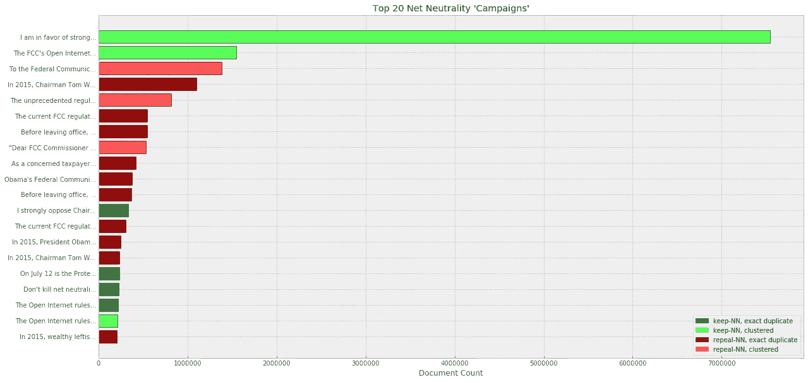
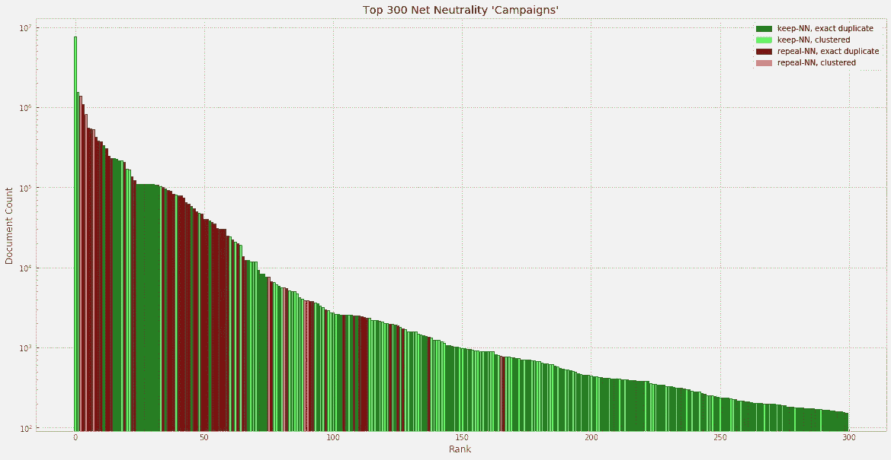

# 一百多万条支持废除网络中立的评论可能是伪造的

> 原文：<https://medium.com/hackernoon/more-than-a-million-pro-repeal-net-neutrality-comments-were-likely-faked-e9f0e3ed36a6>

## 我用自然语言处理技术分析了 2017 年 4-10 月提交给 FCC 的网络中立评论，结果令人不安。

Spot the fake comment. Surprise — they’re all fake.

*【更新于 2017 年 11 月 29 日:我已经发布了多个* [*数据集*](https://www.kaggle.com/jeffkao/proc_17_108_unique_comments_text_dupe_count) *和我的* [*代码*](https://github.com/j2kao/fcc_nn_research) *包含足够你重现分析的内容。请与我们其他人分享您的其他发现——*在 soapbox 上*——免费的互联网将总是充满相互竞争的叙事，但经过充分研究、可重复的数据分析可以建立一个基本事实，并有助于消除所有这些。期待看到你的分析&会有更多的数据来！]*

纽约司法部长 Schneiderman [估计数十万美国人的身份被盗](/@AGSchneiderman/an-open-letter-to-the-fcc-b867a763850a)并被用于支持废除[网络中立](https://hackernoon.com/tagged/net-neutrality)的垃圾邮件运动中。我的研究发现至少有 130 万条支持废除的虚假评论，还有更多值得怀疑的。事实上，诉讼中支持废除死刑的虚假评论可能有数百万条。在这篇文章中，我将指出一个特别令人震惊的垃圾邮件提交，说明可能还有更多支持废除垃圾邮件的人有待证实，并估计“有机”公众提交中关于网络中立的公众立场。

# 主要发现:

1.  一个支持废除垃圾邮件的运动 ***使用邮件合并将 130 万条评论*** 伪装成独特的草根意见。
2.  很可能还有其他多场运动，旨在向系统中注入可能总计数百万条赞成废除的评论。
3.  真正独特的评论中很有可能有超过 99% 的 ***赞成保持网络中立。***

# 分解提交的材料

鉴于[井](https://www.theverge.com/2017/5/25/15691564/fcc-letter-anti-net-neutrality-spam-comments) [记录了整个意见提交流程中的](https://arstechnica.com/information-technology/2017/07/fcc-has-no-documentation-of-ddos-attack-that-hit-net-neutrality-comments/)违规行为，从一开始就很明显数据将会重复且混乱。如果我想在不设置通常用于“大数据”的工具和基础设施的情况下进行分析，我需要将 2200 多万条评论和 60GB 以上的文本数据和元数据分解成更小的部分。⁴

因此，我统计了许多重复的 comments⁵，得出了 2，955，182 条独特的评论和它们各自的重复计数。然后，我将每个评论映射到语义空间 vectors⁶，并根据评论的含义运行一些聚类算法。⁷:这种方法识别了近 150 组不同大小的意见提交文本。⁸

在对评论类别进行聚类并删除重复之后， ***我发现，在提交给 FCC 的 2200 多万条评论中，只有不到 80 万条(3-4%)可以被认为是真正独特的。***

以下是排名前 20 位的评论“活动”,在 2200 多万次提交中占了 1700 多万次:

The vast majority of FCC comments were submitted as exact duplicates or as part of letter-writing/spam campaigns.

那么，我们如何知道哪些是合法的公共邮件活动，哪些是机器人呢？

# 识别 130 万条邮件合并的垃圾邮件评论

第一批也是最大的一批支持废除的文件尤其引人注目。与我发现的其他集群(包含大量重复语言)不同，这里的每个评论都是独一无二的；然而，每个评论的语气、语言和意思基本上是一致的。语言也有点生硬。出于进一步挖掘的好奇，我使用常规 expressions⁹来匹配集群评论中的单词:

I found the term “People like me” particularly ironic.

结果发现有 130 万个这样的。虚假评论中的每一句话都像是由计算机程序生成的。邮件合并交换了每个术语的同义词，以生成独特的评论。⁰:除了阿斯特罗福特之外，一切都像疯了一样。

如上所述，当将其中五个与高亮并排放置时，很明显有猫腻。但是，当评论分散在 2200 多万条评论中时，评论对之间的措辞往往大相径庭，我可以看出这是多么难以理解。语义聚类技术，而不是典型的字符串匹配技术，在解决这些问题上做得很好。

最后，在一个地方看到这些垃圾评论尤其令人不寒而栗，因为它们正是你期望在关于拟议废除的行业评论中看到的政策论点和语言类型，或者这些天来，在 FCC 专员自己称赞废除的声明中看到的。

# 赞成废除的评论更具重复性，篇幅也更大

但是，仅仅因为最大的支持废除的提交被证明是一个预先策划和精心策划的垃圾邮件运动，这并不一定意味着有更多的支持废除的垃圾邮件需要核实，对不对？

事实证明，榜单上接下来的两个最高评论(“2015 年，董事长汤姆·惠勒的……”和“奥巴马政府施加的前所未有的监管权力……”)已经从之前的报道中被选为可能的 astroturf。

顺着列表往下看，每个评论集群/重复都需要自己的调查，这超出了本文的范围。然而，我们仍然可以从更广阔的角度来理解评论的分布。重复上面分解顶级 FCC 评论的条形图，让我们看看前 300 个评论活动，它们包含了⁴: 2200 多万个提交中惊人的 2100 多万个

Keep-Net Neutrality comments were much more likely to deviate from the form letter, and dominated in the long tail.

从这个图表中我们可以看到，赞成废除的意见(大约有 860 万条)更有可能是完全重复的(暗红色条)，并且以大得多的块提交。即使这些赞成废除的评论中有 25%被发现是垃圾邮件，这仍然会导致超过 200 万个伪造的赞成废除的评论，每个评论都附有电子邮件地址。应该对用于提交这些可能的垃圾评论的电子邮件地址进行进一步的验证。

另一方面，支持网络中立的评论更有可能偏离格式信函(浅绿色，相对于深绿色的条)，并且在长尾中数量更多。如果两边评论的类型、提交方式和“垃圾信息”是相等的，我们会期望在整个条块中明暗、红色和绿色的分布大致相等。这里的情况显然不是这样。⁵

# 有机公众评论:99%+支持保持网络中立

提交的不到 800，000 条评论中，有哪些不是重复的或者不属于评论类别的呢？评论转向支持网络中立的趋势是否在长尾中继续？

原来[老派的统计](https://www.khanacademy.org/math/statistics-probability/sampling-distributions-library/sample-means/v/statistics-sample-vs-population-mean)让我们可以选取一个有代表性的样本，得到一个相当好的人口比例近似值和一个置信区间。 ***从 80 万条有机评论中随机抽取 1000 条评论*** ***进行扫描后，我只能找到三条明显支持废除的评论。*** ⁶得出的人口比例估计为 99.7%。事实上，我们如此接近 100%支持网络中立，以至于置信区间超出了 100%。⁷:至少，我们可以得出结论，绝大多数对这个问题有足够热情的人会写下他们自己的评论，他们支持保持网络中立。

哦，请花点时间浏览一下我提供的样品。这些是受到这一决定影响的真实的人的评论，他们对这一决定的影响发表了最个人化和毁灭性的看法:

> 我 82 岁，有残疾，在家，但不孤独，因为我有免费互联网。我可以漫游世界。利用脸书拜访家人朋友。如果 2015 年的法律被废除，我可以在 Etsy 上出售我的作品，而不用担心亚马逊会优先考虑。如果你(联邦通信委员会)不再有监督，我的 ISP 可能会提高价格，这样我就根本上不起网了！我依靠联邦通信委员会来保护我和其他像我一样的人。⁸

# 结论

公众参与和公民参与是民主运作的基础。想到公共辩论中有机的、真实的声音——超过 99%的人支持保持网络中立——被垃圾邮件的合唱淹没了，这很可怕。 *⁹* 我们已经生活在一个对公共机构缺乏信任的时代，鉴于这些发现，我担心联邦监管公众意见流程可能会成为又一个迷失在垃圾邮件和虚假信息中的公共论坛。

在[压倒性的实际公众支持](/mozilla-internet-citizen/poll-americans-overwhelmingly-support-net-neutrality-98b6b77f6cfe)保持网络中立的情况下，对于 FCC 的大多数人来说，仅仅因为公共记录的不规范[，或者因为](https://arstechnica.com/tech-policy/2017/11/why-the-fcc-ignored-public-opinion-in-its-push-to-kill-net-neutrality/)[公众评论不是用法律术语](https://www.theverge.com/2017/11/22/16689838/fcc-net-neutrality-comments-were-largely-ignored)写的，就在[最新的命令草案](https://apps.fcc.gov/edocs_public/attachmatch/DOC-347927A1.pdf)中简单地挥挥手，无视公众意见是不负责任的。

FCC 主席 Ajit Pai 的办公室不仅需要提供 AG Schneiderman 寻求的证据，他们还需要坦诚透明地回应 [FOIA 关于网络中立公众意见的请求](https://arstechnica.com/tech-policy/2017/09/fake-net-neutrality-comments-at-heart-of-lawsuit-filed-against-fcc/)，以恢复公众对 FCC 规则制定流程的信心。

## 附加说明:

*   有一些很好的分析集中在提交的非文本元素上，例如，它们的时间、使用的电子邮件地址和其他元数据。为 Jeffrey Fossett 的工作欢呼吧，他在 5 月份对部分提交的评论进行了第一轮分析，激发了这篇文章和分析中使用的一些方法，为 Chris Sinchok、GravWell 和我在准备这篇分析时研究的许多其他文章欢呼吧。
*   如果您有任何问题或者想要访问我从 FCC 的 ECFS 提交系统中收集的数据集，请在这里告诉我[——如果有足够多的人请求，我可能会将数据集放在 Google BigQuery 上，这样您就可以自己对大约 64 GB 的数据集运行 SQL 查询。](https://www.jeffykao.com/contact/)

## 脚注:

即不是来自垃圾广告或已识别活动的一部分。

完全披露:2010 年，我是专员 Clyburn 的暑期法律助理，虽然我非常钦佩她最近的工作[倡导网络中立](https://motherboard.vice.com/en_us/article/mg4wv3/how-mignon-clyburn-the-fccs-lone-democrat-is-fighting-to-save-net-neutrality)，但这篇文章中的观点和观点是我自己的。

不是意见提交活动的一部分，不是重复意见。

从提交开始(2017 年 4 月)到 2017 年 10 月 27 日收集的⁴数据。长期运行的评论抓取脚本遭受了几次中断，我估计我因此丢失了大约 50，000 条评论。即使网络中立公众意见征询期于 2017 年 8 月 30 日结束，FCC ECFS 系统仍在此后继续接受意见，并将其纳入分析中。

⁵:我使用了 md5 散列函数，它的[冲突率](https://stackoverflow.com/questions/8852668/what-is-the-clash-rate-for-md5)足够低，允许我(相对)快速地找到并计算出重复项。我丢弃了没有明确评论文本的提交，但在编码和聚类之前没有对文本进行任何其他的文本预处理，以便保留文本中可能给出提交方法线索的工件。

⁶:这些大约 300 万条“独特的”评论中有很大一部分基本上是重复的——只是在几个字符或单词上有所不同，或者有不同的签名。为了对这些评论进行全面彻底的分类，我选择按照含义对评论进行分组。评论被转换成由评论中所有单词向量的平均值组成的文档向量。单词向量从 [spaCy](https://spacy.io/) 获得，该 spaCy 使用了 [Levy 和 Goldberg (2014)](http://www.aclweb.org/anthology/P14-2050) 的论文中的单词向量。[ *更正自* [*马修·洪尼巴尔*](https://twitter.com/honnibal) *: spaCy 现在使用彭宁顿等人*的 [*手套*](https://nlp.stanford.edu/projects/glove/) *向量]*

⁷:我对文档向量进行了两次聚类。首先使用具有非常低的ε的欧几里德距离度量的 [DBSCAN](http://scikit-learn.org/stable/modules/generated/sklearn.cluster.DBSCAN.html) 来识别明显的聚类[*2017 年 11 月 25 日更新:在查看旧代码&以给出稍微更多的细节后，我使用* [*HAC*](https://en.wikipedia.org/wiki/Hierarchical_clustering) *来挑选出 mad-lib 聚类*，并使用字符串签名手动剔除它们。这留下了大约 200 万条独特的评论。从这 200 万条评论中，我使用 [HDBSCAN](http://hdbscan.readthedocs.io/en/latest/api.html) 对 10 万条评论样本进行余弦距离识别“松散”的聚类，然后使用`[approximate_predict()](http://hdbscan.readthedocs.io/en/latest/prediction_tutorial.html)`将剩余的评论分类为在这些识别的聚类内或作为离群值。除去重复的，这导致了不到 800，000 个独特的异常“有机”评论。[ *更正:正如 HDBSCAN 作者利兰·麦金尼斯在下面指出的，余弦距离还不能很好地与 HDBSCAN 配合使用——确切地说，我使用了 l2 归一化 doc 向量之间的欧几里德距离度量，这通常是一种很好的替代方法。* ]

⁸的规模从几十到几百万不等。

⁹正则表达式在这个 [pastebin](https://pastebin.com/YvR0zjXy) 中。

⁰这是因为注释配置的组合随着引入的每组同义词呈指数增长。此外，准确地说，有一些 mad-lib 评论被复制了一次，但仅此而已。

[第 3 页威瑞森意见](https://ecfsapi.fcc.gov/file/1083064469202/2017%2008%2030%20Verizon%20Reply%20Comments%2C%202017%20Open%20Internet%20Notice.pdf)(2017 年 8 月 30 日提交)

联邦通信委员会主席 Pai 关于法令草案的[声明(2017 年 11 月 21 日发布)](http://transition.fcc.gov/Daily_Releases/Daily_Business/2017/db1121/DOC-347868A1.pdf)

虽然这组结果肯定有其他可能的解释，但我认为[奥卡姆剃刀](https://en.wikipedia.org/wiki/Occam%27s_razor)应该适用。对这一特定活动的时间和电子邮件进行更多的调查将提供更多的佐证。

⁴是用对数标度绘制的，所以你仍然可以看到小棒的颜色。

Gravwell 研究报告的作者⁵说:“[证据]迫使我们得出结论，要么去 FCC 评论网站发表评论的行为只对那些有某种政治倾向的人有吸引力，要么大量提交的信息充满了谎言。”

⁶支持废除的评论出现在[剪贴板](https://pastebin.com/JGHy6tRu)的第 176、228、930 行。似乎还有三个网络中立的支持者对术语(332，366，901 行)和一个脚本小子(261 行)感到困惑。我可能漏掉了一两个，如果你发现了评论中的错误，我很乐意纠正。

我更倾向于统计学的同事⁷告诉我，中心极限定理在极端极限(人口比例接近 0%或 100%的人口)处失效，我暂时相信了他的话/专业知识，以后会知道。【*编辑:我在一个* [*reddit 评论*](https://www.reddit.com/r/dataisbeautiful/comments/7f2sfy/natural_language_processing_techniques_used_to/dq9qzkh/) *上发现了一个很好的补充。区间为 99.12%到 99.90%，20 次中有 19 次。* ]

[剪贴板](https://pastebin.com/JGHy6tRu)中的⁸线 102。

*⁹【最后一个迟到的补充:为了避免我无意中给那些没有密切关注网络中立辩论的人留下错误的印象，我想澄清的是，从纯文本分析来看，辩论各方都有可疑的活动；然而，没有一条像帖子中提到的 130 万条“独特的”评论那么多，那么刻意伪装。】*