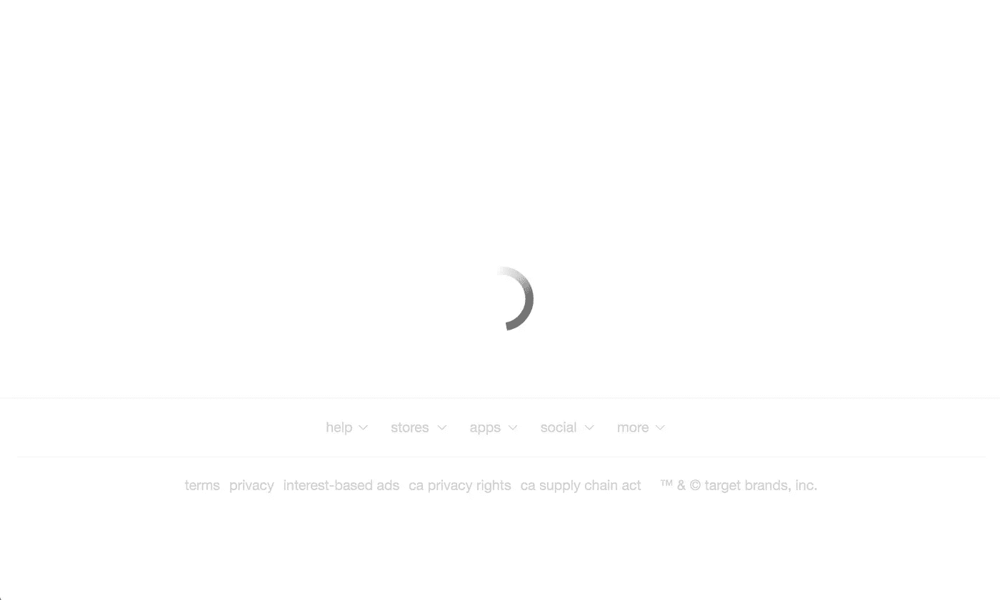
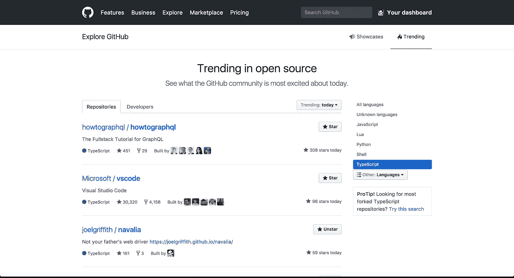
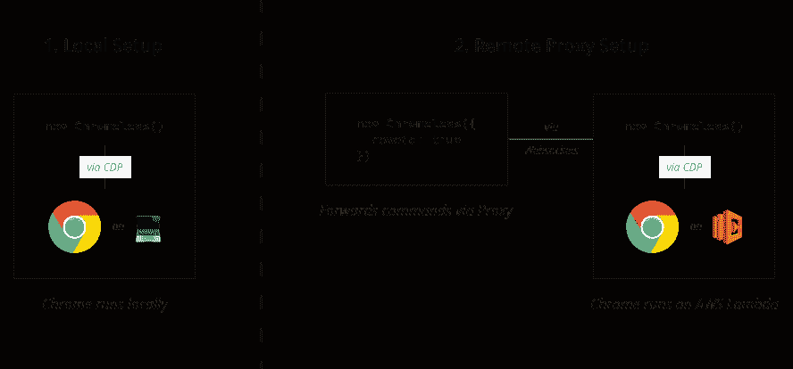
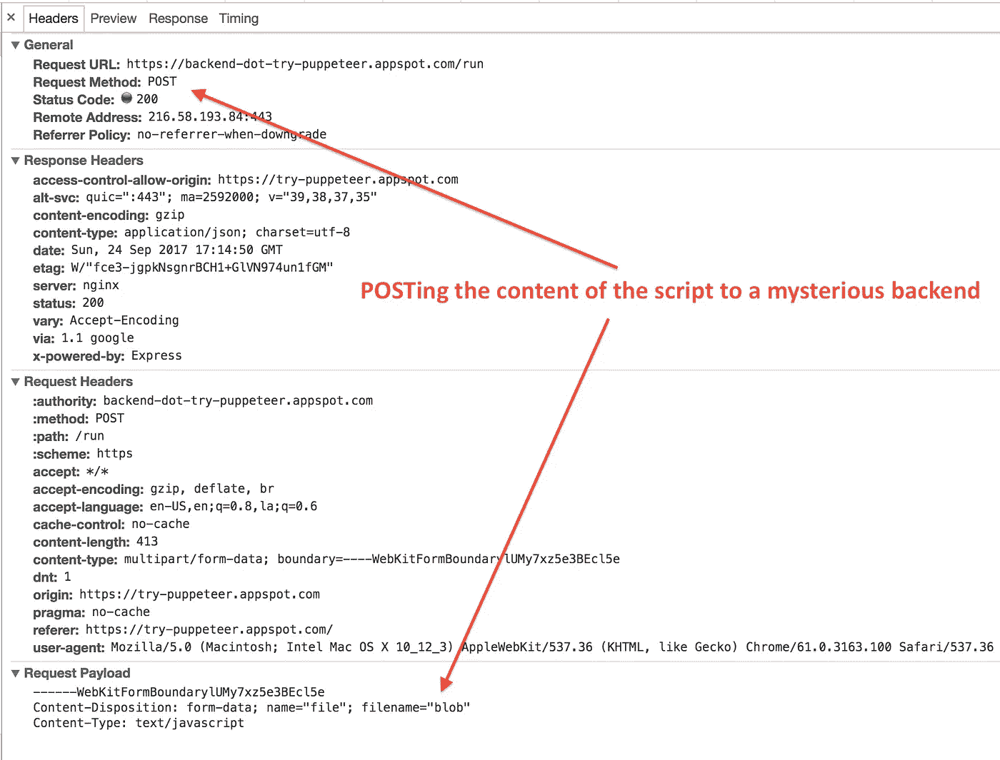
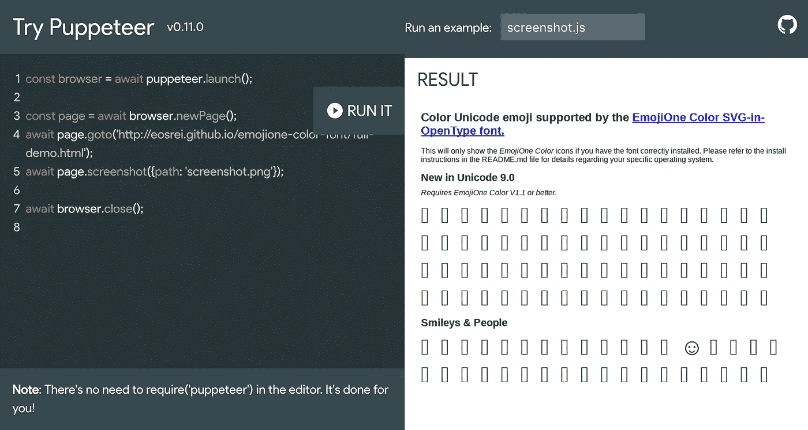

# 比你想知道的更多关于无头浏览器

> 原文：<https://medium.com/hackernoon/more-than-you-want-to-know-about-headless-chrome-31f6b3b06d82>


> 你们的科学家太专注于他们能不能做到，他们没有停下来想一想他们是否应该。

无头的 Chrome 是大张旗鼓地宣布的。它的泄露导致了[维护者设置关闭](https://groups.google.com/forum/#!topic/phantomjs/9aI5d-LDuNE)、[新包出来](https://github.com/graphcool/chromeless)，甚至[新创公司推出](https://browserless.io)(完全披露:最后一个环节是我自己主动的)。如果你经常访问黑客新闻，那么这些都不会让你感到震惊。

虽然并不是所有的事情都像这些重大变化一样完美。PhantomJS 是一款无头浏览器，由于上述原因最近被弃用，它确实有自己的问题。它的 API 背后也有很多的成熟和历史，而且它包括了自己的库，可以开箱即用，这使得它很容易上手。相比之下，目前有两个主要的无头 Chrome 库，标志着一个已经破裂的生态系统([尽管希望不会持续太久](https://github.com/graphcool/chromeless/issues/235))。只有一款捆绑了 Chrome 的一个版本，保证能与它一起工作，尽管代价是灵活性。尽管如此，所有主要的开源无头库都要求迁移到无头 Chrome(见[这里](https://github.com/segmentio/nightmare/issues/1092)和[这里](https://github.com/ariya/phantomjs/issues/14954))。

通常我倾向于从远处观看这样的事件，但命运让我被 GitHub 和 Google 的广告吞没了。

# 我的旅程

在这一点上，你可能想知道我到底是谁。我不为谷歌工作，也不为 graph.cool 工作，也不为任何与无头浏览器游戏有重大利害关系的人工作。我确实有一些其他人，包括那些列出来的人可能没有的东西:在用户方面感受到的过多的经验和挫折。我个人已经与 PhantomJS 缺少的 [JavaScript](https://hackernoon.com/tagged/javascript) API，必须通过它执行的古怪测试，以及调试我的方法进行了多次斗争。我已经在战壕里待了将近五年，而且还在继续。

那么，我是如何在这一片喧嚣中结束的呢？嗯，大约 4 个月前，我在写一个兼职项目，非常需要某种网络驱动程序。和其他人一样，我也在做一个网页抓取器，上面有价格、标题和产品描述，用户可以通过 URL 输入提交。手持 [cheerio](https://github.com/cheeriojs/cheerio) 包；我要“扰乱”礼品登记处的业务。在我遇到 Target.com 之前，一切都进行得很顺利。你可能不知道，Target 运行的是众所周知的单页面应用程序，这意味着他们的 HTML 中几乎没有任何内容，而是依靠 JavaScript 来执行所有的网站操作。这意味着没有任何一个啦啦队长能把我从即将到来的灾难中拯救出来。



Target with JavaScript disabled :(

好的。太好了。如果我想在我的站点中处理 Target，我也这样做了，那么我必须执行一个 JavaScript 运行时来完全“加载”他们的页面。被 PhantomJS 和它的迟钝烧了无数次，我选择用 Chrome 代替。在这个时间点上，headless Chrome 是最近才发布的，当然也没有像 puppeteer 或 chromeless 这样出色的库。那么工程师应该做什么呢？当然，这是为了改变你的应用程序，解决问题！最终产生了一个叫做[纳瓦拉](https://github.com/joelgriffith/navalia)的包。我在这方面取得了一些成功，甚至有几天在 Github 的 TypeScript 趋势排行榜上名列第三。

**我成名的 15 分钟**



Look ma! #3!

这引起了 graph.cool 的优秀员工的注意，他们问我是否愿意帮助他们做一个名为 chromeless 的项目，因为我获得了一些关注。在经历了一些内在的道德困境后，我决定加入 graph.cool 的 chromeless 项目，开始贬低 Navalia 的过程(没关系，它在 JavaScript 年代活得很久)。我强烈地感觉到我们应该团结起来做一个了不起的项目，而不是三四个平庸的项目。当然，正如 JavaScript 所希望的那样，Google 随后推出了他们的木偶项目。有了与 chromeless 和 navalia 几乎相同的 API，我们现在在无头库军备竞赛中有了一个新的竞争者。

这就把我们带到了现在的位置:两个库和一些在云基础设施中执行它们的方法。让我们仔细看看这两个库和它们的区别因素。

# 无铬的

有些人可能不太熟悉 Chromeless，它不仅是一个用于驱动无头 Chrome 的丰富 API，还提供了一个如何在生产/CI 环境中执行无头工作的处方。他们的观点很吸引人:不用在你自己的基础设施中运行和管理二进制文件，只要在 AWS lambda 中就可以了。



Diagram for how to execute chromeless locally and in AWS

到目前为止，对于如何在托管环境中设置无头浏览器，还没有很好的解决方案。Chromeless 能够做到这一切，部分是因为这个[包](https://github.com/adieuadieu/serverless-chrome)的努力(后面会有更多)。

为了方便与 Chrome 通话，chromeless 使用了 [chrome 远程接口](https://github.com/cyrus-and/chrome-remote-interface)。这个项目抽象出了制作自己的 web 套接字客户端、建立连接和实现所有必要协议的痛苦，以便成功地试验 chrome。需要强调的是，web socket 是进入 Chrome 的唯一接口，在某种程度上，你的堆栈*将*必须打开一个 web socket 连接。

使用 chrome-remote-interface 的一个大缺点是，it 和 chrome 仍然会频繁地发布突破性的改变，因此你的 Chrome 二进制文件必须与你正在使用的协议完全一致。这是因为远程协议不支持混合版本，正如在他们的常见问题解答[这里](https://chromedevtools.github.io/devtools-protocol/)中读到的。

在我看来，chromeless 确实有一个非常优雅的 API。

# 我💖那些锁链

```
const screenshot = await chromeless
    .goto('https://www.google.com')
    .type('chromeless', 'input[name="q"]')
    .press(13)
    .wait('#resultStats')
    .screenshot()
```

这些花哨的链接操作是通过 Promise chaining 带给你的，*的 awa 等待*直到调用一个`then` -able(这是`async/await`为你做的)，然后执行操作集合。这个 API 使它与 lambdas 很好地结合在一起，因为这个操作集合实际上被发送到 lambda 调用并立即执行，而不是单独执行每个操作(这使得工作流更加冗长)。如何实现这种批处理操作的主题相当吸引人，可以在这里找到源代码[。](https://github.com/graphcool/chromeless/blob/master/src/queue.ts)

总结为所有你撇油的要点:

**优点**

*   使用链式操作的优秀 API。
*   将您的测试/应用过渡到云平台的规定方式。
*   由于依赖关系，在 Chrome 版本上有些灵活。

**缺点**

*   由于 chrome 远程接口的使用，API 可能无法与 Chrome 的最新版本保持一致。
*   没有谷歌的支持。

# 操纵木偶的人

正如我之前提到的，谷歌在 chromeless 之后不久发布了他们的库[木偶师](https://github.com/GoogleChrome/puppeteer)。虽然这些 API 非常相似，但实际上在实现上有很大的不同，这可以根据您的需求改变您选择的库。

**木偶师的 API**

```
const puppeteer = require('puppeteer');

(async () => {
  const browser = await puppeteer.launch();
  const page = await browser.newPage();
  await page.goto('https://example.com');
  await page.screenshot({path: 'example.png'});

  await browser.close();
})();
```

由于缺少链式操作，这使得 puppeteer 更难在无服务器类型的环境中运行。当然，他们自己的[游戏平台](https://try-puppeteer.appspot.com/)通过将脚本直接发送到服务器执行来绕过这个问题。

**木偶人的游乐场**



由于这种 API 设计，它不太适合 AWS 的 lambda 方法，因为浏览器实例在被收集之前需要“逗留”一段时间。你可以从谷歌的做法中获得灵感，上传你的脚本让 AWS 执行，但是你仍然需要克服[个消息限制。](https://github.com/graphcool/chromeless/issues/114)

木偶戏采用了不同于 chromeless 的方法，因为它不使用 chrome 远程接口包。相反，它实现了协议本身:启动 web socket 客户端并封送消息及其响应。这看起来像是重新发明轮子，因为 chrome 远程界面会处理所有这些事情。然而，与 chromeless 相反，puppeteer 自带 Chrome 二进制文件，保证能与你安装的库一起工作。如果您需要一个保证 API 工作的锁定包，这是一个可靠的选择。不过，这里的成本可能不小，因为您依赖于包的维护者保持他们的协议和 API 是最新的。由于这是由谷歌支持的，这种情况很有可能会一直存在，尽管谷歌因任何原因放弃项目而闻名。

对于我们的撇油朋友，这是木偶师的概要:

**优点**

*   锁定的 API 和 Chrome 二进制。
*   由 Chrome 的发行商谷歌提供支持。
*   [全功能 API](https://github.com/GoogleChrome/puppeteer/blob/master/docs/api.md#) 覆盖大部分用例。

**缺点**

*   潜在的协议滞后，因为他们手动维护它，而不是依赖它。
*   更“闲聊”的方法，因为它们的 API 不是可链接的。
*   在生产环境中设置 it 需要克服一些障碍。

我希望这已经给了你一些关于库决策的指导，因为当把我们的代码发布到生产或持续集成环境中时，事情会变得更加复杂😢

# AWS lambda 上的铬

在我们开始谈论在 AWS lambda 上获得无头 Chrome 之前，让我们先来回顾一下它们的限制，这里是(我已经将它们过滤为适用于 Chrome 的约束):

*   内存分配范围从 128mb 到 1536mb。
*   512 MB 的临时磁盘容量(“/tmp”空间)。
*   每个请求的最长执行时间为 5 分钟。
*   [调用](http://docs.aws.amazon.com/lambda/latest/dg/API_Invoke.html)请求体有效负载大小(请求响应/同步调用)为 6mb
*   [调用](http://docs.aws.amazon.com/lambda/latest/dg/API_Invoke.html)请求体有效负载大小(事件/异步调用)为 128kb。
*   并发执行(参见[λ函数并发执行](http://docs.aws.amazon.com/lambda/latest/dg/concurrent-executions.html)):1000
*   Lambda 函数部署包大小(压缩。zip/。jar 文件):50mb
*   可以压缩到部署包中的代码/依赖项的大小(未压缩。zip/。jar 大小):250mb

要让 Chrome 在这些类型的约束下运行，你首先要做以下事情，或者依靠其他人来做:

*   编译 [headless Chromium shell](https://cs.chromium.org/chromium/src/headless/app/) 的非调试版本，当 gzipped 压缩时，它产生的二进制文件不到 44 MB。
*   在 Chrome 代码库中从`/dev/shm` 到`/tmp`重写 [tmpfs](https://en.wikipedia.org/wiki/Tmpfs) 😨

还有几个步骤我不会浪费时间在这里详述，特别是因为它们在以下地方有很好的记录:

*   [为 AWS 设置无铬合金](https://github.com/graphcool/chromeless/tree/master/serverless)
*   [为 AWS 做 Chrome 设置的人为 chromeless 做了设置](/@marco.luethy/running-headless-chrome-on-aws-lambda-fa82ad33a9eb)。

## AWS lambda 优势

现在，这可能看起来令人难以置信的复杂和痛苦，在某种程度上确实如此。然而，[lambda 在自由层](https://aws.amazon.com/lambda/pricing/)中非常便宜，并且可以很好地水平扩展。以这样的成本和规模，你可以在几秒钟内执行数量惊人的功能测试。

> 在 [Graphcool](https://www.graph.cool/) 的案例中，这将测试持续时间从大约 20 分钟减少到了几秒钟。

如果规模和规划是你不确定的事情，那么 AWS 方法是一个很好的方法。您可以轻松地运行 1 次调用，最多 1000 次，而不会有太多麻烦或变化。

## 缺点

当然，对于不透明的技术，事情总是有两面性。第一个主要的痛点是需要自己维护 Chrome 二进制文件，因为你必须把它拼凑起来才能在 lambdas 中运行。如果越来越多的人开始使用 lambdas 做非标准的事情，比如无头的 Chrome，这种情况可能会改变。由于 lambdas 的存储和时间也非常有限，所以像字体和长时间运行的工作流这样的问题是不可避免的。即使考虑到这些缺点，lambdas 仍然可能相当古怪，正如这里的、这里的和这里的所示。

别忘了我们的撇油器，这是你们渴望的子弹:

**优点**:

*   代码的大规模扩展和并行化。
*   在 AWS 和对应的免费层上运行的成本较低。
*   存在专门关注这一点的包。

**缺点:**

*   [复杂而脆弱的设置](https://github.com/adieuadieu/serverless-chrome/issues/68)。[可能要编译 Chrome](https://chromium.googlesource.com/chromium/src/+/master/docs/linux_build_instructions.md) 。
*   [缺少字体](https://github.com/graphcool/chromeless/issues/43)、[表情符号](https://github.com/graphcool/chromeless/issues/280)和低[调试性](https://github.com/graphcool/chromeless/issues/180)。
*   [长时间运行或复杂设置的下限](https://github.com/adieuadieu/serverless-chrome/issues/68)。
*   轻松挂出[高额账单](https://github.com/graphcool/chromeless/issues/227)。
*   [1 到 2 秒的启动开销](https://github.com/adieuadieu/serverless-chrome/issues/41#issuecomment-317989508)。

# Docker 上的铬合金

如果 AWS 由于其缺点而不能满足你的需求，那么在 docker 容器上运行 Chrome 可能正合你的胃口。这相对简单，因为有大量的 docker 文件可供使用。甚至[木偶师](https://github.com/GoogleChrome/puppeteer/blob/master/docs/troubleshooting.md#running-puppeteer-in-docker)也有文件让你去做。这通常会让你摆脱 lambda 的所有限制，因为你可以随意运行脚本，想用多少就用多少。

**Chrome 的 dockerfile 安装示例**

[](https://github.com/ebidel/try-puppeteer/blob/master/backend/Dockerfile) [## ebidel/尝试木偶师

### 在云中运行木偶代码

github.com](https://github.com/ebidel/try-puppeteer/blob/master/backend/Dockerfile) 

运行你自己的 docker 容器的好处是，你可以自由地使用任何托管提供商(只要他们允许或使用 docker ),并且可以根据你的需要扩展负载。当然，你失去了 lambdas 提供的所有其他好处，即自动伸缩特性，这在标准云提供商中是一件棘手的事情，因为你不仅要平衡 http 请求，还要平衡 web 套接字连接。docker 方法也是危险的，因为你仍然会遇到丢失字体和其他缺点。

我想要表情符号🔥



Never realized there were so many square box emojis…

docker 方法的另一个主要注意事项是确保脚本在干净的隔离环境中运行。尽管 Chrome 有一种创建匿名档案的方法，但是很少有库支持它。这大致意味着，你必须在这个容器中围绕 Chrome 编写一些处理程序，以确保新目标获得一个干净的上下文(阅读:中间人所有 web socket 消息)。呀！

**优点:**

*   完全控制它如何运作。
*   在您自己的基础架构或其他云上运行，没有任何限制。
*   有很多很多的 Dockerfile 可以给你灵感。

**缺点**:

*   不得不用新版 Chrome 手动维护 docker 容器。
*   缺少字体和其他缺点。
*   除非库支持，否则脚本不会独立运行。

# 无浏览器的 Chrome

现在，在我过多地进入[无浏览器](https://browserless.io/)之前，我想完全公开我是它的创造者。正如你可能已经注意到的，我喜欢发现没有人考虑过的问题，并看到无头 Chrome 在服务提供商方面的问题。结束披露。

回顾我的小礼物注册应用程序，无论是 Docker 还是 AWS lambdas 都不能满足我的要求，因为我需要他们没有的功能。表情符号是必须的，干净的隔离是必须的，因为任何人都可以使用它，我不想把所有的时间都花在维护云服务提供商的 Chrome 上。这就是无浏览器诞生到这个世界上的原因。

无浏览器真的位于 docker 的顶端，但是也提供了一些其他的特性。它可以观察 Chrome，当它变得迟钝时会重启它，对各种语言和表情符号都有很好的支持，并且几乎可以与任何一个库兼容:

**🎉表情符号！**


Remember that puppeteer picture? This is what it should have looked like.

这并不是说它没有缺点。首先，这可能比你自己运行一个 docker 容器花费更多。如果你处于“我不知道我需要多少规模”的困境中，那么它可能也不适合你。在远程位置调试浏览器工作仍然存在挑战，但这些通常在所有提供商之间共享。

**优点:**

*   无需维护或托管。
*   字体和表情符号只是工作。
*   Chrome 保持高性能，脚本在它们自己的浏览器环境中运行。
*   为无头 Chrome 定制。

**缺点:**

*   可能比替代品更贵。
*   不能像 AWS 那样自动缩放。
*   不如其他 docker 图像便携。

# 前方是什么

尽管我在 web 开发的这一部分有些磕磕绊绊，但我对迄今为止的劳动成果感到非常兴奋，并对未来的道路充满期待。我认为，为了保持最佳实践与时俱进，我们还需要传播大量的知识。为此，我很高兴地宣布，我将建立一个网站，收集这些新图书馆的最佳实践、酷想法和食谱，以及 headless arena 中的所有更新。请密切关注它的揭示。

最后，我欢迎您对以上任何内容的想法、反馈和评论。如果我犯了严重的错误，或者你对无头浏览器有什么担心，请告诉我。在那之前，我们网上见！