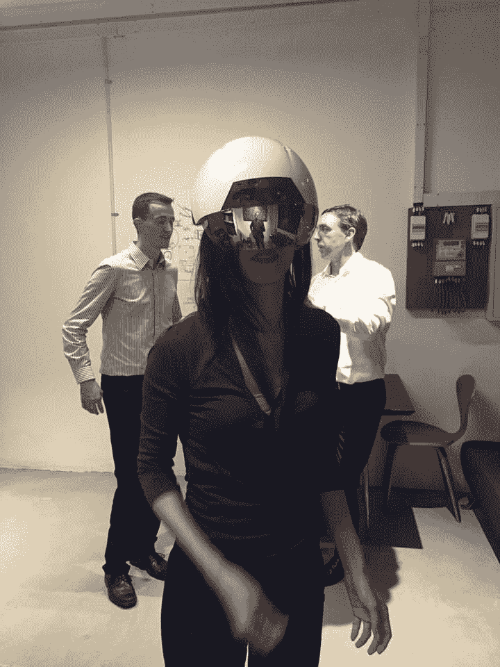
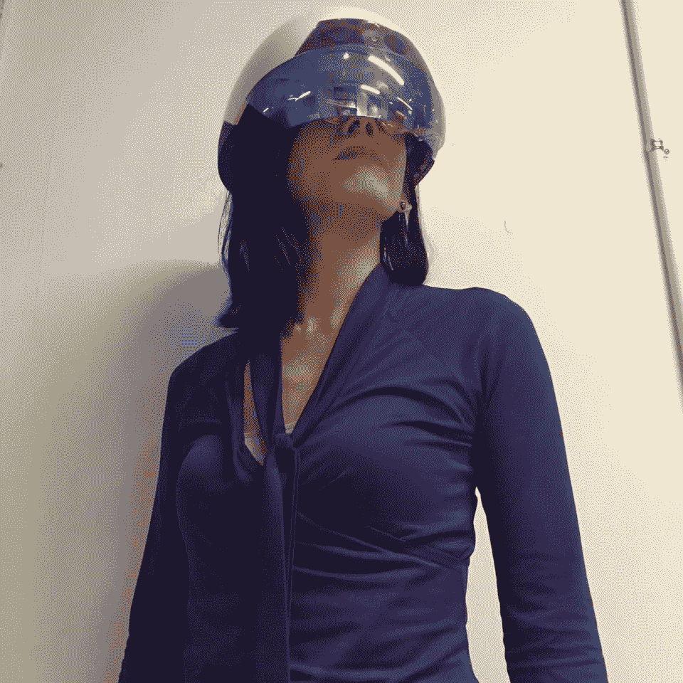
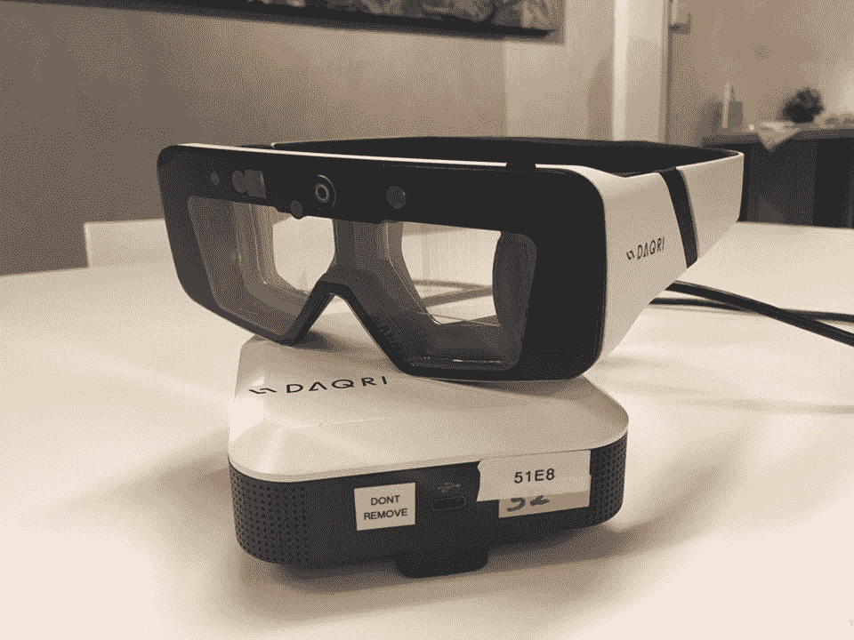

# 借助 DAQRI 的英特尔智能头盔，变身为一名增强的人类工作者

> 原文：<https://medium.com/hackernoon/morph-into-an-augmented-human-worker-with-daqris-intel-powered-smart-helmet-d4449920d2>

AI 和[技术](https://hackernoon.com/tagged/technology)接管人类的工作？

不完全是。戴上 DAQRI 的智能头盔，你就知道为什么了。它让你成为一名“增强人类”工作者。这种可穿戴设备的目标是企业而不是消费者，它试图通过帮助公司改善工作流程以及在工厂车间或建筑工地排除故障来帮助[提高](https://hackernoon.com/tagged/boost)员工的工作效率，从而获得巨大的投资回报。

DAQRI 的智能头盔配有一个附有护目镜的安全帽，由英特尔的 M7 芯片和 RealSense 摄像头传感器提供动力。

戴上头盔，它提供了如此多的人类技术功能，我惊讶于它是如此的轻和舒适。

The author trying out DAQRI’s Smart Helmet in Singapore

它的人机界面将原理图叠加到真实的物体上，并允许模式识别、头部跟踪等——这对需要在工厂车间排除故障的工人非常有用。

它还赋予你“x 光”般的视觉来透视和观察物体内部。可以提醒工人注意危险区域，确保他们的安全，以及哪些管道或工厂设备需要注意。

整个体验非常流畅，一点也不觉得笨重或花哨。虽然你需要一些时间来适应菜单导航，但只需要很少的时间就能适应。

优点是头盔可以让你不用手。你所需要的只是跟随头盔投射到你视野中的指令，以及你用眼睛和头部运动选择菜单上下一步的能力。

切换到菜单上的下一项，我就可以观看并参与人手操作的模拟。这个手术室应用程序是将增强现实引入医疗培训的一个很好的方式。

我很想看看应急人员和执法人员如何使用智能头盔。

除了智能头盔，我还试戴了 DAQRI 的原型企业智能眼镜。重量轻，可用于汽车、航空航天和医疗保健等许多行业。

DAQRI’s prototype enterprise glasses. Photo credit: Vanessa Radd

DAQRI 的智能头盔和 AR 眼镜既提供了有用的在职应用，也提供了现实生活中的应用。

我只能说，工作的未来非常美好。

关于作者
推特 [@vanradd](http://www.twitter.com/vanradd) 联系人:Vanessa(at)the vara(dot)com

Vanessa Radd 被评为全球前三大增强现实影响者，并且是 XR 联盟的创始成员。**XR****联盟**建立技术联盟，推动行业在 VR/AR/XR 领域的发展 [@xrforce](http://www.twitter.com/xrforce) 。Vanessa 还是全球 VR AR 协会新加坡分会的主席。

DAQRI 头盔首次在新加坡由 XR 联盟与合作伙伴共同举办的私人活动中展出。###

DAQRI 智能头盔
[https://www.youtube.com/watch?v=fCAShzXhBCI](https://www.youtube.com/watch?v=fCAShzXhBCI)的制作视频

> [黑客中午](http://bit.ly/Hackernoon)是黑客如何开始他们的下午。我们是这个家庭的一员。我们现在[接受投稿](http://bit.ly/hackernoonsubmission)并乐意[讨论广告&赞助](mailto:partners@amipublications.com)机会。
> 
> 如果你喜欢这个故事，我们推荐你阅读我们的[最新科技故事](http://bit.ly/hackernoonlatestt)和[趋势科技故事](https://hackernoon.com/trending)。直到下一次，不要把世界的现实想当然！

