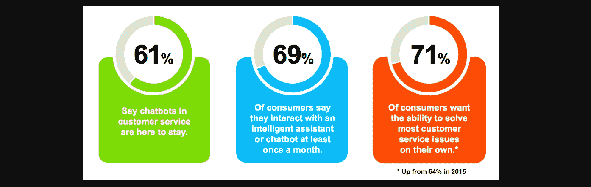
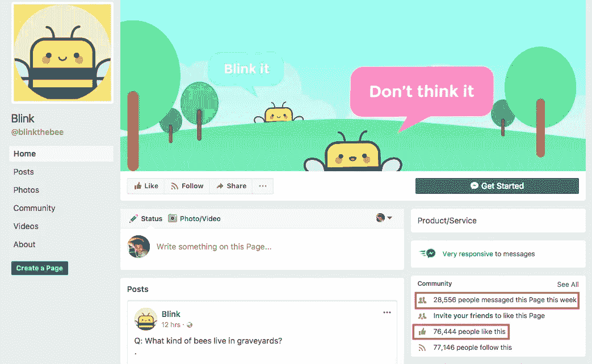
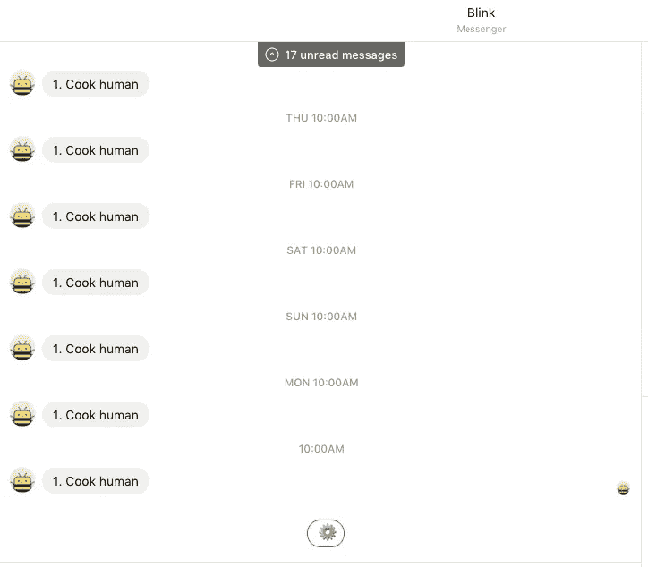

# 开发聊天机器人最有效的三步程序

> 原文：<https://medium.com/hackernoon/most-effective-3-step-program-to-developing-a-chatbot-8cf05f36a767>

## 您的企业需要一个聊天机器人，现在您可以拥有一个了。



([img src](https://www.bulldogreporter.com/human-touch-not-so-much-44-of-consumers-say-they-prefer-chatbots-for-customer-service/))

> 第一步:使用现有的众多服务中的一种来构建一个聊天机器人。
> 
> 第二步:删除你刚刚构建的所有东西
> 
> 第三步:你成为聊天机器人，开始与消费者交谈

不，这不是恶作剧。如果你决定跳上人工智能、聊天机器人、自然语言处理的潮流，为你的企业建立一个聊天机器人，这就是你真正需要做的。

想要一个极其复杂、最先进的神经网络来处理客户通过脸书聊天传来的信息吗？希望系统具有认知处理能力，以便理解、识别和分析自然语言信息？希望它足够强大，能够分离和处理查询，将其与历史消息模式和体验进行比较，并最终发送回友好、个性化的自然语言响应？猜猜看，你已经具备了所有这些能力！

聊天机器人并不新鲜。它们已经存在多年了。直到脸书开放了它的聊天机器人平台，所有的企业才疯狂地需要一个聊天机器人。为什么？因为一个普通的脸书用户每天都会在脸书上花将近一个小时。问题？今天的企业在构建聊天机器人时，并没有首先弄清楚他们为什么需要聊天机器人，以及他们的用户最终将使用他们的聊天机器人做什么，或者他们期望从中获得什么。例如，看看这个脸书聊天机器人。



76，000+人喜欢 Blink，仅上周就有近 30，000 人发消息给它，然而，当涉及到我时，我认为他们的机器人试图强迫我吃人肉。



17 条未读信息，然而，每天早上，他们都给我发来“烹饪人类”的提醒。

## 为什么你应该有一个机器人，更重要的是，什么时候？

看，我不否认有一个聊天机器人的必要性。企业对聊天机器人如此着迷是有原因的。一对一的交互是不可扩展的。整句话中唯一相关的词就是——“可伸缩的”。所以，在你决定建造一个聊天机器人之前，你需要问自己一个基本的问题——

> 我是否已经达到无法独自处理问题的程度？

如果答案是一个响亮的是，那么当然，继续为自己建立一个机器人。但建造它就是为了做到这一点。正因为如此。

> 与消费者对话，因为你不能再处理交通。像现在一样进行对话。永远不要在你提供的让你的业务发展到这一步的体验上妥协。

当你的第一步是建立一个聊天机器人时，你完全错过并跳过了最关键的一步——与你的机器人进行预期的对话。

大多数聊天机器人无法保持互动的原因是，许多营销人员都面临着“*不知道他们的消费者想要什么*”的问题不要犯那个错误。

了解你的消费者想要什么。

听听你的消费者在说什么。

了解什么让他们满意，更重要的是，什么让他们生气。

开始理解这些对话中的模式。

然后，也只有这样，才能开始为你的机器人设计对话流程。

## 一个例子

让我们假设你想围绕度假目的地/套餐开展业务(*或者你已经有了一个*)。

人们来到你的网站后会做什么？有可能，这些事情之一:

1.  看看不同的度假目的地，不同目的地的价格，每个套餐中包含的活动种类，以及度假套餐的持续时间。
2.  搜索特定的目的地，并在选择之前比较各种可用的软件包。

现在，如果你试图为你的企业建立一个聊天机器人，你很可能会遵循这个确切的路线。

第一步:机器人会问用户他/她想去哪里？

第二步:从哪里开始？

(出于显而易见的原因，步骤 1 和 2 可以互换)

3 .日期

第 4 步:显示结果和预订按钮。

你的机器人可能会这么做，不是吗？

> 这种方法的问题在于，你完全扼杀了对话的灵魂。

聊天不应该遵循你的网站的工作路线。聊天本质上应该是对话式的。如果你和你的潜在消费者交谈，你的观众可能会问你这样的问题:

*   从<*市 X* >驱车可达的度假目的地有哪些？
*   在<*城市 X* >有宠物友好型酒店吗？
*   我正在寻找一个为期 3 天的假期，最好是在山区。你对此有什么选择吗？
*   我正在寻找在<*城市 X* >的酒店，该酒店在< *日期* >也有会议室
*   <*让你的想象驰骋* >

如果你进行了这样的对话，你就能更好地开发技术产品，解决消费者的疑问。通过这样做，你可以提供更好的客户体验，并可能更好地提高你的转化率。相反，你决定建立一个聊天机器人，做你想让它做的事情，而不是你的消费者想要的机器人。

这是一个基本的错误，但也是非常关键的错误。

技术是为了帮助你超越我们这些渺小的人类无法处理的程度。如果你试图在这一点之前解决问题，你很可能会错过问题的开始。

> 如果你这样做，你唯一会增加的就是你的错误。

# 今天到此为止；明天见！


```
I am Abhishek. I am here... there.... Everywhere...[**Medium**](/@abyshake) **|** [**Twitter**](http://twitter.com/@abyshake) **|** [**Facebook**](http://facebook.com/abyshake) **|** [**Quora**](http://bit.ly/abyshake) **|** [**LinkedIn**](http://in.linkedin.com/in/abyshake) **|** [**E-mail**](mailto:mail@abyshake.com)
```

[](https://upscri.be/a5ccb9/)

Click here to join the mailing list.