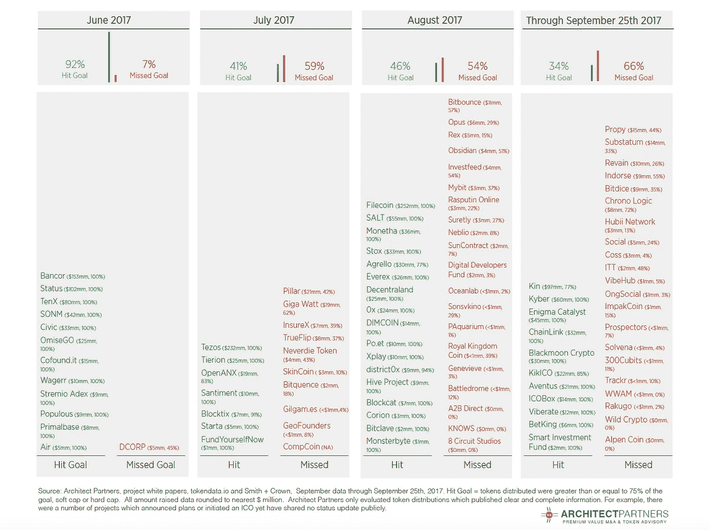

# 大多数 ico 失败:两个世界的故事

> 原文：<https://medium.com/hackernoon/most-icos-fail-tale-of-two-worlds-d1ab7625ff66>

并非一切都是美好的

过去 6 个月，首次发行硬币的数量激增。然而，一切并不像看起来那么美好。对代币发行活动的细致评估讲述了两种截然不同的发行者经历。Architect Partners 评估了 100 多份项目白皮书，并通过 [Smith + Crown](https://www.smithandcrown.com/) 和 [tokendata.io](http://www.tokendata.io) 发布的数据进行了补充，以超越令人窒息的头条新闻。

**成功**

是的，有许多成功的令牌分发。自 2017 年 6 月初以来，已有 46 个项目根据其既定目标完成了 ICO，筹集了超过 16 亿美元的资金。这些项目平均筹集了 3600 万美元的资金，尽管异常值扭曲了数据，因为平均筹集额为 1900 万美元。很明显，这些项目显示出象征性购买者的良好接受度。

**故障**

然而，大多数 ico 都未能实现目标，有时甚至是悲惨的。绝大多数发行者通过规定的目标、软上限或硬上限来表明他们的代币发行目标。我们只是评估了最终结果和既定目标。如果发行者实现了超过 75%的预期代币发行，我们认为它是成功的，低于这个水平，就是失败的。

代币发行市场迅速变得更加困难。2017 年 6 月，只有一个项目没有达到他们的目标。然而，接下来的几个月讲述了一个截然不同的故事。从 2017 年 7 月 1 日到 2017 年 9 月 25 日，51 个 ico 被寄予厚望，但未能实现自己的目标。在此期间，所有 ico 的故障率高达 59%。

有些人可能会争辩说，即使失败对项目也是有益的，因为它筹集了资金，允许项目和团队愿景的启动或继续发展。在某些情况下，这是一个非常合理的论点，但是，在许多情况下，实际发行的令牌的价值主张受到严重损害，也许是永久性的损害。此外，从失败的代币分配中筹集的资本水平正在迅速下降，从 2017 年 7 月的 400 万美元中值降至 2017 年 9 月的 200 万美元，21 人(占总数的 43%)通过努力筹集了 100 万美元或更少。

**图表:令牌分发成功率**

下表详细列出了每个评估项目及其结果:

**Token Distribution Success Rate**

**教训与未来**

我们清楚地看到了 ICO 市场走向成熟的第一步。虽然每一次代币发行的成功和失败都需要自己的分析，但很明显，市场正在做市场最擅长的事情:做出有效的决策。这并不是说所有成功的代币发行都会成为成功的项目，反之亦然，然而，一个明显的两级市场已经通过“群体行为”迅速发展起来。

除了一个更加现实的监管环境(即将到来)之外，我们希望看到质量指标变得越来越重要。这些措施包括:I)在寻求代币发行之前进行仔细和全面的准备，ii)更高级的项目开发，iii)为强大的代币经济提供清晰的基础，iv)强大的项目优势和巨大的市场机会，以及 v)负责执行的团队的质量和凝聚力。换句话说，ICO 市场将需要吸引优质早期投资者的所有重要特征。

特别感谢埃里克·徐的努力。