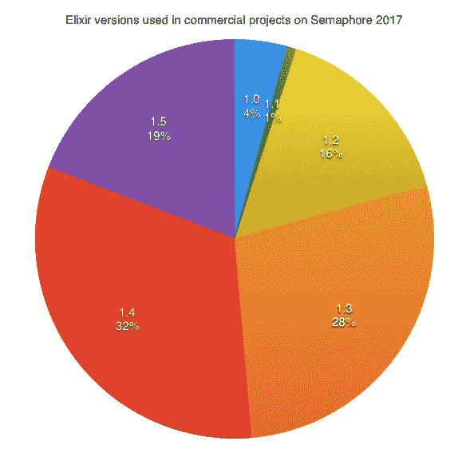
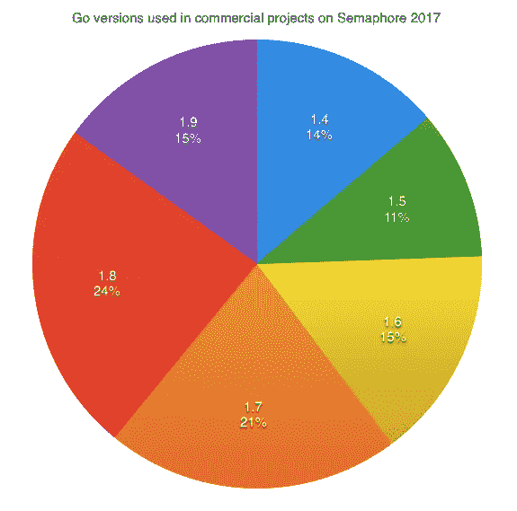
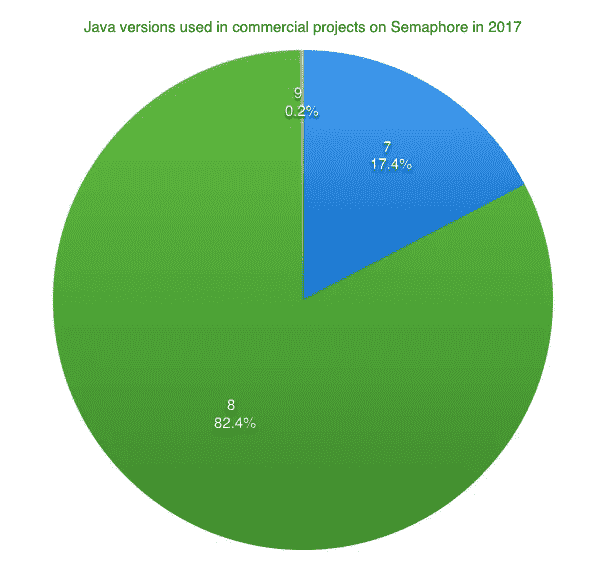
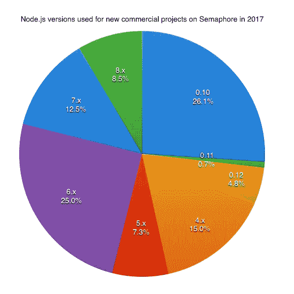
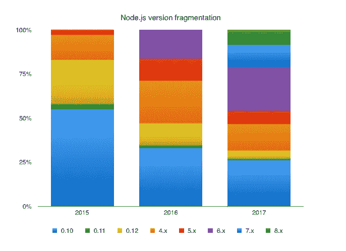
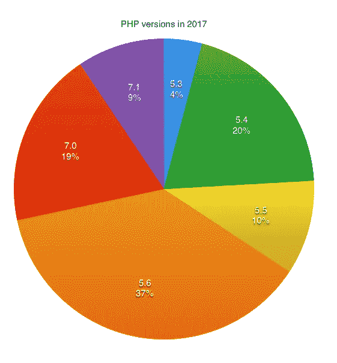
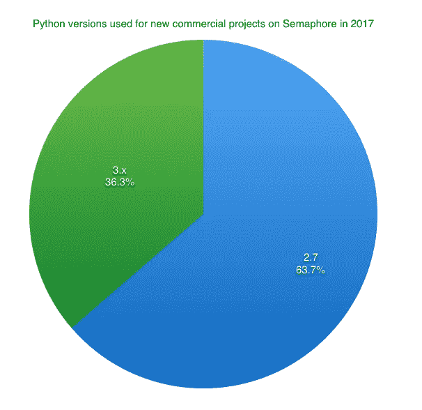
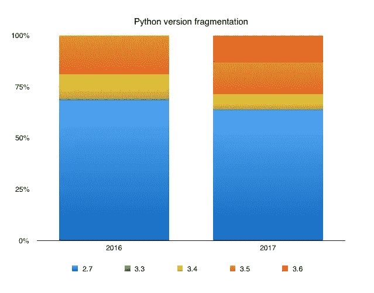
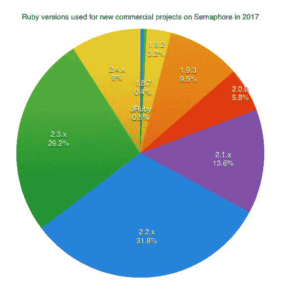
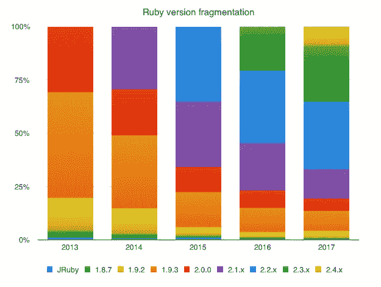

# 2017 年商业项目中使用的最流行的开源语言版本

> 原文：<https://medium.com/hackernoon/most-popular-open-source-language-versions-used-in-commercial-projects-in-2017-82c533346073>

在过去的 3 年里，我们一直在 Semaphore 博客上发布报告，揭示开发者在现实世界的商业应用中使用了某种开源语言的哪些版本。这些数据是基于在[信号量](https://semaphoreci.com)上测试和部署的数千个私人项目。我们现在很高兴向媒体读者呈现我们迄今为止最全面的报告，揭示了关于七种主要开源语言的见解。

# 长生不老药

Elixir 是一门相当年轻的语言，自然几乎所有的项目都是基于它的最新版本。40%的项目使用的是今年发布的 Elixir 版本(1.4 及以上)，而 96%的项目使用的是 2016 年 1 月 1 日发布的不低于 1.2 的版本。

有趣的事实:Semaphore 的许多组件都是作为 Elixir 微服务构建的。你可以阅读我们对导致构建微服务的[技术挑战的想法](https://semaphoreci.com/blog/2017/03/21/cracking-monolith-forces-that-call-for-microservices.html)和一个用 Elixir 和 RabbitMQ 设计微服务的小例子[。](https://semaphoreci.com/blog/2017/03/07/making-mailing-microservice-with-elixir-and-rabbitmq.html)

# 去

Go 开发者喜欢平分他们的馅饼。

[Go 的发布政策](https://golang.org/doc/devel/release.html)规定，在有两个更新的主要版本之前，每个主要的 Go 版本都将得到支持。因此，目前 60%的商业 Go 项目都在使用官方支持的版本。

# Java 语言(一种计算机语言，尤用于创建网站)

大多数项目都是基于 Java 8 的。

Java 9 于 2017 年 9 月发布，但似乎不会在现有项目中得到显著采用。甲骨文[宣布](http://www.oracle.com/technetwork/java/javase/eol-135779.html)Java 8 将是一个长期支持版本，支持到 2022 年，而 Java 9 将不会被指定为长期支持。这一点，加上新的模块化特性(需要一些时间来适应)，可能是影响大多数团队等待下一个长期版本的原因。Java 18.9 LTS 计划于 2018 年 9 月发布。

# 节点. js

在过去几年中，Node.js 运行时发生了很多变化。早期采用的迅速增长，然后放缓，分叉，最后随着新的发布时间表的到来而巩固。因此，现实情况是，几乎三分之一的项目基于过时版本的 Node，而不到 10%的项目使用 2017 年发布的版本(v8 或 v9)。

Node 9 于今年秋天发布，但我们尚未看到大量采用。值得注意的是，截至 3 月份，AWS Lambda 支持 Node.js 版本。

Node.js version adoption 2015–2017

你可以在信号量博客上阅读完整的 [Node.js 版本报告。](https://semaphoreci.com/blog/2017/11/22/nodejs-versions-used-in-commercial-projects-in-2017.html)

# 服务器端编程语言（Professional Hypertext Preprocessor 的缩写）

多年来，PHP 一直是十大最常用的语言之一，它出现在今天大多数可访问网站的服务器端。

大多数项目使用的是 5.6 版本，其有效支持期于 2017 年 1 月 19 日结束。该版本将持续获得安全更新，直到 2018 年底。不再受支持的版本 5、3、5.4 和 5.5 在 34%的项目中使用。这可能是因为从 5.x 更新到 7.x 的过程很复杂。例如，许多致命错误已经被转换为异常，变量和整数处理有许多变化，等等。

19%的 PHP 项目使用 7.0 版本。该版本于 2015 年 12 月发布，其活跃支持期在 1 个月后结束。7.1 版本于去年 12 月发布。到目前为止，只有 9%的项目在使用它。

你可以看看[官方支持的 PHP 版本页面](http://php.net/supported-versions.php?utm_source=semaphoreci&utm_campaign=semaphoreci-blog-php-version-report-2017&utm_medium=link)，了解更多关于不同版本何时发布以及它们的有效支持期的信息。

# 计算机编程语言

Semaphore 去年的 Python 报告在黑客新闻和各种论坛上受到了很多关注[，因为它表明，尽管 Python 3 在 2008 年发布，但超过 70%的商业项目仍然基于 2.7。今年，Python 3 的结果稍微好一点，但也不多。](https://news.ycombinator.com/item?id=12930082)

截至今年 4 月，AWS Lambda 同时支持 Python 3.6 和 2.7。

你可以在 Semaphore 博客上阅读完整的 [Python 版本报告。](https://semaphoreci.com/blog/2017/10/18/python-versions-used-in-commercial-projects-in-2017.html)

# 红宝石

开源进展很快，Ruby 社区以跟上步伐而闻名。超过 85%的项目使用 Ruby 及更高版本。

总的来说，团队一从 1.9.3 迁移到 2.x，迁移到新版本就变得更容易了。

需要注意的重要一点是，版本 2.0 和 2.1 [已经到达生命周期的终点](https://www.ruby-lang.org/en/downloads/branches/)，Ruby 2.2 的停产日期定于 2018 年 3 月 31 日。我们强烈建议升级到新版本，因为旧版本不会收到任何安全更新。

另外需要注意的是，Rails 5 只支持 Ruby 2.2.2 及更高版本。

你可以在 Semaphore 博客上阅读完整的 [Ruby 版本报告。](https://semaphoreci.com/blog/2017/11/08/ruby-versions-used-in-commercial-projects-in-2017.html)

您可能还想看看 [Rails 测试分级器——一个将您的 Rails 测试套件与行业](http://rails.testinggrader.com/)进行比较的工具，以了解您的情况。

您如何跟上新版本并使您的应用程序保持最新？请在评论中告诉我们。