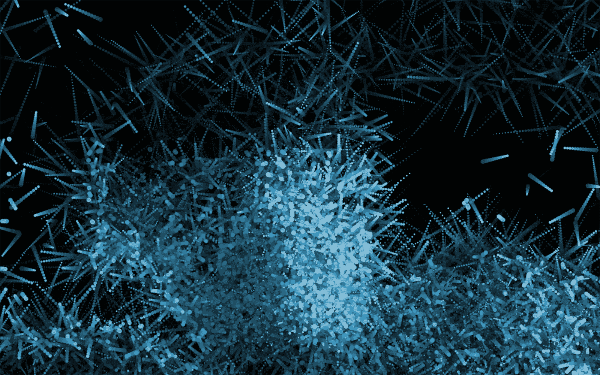
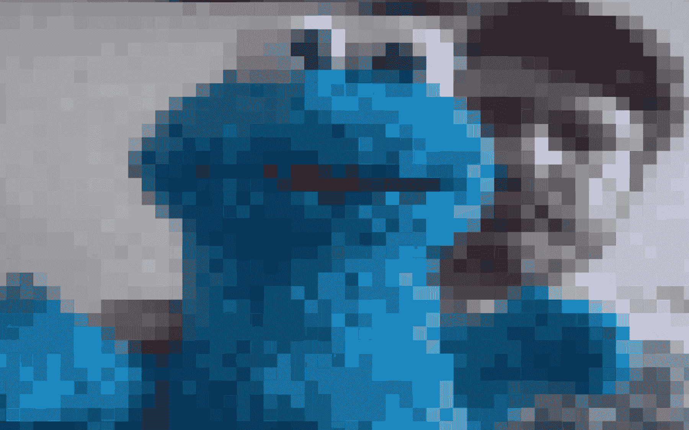
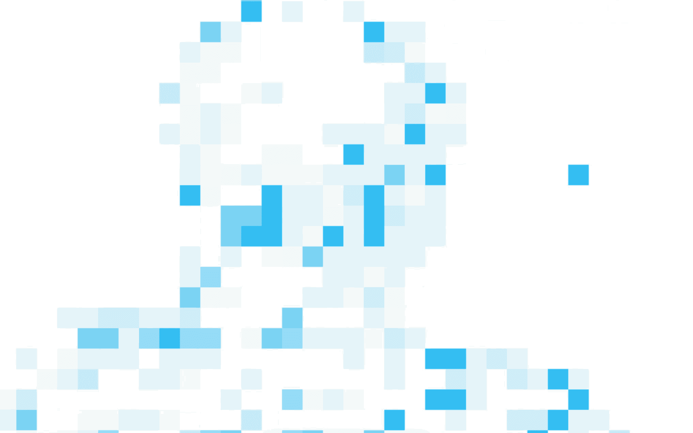

# Javascript 中的运动检测

> 原文：<https://medium.com/hackernoon/motion-detection-in-javascript-2614adea9325>



*制造计算机参见*

*学习纯 javascript 创造性编码系列的一部分。更多* [见此处](/@radarboy3000)**。并在这里得到文件*[](https://github.com/GeorgeGally/creative_coding)**。***

**有很多技术和库可以用来检测和处理相机的运动数据。但是大多数情况下，一个简单的解决方案比你需要的要多。我发现滚动我自己的运动检测代码给了我更好的性能、灵活性和理解。95%的情况下，你只需要这个简单的方法。所以让我们开始吧…**

**我们要使用的技术很简单。我们将前一帧的颜色与当前帧的颜色进行比较。如果它们高于某个阈值，我们可以假设有运动。**

**当然没必要每个像素都比较。这对我们的计算机来说太费力了，而且经常会给系统带来不必要的噪音。因此，我们将使用与上一个教程[相似的技术来创建一个像素化滤镜](https://hackernoon.com/creating-a-pixelation-filter-for-creative-coding-fc6dc1d728b2)。**

**首先，我们需要让您的网络摄像头在浏览器中工作。我不打算深入讨论这个问题。到处都有很多教程。老实说，这没什么意思(还有点罗嗦)。我已经创建了一个可重复使用的 [Javascript](https://hackernoon.com/tagged/javascript) 文件，所以我再也不需要重写代码，甚至不需要费心启动你的网络摄像头……[下面是代码](https://github.com/GeorgeGally/creative_coding/blob/master/js/video.js)。只需将它包含在 html 中，就像处理任何 javascript 文件一样，它会自动创建一个默认大小为 320x240px 的 *video* 元素，该元素通过 css 隐藏。**

**(实际上，我们可以以较小的尺寸绘制它，然后扩大我们的计算，并获得进一步的性能提升，稍后我会向您展示这一点。但是现在让我们保持事情简单。**

**要将视频绘制到屏幕上，我们只需引用视频并使用 canvas *drawImage()* 函数:**

```
**ctx.drawImage(video, 0, 0, w, h);**
```

**现在我们想遍历像素并得到它们的颜色值…**

****

**代码与使用 *getImageData()* 创建[像素化效果](https://hackernoon.com/creating-a-pixelation-filter-for-creative-coding-fc6dc1d728b2)完全相同，除了我们使用的是实时视频:**

```
***// setup canvas*
var ctx = createCanvas("canvas1");// sample the colour of every 50 pixels
var sample_size = 50;function draw(){ *// draw video onto screen*
  ctx.drawImage(video, 0, 0, w, h); *// get the screen's pixels data*
  var data = ctx.getImageData(0, 0, w, h).data; *// loop through rows and columns* **for (var y = 0; y < h; y+= sample_size) {** **for (var x = 0; x < w; x+= sample_size) {** *// the data array is a continuous array of red, blue, green 
      // and alpha values, so each pixel takes up four values 
      // in the array*
      **var pos = (x + y * w) * 4;**

      *// get red, blue and green pixel value* **var r = data[pos];
      var g = data[pos+1];
      var b = data[pos+2];** *// draw the pixels as blocks of colours*
      **ctx.fillStyle = rgb(r, g, b);
      ctx.fillRect(x, y, sample_size, sample_size);** **}
  }**}**
```

****运动测试:****

**为了测试视频中是否有运动，我们现在需要做的就是将我们前一帧的像素值存储在一个数组中，并将这些值与当前值进行比较…如果差值高于某个阈值，那么就有运动。**

****

**我们可以做一个公式来计算 RGB 值的总和，或者看看亮度，但在大多数情况下，我们只需要比较红色值…**

```
***// make an array to hold our old pixel values* **var previous_frame = [];** // choose a brightness threshold, if the old pixel values differs enough then we know there's movement
**var threshold = 50;** // sample the colour every 50 pixels
var sample_size = 50;function draw(){ ctx.drawImage(video, 0, 0, w, h);
  var data = ctx.getImageData(0, 0, w, h).data;
  ctx.background(0);

  for (var y = 0; y < h; y+= sample_size) {

     for (var x = 0; x < w; x+= sample_size) { var pos = (x + y * w) * 4;
      var r = data[pos];
      var g = data[pos+1];
      var b = data[pos+2]; // first check if it's not the first frame, but 
       // seeing of when the *previous_frame* array 
      // is not we empty, and then only draw something if there's 
      // a significant colour difference 
      **if(previous_frame[pos] 
      && Math.abs(previous_frame[pos] - r) > threshold) {**
        ctx.fillStyle = rgb(r, g, b);
        ctx.fillRect(x, y, sample_size, sample_size);
     ** }** *// store these colour values to compare to the next frame* **previous_frame[pos] = r;** }

  }}**
```

**现在你知道了。这就是运动检测的基本原理。非常简洁明了。**

**为了使我们的代码更容易阅读和处理，让我们快速地将运动检测代码放入一个函数中。除了添加一个运动数组来存储所有的运动点及其颜色值，然后返回这些值之外，我们不需要做太多的修改:**

```
**function motionDetection(){ *// create an array to store our motion data*
  **var motion = [];** ctx.drawImage(video, 0, 0, w, h);
  var data = ctx.getImageData(0, 0, w, h).data;
  ctx.background(0);

  for (var y = 0; y < h; y+= sample_size) {

     for (var x = 0; x < w; x+= sample_size) { var pos = (x + y * w) * 4;
      var r = data[pos];
      var g = data[pos+1];
      var b = data[pos+2]; // first check if it's not the first frame, but 
      // seeing of when the *previous_frame* array 
      // is not we empty, and then only draw something if there's 
      // a significant colour difference 
      ctx.drawImage(video, 0, 0, w, h);
      var data = ctx.getImageData(0, 0, w, h).data;
      ctx.background(0);

      for (var y = 0; y < h; y+= sample_size) {

        for (var x = 0; x < w; x+= sample_size) { var pos = (x + y * w) * 4;
           var r = data[pos];
           var g = data[pos+1];
           var b = data[pos+2]; // first check if it's not the first frame, but 
           // seeing of when the *previous_frame* array 
           // is not we empty, and then only draw something if 
           // a significant colour difference there's
           if(previous_frame[pos] 
           && Math.abs(previous_frame[pos] - r) > threshold) {

          // push the x, y and rgb values into the motion array
          **motion.push({x: x, y: y, r: r, g: g, b: b});**
     } *// store these colour values to compare to the next frame* previous_frame[pos] = r; }

  }**return motion;**}**
```

**然后在我们的绘制循环中，我们可以遍历运动数组，并对结果值做一些事情:**

```
**function draw(){ ctx.background(250);
   **var motion = motionDetection();
   for (i = 0; i < motion.length; i++) {

      var m = motion[i];
      ctx.fillStyle = rgb(m.r, m.g, m.b);
      ctx.fillEllipse(m.x, m.y, sample_size, sample_size);** **}**}**
```

**现在让我们开始表演吧。照目前的情况来看，它相当快。但是我们可以让它更快。仔细想想，将视频绘制到整个屏幕上，然后每隔 10 或 20 个像素读取一次，这有点傻，因为我们可以只输入一个较小的视频，然后读取这些像素…所以我们就这么做吧…**

**首先，让我们把视频变得更小…我们将使用 setup()函数来确保视频在我们操作它之前被加载…然后我们只需将视频设置为屏幕大小的比例…**

```
****var scalefactor = 40;****function setup(){
   video.width = w/scalefactor;
   video.height = h/scalefactor;
}****
```

**然后，我们只需要循环输出视频，而不是整个屏幕，看到我们的视频很小，我们的性能会有很大提高。因为我们现在查看视频的每个像素，噪音也有微小的减少。我们还需要将 x 和 y 位置乘以比例因子…**

```
**function motionDetection(){ var motion = []; *// draw the video and get its pixels*
  ctx.drawImage(video, 0, 0, **video.width, video.height**);
  var data = ctx.getImageData(0, 0, **video.width**, **video.height**).data; **// we can now loop over all the pixels of the video**
  for (var y = 0; y < **video.height**; y++) {
    for (var x = 0; x < **video.width**; x++) { var pos = (x + y * **video.width**) * 4;
      var r = data[pos];
      var g = data[pos+1];
      var b = data[pos+2]; if(old[pos] && Math.abs(old[pos].red - r) > threshold) {
        ctx.fillStyle = rgb(r, g, b);
        ctx.fillRect(x * scalefactor, y * scalefactor, scalefactor, scalefactor);
        *// push the x, y and rgb values into the motion array
        // but multiply the x and y values bck up by scalefactor 
        // to get their actual screen position*
        motion.push({**x: x * scalefactor, y: y * scalefactor**, r: r, g: g, b: b}); } old[pos] = { red: r, green: g, blue: b};}
  }

return motion;}**
```

**现在你知道了。一个简单的可重用运动反应代码块。一旦你有了你的运动阵列，尝试附加粒子。**

**注意环境光，它会增加噪音，并相应地上下调整你的阈值。**

**让调整更容易的简单方法是添加一些滑块来调整我们的*阈值* …**

**我喜欢用 [bit101](http://www.bit-101.com/blog/) 的快速设置:[https://github.com/bit101/quicksettings](https://github.com/bit101/quicksettings)*(也可以看看他的* [*lab*](https://bit101.github.io/lab/) *和* [*编码数学*](https://www.youtube.com/user/codingmath?&ab_channel=CodingMath) *视频系列中一些很棒的创意* [*编码*](https://hackernoon.com/tagged/coding) *的例子和技巧)。***

**一旦包含了这个库，就要像这样实例化它:**

```
**var settings = QuickSettings.create();**
```

**然后添加*阈值*和*样本大小*的范围滑块:**

```
***// addRange(label, min, max, start, increment, callback)*
**settings.addRange("threshold", 5, 100, 50, 1, function(value) {
  threshold = value;
});****
```

**另一个经常使用的技术，特别是对于装置，是*背景减除*。代码完全一样。但是，你不是比较前一帧的像素，而是对你的空房间拍一张快照，然后将该图像与你当前的像素进行比较。试着让它运行起来，如果你有困难，我很乐意帮助你，请在评论中或 twitter 上联系我。**

**这就是运动检测所需的全部内容。快乐编码。**

**像往常一样，我的 github 上有完整的代码:[https://github.com/GeorgeGally/creative_coding](https://github.com/GeorgeGally/creative_coding)**

**你可以在这里看到我之前所有的创意编码教程[。](/@radarboy3000)**

****如果你愿意，请跟我来:****

**[**https://www.instagram.com/radarboy3000/**](https://www.instagram.com/radarboy3000/)**

**[**https://twitter.com/radarboy_japan**](https://twitter.com/radarboy_japan)**

**[](https://www.facebook.com/radarboy3000) [## 雷达男孩

### 雷达男孩。145 个赞。艺术、设计可视化、黑客

www.facebook.com](https://www.facebook.com/radarboy3000)**