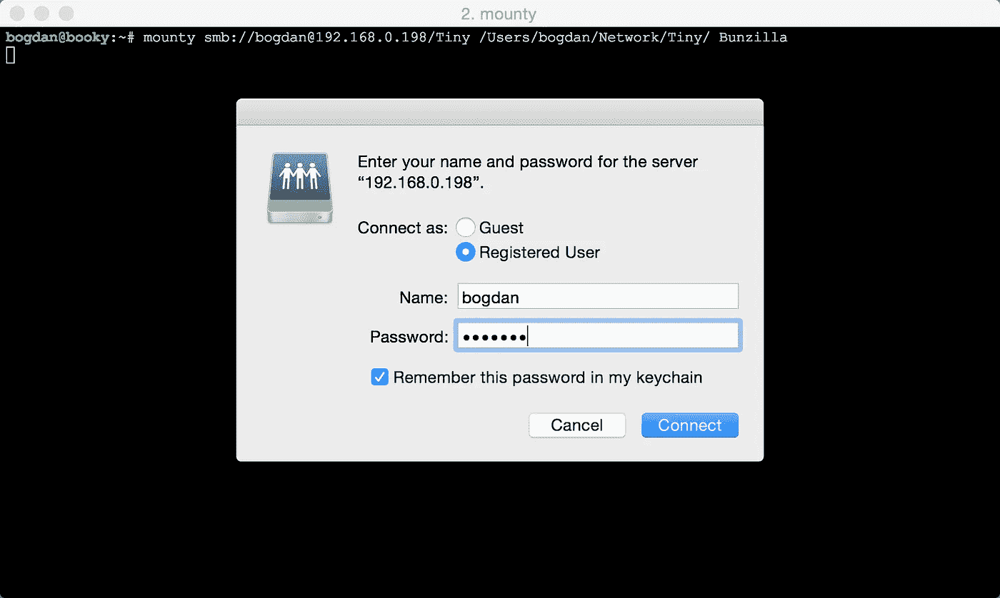

# Mounty — macOS Samba 共享安装工具

> 原文：<https://medium.com/hackernoon/mounty-macos-samba-share-mounting-tool-f0cf37c75cc2>

Fri，2015 年 7 月 31 日

几年前，当我连接到家里的 WiFi 时，我在寻找一种在 MacBook 上自动安装服务器共享的方法。事实上，我在家里和办公室都有一些我经常使用的股票。我不想总是不得不手动重新连接到它们。经过一些研究后，我在 AppStore 中找到了一个声称可以做到这一点的工具，但我希望它可以在 CLI 中工作，并且可以编写脚本。就这样[山地](https://github.com/x0054/mounty)诞生了。

# 关于 Mounty

[Mounty](https://github.com/x0054/mounty) 是一个在 OSX 挂载远程股票的工具。它将 WiFi SSID 作为参数，并且仅当 SSID 与系统当前连接的网络匹配时才尝试连接。它还验证共享尚未装载。如果是，它将返回已经装载共享的位置，而不是尝试再次装载它。

Mounty 优于 OSX 的 unix mount 命令，因为它可以将网络共享的凭证(用户名和密码)存储在钥匙串中。这使得它非常适合在 bash 脚本中使用。例如，您可以编写一个 bash 脚本，多次调用 mounty，遍历您定期连接的所有类型的网络共享。只需将该脚本添加到 cron 中，您就再也不用担心手动重新挂载这些共享了。

我添加了 SSID 参数，以便 monty 知道只有当系统连接到正确的网络时才尝试连接。如果您在几个不同的位置工作，并且需要根据位置访问不同的网络共享，这对于笔记本电脑来说是非常理想的。

# 安装底座

你可以在 [GitHub](https://github.com/x0054/mounty) 上找到 [Mounty](https://github.com/x0054/mounty) 的副本。只需抓取源码编译成 Xcode，或者下载最新的[编译二进制](https://github.com/x0054/mounty/raw/master/compiled/mounty)。要安装，只需将其复制到您的计算机上，例如复制到`/usr/bin/`。

# 使用 Mounty

在终端中运行它，如下所示:

`mounty smb://server/share /mount/pint WiFi_SSID`

它适用于 OSX 可以挂载的任何类型的共享，而不仅仅是 samba，因为它依赖于内部的 NetFS 库。首次连接到受密码保护的共享时，GUI 弹出对话框会要求您输入密码。第一次之后，密码会安全地保存在钥匙圈里，不会再被窃听。这意味着您可以在 BASH 脚本中使用 Mounty，而无需在脚本中包含您的密码。

# 最后的想法

希望你喜欢曼迪。用它，爱它，[叉它](https://github.com/x0054/hyperjump)，做出改变，发送拉请求。尽情享受吧！

*最初发表于*[T5【sdbr.net】](http://sdbr.net/post/Mounty/)*。*