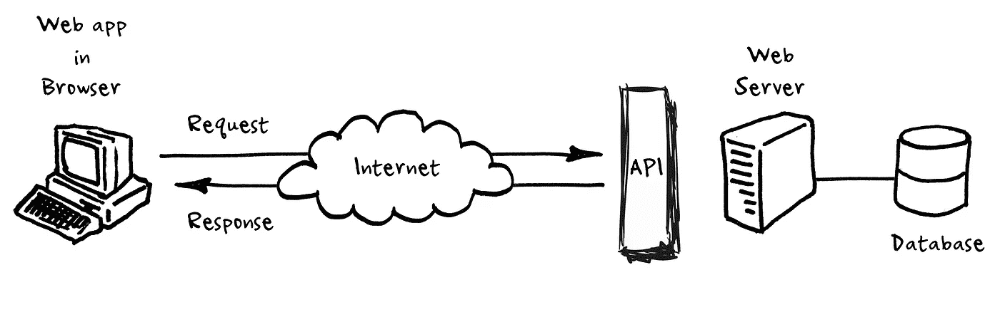

# 将 React 中的 API 请求移动到 Redux-Saga 的

> 原文：<https://medium.com/hackernoon/moving-api-requests-to-redux-saga-21780f49cbc8>



This image is a nice representation of how modern web-applications work. I found it on this article about [Web API’s on a Raspberry Pi](http://www.robert-drummond.com/2013/05/08/how-to-build-a-restful-web-api-on-a-raspberry-pi-in-javascript-2/)

去年，我们在[温室集团](http://www.greenhousegroup.com)开发了几个基于 React 的应用程序。

我最近在做的一个项目是一个内部工具，用来监控我们公司营销人员的营销费用。
我的职责是根据我们获得的经验和团队建立的概念验证来设置这个新工具。

我想和你分享一下我们如何创建这个应用程序的故事。我们使用了什么工具，我们在哪里偏离了传统的道路。

## 我们的工具包

为了让你对我们使用的工具有个概念，这里列出了我们日常使用的工具:

我们使用 [Babel 6](https://babeljs.io) 来传输我们的 ES6 编写的代码，以准备生产。Webpack 作为我们的开发服务器运行，是为验收和生产环境构建和编译代码的引擎。对林挺来说，我们依赖于 [ESLint](http://eslint.org) (带有一些定制的 [AirBnB 预置](https://www.npmjs.com/package/eslint-config-airbnb)，我们使用 [Jest](https://facebook.github.io/jest/) 来测试我们的代码。

当我们最初开始时，我们知道我们必须实现某种状态管理，我们可以在应用程序范围内存储数据，而不仅仅是每个组件，以便在用户在视图之间切换时更加持久。从我们开始 React 开发的那一刻起，我们就接受了 Redux，并一直使用它。尽管它可能有缺陷，并且不像 Mobx 那样广泛，但是它服务于我们的目的，并且直到今天还没有给我们带来任何实现问题。

## 添加 API 请求以做出反应

当你创建一个网络应用程序时，仅仅有一个静态前端是不够的。我们需要来自 API 的数据，在 Javascript 中，传统的获取方式是通过 [XMLHttpRequests](https://developer.mozilla.org/nl/docs/Web/API/XMLHttpRequest) 。由于我们正在构建内部应用程序(其中一个甚至是电子应用程序)，我们不必太担心浏览器的覆盖范围。我们只需要支持 Google Chrome，所以甚至在我们用 XMLHttpRequest 实现 API 调用之前，我们就决定尝试一下新的 [Fetch API](https://developer.mozilla.org/en-US/docs/Web/API/Fetch_API) 。

那么接下来的问题就来了，如何用 React 发出 API 请求？最常见的答案是在那个时候(2016 年初)在`ComponentDidMount`做。您从请求中得到的响应将存储在组件的本地状态中，并且您能够呈现获取的数据。

> 但是对于一个组件中的数据，如何将相同的数据传递给兄弟组件呢？

## 将 API 请求从组件中移出

我们应该将请求转移到父节点吗？但是，如果我们将“组件状态”与 Redux 同步，并使其在应用程序范围的状态下可用，会怎么样呢？

一种选择是将请求转移到国家行动。但是动作可能不会被阻塞，而获取请求会被阻塞。所以下一步是找出 [Redux-Thunk](https://github.com/gaearon/redux-thunk) 。有了 Redux-Thunk，你将得到一个中间件，它对 Redux 动作作出反应，做它的事情，然后再次分派其他动作。

我们摆弄了一段时间 thunks，但是我们最终得到了相当多的副作用，这些副作用给测试带来了问题，并且不容易阅读。有了 thunks，你可以调度一个动作，然后这个动作完成它的工作并调度另一个动作。这可能是我们的方法有点偏离，或者它还不够成熟，但我们正在寻找一种方法，在这种方法中，我们可以更容易地跟踪我们在这个状态中的行为的副作用。

## 然后 Redux-Saga 进来了

2016 年 10 月，我们遇到了 [Redux-Saga](https://redux-saga.js.org) ，很快我们就发现它可以解决我们的问题。在一些概念之后，不到一个月后，我们将我们的第一个传奇集成到我们的一个应用程序中。Thunks 和 Saga 的主要区别在于，Thunks 是基于被调度的动作来控制的，而 Saga 则独立地监听动作，更像是 reducers，并据此行动。

在传奇中，要求一个特定的任务并不复杂，根据传奇中特定步骤的有效载荷和结果，结果将开始。

## 用实际代码解释

我想给你一个例子，说明我们如何在代码中进行 API 请求，这可能会澄清这个复杂的问题；

我们的大多数组件都用 Redux' connect 包装，我们称之为连接器。最简单的连接器可能如下所示:

```
import { connect } from 'react-redux';

import App from 'components/app';

export default connect()(App);
```

一旦一个组件被挂载，我们希望获取数据，这样它就可以显示在组件的渲染中。

这是其中的一个组成部分:

```
import React from 'react';

export default class App extends Component {
    componentDidMount() {
        this.props.fetchRecords();
    }

    render() {
        const { records } = this.props;

        return (
            <div className="app">
                {records.map(record => (
                    <div className="record" key={record.id}>{record.name}</div>
                ))}
            </div>
        );
    }
}
```

*(为了保持我的代码块小，我没有在示例中添加 PropTypes)*

正如你所看到的，我使用了两个没有包含在初始连接器中的道具。所以我必须编辑那个文件。我将向 Redux connect 添加一个 dispatchToProps 和一个 stateToProps。一旦被调用，第一个将向商店发送一个动作。stateToProps 将数据直接从记录缩减器传递到组件。

> 在我的例子中，我将直接从 state 加载数据，但是在内部，我们使用选择器(通常与 [Reselect](https://github.com/reactjs/reselect) 结合使用)来更容易地重用状态选择器，并在 reducers 的引用改变时优化呈现，但是数据本身没有改变。

```
import { connect } from 'react-redux';

import App from 'components/app';
import fetchRecords from 'actions/fetch-records';

const stateToProps = state => ({
    records: state.records.data
});

const dispatchToProps = {
    fetchRecords
};

export default connect()(App);
```

现在，一旦组件被安装，它将调用`fetchRecords`，这是由于 Redux Connect 函数将把动作`fetchRecords`分派给商店。

我必须添加下面的代码来添加一个监听`fetchRecords`的传奇。由于我不会在本文中详细解释 Redux-Saga，假设我有一个 rootSaga，它将`spawn`我新创建的 Saga。

```
import { takeLatest, put, call } from 'redux-saga/effects';

import fetchFailed from 'actions/fetch-failed';
import setRecords from 'actions/set-records';

export default function* onFetchRecords() {
  yield takeLatest('RECORDS/FETCH', function fetchRecords() {

    try {
        const response = yield call(fetch, 'https://api.service.com/endpoint');
        const responseBody = response.json();
    } catch (e) {
        yield put(fetchFailed(e));
        return;
    }

    yield put(setRecords(responseBody.records));
  });
}
```

在上面的例子中，你可以看到它会监听`RECORDS/FETCH`，一旦那个动作出现，它就会发出一个获取请求。当获取失败时，它将抛出一个异常。在这种情况下，我们将调度`fetchFailed`动作。当请求成功时，它将分派`setRecords`并传递我们从服务器获得的记录。

在这里，您可以看到我们的减速器如何处理这些动作以及我们的传奇故事；

```
export default (state = {data: [], loading: false}, action = {}) => {
  switch (action.type) {
    case 'RECORDS/FETCH':
    case 'RECORDS/FETCH_FAILED':
      return {
          ...state,
          loading: true,
          data: []
      };
    case 'RECORDS/SET':
      return {
          ...state,
          loading: false,
          data: action.payload
      };
    default:
      return state;
  }
};
```

通过这些小段代码，我向您展示了如何将 API 调用从 ComponentDidMount 转移到 Redux Saga，并在 Reducers 中轻松获得数据，而不仅仅是组件状态。

对这个话题更感兴趣，或者这听起来比你在日常工作中做的更酷？让我知道！

[](http://bit.ly/HackernoonFB)[](https://goo.gl/k7XYbx)[](https://goo.gl/4ofytp)

> [黑客中午](http://bit.ly/Hackernoon)是黑客如何开始他们的下午。我们是阿妹家庭的一员。我们现在[接受投稿](http://bit.ly/hackernoonsubmission)并乐意[讨论广告&赞助](mailto:partners@amipublications.com)机会。
> 
> 如果你喜欢这个故事，我们推荐你阅读我们的[最新科技故事](http://bit.ly/hackernoonlatestt)和[趋势科技故事](https://hackernoon.com/trending)。直到下一次，不要把世界的现实想当然！

