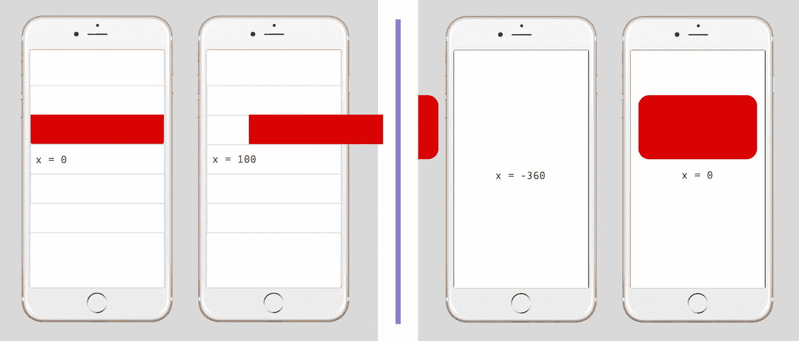
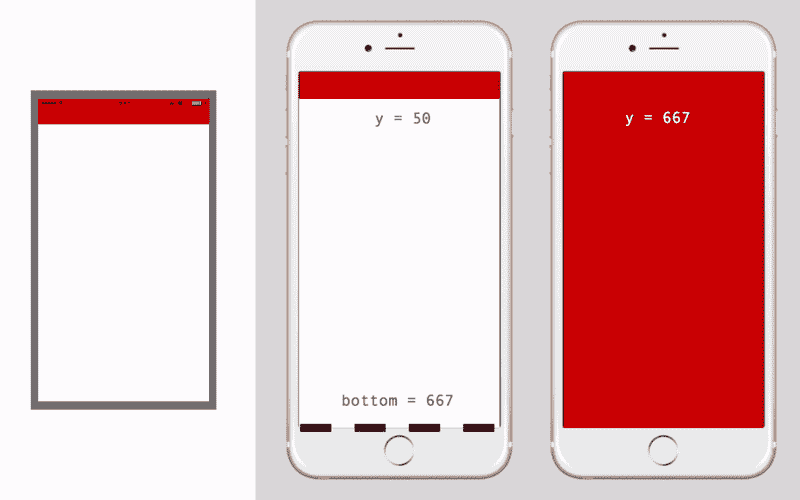
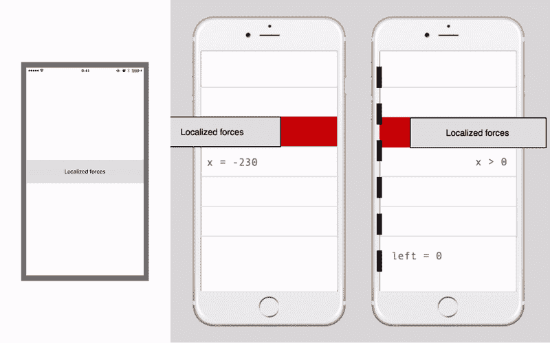
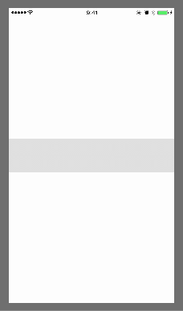

# 在 React Native 中以 60 FPS 的速度从动画过渡到用户交互

> 原文：<https://medium.com/hackernoon/moving-beyond-animations-to-user-interactions-at-60-fps-in-react-native-b6b1fa0ba525>

presentation is everything

*[*React Native*](https://hackernoon.com/tagged/react-native)*桥的异步特性招致固有的性能损失，阻止 JavaScript 代码以高帧率运行。现代动画库，如 Animated，通过减少过桥次数来解决这个问题。用户交互是更进一步的发展，UI 不断地对用户的手势做出反应。我们怎样才能以 60 帧/秒的速度运行呢？**

## *穿越最后一英里*

*React Native 作为现代移动应用的首选堆栈具有很大的吸引力。这个框架提供的主要优势是生产率的显著提高。简而言之，你开发应用程序的速度要快得多——部分原因是你终于可以在平台之间共享代码了。*

*不过，总会有人担心。React Native 能带我走过最后一英里吗？我将开发的应用程序能达到纯本地实现的顶级应用程序吗？*

*我不得不承认这种担心是有道理的。在 Wix.com，大约一年前，我们将我们的移动堆栈从一个纯粹的原生堆栈切换到原生堆栈，为 iOS 和 Android 提供单独的代码库。最初 95%的开发是轻而易举的。我们发现自己前进的速度是之前的 4 倍。不过，最后的 5%更具挑战性。我们发现这 5%，我称之为最后一英里，仍然不能用 React Native 直接实现。*

*作为社区，我们的目标是改善这种情况。*

## *那么是什么造就了伟大的应用呢？*

*区分最好的应用和平庸的应用的细微差别是什么？在手机领域，我们越来越希望物体不再只是在屏幕上弹出。事情预计会平稳过渡。*

*60 FPS 的流体动画是最后 5%的重要组成部分。动画曾经是 React Native 中的一个大问题。这个问题最终用 [Animated](https://facebook.github.io/react-native/docs/animated.html) 解决了，它是核心的一部分，是一个优秀的动画库。*

*让我们看看动画之外的下一步——模拟现实的动态用户交互。当用户在一个视图上执行一个手势时，一个交互就发生了，这个视图不断地以物理真实感响应用户的手势。*

*让我们来看一些现实生活中的例子，以便更好地理解我们正在谈论的内容。我翻遍了我的私人手机，开始在一些我最喜欢的应用程序中列举一些精彩互动的例子:*

*UX Inspirations*

*   ***ListView 行操作**——左边是苹果官方的 iOS 邮件应用和谷歌 Gmail 应用的[收件箱。当用户在 ListView 中滑动行时，行操作的按钮逐渐从侧面出现。](https://itunes.apple.com/us/app/inbox-by-gmail/id905060486?mt=8)*
*   ***可刷卡卡**——左起第二个是谷歌的 [Google Now](https://itunes.apple.com/us/app/google-search-made-just-for-mobile/id284815942?mt=8) 应用程序和 Lifehack Labs 的 [Flic](https://itunes.apple.com/us/app/flic-delete-manage-camera-roll-easily-delete-photos/id918263212?mt=8) 应用程序，后者有类似 [Tinder](https://itunes.apple.com/us/app/tinder/id547702041?mt=8) 的用户界面。当用户刷卡时，这些卡片会改变它们的外观，如果刷卡的力度足够大，它们就会飞出屏幕。*
*   ***可折叠视图**——右边第二个是 [Airbnb](https://itunes.apple.com/us/app/airbnb/id401626263?mt=8) 和 Any.DO 的 [Cal](https://itunes.apple.com/us/app/cal-shared-calendar-daily-organizer-weekly-planner/id648287824?mt=8) 应用程序。这两个应用程序都有用户可以在多个状态之间折叠的视图。在 Airbnb 中的过滤器和搜索之间切换，以及在 Cal 中的月视图和周视图之间切换。*
*   ***滑动面板&抽屉**——右边是苹果官方 iOS 顶部通知面板和苹果官方 iOS 地图应用。用户可以拖动这些面板来显示通常隐藏的其他 UI 元素。很像流行的导航抽屉/侧边菜单。*

*这些例子有什么共同点？它们本质上都是物理的。视图的速度随着它们被拖动和投掷而变化。注意细微的差别，比如当用力投掷时，通知面板如何从地面反弹。*

## *用 JavaScript 实现*

*当使用 React Native 时，我们自然会尝试用 JavaScript 实现这些交互。让我们回顾一下这样一个实现。第一个灵感示例——ListView 行操作——实际上是在 React Native core 中以名称 [SwipeableRow](https://github.com/facebook/react-native/blob/edd957007d689f9a0d559363bb88d3151f8e6c58/Libraries/Experimental/SwipeableRow/SwipeableRow.js) 实现的。*

*它有一个现代化的实现与所有最新和最伟大的。它强调性能并大量使用动画库。让我们把注意力集中在实现交互本身的部分:*

*该实现依赖于 [PanResponder](https://facebook.github.io/react-native/docs/panresponder.html) 来计算触摸事件之间的视图变化。我们应该从这种方法中期待什么样的性能？*

*为了分析性能，我们必须研究 React 本机内部机制。React Native 有两个领域并行运行:一个是 *JavaScript 领域*——我们在那里实现业务逻辑，另一个是*本地领域*——我们的本地视图驻留在那里。两个领域之间的交流通过*桥*进行。因为需要序列化来通过桥发送数据，所以频繁的通信是昂贵的。*

*触摸事件是一种本地构造，它们起源于*本地领域*。对于交互的每一帧，这些事件都通过桥发送，由 *JavaScript 领域*中的*_ handlePanResponderMove*处理。一旦业务逻辑计算出响应，就会设置一个动态值。由于更新视图必须发生在本地领域*中*，我们必须再一次过桥。*

*正如您所看到的，每个帧都需要数据通过网桥进行序列化。如果你的应用很忙，你会发现这种性能开销会阻止交互以 60 FPS 运行。*

## *用本机实现*

*在开发 Wix 应用程序时，我们最初开始实现与 JavaScript 的所有交互。当性能不如预期的顺利时，我们开始将特定的用例移植到 native。*

*这意味着每件事都要实现两次——一次在 iOS 上用 Objective-C 实现，一次在 Android 上用 Java 实现。使用本机实现通常更容易达到 60 FPS，因为我们可以避免在桥上传递数据，并在*本机领域*中关闭整个循环、业务逻辑和视图。*

*由于我们开源了几乎所有的本机代码，我们最终拥有了多个库，比如实现可刷卡器的[react-native-swipe-view](https://github.com/wix/react-native-swipe-view)和实现可刷卡器的[react-native-action-view](https://github.com/wix/react-native-action-view)。如果没有通用的解决方案，每一个新的用例都会产生另一个定制的库。*

*这种方法的主要问题是它需要本地技能，通常需要两个不同的开发人员。在 Wix，我们有大约 10%的前端员工是本地工程师，他们拥有 Objective-C/Swift 或 Java 方面的专业知识。*

*这还不够好。我们应该志存高远，努力找到一个优雅的通用解决方案。*

## *从动画中学习*

*动画实际上提出了一个非常相似的挑战。简单的实现是在 JavaScript 的框架之间补间视图属性。这将在网桥上产生大量噪声，并导致帧丢失。正如我们所知，库 [Animated](https://facebook.github.io/react-native/docs/animated.html) 作为 React Native 中处理 60 FPS 动画的解决方案而出现。它是如何工作的？*

*动画背后的概念是使用一个*声明式 API* 来描述动画。如果我们能够提前声明整个动画，那么 JavaScript 中的声明可以被序列化并通过桥发送一次。从那时起，*通用驱动*将根据声明中的规范逐帧执行动画。*

*动画的原始驱动程序是用 JavaScript 实现的。不过，最近的[版本](https://github.com/facebook/react-native/commit/19e2388a76a7792ace166b64b9f1fc4695b62f1f)提供了一个*原生驱动*，它能够在*原生领域*中逐帧执行动画，并更新原生视图，而无需过桥。*

*这种方法只在初始化阶段减少了网桥上的流量。这带给我们一个有趣的结论:*

> *声明式 API 是我们跨越最后一英里的方式*

*这是一个非常强大的概念。这些是我们应该考虑的图书馆类型。每当我们在 React Native 中发现一个性能边界时，这都是一种克服它的方法。我们所要做的就是找到几个示例用例，并设计一个可以涵盖所有用例的声明式 API。这正是我们接下来要做的。*

## *用于用户交互的声明性 API*

*为了设计一个成功的 API，我们应该定义几个目标:*

1.  *我们的 API 应该是通用的。验证的一个好方法是确保它涵盖了我们在上面的 UX 灵感中看到的所有 8 个例子。*
2.  *我们的 API 应该是简单的。验证这一点的一个好方法是确保每个交互的定义不超过 3-5 行代码。*

*在我们进入 API 的细节之前，我想提一下正在进行的一些非常有趣的工作，目的是为用户交互增加一些支持。一个有趣的补充是[动画。ScrollView](https://github.com/facebook/react-native/blob/0a712f5335d1bf04c4ff93a79b14c9e23dbd5831/Examples/UIExplorer/js/NativeAnimationsExample.js#L195) 允许根据 [ScrollView](http://facebook.github.io/react-native/docs/scrollview.html) 位置执行视图属性插值。另一个正在进行的有趣工作是由 Krzysztof Magiera 开发的名为[react-native-gesture-handler](https://github.com/kmagiera/react-native-gesture-handler)的库，它允许基于手势参数执行视图属性插值。*

*我们现在要一起采取的方法有点不同。我们将从上面显示的 8 个 UX 灵感开始，设计一个可以定义所有这些灵感的最简单的高级 API。*

## *定义 API —第 1 阶段*

*分析我们的 8 [UX 灵感](https://youtu.be/zqsnGEcMeV0)，我们可以看到一些视图可以自由水平移动，一些可以自由垂直移动。因此，指定*方向*对于我们的 API 来说是一个好的开始。*

*另一个观察结果是视图只能在被拖动时自由移动。一旦用户放开，他们通常会捕捉到一个预定义的*捕捉点*。例如，抽屉可以快速打开或关闭。*

*最后，为了给捕捉行为一个真实的感觉，我们需要使用类似弹簧动画曲线的东西。如果我们不希望弹簧永远振荡，我们还应该在我们的 API 中指定*摩擦力*(或者弹簧的阻尼)。*

*总之，我们的声明性 API 的第一阶段可以依赖于道具:*

*   ***水平** / **垂直***
*   ***捕捉点***
*   ***摩擦力***

*让我们尝试使用这个简单的 API 来声明前两个 UX 的灵感——ListView 行操作(左)和可刷卡(右):*

**

*为了允许可刷卡被刷走，我们简单地定义了完全在屏幕外的捕捉点(-360 和 360 逻辑像素)。注意，为了简单起见，我们目前使用像素值。我们可以在以后添加对更适合多屏幕分辨率的单位的支持，比如百分比。*

*这是一个很好的开始，但是设计*声明式 API* 只是前半部分。后半部分是实现*原生驱动*。让我们接下来做那件事。*

## *实现本机驱动程序—尝试 1*

*在 *JavaScript 领域*中将交互规范声明为道具后，它们在初始化期间由 React Native 序列化，并通过桥发送到*本地领域*。我们的通用*本机驱动*将接收这些规范，并完全从本机驱动交互。计算每一帧不再需要通过网桥，从而以 60 FPS 的速度执行，没有额外开销。*

*让我们从 Objective-C 中的一个简单实现开始。我们将通过使用 [UIPanGestureRecognizer](https://developer.apple.com/reference/uikit/uipangesturerecognizer?language=objc) 来拖动视图，当平移手势结束时，我们将找到最近的捕捉点，并用一条弹簧曲线将我们的视图动画化:*

*这个实现足够好了。问题是我们用动画来伪装物理。考虑当视图被用户以某个初始速度抛出时会发生什么。我们使用的动画函数只能在弹簧方向应用速度。如果用户将视图转向另一个方向会发生什么？我们的模型不足以驱动这个案子。*

## *实现本机驱动程序—尝试 2*

*让我们看看更强大的模型来推动互动。如果你深入到原生 SDK，并检查苹果如何推荐实现物理现实主义的复杂交互，你会遇到 [UIKit Dynamics](https://developer.apple.com/reference/uikit/uidynamicanimator?language=objc) 。*

*这个疯狂的 API 是在 iOS 7 中引入的。它在引擎盖下运行一个完全成熟的物理引擎，并允许我们将物理属性如[质量](https://developer.apple.com/reference/uikit/uidynamicitembehavior/1624395-density?language=objc)、[速度](https://developer.apple.com/reference/uikit/uidynamicitembehavior/1624391-addlinearvelocity?language=objc)和[力](https://developer.apple.com/reference/uikit/uifieldbehavior)应用到视图中。场景的物理参数通过应用[行为](https://developer.apple.com/reference/uikit/uidynamicbehavior?language=objc)来定义。我们可以很容易地修改上面的实现:*

*我们越来越近了，但还是没到。使用 UIKit Dynamics 有两个主要缺点。首先，没有 Android 支持。这个 API 是 iOS 独有的，在 Android SDK 中没有类似的东西。第二，一些行为，例如[捕捉](https://developer.apple.com/reference/uikit/uisnapbehavior?language=objc)，没有提供足够的控制——例如，没有办法指定捕捉力的强度。*

## *实现本机驱动程序—尝试 3*

*让我们变得更疯狂一点。为什么不尝试自己实现 UIKit Dynamics？归根结底，物理力是相对简单的数学方程。从头开始构建物理引擎应该不会太难。*

*UIKit Dynamics 会给我们指路。我们甚至可以采用它的行为模式。让我们以捕捉行为为例——我们可以使用一个*弹簧*来实现它。弹簧的表现如何？是时候回忆一些[物理 101](https://en.wikipedia.org/wiki/Hooke's_law) :*

**

*不要太担心数学，这是图书馆内部会做的事情。维基百科中关于[牛顿运动定律](https://en.wikipedia.org/wiki/Newton%27s_laws_of_motion)和[胡克定律](https://en.wikipedia.org/wiki/Hooke's_law)的条目可以为你提供完整的背景。*

*我们必须计算每一帧上的力和速度。为此，我们需要一个以 60 FPS 运行的高精度计时器。幸运的是，有专门为此任务设计的本地 API—[CADisplayLink](https://developer.apple.com/reference/quartzcore/cadisplaylink)。将所有这些放在一起会产生以下结果:*

*现在这种感觉是对的，并带给我们一个非常有趣的认识…*

> *我们正在为 React Native 编写一个声明式物理引擎*

*这真是太酷了。*

*我们终于控制住了*本地驱动*。是时候利用我们强大的引擎，并为我们的*声明式 API* 添加更多功能了。*

## *丰富 API —更多道具*

*到目前为止，我们所拥有的声明式 API 提供了一个坚实的基础，但是仍然缺乏在我们的 8 个 UX 灵感中实现一些更复杂的交互的能力。考虑苹果官方的 iOS 顶部通知面板。当用户用足够的力向下投掷面板时，面板[会从地面上弹起](https://www.youtube.com/watch?v=zqsnGEcMeV0&feature=youtu.be&t=8s)。*

*我们可以很容易地将对这种行为的支持添加到我们的声明式 API 中。我们将使用**边界**限制视图的移动，并从边缘添加**反弹**:*

**

*让我们考虑另一个复杂的用例，这次涉及 ListView 行操作。有些行两侧没有操作按钮。在这种情况下，常见的 UX 行为是允许行在暴露按钮的方向上自由移动，但是当在另一个方向上移动时，移动将更加困难并且遇到越来越大的阻力。*

*我们可以通过使用一个恒定的**弹簧**将行的一个边缘绑到屏幕的边缘来增加行移动的阻力。与捕捉点不同，此弹簧在拖动时也是活动的。*

*我们还需要解决另一个问题。该行应该无阻力地向左移动(该方向暴露按钮)，但有阻力地向右移动(无按钮的方向)。我们可以通过赋予每一个力，比如我们的弹簧，一个可选的**影响区域**，来将这种行为添加到我们的 API 中。*

*当视图在影响区域之外时，力将消失。*

**

*正如你所看到的，随着我们遇到越来越多的用例，我们可以简单地丰富我们的声明式 API，并添加通用功能来描述它们。*

## *丰富 API —与动画的集成*

*我们仍然缺少一大块拼图。考虑 ListView 行操作用例。当您扫动该行时，操作按钮会逐渐从下方出现。一种常见的模式是在显示时改变它们的外观，如比例和不透明度。*

*您可以在下面看到这种行为(蓝色的操作按钮):*

**

*还要注意，我们想要激活的视图(蓝色的动作按钮)不同于用户正在交互的视图(灰色的行封面)。*

*实现这种效果并不容易，因为动画的阶段取决于行的水平位置，而不是时间。然而，这仍然是一个动画，其中视图属性(比例和不透明度)是按顺序修改的。我们已经有了一个强大的工具来制作视图属性的动画——动画库[。让我们找到一种方法来使用它。](https://facebook.github.io/react-native/docs/animated.html)*

*通过在[动画上定义插值，以声明方式执行带动画的视图属性动画。数值](https://facebook.github.io/react-native/docs/animated.html#animatedvalue):*

*因为动画依赖于行的水平位置，如果我们把位置转换成动画。价值？这将允许我们根据交互视图的位置来定义插值，这些位置会影响其他不直接参与交互的视图(比如按钮)。*

*这在我们的声明式 API 中是如何工作的？我们可以通过传递动画。作为道具的值( *animatedValueX* ):*

*我们的本地驱动程序将执行引擎盖下的实际传输。这可以通过使用[动画事件](https://facebook.github.io/react-native/docs/animated.html#event)来完成。最近版本的 Animated 甚至支持使用一个[本地驱动](https://github.com/facebook/react-native/commit/fc11a5fde847f40f446823ac2bbb0d2e64236306)来驱动 Animated.events。这意味着整个动画——从传输位置到插值和更新视图属性——可以在*本地领域*中执行，而无需通过桥发送数据。如果我们的目标是 60 FPS，这是个好消息。*

## *丰富 API——收尾工作*

*如果我们在做我们自己的物理，我们也可以加上其余的力。我们已经有了*弹簧*，让我们再加上*重力*和*磁力*。这将为开发人员提供定义各种疯狂的物理交互所需的灵活性。*

*我们还应该添加对*事件*的支持，这样我们的 JavaScript 代码就可以在交互停止或视图捕捉到某个点时得到通知。同时，添加触觉反馈也是一个不错的触摸——因此每当视野与周围环境发生冲突时，该设备都会轻微振动。这些细微差别为出色的用户体验增添了光彩。*

*该收拾东西了…*

*我想向你展示我们在这里创造的全部力量。看看下面的声明，你能猜出它实现了什么吗？*

*我们的神秘视图可以贴在屏幕的左边或右边。底部有一个重力井，当它靠得太近时会把里面的景色吸走。另外，请注意，我们没有限制移动，而是允许视图向两个方向移动。*

*我们这里有一个完整的*聊天标题*实现，只有 7 行代码！*

**

## *真的以 60 FPS 运行吗？*

*观看视频和自己在真实设备上体验互动是不一样的。请注意，即使是模拟器也不能提供真实的体验，因为它会丢帧。*

*那么，在真实的设备上，它真的能以 60 FPS 的速度运行吗？自己判断。我已经用我们刚刚在 React Native 中创建的引擎实现了所有 8 个 [UX 灵感](https://youtu.be/zqsnGEcMeV0)。你可以在[苹果应用商店](https://itunes.apple.com/us/app/react-native-interactions/id1209875831?ls=1&mt=8) (iOS)和 [Google Play](https://play.google.com/store/apps/details?id=com.wix.interactions&hl=en) (Android)找到最终的演示应用。*

*Download the demo app*

*GitHub 上提供了物理引擎、我们的 iOS 和 Android 原生驱动程序以及演示应用程序的完整实现:*

* [## wix/react-本机-可交互

### React-Native-interactable-React Native 中高性能交互式视图的实验性实现

github.com](https://github.com/wix/react-native-interactable) 

特别感谢[罗滕·米兹拉奇-梅丹](https://medium.com/u/60e6105b5bc7?source=post_page-----b6b1fa0ba525--------------------------------)和察奇·科皮洛维兹帮助我们在 2017 年 ReactConf 上及时将它带回家。

## 穿越最后一英里

我希望您从这个有趣的实验中获得的不仅仅是在 React Native 中实现出色的用户交互的酷方法。作为一个社区，我们的目标是确定 React Native 的边界，然后推动它们。

当您在 React Native 中偶然发现一个有趣的性能问题时，我建议您找到几个示例用例，并尝试设计一个简单的声明性 API 来定义它们。如果性能问题源于桥接开销(通常是这样)，API 的本地驱动程序可能会提供一个很好的解决方案。

让我们一起走过最后一英里。

> [黑客中午](http://bit.ly/Hackernoon)是黑客如何开始他们的下午。我们是 [@AMI](http://bit.ly/atAMIatAMI) 家庭的一员。我们现在[接受投稿](http://bit.ly/hackernoonsubmission)并乐意[讨论广告&赞助](mailto:partners@amipublications.com)机会。
> 
> 如果你喜欢这个故事，我们推荐你阅读我们的[最新科技故事](http://bit.ly/hackernoonlatestt)和[趋势科技故事](https://hackernoon.com/trending)。直到下一次，不要把世界的现实想当然！

*