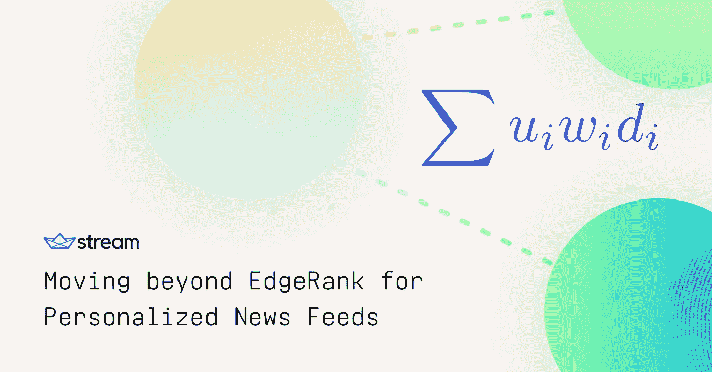
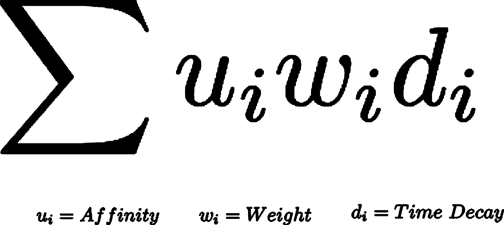
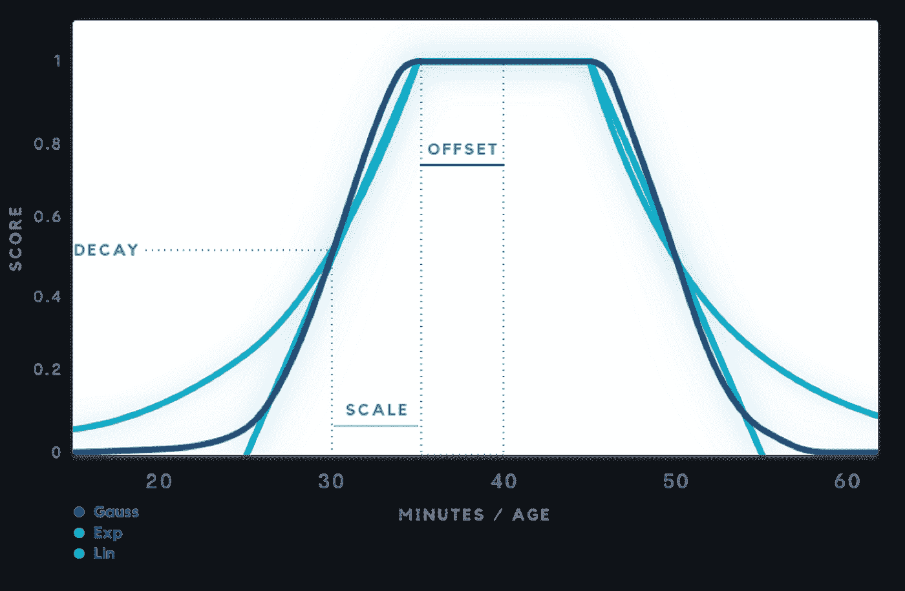
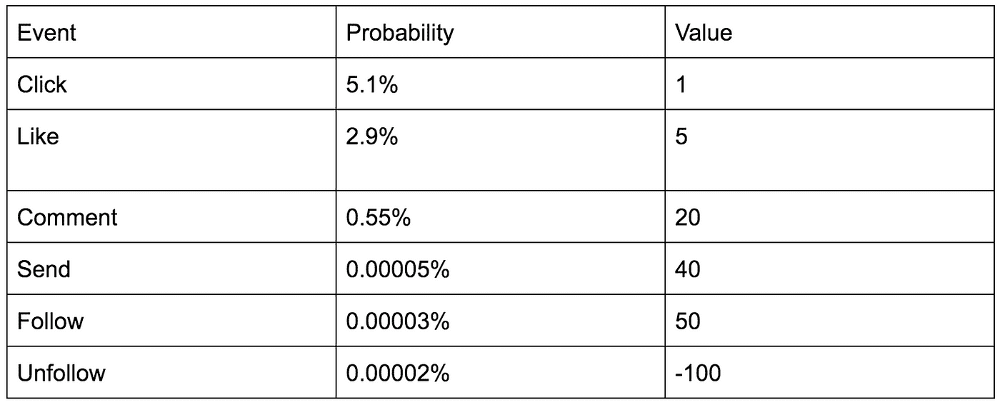
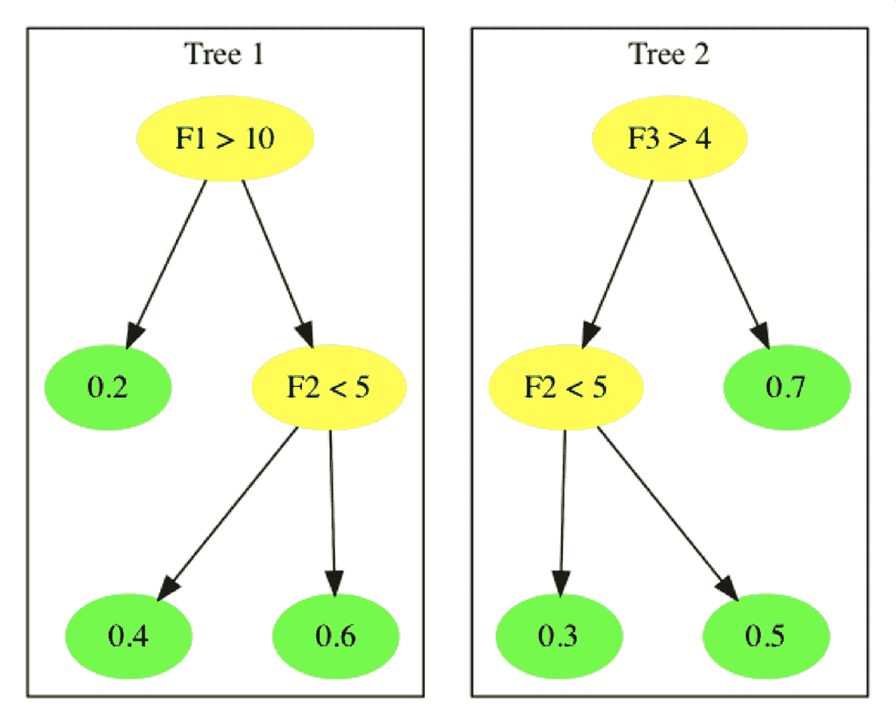

# 超越 EdgeRank 实现个性化新闻订阅

> 原文：<https://medium.com/hackernoon/moving-beyond-edgerank-for-personalized-news-feeds-1227aa782d>

> 披露: [Stream](https://goo.gl/LxzcfX) ，可扩展提要的 API，之前赞助过 Hacker Noon。

*这篇博文分为两部分，追溯了之前***的一篇博文。所有这些部分的总和是我最大的努力，为您提供一个如何将个性化新闻提要的创建提升到下一个级别的框架。**

*   **第 1 部分:一个非常基本的 EdgeRank 风格算法背后的理论，该算法用于构建我自己的* [*Instagram 发现引擎。*](https://getstream.io/blog/building-instagram-discovery-engine-step-step-tutorial/)*
*   **第 2 部分:了解如何使用现代机器学习技术来优化提要中的排名**

## *第 1 部分:我如何以及为什么使用这个分数函数*

*在我的[上一篇博文](https://getstream.io/blog/building-instagram-discovery-engine-step-step-tutorial/)中，我讲述了如何构建自己的 Instagram 发现引擎。它包含了相当多的代码，但是没有很多关于我为什么选择下面的算法来排列帖子的理论的讨论。*

**

*所以让我们再深入研究一下。本质上，它只是经典 facebook EdgeRank 算法的变体:*

**

*这可以分解为三个主要部分:**亲和力**、**权重**和**时间衰减**。*

## *吸引力*

*亲和力这个术语是一种将用户与你的“联系”程度联系起来的方式。这个想法是，如果你有很多共同的朋友，并且你过去和他们有过互动，你更有可能想要看到那个用户未来的帖子。*

*在这个例子中，亲和力由两个术语确定:*

**

*其中 PPR 是我对那个用户的个人排名。其他因素可能包括我评论的次数和点击用户帖子的次数。*

*在 Python 中，PPR 是通过基于我关注的人创建一个 NetworkX 图来计算的。然后，我使用指定的个性化字典运行 pagerank。个性化字典只是告诉 NetworkX PageRank 算法，重置到任意随机节点的概率为零，除了你正在“个性化”的节点。*

*将 PPR 乘以我“喜欢”一个用户帖子的次数的自然对数，是提高我之前互动过的用户的亲和力得分的一种方式。*

## *重量*

*权重可以由许多不同的因素决定，具体取决于您可以访问的数据类型。我是根据帖子的赞数和评论数来判断的。*

**

*我用日志让一个帖子上前几个赞的重要性高于那些已经有很多赞的帖子。思维过程是 10 个和 100 个喜欢之间的差异，应该比 100 到 190 个更相关，即使两者都有 90 个喜欢的差异。*

## *衰减时间*

*时间衰减适用于非常关心项目“新鲜度”的应用程序。重要的是增加新的内容，而不是旧的、过时的内容。时间衰减确保新的文章有机会出现在你的订阅源的顶部，即使它们可能没有很多喜欢……在 Stream，我们将大多数的[衰减函数](https://getstream.io/docs/#decay)基于线性、指数和高斯衰减函数。您决定使用的功能在很大程度上取决于最终应用程序以及您希望旧内容变得无关紧要的速度。*

**

*嗯，这很简单，是吧？将三个相当容易得到的特性相乘，可以得到一些相当不错的结果。虽然手动调整少数几个参数相当容易，但当您想要包括 10 个、100 个甚至 1000 个不同的参数，以确保您用户的提要中包含最相关的内容时，会发生什么呢(我知道，我知道，这是机器学习这个词的一个重要组成部分)。让我们来看看…*

## *第 2 部分:超越 EdgeRank 到提升树和神经网络*

*虽然一个简单的 EdgeRank 风格的算法很容易实现，但它确实有一些缺点，这取决于您的应用程序有多少数据。这似乎是显而易见的，但最佳的提要是最能吸引用户的提要。如果您希望您的提要基于大量参数，那么实现这一点可能很难。根据应用，接合可以基于许多不同的参数。对于 Instagram 风格的订阅源，它们可以基于点击、喜欢、评论、发送、关注和取消关注。我们可以将这些指标视为不同的模型，优化每一个模型，最后将它们相加得到最终得分。*

**

*[1]
总分= 30.6015*

*那么我们可以用什么模型来预测所有这些事件的概率呢？一种已经被证明是成功的对 feeds 进行分级的方法[1]是使用逻辑回归的提升决策树。使用增强决策树可以让我们(几乎)向模型中抛出尽可能多的特征，让它决定什么是重要的。在决策树被训练之后，我们可以将每个输入特征转化为一组分类特征。然后，我们将这些分类特征用作逻辑回归的一次性编码输入，以重新学习叶权重。这个额外的步骤允许我们加速训练过程，并将训练步骤推至接近在线的模型，同时仍然利用增强树提供给我们的特征变换。*

*提示:在生产中，你可能希望减少特征的数量，以加快训练时间，减少过度拟合。*

**

*(黄色节点表示分类特征，绿色节点表示要重新学习的叶权重)那么我们可以使用什么特征来填充到增强的决策树模型中呢？让我们把它们分成两个子类别:**语境**和**历史**。*

***上下文特征**是构成内容的那些特征。例如，标签为# puppiesofinstagram 的小狗照片中的全能小狗。*

***历史特征**可以通过作者和观众之间的约定先验来描述。在这里，理解一个人的网络结构很重要，因为它可以让一个人看到谁是他们的亲密朋友，他们总是喜欢谁的照片，他们只在发布猫的照片时喜欢谁的照片，以及他们在发布小狗的照片时总是评论谁的照片。其他重要的历史特征包括现实生活中你可能认识的人和你搜索的人。例如，我总是喜欢来自 [haystackpets](https://www.instagram.com/haystackpets/) 的帖子，所以它们应该首先出现在我的提要中。(没错，那是不要脸的给我宠物的 Instagram 账号插队。)*

*历史特征将推动大部分项目，但背景特征对于冷启动问题至关重要。虽然提升树是 Stream 团队的最爱(并且已经处于前沿很长时间了)，但在某些情况下，神经网络可以表现得更好。大多数情况下，当您有大量稀疏数据要排序时。*

*就设置而言，神经网络的模型可以用与增强树几乎相同的方式来设置。通过使神经网络的输入为具有特征和反馈标签的单个数据流，输出为具有 sigmoid 函数的单个节点来预测事件的概率。*

*由于训练神经网络的成本很高，我们可以利用一个常用于图像识别的简单技巧。我们可以利用迁移学习来为一个指标训练整个神经网络，然后重新使用昂贵的工具来训练基础层，并为您想要优化的每个指标微调顶部密集层，而不是为每个指标从头开始训练整个神经网络。下面显示了前馈神经网络的一个示例。*

**

*根据你每天需要排列的提要的数量，这个计算仍然很昂贵。脸书将神经网络与增强决策树相结合，以帮助降低神经网络中的推理成本，同时仍然获得性能增益[2]。*

*一旦你训练了你的神经网络，你可以使用最后一层作为特征向量，并将其输入到每个事件的逻辑回归模型中，这样我们就可以加快训练速度，并迅速考虑新的数据。此外，作为一个额外的奖励，你还可以为你的下一次鸡尾酒会找到一个很好的话题。*

*哇，我确实在那里浏览了很多话题。我们也有很多关于如何在你的应用中实现[个性化排名提要](https://getstream.io/personalization/)的信息。请随时联系我或我们数据科学团队中的任何人，了解如何改进您的应用！*

*[1] Ewa Dominowska —生成十亿条个人新闻 feed—ml conf SEA 2016(【https://www.youtube.com/watch?v=iXKR3HE-m8c】)
【2】insta gram 上预测性 feed 排名模型的测量与分析
([https://code . Facebook . com/posts/1692857177682119/machine-learning-scale-2017-recap/](https://code.facebook.com/posts/1692857177682119/machine-learning-scale-2017-recap/))*

> *最初发表于[流博客](https://getstream.io/blog/moving-beyond-edgerank-for-personalized-news-feeds/)。*
> 
> *我们的每周赞助商 [**Stream**](https://goo.gl/LxzcfX) **使您能够在几个小时而不是几周内构建可扩展的新闻提要&活动流:** [**在这个 5 分钟的教程中试用 API。**](https://goo.gl/LxzcfX)*