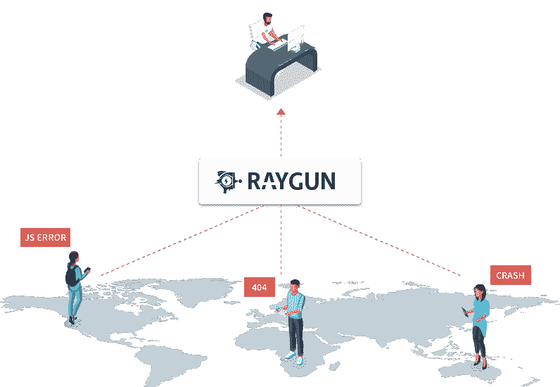

# “快速移动和打破东西”是一派胡言

> 原文：<https://medium.com/hackernoon/moving-fast-and-breaking-things-is-such-a-load-of-crap-f23ac50215b0>

“快速行动，打破常规”这句话是脸书首席执行官马克·扎克伯格创造的。但是为什么人们一直这么说呢？

最近，我看到软件工程师越来越频繁地重复这句话。

这几乎成了懒惰的开发人员的借口，以某种方式证明他们的代码中有 bug 是绝对没问题的。

现在要明确的是，**所有软件都有 bug**，这是事实。

这是建筑应用的一部分。当有几个、几百个甚至几千个人在为一个代码库做贡献时，情况更是如此。

问题是，**这个‘座右铭’几年前就死了**。

在该公司 2014 年的 F8 会议上，首席执行官马克·扎克伯格提出了一个新的座右铭:

> **“凭借稳定的基础设施快速前进。”**

扎克伯格说，它“可能不像‘快速行动，打破常规’那样吸引人”。“但这是我们现在的运营方式。”

“作为开发人员，快速行动是如此重要，我们甚至可以容忍一些错误来做到这一点。”

现在，脸书有超过 20 亿用户和一大堆广告收入要保护，打破一些小事情可能会有重大影响。

今天的软件工程与几年前我们所知道的软件工程相比已经大不相同了。

# 软件工程的前景已经改变

如果一个严重的 bug 对最终用户产生负面影响，从接待员到首席执行官的每个公司员工都不会对此感到高兴。公司品牌正被你编写的问题玷污，然后发布到用户手中。

然而，一些开发人员认为这一切都是合理的，因为他们正在以快速的速度发布代码，表现出巨大的“创新”，并且在某种程度上打破一些东西是可以接受的。

不，不是。不再是了。

“I’m sorry. I was only ‘moving fast and breaking things’, sir”

每个公司都有能力快速交付大规模的软件应用程序，同时保持一贯可靠的用户体验。

不再需要在速度和质量之间做出选择。

如今，你也可以快速行动，解决问题。

# 你不能修复你看不到的东西

提高软件质量的答案不是简单地编写更多的单元测试。在软件开发团队中，这需要改变心态和文化态度。

Bug 跟踪和解决曾经是一项令人难以置信的手工任务，并且是一项无情的任务。这可能是为什么大多数开发人员认为这是一个巨大的麻烦。

不仅要让用户报告他们自己经历的问题，而且要将它们单独记录到一个 bug 跟踪工具中。用有限的技术细节分配开发人员的时间来复制和修复它们。

*唉。*

这就是现代、专用的[错误跟踪工具](https://raygun.com/platform/crash-reporting)可以确保开发人员实时查看用户遇到的生产错误和崩溃，然后有足够的细节在几分钟内重现它们。

[Raygun](https://raygun.com) 只是一个例子，但是软件工程团队可以使用许多有用的工具来密切关注你在生产中的应用，**然后简单地告诉你什么时候需要注意**。

开发人员不再对代码落入用户手中后的问题视而不见。如果您真的破坏了东西，它会在影响最终用户之前很快被发现。

# 调试问题并修复它们比以往任何时候都容易

我相信你不会故意在应用程序中编写错误代码，但是能够像编写程序一样快速地调试它们还是有很多好处的。

在开发和测试期间，您可能习惯于手头有一致的操作系统、设备、浏览器及其各自的版本，并且能够访问每个未处理异常的完整堆栈跟踪。发现漏洞相对容易。

一旦投入生产，一切都会变得黑暗。这些信息没有一个是你可以得到的，许多 bug 可能 ***只*** 发生在生产中。

没有一个可以收集这些细节的监控工具，你简直是在瞎飞。

通过适当的监控，可以自动检测错误、崩溃和性能问题，并将其提交到团队工作流中。一个自我填充的待办事项列表，如果你愿意的话，你可以做些什么来改进你的软件。直到出现问题的确切代码行。

# 动作要快，但是认真地修改你该死的代码

当涉及到软件开发时，实际上很容易快速移动和打破东西。谁都可以做。

要成为一名优秀的开发者，你需要关心你的代码质量以及你对软件用户的影响。

“快速行动，打破常规”的心态很容易让问题不了了之。但是我们为我们的 ***用户*** 构建软件，有时却忘了他们是真正的 ***人*** 。

当他们不能以他们需要的方式操作你的软件时，他们会感到沮丧和愤怒。

在今天的现代开发环境中，公司没有必要让他们的用户暴露在未被发现的错误中。[工具可用](https://raygun.com)。

所以，动作要快。

想走多快就走多快。

但以修理东西为荣。而不是打破它们。