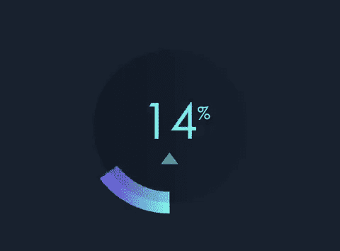

# 从❤️️❤️️❤️️搬到👏👏👏。下一步是什么？也许…

> 原文：<https://medium.com/hackernoon/moving-from-%EF%B8%8F%EF%B8%8F-%EF%B8%8F%EF%B8%8F-%EF%B8%8F%EF%B8%8F-to-whats-next-maybe-e3ef0398be6a>

## 这一切都始于👍在 Facebook 上，一个⭐️在 Twitter 上，还有一个👋轻扫火绒。

似乎很多人对媒体从推荐(或❤️️s)转向鼓掌(或👏).像所有的新事物一样，有些用户很沮丧，有些人很高兴。

根据 [Ev Williams](https://medium.com/u/268314bb7e7e?source=post_page-----e3ef0398be6a--------------------------------) 的说法:“这个系统(或类似的东西)对于我们根据人们写作的质量支付报酬的新方法来说至关重要。”他补充道:“我们正试图与摧毁我们思想和民主的广告黑暗势力作斗争。”

我同意 Ev 所说“鼓掌可能看起来很傻”，但是傻可能是好的。这可能是走向付费在线内容未来的第一步…也可能不是。

虽然我对拍手和心跳/推荐没有什么看法，但我相信，如果我们想重塑这个行业，把重点放在内容和内容制作者身上，而不仅仅是广告商，实验是关键；从浏览量到页面享受；从数量到质量。

到目前为止，我很喜欢观察有多少读者一次鼓掌，而不是多次；新的系统让我更加清楚自己是否在鼓掌，甚至是在鼓掌一次或多次。

也许我们仍然过于关注脸书上的竖起大拇指和反应，以及 Twitter 上的心和喜欢，甚至是我们在 Tinder 和 Tinder 启发的应用程序上向左或向右滑动。

但是如果我比较👍 ❤️️ 👏vs 刷卡，我觉得后者可能更有意义。这是一个更长的动作；它不仅仅是一次点击；它遵循一个想法，而不是快速反应。

也许灵媒可以从挥击中受益…或者它可以重新发明挥击和所有反应的倾斜。

在我看来，圆形表盘会很棒:

*   它是圆形的，设计有限，但有无限的可能性；
*   并不陌生；
*   只需点击一次，即可获得一个赞/推荐；
*   或者可以用手指绕着它转圈，增加喜欢的强度……几乎到无限远；
*   你可以用手指在屏幕上或者鼠标垫上绕着它跑；
*   你可以顺时针或逆时针转动手指；
*   它要求用户思考这个问题，而不仅仅是通过一次或多次点击做出快速反应。

只是想法不同！可能是个疯子！

继续试验 [Ev Williams](https://medium.com/u/268314bb7e7e?source=post_page-----e3ef0398be6a--------------------------------) ！👏👏👏