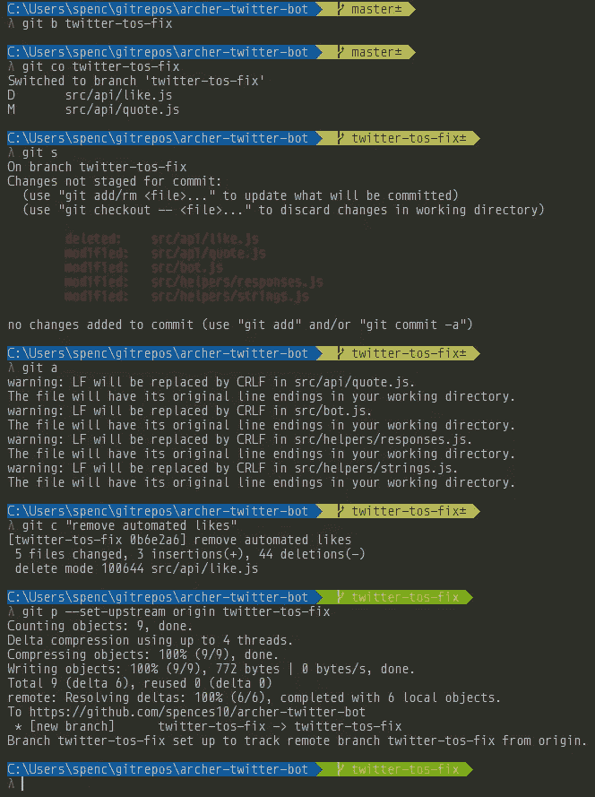

# 从初级到(稍微更高级的)使用别名的 git。

> 原文：<https://medium.com/hackernoon/moving-from-beginner-to-slightly-more-advanced-git-with-aliases-89e30a6accf4>


Image credit: [https://www.pexels.com/photo/scenic-view-of-beach-248797/](https://www.pexels.com/photo/scenic-view-of-beach-248797/)

您使用 Git 越多，您就越熟悉在您的项目或您团队的项目的日常工作流程中使用的命令。

命令，如命名和创建要素分支，如果您有必要的权限，则发出“拉”请求或推送您的更改。

我每天都在使用它，其他使用 git 的人[我想]都是使用`git add .`命令，然后是`git commit -m "my awesome feature"`和`git push`或者`git push origin <branch>`

在我使用 Git 的短暂时间里，我总是打出完整的命令[通常我的备忘单就在手边]，不再多想，这就是你使用这个工具的方式，对吗？

嗯，这是我愚蠢的假设，直到我了解了点文件，我从听 [toolsday.io](http://www.toolsday.io/) 播客中了解了`.`文件，这是一个学习工具的好渠道👍这个播客是关于 Git 工具的，听一下吧，这是一个很棒的节目。

这对我来说是一次非常酷的学习经历，现在我有了一个非常高效的 git 工作流程🚀

让我们回顾一下`.gitconfig`，你还记得第一次在电脑上设置 Git 时必须输入你的电子邮件地址和姓名吗？该信息存储在您的`.gitconfig`文件中，您的文件将位于 Windows 上的用户文件夹`C:\Users\yourusername\.gitconfig`或 Linux/Mac 上的`~/.gitconfig`中

如果您在您选择的文本编辑器中导航到该文件并打开它，您将在“[用户]”标志下看到您的详细信息，这是我的:

```
[user]
  name = spences10
  email = spences10apps@gmail.com
```

我不确定您的配置中可能还有哪些其他选项，所以我们将只关注别名，可以使用别名，以便您可以缩短命令[或者如果您愿意，可以使它们更长]，但我完全支持减少击键次数，即使少一两次。

因此，让我们回顾一下我在开始时提到的常见命令:

```
git add .
git commit -m ‘my awesome feature’
git push
```

所以对于别名，我们可以把它们缩短一点:

在您的`.gitconfig`文件中，如果还没有添加到`[aliases]`部分，我在我的用户详细信息上面添加了我的，然后添加一些别名:

```
[alias]
  a = add .
  c = commit -am
  p = push[user]
  name = spences10
  email = spences10apps@gmail.com
```

因此，现在我们可以缩短向我们的一个回购协议添加变更的工作流程:

```
git add .
git commit -m ‘my awesome feature’
git push
```

会变成:

```
git a
git c ‘my awesome feature’
git p
```

你输入的内容并没有大幅减少，但你会惊讶地发现，你会很快习惯，并开始添加更多的内容。



Here they are in action 👍

这是我目前的化名列表:

```
[alias]
  a = add .
  b = branch
  c = commit -am
  cl = clone
  co = checkout
  d = diff
  f = fetch
  i = init
  o = open # see: https://github.com/paulirish/git-open ♥
  p = push
  pt = push --tags
  s = status
  t = tag
```

在发表这篇文章的时候，我发现一个新的版本是`clone --depth 1`,它只克隆了库的头部，而不是整个库，所以如果你在克隆 react，你只会得到主版本，而不是库中的其他 38 个分支。非常整洁，所以可以别名成一个更短的东西`git cl1d?`

毫无疑问，你会注意到我为`o = open`准备的链接，这个小宝石属于[保罗·爱尔兰](https://github.com/paulirish)它是一个 npm 包，会弹出一个浏览器标签，指向你当前所在的库，很棒吧？

我相信有很多很多方法可以配置 Git，如果你看一下 Paul Irish 的 dotfiles repo 的`[.gitconfig](https://github.com/paulirish/dotfiles/blob/master/.gitconfig)`，你会发现有很多方法可以配置 Git，我还在学习和寻找新的方法来做事情。

如果我错过了什么，或者如果你有更好的方法，请告诉我。

让我在 Twitter 上[或者在 GitHub 上](https://twitter.com/ScottDevTweets)[问我任何事情](https://github.com/spences10/ama)。

如果你喜欢这篇文章，或者它以任何方式帮助了你，请给它一个赞，不要忘记在社交媒体上分享它。

[](http://bit.ly/HackernoonFB)[](https://goo.gl/k7XYbx)[](https://goo.gl/4ofytp)

> [黑客中午](http://bit.ly/Hackernoon)是黑客如何开始他们的下午。我们是阿妹家庭的一员。我们现在[接受投稿](http://bit.ly/hackernoonsubmission)并乐意[讨论广告&赞助](mailto:partners@amipublications.com)的机会。
> 
> 如果你喜欢这个故事，我们推荐你阅读我们的[最新科技故事](http://bit.ly/hackernoonlatestt)和[趋势科技故事](https://hackernoon.com/trending)。直到下一次，不要把世界的现实想当然！

