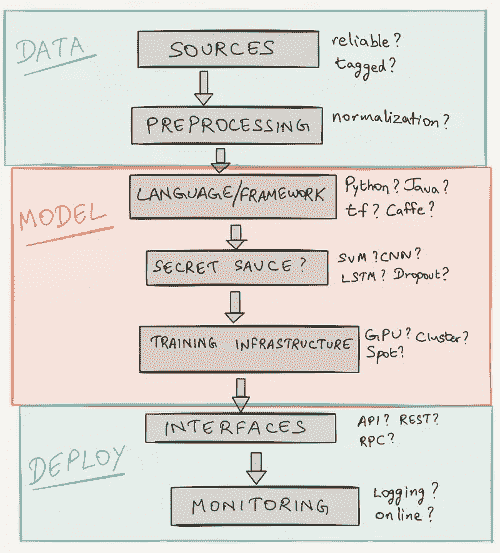

# 将机器学习从实践转移到生产

> 原文：<https://medium.com/hackernoon/moving-machine-learning-from-practice-to-production-a476451161e5>

随着[对神经网络和深度](https://hackernoon.com/tagged/growing)[学习](https://hackernoon.com/tagged/learning)兴趣的增长，个人和
公司声称人工智能在其日常工作流程和产品供应中的采用率越来越高。

再加上人工智能研究的极快速度，新一波的流行显示了解决一些更困难问题的巨大希望。

也就是说，我觉得这个领域在*欣赏*这些发展和随后*部署*它们来解决“现实世界”的任务之间存在鸿沟。

出现了许多框架、教程和指南来民主化机器学习，但它们规定的步骤往往与需要解决的模糊问题不一致。

本帖收集了在
生产中应用机器学习时值得思考的问题(有一些(甚至可能不正确)
答案)。

## 垃圾进，垃圾出

> 我有可靠的数据来源吗？我从哪里获取数据集？

开始时，大多数教程通常包括定义良好的数据集。
无论是 [MNIST](http://yann.lecun.com/exdb/mnist/) 、[维基百科语料库](http://corpus.byu.edu/wikipedia.asp)还是
、 [UCI 机器学习知识库](https://archive.ics.uci.edu/ml/)中的任何伟大选项，这些数据集通常并不代表你希望解决的问题。

对于您的特定用例，一个合适的数据集甚至可能不存在，并且
构建一个数据集可能比您预期的要长得多。

例如，在 Semantics3，我们解决了许多电子商务特有的问题，从*产品分类*到*产品匹配*到*搜索
相关性*。对于这些问题中的每一个，我们都必须深入内部，并花费相当大的精力来生成高保真的产品数据集。

在许多情况下，即使你拥有所需的数据，也可能需要大量(并且*昂贵的*)手工劳动来对你的数据进行分类、注释和标记以供训练。

## 将数据转换为输入

> 需要哪些预处理步骤？在使用我的算法之前，我如何标准化我的数据？

这是另一个步骤，通常独立于实际模型，在大多数教程中都被忽略了。当探索深度神经网络时，这种遗漏显得更加明显，在深度神经网络中，将数据转化为可用的“输入”至关重要。

虽然存在一些图像的标准技术，如裁剪、缩放、零居中和白化，但最终的决定仍然取决于每个任务所需的标准化水平。

当处理文本时，字段变得更加混乱。*大写
重要吗？我应该使用分词器吗？单词嵌入呢？我的词汇量和维度应该有多大？我应该使用预先训练好的矢量还是从头开始或者分层？*

没有适用于所有情况的正确答案，但是了解可用的选项通常是成功的一半。最近一篇来自 [spaCy](https://spacy.io/) 创建者的[帖子详细描述了一个有趣的策略来标准化文本深度学习。](https://explosion.ai/blog/deep-learning-formula-nlp)

## 现在，让我们开始吧？

> 我使用哪种语言/框架？Python，R，Java，C++？Caffe，Torch，Theano，Tensorflow，DL4J？

这可能是回答最固执己见的问题。我
在这里包括这一部分只是为了完整性，我很乐意向您指出[各种](https://github.com/zer0n/deepframeworks) [其他](https://deeplearning4j.org/compare-dl4j-torch7-pylearn) [资源](https://www.oreilly.com/ideas/six-reasons-why-i-recommend-scikit-learn)可用于做出这一决定。

虽然每个人可能有不同的评估标准，但我的标准是
易于定制、原型制作和测试。在这方面，我更喜欢在可能的情况下从 [scikit-learn](http://scikit-learn.org/) 开始，并在我的深度学习项目中使用 [Keras](https://keras.io/) 。

进一步的问题，如*我应该使用哪种技术？应该用深度
还是浅度模型，CNN/RNNs/lst ms 怎么样？再次重申，有许多资源可以帮助做出决策，这可能是人们谈论“使用”机器学习时讨论最多的方面。*

## 培训模型

> 我如何训练我的模型？应该买 GPU，定制硬件，还是 ec2(现货？)实例？我可以将它们并行化以提高速度吗？

随着模型复杂性的不断提高，以及对处理能力需求的不断增加，这是转向生产时不可避免的问题。

一个十亿参数的网络可能会因其
万亿字节大小的数据集而表现出色，但大多数人无法承受在训练仍在进行时等待数周的时间。

即使有了更简单的模型，跨实例构建、训练、整理和分解任务所需的基础设施和工具也会令人望而生畏。

花些时间规划您的[基础设施](https://openai.com/blog/infrastructure-for-deep-learning/)，标准化[设置](https://engineering.semantics3.com/2016/09/24/gpu-enabled-instance-deep-learning/)，并尽早定义工作流程，这可以为您构建的每个额外模型节省宝贵的时间。

## 没有一个系统是孤立的

> 我需要批量预测还是实时预测？嵌入式模型还是接口？RPC 还是 REST？

你的 *99%验证准确性的*模型没有多大用处，除非它与你的生产系统的其余部分接口[。](https://xkcd.com/1312/)这里的决策
至少部分是由您的用例驱动的。

一个执行简单任务的模型，如果其权重直接打包到您的应用程序中，可能会表现得令人满意，而更复杂的模型可能需要与集中的重载服务器进行通信。

在我们的例子中，我们的大部分生产系统成批地离线执行任务，而少数通过 JSON-RPC over HTTP 提供实时预测。

知道这些问题的答案也可能会限制您在构建模型时应该考虑的
架构的类型。构建了一个复杂的模型，后来才发现它不能部署在您的
移动应用程序中，这是一个可以轻松避免的灾难。

## 监控性能

> 我如何跟踪我的预测？我是否将我的结果记录到数据库中？网上学习呢？

在构建、训练和部署你的模型到生产中之后，任务
仍然没有完成，除非你有合适的监控系统。确保模型成功的一个关键因素是能够测量和量化它们的性能。这方面有许多问题值得回答。

*我的模型如何影响整体系统性能？我要测量哪些数字？模型是否正确处理了所有可能的输入和场景？*

在过去的中使用过 Postgres，我喜欢用它来监控我的模型。事实证明，定期保存生产统计数据(数据样本、预测结果、异常细节)对于对部署执行分析(和事后错误分析)非常有价值。

另一个需要考虑的重要方面是
你的模型的在线学习需求。*您的模型应该随时学习新功能吗？*当悬浮滑板成为现实[、](http://www.slate.com/articles/technology/future_tense/2012/11/where_s_my_hoverboard_sorry_you_re_probably_never_getting_one.html)产品分类员应该把它放在*车辆*、*玩具*还是让它*不分类*？同样，在构建系统时，这些都是值得讨论的重要问题。

## 包装它

*there is more to it than just the secret sauce*

这篇文章提出的问题比它回答的问题要多，但这确实是问题的关键。随着新技术*和*单元*和*层*和*网络架构的许多进步，人们比以往任何时候都更容易只见树木不见森林。

从业者之间需要更多关于端到端部署的讨论，以推动该领域的发展，并为大众真正实现机器学习的民主化。

*原载于*[*engineering.semantics3.com*](https://engineering.semantics3.com/moving-machine-learning-from-practice-to-production-9c462eeef9fa)*。*