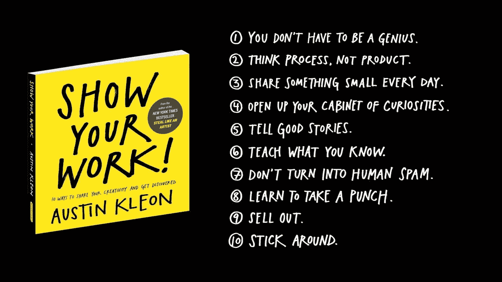

# 继续，从附带项目到真正的产品

> 原文：<https://medium.com/hackernoon/moving-on-from-side-projects-to-real-products-f6cc24f556ff>

The channels of Milano. Photo by Adrien Joly, February 2017.

## 失败的尝试很有趣。现在让我们找到适合的神圣市场！

在最新一期的每周视频“结束星期五”中，作家托德·布里森说了我今天需要听到的话:

> 当你开始一件新的事情时，每个人都会参与进来。[……]比赛开始时，每个人都很兴奋。(大助力)
> 
> 但是当你开始养成习惯时，每个人都不再关心了。(很冷漠)
> 
> 这是你可以做大量工作的地方。所以每当你从另一边出来，你真的开始爆炸了，每个人都会回头看你做了什么，然后说“哦，我的天哪，这家伙有一大堆工作要做。我可以忍受好几天。”
> 
> 从那时起，你开始改变世界。

因为，是的，当人们说**创业是一条孤独的道路**时，我现在感觉到了他们的意思。

# 第一级:大幅提升

当我决定不再为客户工作，转而[失败了](/@adrienjoly/from-immediate-profitability-to-pleasure-a-shift-of-priorities-3f767253084e#.mla183jok) ❌

*   吸引人们参加我的 Patreon 活动=> [失败了](https://www.patreon.com/adrienjoly) ❌

> 哦，事实上，我确实获得了一些收入:大约 80 美元来自那些想在 Patreon 上鼓励我的朋友(非常感谢！)，以及来自 Trello 下一步用户的 80 美元捐款。那总比没有好，但这是真实的收入吗？

从好的方面来看，这些试验确实帮助我认识到一些重要的事情。

**我需要学习和提高的地方有多少:**

*   如何找到一个好的市场，解决一个好的问题，
*   如何阐述一个好的价值主张，并测试它，
*   如何决定你是否应该继续朝着同一个方向前进，或者转向。

除了在自我意识的道路上又前进了一步，我很高兴我试着靠自己做到这一切。这让我真正意识到管理产品和发展业务的复杂性(以及所需的艰苦工作)。因此，这让我更加同情产品经理和业务开发人员。👏

# 通往第三级的道路:迭代和学习

尽管人们可以在独立黑客网站上读到所有成功的故事，但我知道要有所作为是不可能在一夜之间发生的。甚至连微薄的收入都没有。

我需要在**投入更多汗水**。并学会做出**更明智的决定**。

“Show your work!” by Austin Kleon. A huge motivator to keep crafting and sharing!

但是我真的需要靠自己奋斗**吗？**

我需要学习将产品转化为收入所需的所有技能吗？

我目前正在试验这个假设。我开始与才华横溢、积极进取的同事合作开发两个产品。我们的第一次迭代的测试阶段(*什么是精益* [*创业*](https://hackernoon.com/tagged/startup) [*企业家*](https://hackernoon.com/tagged/entrepreneurs) *被称为“MVP”*)正在进行中，这两款产品都是如此。

我还不确定我决定继续团队工作还是单干的标准是什么。我们走着瞧。

所以，现在，我要坚持我的朋友文森特的创业建议:

> 跟着你的直觉走！

# 要了解我的旅程，请订阅我的时事通讯:

 [## 阿德里安·乔利评论

### 埃德里安娜·乔利——每周，我都会分享我在一天内完成的一个兼职项目....

www.getrevue.co](https://www.getrevue.co/profile/aj-sideprojects) 

## 我也很感谢❤的评论和建议！🙌

> [黑客中午](http://bit.ly/Hackernoon)是黑客如何开始他们的下午。我们是 [@AMI](http://bit.ly/atAMIatAMI) 家庭的一员。我们现在[接受投稿](http://bit.ly/hackernoonsubmission)并乐意[讨论广告&赞助](mailto:partners@amipublications.com)机会。
> 
> 如果你喜欢这个故事，我们推荐你阅读我们的[最新科技故事](http://bit.ly/hackernoonlatestt)和[趋势科技故事](https://hackernoon.com/trending)。直到下一次，不要把世界的现实想当然！

