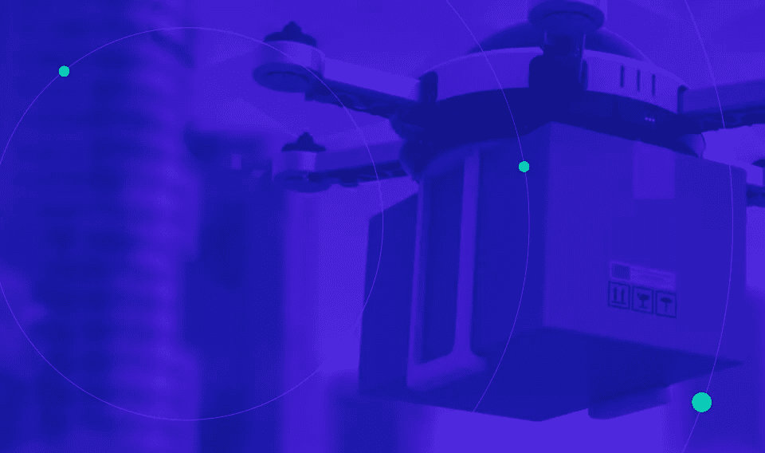
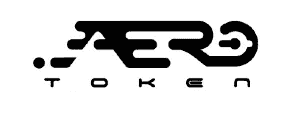

# 将共享经济转移到区块链——从空域开始

> 原文：<https://medium.com/hackernoon/moving-the-sharing-economy-to-the-blockchain-starting-with-airspace-dd7f741b8fb6>

## 基于区块链的共享经济将揭示可用的供应(即主机可用性)和需求数据，同时从根本上增加消费者的选择和主机收入机会。

AERO Token: Chain of Connectivity

出于讨论的目的，共享经济被具体定义为，“*消费者授予对未充分利用的物理资产(“闲置产能”)的临时访问权，可能是为了钱。”* [弗伦肯等人(2015)](https://www.theguardian.com/science/political-science/2015/may/20/smarter-regulation-for-the-sharing-economy) 。

在当前的共享经济中，主机和用户依赖可信的集中中介来促进主机/用户配对，提供可靠性晴雨表、争议解决机制，并在适用时确保补偿。虽然集中式中介可以而且肯定会为共享经济提供物质价值，但它们只不过是数字看门人，故意混淆供需数据，并不是它们长期价值主张的组成部分。

> “尽管集中式中介可以而且肯定会为共享经济提供实质性价值，但它们只不过是数字看门人，故意混淆供需数据，并不是它们长期价值主张的组成部分。”

此外，数据孤岛造成了主机和用户对中间服务提供商的依赖，限制了消费者的选择并阻碍了主机的潜在收入。正如每个共享经济公司(例如乘车共享服务)单方面发展和扩大其市场存在，这不仅仅是主机和用户在中间服务提供商之间交替以成功参与共享经济(例如预约搭车或接乘客)。

# 区块链上的共享经济:区块链和加密令牌的高影响力、真实世界使用

在点对点(或点对点区块链)共享经济中，主机将能够直接去区块链通知*所有*网络参与者和相关方他们的资产或服务是可用的。因此，[去中心化应用(**dApps**)](https://github.com/DavidJohnstonCEO/DecentralizedApplications/blob/master/README.md)***可以消除依赖任何一个*** ***组织*** 基于孤岛数据匹配潜在主机和服务提供商的依赖。

此外，dApps 可以利用智能合同来消除对第三方处理器的补偿依赖。智能合约可以确保在参与之前在请求参与者的钱包中持有足够的资金，并且在验证了合约中定义的参数的执行之后，将指定的资金转移到主机的钱包中。

# 对于共享经济来说，空域是一种未被充分利用的、有价值的理想资产

在共享经济中，主机通常会因共享其资产而产生“额外成本”。根据共享资产的环境和性质，有多种形式的额外成本可以以多种方式表现出来。从房屋清理到车辆维护，额外成本的严重程度因具体交易的资产共享类型而异(例如损坏主机财产的共享经济参与者)。此外，对于参与共享经济的所有人来说，实质性的非货币额外风险是固有的。当允许其他方进入某人的家、车辆或财产时，有不可忽视的责任问题和人身安全考虑。

在共享经济中，最大化主机收入机会的理想的*未充分利用的资产*是这样的资产:I)具有较低的额外货币成本；ii)具有最小的责任顾虑 iii)对所有相关方引入最小的物理风险。

给予无人机临时空域使用权以换取补偿，不仅解决了理想未充分利用资产的三部分定义，也是展示共享经济在区块链高效运行的理想用例。

# 基于区块链的共享经济将实现无人机高速公路

许多受尊敬的机构和公司正在致力于无人机飞行管理软件解决方案，而其他人则提出了政策倡议，旨在修改 FAA 控制的空域，以适应无人机和传统的有人驾驶飞机。

然而，如果没有一种有效的机制来允许和激励财产所有者将 ***低空通行权*** 授予无人机服务提供商，那么除了征用权行动之外，就没有切实可行的方法来生成可行的飞行路线并在不侵入的情况下大规模飞行商业无人机服务。

通过利用区块链， [AERO Token](https://aerotoken.com) 证明了私有财产上的空域这一未被充分利用的资产可以被轻松利用来创造收入，从而增强了共享经济。

AERO Token 提供了一种缺失的技术和法律机制，这种机制对于允许和方便财产所有者同意无人机在私人财产上空低空飞行是必要的。

但也许更重要的是，AERO Token 证明了区块链可以通过消除数据孤岛、增加消费者选择和建立可能对未来政策和经济问题的解决方式产生重大影响的用例，最大限度地发挥共享经济的潜力。

[**AERO Token**](https://aerotoken.com) 是一种基于以太坊的区块链技术，它使财产所有者(即主机)能够向授权的无人机服务提供商授予临时通行权地役权，以换取收入。

