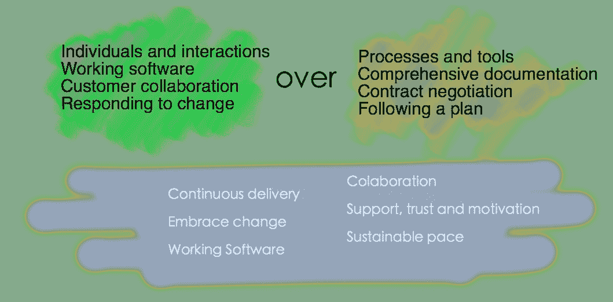
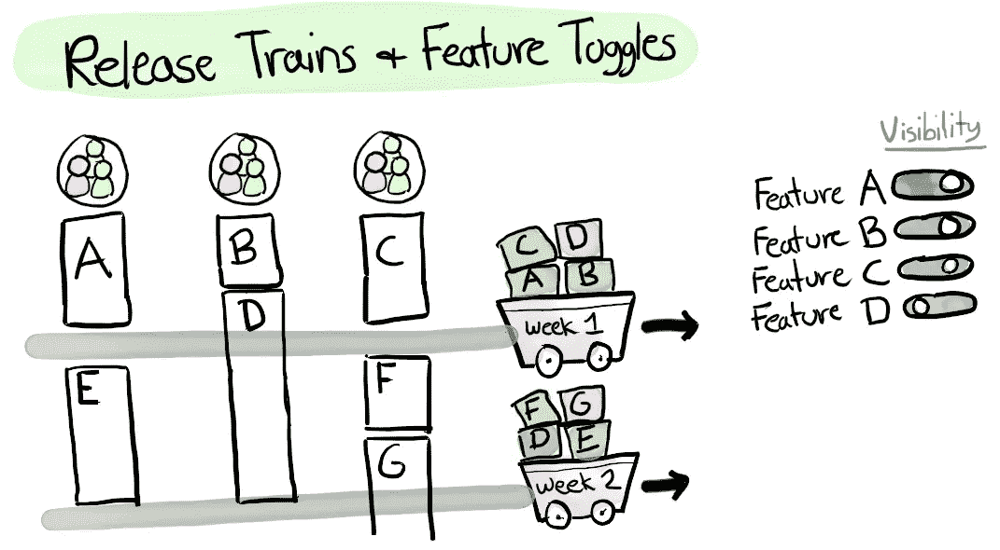
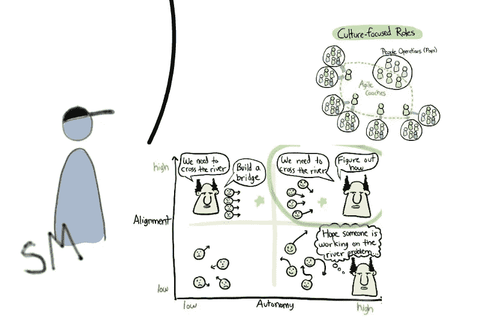
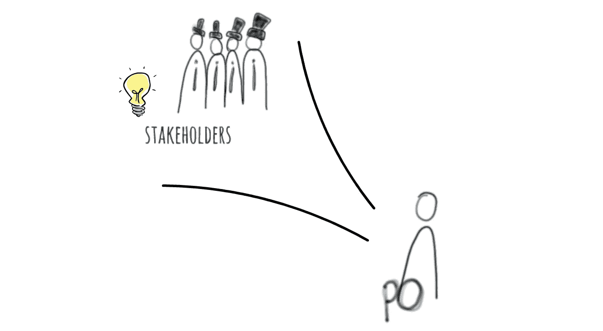
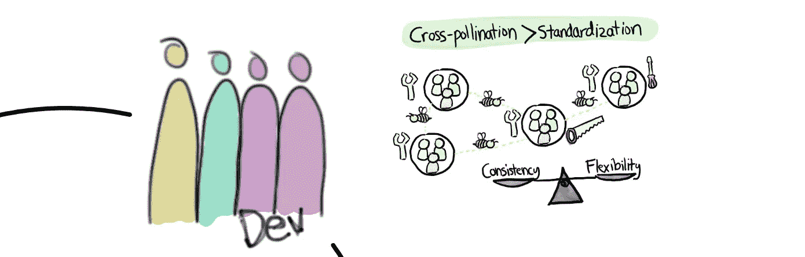
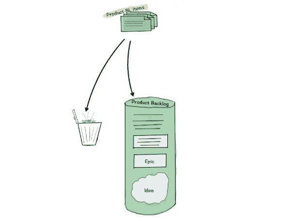
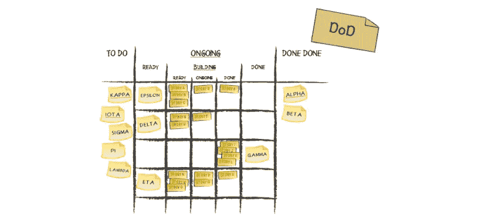
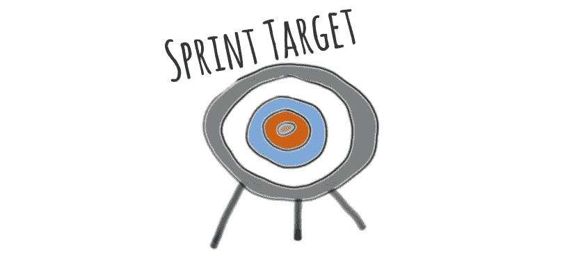

# 向敏捷环境转移(第二部分)——按常规进行 Scrum

> 原文：<https://medium.com/hackernoon/moving-to-an-agile-environment-part-ii-scrum-by-the-book-5733dc6bee3e>

> 亲爱的读者，我偶然看到这篇文章，想告诉你我几个月前的一次经历——从瀑布环境转移到敏捷环境的经历。我既不是敏捷专家，也不是 Scrum 专家，但是我会告诉你我从自己的经验中学到的东西，以及我从一些书籍和文章中找到的东西。这是第 2 部分，共 3 部分。

在这篇文章中，我会给你一个关于[敏捷](https://hackernoon.com/tagged/agile)和 scrum [框架](https://hackernoon.com/tagged/framework)的简要概述，然后，在第三部分[中，我会解决一些对所有这些工作都很重要的次要话题。](https://hackernoon.com/moving-to-an-agile-environment-part-iii-scrum-by-experience-35fb7b5af563)

# 敏捷

敏捷是一种描述软件开发的一套价值观和原则的方法，旨在指导软件开发团队寻求需求和解决方案的演变，以及适应性规划、快速交付、短开发周期和持续改进。它拥抱变化，而不是害怕变化。

然而，它并没有给你任何实现其价值观和原则的收据，这是**敏捷框架的**责任，在这篇文章中，我会给你一个关于 [**Scrum**](https://www.scrum.org/resources/what-is-scrum?gclid=CjwKCAjw7frPBRBVEiwAuDf_LTswDrFjtmrdUfmmFuL15GJ1QDTil0uBIuQhG54EdM7V40gZ_01n_BoCe9MQAvD_BwE) 的简要概述。

# 敏捷宣言

[敏捷宣言](http://agilemanifesto.org/)是任何敏捷环境背后的关键，它描述了一套你必须遵循的[价值观](https://www.smartsheet.com/comprehensive-guide-values-principles-agile-manifesto)和[原则](https://www.smartsheet.com/comprehensive-guide-values-principles-agile-manifesto)。但是如果你像我过去一样在瀑布模型中工作，你将需要改变你大部分的日常工作来实现这些。

这就是像 Scrum 这样的框架发挥作用的地方，它定义了角色、工件和契约。

# **Scrum 框架**

我想重点介绍一下这个框架的概况，但是我相信你需要阅读一些核心概念来理解更大的图景。让我们致力于这项小小的任务:

> 我们现在概述一下，但是如果在**的任何时候**你不知道什么是“产品负责人”、“Scrum 大师”、“每日例会”等等。您可以跳到本文末尾的“附录”中找到更多相关信息。

我们开始吧！

所以，上面这张图片代表了你实现 Scrum 所需要的一切。将所有这些付诸实践并不一定意味着你在一个敏捷的环境中工作，而是……循序渐进([快速阅读一下这个](http://agilitrix.com/2016/04/doing-agile-vs-being-agile/))。

就像我在之前说过的[，我们的目标是将我们的项目分成几个阶段，这样我们可以更频繁地交付，更快地获得反馈。这张图片代表了这些周期中的每一个，它们被称为](/@rodolfogonalves/moving-to-an-agile-environment-part-i-getting-started-4ed049d2b0c0)[冲刺](https://www.scrum.org/resources/what-is-a-sprint-in-scrum?gclid=Cj0KCQiA84rQBRDCARIsAPO8RFztsUAJfCNFX4mvIipd2cQqZqlaSg7O9iv9HBy2hkK4XEs0dvDYRUsaArLJEALw_wcB)。

冲刺必须在 **1 到 4 周**之间持续，并且始终**以 s **印刷计划**开始**，以**冲刺回顾/回顾**结束**(***附录 C* **)** 。中间是我们的产品实现的地方，在每个 sprint 的结尾，我们必须总是有一个新的产品工作版本，一个 [**潜在的可发布产品**](https://www.scruminc.com/potentially-shippable-product/) (接下来我们会看到为什么会有这个奇特的名字)。

让我们看看一个[用户故事](https://www.mountaingoatsoftware.com/agile/user-stories)从论文到生产的所有阶段！

## 从创意到生产

所有的创意都可以变成[用户故事](https://www.mountaingoatsoftware.com/agile/user-stories)、[秒杀](http://www.scaledagileframework.com/spikes/)、[科技故事](http://rgalen.com/agile-training-news/2013/11/10/technical-user-stories-what-when-and-how)等等。而这些都可以成为**产品待办事项(**附录 B **)** 或者干脆就是**垃圾**。所有 scrum 团队成员都可以对每个新想法发表意见，但是产品负责人(附录 A)负责决定它是上交 PBL 项目还是被丢弃。

当 PO 有足够多的 PBL 项目(5，8，10…)而没有任何度量时，他召集 Scrum 团队，解释每一个项目，这样每个人都能得到相同的理解，然后开发团队的每个成员(附录 A)使用[故事点](https://www.mountaingoatsoftware.com/blog/what-are-story-points)给出他的评估——这被称为**梳理**(附录 C)。

所以现在我们的新想法是一个产品待定项，并且有了它的估计，是时候定义它的优先级了。在产品待办事项中，项目从高到低、从上到下排序，PO 负责管理该订单。

当我们的第一个 PBL 项目到达顶端时，是时候进入下一个冲刺阶段了！

就像我说过的，每个冲刺都是从冲刺计划开始的。在 Sprint planning 阶段，scrum 团队聚在一起，决定哪些项目进入 Sprint backlog(附录 B)。但是我们可以在 Sprint backlog 中放置多少项呢？这是我将在第三部中提到的，但是现在我可以说它与**故事点**和**团队速度**有关。

一旦我们的**冲刺目标**(附录 B)被定义，开发团队就可以开始实现每一个项目，并在 [Scrum board](https://www.mountaingoatsoftware.com/agile/scrum/scrum-tools/task-boards) 上看到它的进展。Scrum 板由几个阶段组成，例如: **WIP、代码评审、UX 评审和 Done。**只有在以下情况下，项目才必须标记为完成:

1.  符合所有的[验收标准](https://www.boost.co.nz/blog/2010/09/acceptance-criteria)
2.  完成完成的[定义](https://www.scrumalliance.org/community/articles/2008/september/what-is-definition-of-done-(dod))
3.  经历 Scrum 板的不同阶段

在 sprint 期间，开发团队和 Scrum master 召开**每日会议**(附录 C ),每个团队成员都要回答以下三个问题:

1.  你昨天做了什么？
2.  你今天要做什么？
3.  你的道路上有什么障碍吗？

这里的目标不是通过某人的表现来惩罚他，而是了解冲刺进度，检查某人是否被某事卡住。这样，我们都可以意识到我们最初想法的状态，以及离完成还有多远。

然后，在 sprint 的最后一天，我们进行 sprint 回顾和回顾(附录 C)。这两者可以以任何顺序出现。

冲刺评审也被称为演示会议，因为在这个会议上 Scrum 团队必须向涉众演示产品的新版本。

这是我们的**潜在可发货产品**。一个新的**作品**版本**作品**即**可以出货生产了！**

****产品负责人负责决定新版本是否上线**。(我们的想法终于差一点就能见到天日了！耶！！)**

> **“哦不不。我如何发布我刚刚实现的东西？？?"**

**还记得 **DoD** 和**验收标准**和所有这些吗？质量保证，单元测试，集成测试，端到端… 这些都必须是它的一部分。这是您有效实现持续交付的唯一方式。**

**现在的问题是…**

> **“好吧。我已经实现并测试了我所有的故事，但是我的“用户模块”只有用户列表。现在还没有投产的意义。”**

**嗯……在这种情况下，我可以告诉你两种方法。**

1.  ****潜在可发货的产品没有发货**，就这么简单。这是一个潜在的船只，所以…如果 PO 不认为新版本有足够的价值来部署，所以不要。**
2.  ****使用** [**功能切换**](https://martinfowler.com/articles/feature-toggles.html) 。还记得我之前和你分享的那些来自 spotify 的视频吗？他们就是这么做的。你不会因为未完成的开发而影响你的交付。只需使用参数化系统并启用/禁用功能。例如，这对于 [A/B 测试](https://www.optimizely.com/optimization-glossary/ab-testing/)也很有用。**

****

**最后，当 PO 发现产品的新版本对我们的用户来说足够有价值时，**我们的想法会成为产品中的一个特性！****

**我刚刚给了你一个关于 Scrum 的快速浏览，但是你猜怎么着？关于它还有很多要了解的。在第三部分中，我将涉及一些额外的话题。**

**如果你有任何问题，请在评论中联系我。我会尽力帮助你。**

# **附录**

# ****附录 A —角色****

## ****Scrum master****

****

**Scrum master 负责在开发团队中建立平衡，给他们一些联合和自主权。**

**他的职责是解决任何阻碍问题，引入任何可能帮助团队更好更快发展的新技术，捍卫团队愿景，不仅在团队中建立信任，而且与利益相关者建立信任。他的主要目标是**尽可能地提高团队速度**。**

## ****产品负责人****

****

**产品负责人持有产品愿景和方向。他是 Scrum 团队和客户以及其他利益相关者之间的桥梁。**

**他的主要目标是交付更适合客户需求的产品，为此，他必须不断地从客户那里收集反馈，并评估哪些更改必须应用于改进产品。**

> **PO 持有产品价值，SM 持有开发团队愿景。**

## ****开发团队****

****

**开发团队是实干家，是他们实现了这一切！他们的职责是在 Scrum Master 的帮助下执行 PO 愿景。**

**团队由交付工作所需的人员组成——开发人员、测试人员、架构师、设计人员……任何需要的人。而且它的规模最好必须在 7 人左右，正负 2 人。**

**Scrum 说在开发团队中，头衔和角色必须被移除，这样我们才能实现跨功能。心态是*“我是负责交付这项工作的团队成员，我无法独自完成这项工作”*。**

# **附录 B—人工制品**

## ****产品积压****

****

**产品 backlog 是根据商业价值和风险划分优先级的项目列表，描述了实现远景所需的特性和功能。任何人都可以向这个列表添加新的条目，但是产品所有者有责任维护它，使它保持最新、优先或有序、清晰。**

**这是一个活的文档，永远不会结束，可以随时添加和删除项目。有几种类型的产品待定项，如用户故事、史诗、想法、峰值……重要的是，那些在顶部(最大优先级)的项目是清晰和详细的，而那些在底部的项目可以更加模糊，因为现在不是重点。**

## ****冲刺积压****

****

**sprint backlog 只是具有最高优先级的产品 backlog 项目的子集。当一个新的 sprint 开始时，一些项目被从产品 backlog 的顶部移走，放入 sprint backlog 中。这建立了 sprint 目标。**

****

**在 sprint 期间，项目从 sprint backlog 转移到 [Scrum board](https://www.mountaingoatsoftware.com/agile/scrum/scrum-tools/task-boards) 的不同阶段，只有当项目满足所有的[验收标准](https://www.boost.co.nz/blog/2010/09/acceptance-criteria)和[完成定义](https://www.scrumalliance.org/community/articles/2008/september/what-is-definition-of-done-(dod))时，才被确定为完成。**

> **"当一个待办事项被描述为“完成”时，每个人都必须明白“完成”是什么意思."**

# **附录 C——婚礼/集会**

## **[**修饰**](https://www.agilealliance.org/glossary/backlog-grooming/#q=~(filters~(postType~(~'page~'post~'aa_book~'aa_event_session~'aa_glossary~'aa_organizations~'aa_research_paper~'aa_video)~tags~(~'backlog*20refinement))~searchTerm~'~sort~false~sortDirection~'asc~page~1))**

**当 PO 有足够多的新产品待定项需要与团队讨论时(例如，在冲刺阶段的任何时候)，就会发生扣分。在这次会议中，PO 解释了每个项目，以便每个人都能以相同的方式理解，然后开发团队的每个成员使用[故事点](https://www.atlassian.com/agile/estimation)给出了他的评估。**

**在这次会议中，可以添加新项目，删除其他项目，更改一些项目，列表的顺序也可能改变。**

## **[**冲刺规划**](https://www.mountaingoatsoftware.com/agile/scrum/meetings/sprint-planning-meeting)**

**冲刺规划可以分为两个部分。第一个是 PO 告诉**他想在冲刺阶段完成什么**(冲刺目标/目的)，第二个是团队定义**如何完成**。PO 不必出席第二部分，因为他不参与技术讨论。**

## **[**每日例会**](https://www.scrum.org/resources/what-is-a-daily-scrum?gclid=CjwKCAjw7frPBRBVEiwAuDf_LUxbI3rhQECzLAn8vq-E8HD3O25TGYF1iSlqI0Rn4jaOfPK_gXBMCxoCCuoQAvD_BwE)**

**每日例会是团队同步的机会。该会议由 SM 主持，每个团队成员都要回答以下标准问题:**

*   **自从上次会议以来，你完成了什么？**
*   **你今天要完成什么？**
*   **在你的道路上有什么阻碍或障碍。**

## **[**冲刺复习**](https://www.scrum.org/resources/what-is-a-sprint-review)**

**在冲刺的最后一天，团队进行冲刺评审。它也被称为“演示会议”，在这里客户有机会回顾项目到目前为止的进展。这是团队可以从客户那里收集有价值的反馈的地方。**

**在这个会议中，团队必须寻求客户的认可。有时客户会说有些功能没有交付或者没有按预期交付。在这些情况下，工作可能会被放回产品待办事项中。**

## **[**回顾**](https://www.scrum.org/resources/what-is-a-sprint-retrospective)**

**sprint 回顾也发生在 sprint 的最后一天。这为团队提供了一个机会来确定如何**改进其工作流程和执行**。SM 和开发团队的每个成员都必须出席，这一点很重要，PO 不需要参加此会议。**

**(这些改进被称为**改善**。)**