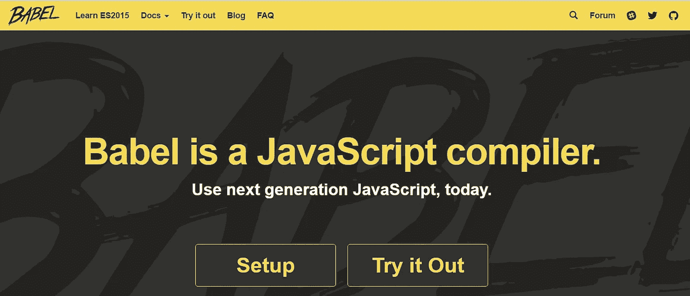
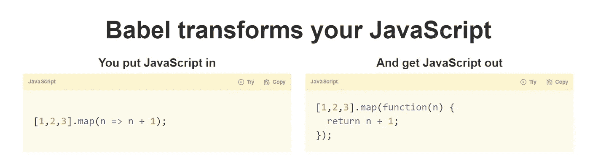

# 转向 ES6 —巴别塔和 Transpilers

> 原文：<https://medium.com/hackernoon/moving-to-es6-babel-and-transpilers-337921c025b1>

为了启动和运行 ES6 的最前沿特性，使用一个叫做“Transpiler”的工具是很有帮助的。这里有一个简单的介绍，因为虽然你可能已经看过这个术语，但是对于这些“编译器”或“传输器”工具的功能并没有简单的介绍。

由于在互联网上活跃的设备上的 web 浏览器分布存在巨大的碎片，ES6 支持往往因浏览器而异。Transpiling 是将一种语言编写的源代码转换成另一种具有相似抽象层次的语言。

随着对新标准的支持慢慢被采用，我们将不得不把我们的代码库从一个层次转移到另一个层次，比如从 ES5 到 [ES6](https://hackernoon.com/tagged/es6) 。值得注意的是，编译器和转换编译器都会在编译过程中优化你的代码。这就是 transpilers 发挥作用的地方。这些 transpilers 可以将代码从一个源转换到另一个源，比如将 TypeScript 转换成 [JavaScript](https://hackernoon.com/tagged/javascript) ，或者将 ES5 Javascript 转换成 ES6。将所有这些都装载到客户机上是不可能的。

这是将源代码转换成原生 JavaScript 更符合逻辑的地方，也是 transpilers 发挥作用的地方。作为初学者，对人类最友好的 transpilers 之一叫做 Babel。

Babel 能够以人类可读的形式给出详细的输出，从而使调试代码变得更加容易。该工具还有各种各样的可用插件。你可能会发现自己正在使用的一些重要插件有:ES2015、ES2016、ES2017 和 React。Babel 还有一个名为“latest”的插件集，它会定期更新所有可能的工具，以跟上 JS 的最新创新。

简单来说，

现在，您可以在代码中编写许多很棒的 ES6 特性。Babel 会进行转换，这样就可以被最新的浏览器支持了。

【https://babeljs.io/ 

我将会写一些关于 ES6 特性的文章，这些特性比目前支持的 ES5 特性有了很大的改进。

> [黑客中午](http://bit.ly/Hackernoon)是黑客如何开始他们的下午。我们是 [@AMI](http://bit.ly/atAMIatAMI) 家庭的一员。我们现在[接受投稿](http://bit.ly/hackernoonsubmission)并乐意[讨论广告&赞助](mailto:partners@amipublications.com)机会。
> 
> 如果你喜欢这个故事，我们推荐你阅读我们的[最新科技故事](http://bit.ly/hackernoonlatestt)和[趋势科技故事](https://hackernoon.com/trending)。直到下一次，不要把世界的现实想当然！

