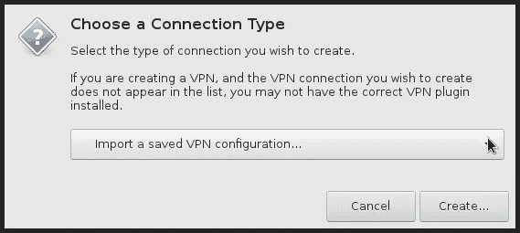

# 一个终生的 Windows 用户如何转向 Linux…艰难的道路

> 原文：<https://medium.com/hackernoon/moving-to-linux-with-debian-base-system-and-i3-cf3c771b8a5c>

*读者您好！这篇文章(以及我所有的文章)的更新版本在我的网站上免费提供:*[*Victoria . dev*](https://victoria.dev)*—感谢阅读！*

> 最初发表于 [vickylai.io](https://vickylai.io/verbose/how-windows-user-switched-to-linux/) 。

让我先说，我一直对发现事物如何工作很感兴趣。如果一个东西做了某件事，我想知道为什么，怎么做，以及我是否可以定制它。

Windows 10 让我抓狂应该不足为奇。

看似任意的更新在任何一天都会导致漫长的启动过程，意外的重启意味着我会丢失我的会话，从而丢失我前一天的思维过程，最糟糕的是我从来不知道它们的目的是什么。Windows 10 是一个令人费解的神秘蓝屏，我没有参与决策。

谢天谢地，对于我和其他像我一样的人来说，还有一个选择。嗯，有好几个——许多 Linux 发行版存在，大多数都是熟悉的，并且在新安装时完全可用。也许最著名的“类 Windows”发行版之一是 Ubuntu。它有一个类似于 Windows 10 的桌面，非常图形化，通常适合那些 Linux 新手。

我选择了 Debian，Ubuntu 的发行版。它不像其他功能丰富的发行版那样牵着你的手，更具可定制性。我从这里找到的[小安装镜像开始](https://www.debian.org/distrib/)，你可以下载并使用它来创建一个可引导的 USB。

不完全是故意的，主要是由于糟糕的互联网连接(我是东南亚的数字流浪者——这是意料之中的),我最终从 Debian base system 开始。这是最基本的 Debian 安装，排除了我作为以前的 Windows 用户认为理所当然的东西。在其他事情中，我必须找到并安装(或至少配置):

*   一个窗口管理器[(i3)](https://wiki.debian.org/WindowManager)
*   让我连接到互联网的应用程序(网络管理器/网络管理小程序)
*   让我控制屏幕亮度的程序(xrandr)
*   一个处理声音的程序，叫做[声音服务器](https://en.wikipedia.org/wiki/Sound_server) (pulseaudio)
*   事件处理程序，比如告诉我的笔记本电脑在我合上盖子时暂停
*   显示基本状态信息(i3 条)
*   桌面通知(dunst)
*   基本程序，如图形文件管理器(PCmanFM)、pdf 查看器(Okular)和图像编辑器(Darktable)

如果你不像我一样，宁愿从一个功能更全的桌面环境开始，Debian 的 Net Install 会给你一个默认的带有 GNOME 桌面环境的“标准系统”。Debian 有一个[完整的安装指南](https://www.debian.org/releases/stable/installmanual)，可以带你完成这个过程。

然而，通过艰苦的努力，我学到了很多。从基础系统开始，我对表面下发生的事情有了一个更好的视角。如果将来我遇到一个组件的问题，我更有可能知道如何开始修复它，因为我首先把它组装起来。

一路上，我确实遇到了一些困难，也发现了一些比其他方法更有效的方法。我在这篇文章中讨论了其中的一些事件。但首先，出于动机，完整的截图:


我在 GitHub 上发布了我所有的[配置文件，以防你想偷我的甜米。](https://github.com/hivickylai/i3-linux-config-tokyo-rice)

# 以下涵盖的主题:

*   首先什么是配置文件？
*   这些配置文件都去哪里了？
*   我选了一个愚蠢的用户名，我如何改变它？
*   如何让 NetworkManager 和 Dropbox 自动启动？
*   如何用 NetworkManager 设置 OpenVPN？
*   如何让我的 VPN 状态显示在 i3bar 中？
*   如何让我的打印屏幕/背光控制/音量键工作？
*   我编辑了我的配置文件，但我没有看到任何变化。WTF？

# 首先什么是配置文件？

如果你是 Linux 或编码新手，这些基本上是技术用户版本的 [GUI 程序](https://en.wikipedia.org/wiki/Graphical_user_interface)中的“文件>首选项”。根据您正在配置的应用程序，有几种不同的格式和语言。幸运的是，通过简单的网络搜索，可以获得大量的配置文件示例。

# 这些配置文件都去哪里了？

我发现一些不同的文件路径。以下是我和作品:

```
systemd event handlers: /etc/systemd/logind.conf For URxvt: ~/.Xdefaults For i3wm: ~/.config/i3/config For i3bar: ~/.config/i3status/config/i3status.conf For dunst: ~/.config/dunst/dunstrc for Compton: ~/.config/compton.conf
```

# 我选了一个愚蠢的用户名，我如何改变它？

这很有趣。原来，更改用户名搞乱了一大堆东西，我不得不去修复/重新安装，其中包括:

*   Dropbox
*   蟒蛇和皮普
*   在配置文件中完整写入的文件路径

为了避免我所经历的麻烦，在你设置大部分程序之前，请更改你的用户名。如果为时已晚，请注意许多包含带有`/home/oldusername/...`的文件路径的程序都会受到影响。

要通过终端更改您的用户名，请以 root 用户身份登录，然后:

```
$ killall -u oldusername $ id oldusername >>> uid=1000(oldusername) gid=1000(oldusername) groups=1000(oldusername),24(cdrom),25(floppy),27(sudo),29(audio),30(dip),44(video),46(plugdev),108(netdev) # change login name $ usermod -l newusername oldusername # change group name $ groupmod -n newusername oldusername # modify home directory $ usermod -d /home/newusername -m newusername # add comment with full name $ usermod -c "New Full Name" newusername # check that "newusername" replaces "oldusername" in all fields $ id newusername >>> uid=1000(newusername) gid=1000(newusername) groups=1000(newusername),24(cdrom),25(floppy),27(sudo),29(audio),30(dip),44(video),46(plugdev),108(netdev)
```

如果您之前在 i3 中设置了背景图像，但它消失了，不要忘记检查配置文件中的文件路径。

# 如何让 NetworkManager 和 Dropbox 自动启动？

Dropbox for Linux 应该有一个自动启动设置，你可以在终端中输入`dropbox autostart y`，它就会监听。这对我没用。相反，我使用以下语法将任何我想在登录时自动启动的应用程序添加到 i3 配置文件中:

```
# start apps automatically exec --no-startup-id /usr/bin/nm-applet exec --no-startup-id dropbox start
```

在上面的例子中，`exec`是“执行”，`--no-startup-id`基本上让你不用看着你的光标做加载的事情，命令的最后一部分是程序的文件路径或者启动它的语法，就像在终端中输入一样。

# 如何用 NetworkManager 设置 OpenVPN？

首先，确保你已经做了`apt-get install network-manager-openvpn`来获得插件。

您将需要 client.ovpn 文件。在我的例子中，我使用 Amazon EC2 设置了自己的 VPN，并从我的 OpenVPN 控制台页面下载了 client.ovpn 文件。

使用文本编辑器(如 vim 或 gedit)打开 client.ovpn，并将“远程 openvpn 端口 xxxx”的任何实例改为“远程< your ip address >端口 xxxx”。

使用 nm-applet 建立新的 VPN 连接。如果你已经安装了 OpenVPN 插件，你会在下拉列表中看到 OpenVPN 选项。选择“导入保存的 VPN 配置”选项。



一旦您加载了 client.ovpn 文件并单击“Create”，除了您的用户名和密码之外，所有的设置都会自动填写。插上电源，你就可以开始了。

# 如何让我的 VPN 状态显示在 i3bar 中？

找到 i3status 配置文件。如果你还没有，你可以用一个很棒的模板，比如 [mine](https://github.com/hivickylai/i3-linux-config-tokyo-rice) 。

在以下代码段中编辑文件路径:

```
run_watch VPN { pidfile = "sys/class/net/yourspecialsetting0" }
```

其中“您的特殊设置”是`tap` / `tun` / `tun tap`中的任意一个，具体取决于您的 VPN 设置。如果不知道是哪个，可以在 VPN >高级>“设置虚拟设备类型”下的 VPN 配置设置中查找。

# 如何让我的打印屏幕/背光控制/音量键工作？

我在 i3 配置文件中使用了键绑定。棘手的部分是找出是什么控制了特定的功能(在某些情况下，必须安装一些东西来控制该功能)。

```
# brightness adjustment (pre-defined levels) bindsym $mod+Shift+F6 exec xrandr --output eDP-1 --brightness 1 bindsym $mod+F6 exec xrandr --output eDP-1 --brightness 0.8 bindsym $mod+F5 exec xrandr --output eDP-1 --brightness 0.5 bindsym $mod+F7 exec xrandr --output eDP-1 --brightness 0.1 # volume control (increment) bindsym $mod+F12 exec amixer -q sset Master 3%+ bindsym $mod+F11 exec amixer -q sset Master 3%- bindsym $mod+F10 exec amixer -q sset Master toggle
```

如你所见，在 xrandr 的情况下，我只能找到一种方法来设置特定的级别。对于音量控制，amixer 似乎提供了增量。

# 我编辑了我的配置文件，但我没有看到任何变化。WTF？

对于一些东西，比如 i3 中的壁纸和 dunst 通知，我发现我必须重新加载应用程序(对于 i3，在终端中键入`i3-msg restart`)或者重启我的 X 会话(注销并重新登录)才能看到变化。

切换到 Linux 绝对是值得的。虽然学习和发现的过程有些挑剔和令人沮丧，但我真的很享受每一分钟。没有什么能比得上想出办法并让它发挥作用的感觉了！

我希望这篇文章对你有用！

感谢阅读！

*想学习如何编码？我在*[*Victoria . dev*](https://victoria.dev)*上用美食涂鸦解释编码概念。*