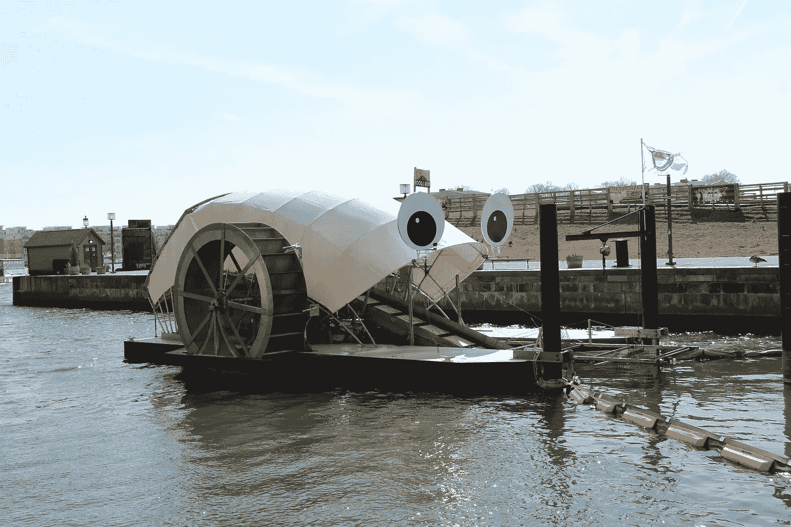

# 垃圾轮先生

> 原文：<https://medium.com/hackernoon/mr-trash-wheel-96dd0df73dc3>

## 利用科技清理巴尔的摩港

有了[literati](http://www.litterati.org)，我们经常思考那些能让我们改善自然环境的创新。不管是学校、水路、徒步旅行路线还是城市街区，都有大量的工作要做。一次清理一片垃圾的愿望可能是一项艰巨的任务。

因此，当我们发现像巴尔的摩内港收集废弃垃圾的巨型垃圾轮这样的故事时，它让我们停下来反思:如果巴尔的摩地区可以通过公共/私人资金产生一个收集超过 354 吨垃圾的项目——如果我们通过移动应用程序通过技术[让人们做出贡献会怎么样？](https://itunes.apple.com/us/app/litterati-crowdsource-cleaning/id982782776?mt=8)

credit: [http://baltimorewaterfront.com/](http://baltimorewaterfront.com/)

如果 5 个人一周 5 天每天捡 5 件，我们就能在当地产生重大影响。

5 人 x 5 件 x 每周 5 天= 6250 件。

想象一下一个五年级班级、社区企业或女童子军能带来的变化。不需要太多就能产生影响。

以这些地方为例，按县、州和地区放大，我们的集体影响会更大。

同样，巴尔的摩的垃圾轮先生让一个真正困难的问题变得容易解决——让巴尔的摩内港[的海湾在 2020 年](http://baltimorewaterfront.com/healthy-harbor/)前可以游泳和捕鱼，我们也可以通过 Litterati 做到这一点。这种模式可以应用于旧金山湾区、纽约北部的哈德逊谷等地区。

关于垃圾先生的更多信息，请查看[实时反馈](http://baltimorewaterfront.com/healthy-harbor/mr-trash-wheel-live-feed/)或关注[推特](https://twitter.com/MrTrashWheel)。

如果你有关于你所在地区环境影响的故事，我们很乐意听到更多。

> [黑客中午](http://bit.ly/Hackernoon)是黑客如何开始他们的下午。我们是阿妹家庭的一员。我们现在[接受投稿](http://bit.ly/hackernoonsubmission)并乐意[讨论广告&赞助](mailto:partners@amipublications.com)机会。
> 
> 如果你喜欢这个故事，我们推荐你阅读我们的[最新科技故事](http://bit.ly/hackernoonlatestt)和[趋势科技故事](https://hackernoon.com/trending)。直到下一次，不要把世界的现实想当然！

