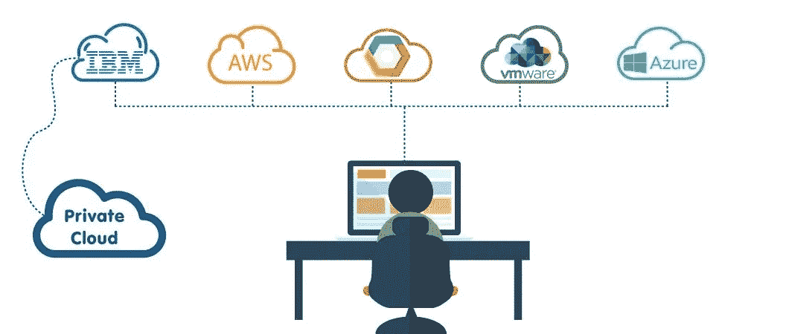

# 多云不是一个选择

> 原文：<https://medium.com/hackernoon/multi-cloud-is-not-a-choice-574d4f09d962>

开发社区构建坚固的整体应用程序来跨多个公共/私有服务器进行水平扩展的日子已经一去不复返了。

世界正在走向微服务，因此部署、维护和扩展各种微服务的压力现在转移给了 devops 团队。

今天构建的微服务在计算、存储、内存、网络等方面彼此有很大不同。，因此在选择云服务提供商之前应该考虑这些因素。

随着 GCP 和 Azure 等其他玩家占据主导地位，云平台市场的无冕之王 AWS 正在失去垄断地位。

根据您的微服务器最需要的几个因素来选择云平台

**计算**

计算是选择云服务提供商的最重要的标准，所有三大提供商都以自己的方式给人留下了深刻的印象。因此，当你必须为计算密集型程序选择服务时，它总是最划算的。

**服务项目**

所有三个云平台都与多种服务产品捆绑在一起，让我们的生活变得更加轻松。根据特定用例的要求，客户可以选择哪个云 IaaS 供应商适合他们的需求。

**储存**

考虑到社区、支持、可靠性和更好的文档，AWS 及其亚马逊 S3(简单存储服务)在这一领域处于明显领先地位。

**地点**

AWS 和 Azure 凭借其跨多个地区和特定位置的高可用性在竞争中保持领先。别忘了 GCP 会定期增加新的地区。

**文档**

AWS 提供最好的文档，紧随其后的是 Azure 和 GCP。AWS 文档的建立得益于它的历史和十多年来许多人的贡献。

**其他玩家**

很少有其他玩家在市场上有足够的竞争力，提供针对初创企业和中型企业的惊人服务。

*   [亮盒](https://www.brightbox.com/)。总部设在英国的云托管团队坚持 100%正常运行时间。
*   [Codero](http://www.codero.com/) 。托管、专用和云托管。
*   [数字海洋](https://www.digitalocean.com/)云计算，为开发者设计，价格有竞争力。
*   [Kyup](https://kyup.com/) 。Linux 容器上的可扩展云托管。
*   李诺得。满足多种基础设施需求的高性能固态硬盘 Linux 服务器。
*   [数据包](https://www.packet.net/)。一个[贱金属](https://en.wikipedia.org/wiki/Bare*machine)云为开发者打造。
*   [Rackspace 云](https://www.rackspace.com/cloud)。由开源技术 OpenStack 提供支持。
*   [SoftLayer (IBM 云)](http://www.softlayer.com/)。由 IBM 支持的分布广泛的企业的另一个选择。
*   [Vultr](https://www.vultr.com/) 。高性能固态硬盘云在全球 14 个城市上市，价格极具竞争力。

比较云服务可能是一项艰巨的任务，但鉴于产品的多样性水平，我们无法回避云计算