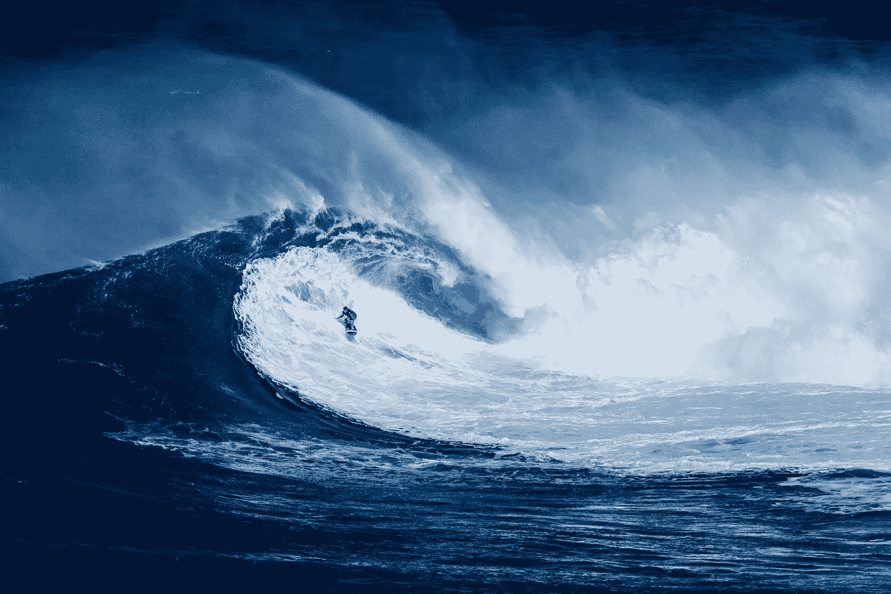
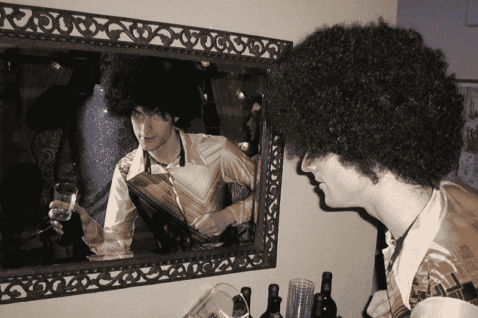

# 27 岁成为千万富翁。我学到的。

> 原文：<https://medium.com/hackernoon/multi-millionaire-at-27-what-i-learned-7df8153f5425>

StockSnap.io

2000 年初，我是硅谷一家技术公司的早期员工，该公司设计并销售尖端的计算机处理芯片。当我开始的时候，有几十个人。我离开的时候，有几千个。我是一名计算机处理器工程师、建筑师和经理。该公司现在是世界上最大和最成功的公司之一。

我赚了几百万美元。我从来没有真正算出到底有多少钱。我想可能有五百万左右。我知道我至少一年的调整后总收入大约是 150 万美元。我每年至少赚 50 万美元。

以下是我从相对富裕中学到的一些东西。

This is what I looked like (at a costume party)

# 金钱不会让你快乐

有些人说金钱不会让你快乐，然而他们继续努力变得更富有，希望变得更快乐。说出来或想出来是一回事，经历出来完全是另一回事。

金钱不会让你快乐，也不会让你满足。我记得在一个特别具有挑战性但令人满意的项目结束时，我把脚放在桌子上，深呼吸，意识到我拥有了一切。

我在山景城(谷歌总部所在地)有一栋价值百万美元的豪宅。我在那栋房子上有小额抵押贷款，但我可以随时还清。我在另一个国家有一栋完全属于我的房子。我有用现金购买的豪华汽车。我家里有个迷人的妻子。我在工作的地方很受尊敬。我有自由去做我选择的任何事情。我有很高的薪水，丰厚的股票期权，以及多得我都不知道该怎么花的钱。

但我感到焦虑和不满。在某种程度上，我追求成功的动力来自于一种信念，即当我拥有足够的财富时，我内心深处的痛苦就会消失。我亲身体会到，一旦我们的基本需求得到满足，我们所经历的满足感和幸福感的水平与我们拥有多少财富无关。

事实上，财富实际上会让生活变得更糟。我们可以通过把钱花在我们不需要的东西上，或者担心失去我们的财富，来利用财富转移我们对更深层问题的注意力。有了财富，生活也会变得更加复杂。

我意识到我倾向于担心将来没有足够的钱，这种恐惧伴随了我一生。它与我的净资产或净现金流不相关。

# 你只能帮助人们自助

我没有在太浩湖买度假别墅或投资房产，而是在另一个国家买了一栋房子给我的大家庭的一些成员居住。我让他们住在那里，几年不付房租。我实际上每年从自己的口袋里拿出数万美元给他们。

我后来发现，这些人因为我这样做而怨恨我。他们觉得我像对待孩子一样对待他们，并声称我没有让他们参与选择和购买房子的过程。他们声称是我让他们失去了与前任房东拥有的一栋小得多的房子的优惠租赁权。他们声称他们不喜欢我买的房子。

在经济上，我不仅损失了那栋房子的租金，还损失了大量的货币兑换、买卖费用和极低的投资回报。整个过程耗费了我大量的时间和精力。

我曾经相信人天生就是讲道理的，善良的。这个过程告诉我，我不应该假设人们是可以依赖的，或者其他人一定会从我这里得到，就像我从其他人那里得到一样。

我从这件事中学到了另一个重要的教训。我现在从不帮助那些不向我求助的人，即使那样，我也只在他们要求的范围内帮助他们。我也寻找我能帮助的方法，这些方法不会损害我自己的立场，并且只需要我最少的金钱、时间和努力。

# 总会有人比你有钱

如果你把你的价值等同于你拥有的东西的多少，那么你会一直注意到比你拥有更多的人，你会一直觉得自己不够格。

如果你深受其害，你就不会达到净资产的神奇水平，也不会最终意识到自己是有价值的。事实上，问题只会变得更糟。我在山景城买了一栋更大、更豪华的房子，主要是因为我觉得我在圣克拉拉的房子不够豪华。在那个时候，我不能像我的一些朋友那样买到如此精美的东西。当我搬到山景城时，我认识的一对夫妇从帕洛阿尔托(已经比山景城好了)搬到了超级豪华的洛斯阿尔托斯山。

诀窍是计算出你实际需要和想要多少钱来满足你的实际需求。过合理的[生活方式](https://hackernoon.com/tagged/lifestyle)需要多少钱？可选地，你也可以计算出你需要积累多少财富才能在过自己选择的生活方式的同时实现经济独立。

治愈伤口也很重要，伤口会让你努力感觉到基于你所拥有的东西的价值。我相信我根本毫无价值。通过心理治疗、指导、真诚的友谊和治愈亲密关系的过程，我开始明白我有丰富的内在价值。别人欣赏我只是因为我的本质，而我学会了如何内化这一点，所以现在我也可以欣赏我的本质。

# 奢侈品是一种令人上瘾的毒品

节俭的博客作者金钱小胡子先生告诉我们，奢侈就是弱点。奢侈品是一种令人上瘾的毒品。在我们明白这一点之前，它有能力毁掉我们的生活。

我记得开着我全新的豪华跑车，并注意到我的身份正变得与汽车紧密相连。我意识到这辆超贵的车会用坏，然后我需要再买一辆。为了保持我的身份，我需要不断创造大量的金钱。就像吸毒一样。车并没有让我感觉很好，但是没有车的想法让我感觉很糟糕。所以我意识到我需要保持这种状态来感觉正常。

这个让药物恢复正常的过程，是吸毒者的普遍经历。此外，随着滥用时间的推移，对药物的耐受性会增加。曾经令人满意的药物量开始没有预期的效果。我们发现我们需要越来越多的物质或经验来恢复正常。

问题在于，正如 U2 的歌词所说，“你永远不会满足于你并不真正需要的东西。”一旦你有了保时捷 Cayenne Turbo，你就开始希望有一辆宾利 Bentayga。你拥有的奢侈品越多，你需要的奢侈品就越多，但奢侈品永远不会真正满足它承诺要挠的痒。

奢侈让我们感到成功，我们在生活的游戏中获胜，我们不仅在生存，而且在繁荣。就像我们大脑中的阿片类药物一样，奢侈锁定了我们的生存受体。具有讽刺意味的是，购买奢侈品，并依赖它来获得自我和幸福，会导致我们耗尽我们实际生存所需的资源。

事实证明，遵守节俭生活、投资而不是消费、修补和凑合、不用工作就能活得越来越久的原则，才是衡量财富的真正标准。深深享受你现在正在经历的一切是最大的财富。

那些坐在朝九晚五的跑步机上的人，工作是为了支付豪华汽车每天开两个小时上下班的费用，他们真的是坐在豪华跑步机上。这些人沉溺于奢侈。

# 有些人很肤浅

我过了很长一段时间的中年退休生活。在那段时间里，我一直在攻读博士学位，并开始创业。我记得在我 30 岁出头的时候，有一次在一个聚会上，一个非常有魅力的女人向我走来，做了自我介绍，然后问道:“你是做什么的？”我回答说:“我是学生。”

在我意识到之前，她已经转身离开了我。她立刻停止和我说话，消失在人群中。我记得我真的很受伤。我觉得自己一无是处。据推测，她不想和我说话，因为我是一个学生，也许她认为我没有钱。几天后，在进一步思考肯定发生了什么之后，我明白了其中的讽刺意味，我可能是派对上最富有的人。我也明白我的运气，她没有逗留。

我知道许多人拥有极高的净资产。这些人大多穿着睡衣、人字拖或短裤。你不能通过一个人的穿着来判断他有多富有。你也不能通过一个人有多少钱来判断他有多富有。

# 每个人都尊重财富

我想不出这方面的具体例子，但我知道我有过很多这样的经历:当人们意识到我有多少钱时，他们对我的态度非常不同。拥有金钱似乎表明你是成功的，这与你在生活的其他领域有多成功完全无关。

我也见过新时代的人不屑于谈论金钱，并声称“金钱不会让你幸福”，“富人都是混蛋”，以及其他各种各样的言论，表明了对金钱的厌恶。后来，我看到同样是这些人开始赚钱和积累财富，我看到他们大肆消费和炫耀。

金钱作为选择和自由的象征是如此强大，以至于它不可能不在人们身上激起强烈的反应，并产生强烈的反应。

# 大多数财务顾问一无所知

我去了一家股票经纪公司的财务顾问那里，就如何管理我的钱征求了一些建议。这两位顾问，实际上是“股票经纪人”，告诉了我很多他们在夏威夷跑马拉松的事，然后建议我买一些个股。几个月后，他们会打电话给我，“我们喜欢朗讯科技！”我会说，“好吧，给我买 2 万美元。”然后他们会给我 1000 美元的佣金。那是“喜欢”某样东西的 5%佣金。我是个傻瓜。我有一个在线经纪账户，在那里我可以花 10 美元买到同样的股票。

当我告诉他们我的股票期权时，他们说:“没听说过那家公司！你需要摆脱它！”我最终兑现了我公司的大量股票，买了他们喜欢的所有热门互联网股票。在我与他们的最后一次会面中，他们问我是否可以行使并出售更多我的股票期权，以便购买一些 x 公司的股票。我告诉他们我不能，因为我正处于封锁期。他们看起来很困惑。

后来，我收到一封电子邮件，告诉我我的一批股票期权已被行使和出售，我是 x 公司自豪的所有者。我打电话问他们发生了什么事。他们说我已经告诉他们卖掉股票。我说我没有。电话里的那个人告诉我，他的搭档去过那里，并目睹了这一切。在我因内幕交易入狱之前，我告诉他们撤销股票交易，然后我解雇了他们。

这时我才意识到，我在一些我一无所知的公司里拥有价值数十万美元的股票。回想起来，我感到欣慰的是，股票经纪人对股票也一无所知。也是在那个时候，网络泡沫破裂，一篮子股票的价格下跌了一半，而我工作的公司的股票继续上涨(这不是一家网络公司)。

我开始阅读关于投资的书籍。我从沃伦·巴菲特那里学到了最有价值的信息。他说，如果你没有时间或兴趣调查和跟踪个股，最好购买指数基金或指数跟踪股票。这是因为大多数共同基金经理不能战胜市场，但他们收取高额佣金。对于这些股票经纪人，我甚至没有购买管理型共同基金，我只是根据他们的选择购买个股。这是我做过的最糟糕的事情。

我还了解到，出于这样或那样的原因，华尔街的大多数人要么不知道到底发生了什么，要么无法做出最有效的决策。例如，大多数华尔街人士与现实世界中发生的事情脱节，所以他们不知道趋势是什么。在《嘲笑华尔街》一书中，作者解释了他是如何通过在机构投资者意识到之前几个月就注意到华尔街的趋势，从而击败机构投资者买入和卖出股票，从而赚了数百万美元。大型共同基金决策选择的局限性的一个例子是，中小型公司的增长速度往往比整个市场快得多，但大型共同基金不能或不愿意投资它们，因为它们太小了。共同基金通常必须保持一定的投资组合，以保持在那些已经投资于它们的人所指定的参数范围内。即使是对冲基金也很难做出有效的长期选择，因为它们总是试图在短期内让投资者满意。

请注意，我说的是真正的华尔街类型，真正的投资银行家和共同基金经理。我当地的股票经纪人甚至还不到那个程度。然而，华尔街的无能令人震惊。我推荐阅读《大空头》这本书(一部由它改编的电影)，以了解通过阅读财务报告并思考它们的激进方法有多少赚钱的机会。顺便说一下，阅读和思考是巴菲特的两大秘密武器。

# 银行也敲诈富人

我在各国之间转移了大量资金，我还利用银行提供的服务帮助富人毫不费力地转移资金。在经历了几次在这些交易中损失巨额资金的经历后，我更深入地研究了一下，发现尽管银行在国家和货币之间转账不收费，但它们确实会增加汇率的利差。这种差价如此之大(几个百分点),以至于他们可以在一笔交易中赚到一大笔钱。

例如，如果你在两种货币之间转移 100 万美元，银行可能会为一位毫无戒心的富有客户在交易中增加 5%的利差。因此，这笔交易将额外花费 5 万美元。那是完全不必要的花费。

在几次使用我的银行进行国际转账后，我明白了这个问题。根据市场汇率，我不断发现目标货币的资金比我预期的要少得多。当我打电话给位于另一个国家的银行国际货币交易中心时，他们无法向我解释如何才能在不通过这种方式不必要地丰富资金的情况下转移资金。这本质上是他们商业模式的一部分:让富人觉得自己很特别，然后敲诈他们。

我发现有些货币经纪公司会买卖货币，为你在国际间转移资金，在一笔非常大的交易中，可变差价只有几千英镑。顺便说一句，我说的不是西联汇款。

# 更多的零只是更多的零

你可以在支票上写任何你想写的东西。我已经开了很多六位数的支票。我认为七位数、八位数、九位数或十位数都是一样的。你只要把号码写在上面。

银行不会说:“哦，这是一张大支票！”他们只是兑现支票。这让我大开眼界。零的数量没有任何意义。大量的钱只是大数字。当你看着你的经纪账户，看到七位数，它们只是数字。没什么区别。

# 人们对待金钱的最大问题是限制信仰

我在治疗中与很多人合作过，我也和很多人谈论过金钱和财富。我有一个非常强烈的印象，决定一个人拥有多少钱或收入的因素几乎完全是由他们有限的信念决定的。

我们都有信仰。信念之所以存在，是因为我们过去的经历没有被充分体验和整合，它们仍然存在于我们的头脑中，在我们没有意识到的情况下控制着我们的行为。

由于金钱是自由、生存、控制、权力、遗产、延续和生存的象征，它变得与如此多的早期经历紧密相连。我们创造、保留和使用金钱的能力几乎完全被这些无意识驱使的信念所定义。

我强烈建议找一位治疗师或教练来帮助你解决与金钱相关的限制信念。

# 去你妈的钱被高估了

我记得有一次我做了一个管理决策，但被我的经理否决了。我记得我对他说:“好吧，我不同意你的观点，如果你愿意，你可以解雇我。”他笑了。我不知道他对此的真实想法，也没有负面的事情发生在我身上。打了“去你的”牌，感觉不是特别好。

2007 年，我辞职了，基本退休。我接了很多项目，我拼命工作。我可以自由地做许多我想做的事情，以及更多对我没有真正意义的事情。同时，我没有抓住机会真正退休，什么也不做，背着背包环游世界，躺在沙滩上，整天冲浪。

好吧，我确实花了一些时间，每次持续几个月，住在便宜的热带地区冲浪，但我没有像我现在希望的那样做得那么多。那些经历对我很有好处。经常做对你来说最困难或最奇怪的事情——对我来说就是去度假——实际上可能是最具变革性的。

这个故事的寓意是，你可以拥有世界上所有他妈的钱，但如果让你自己决定，没有深入的内心工作，通常由一个伟大的教练或治疗师帮助，你会把时间花在自己身上。

# 富有是一份全职工作

有一种愚蠢的印象，认为一旦你有了很多钱，你就可以放松放松了。在某种程度上，这是真的。你可以有更多的选择，你可以在某种程度上缓冲生活中的情况。然而，一旦你有了资产，你就必须管理它们，保护它们，维护它们。你需要担心被起诉，所以你需要保险。你需要雇人为你做事，你需要管理他们。代表团真的很辛苦。

如果你不小心，你会让你的生活变得更复杂，有更多的事情，更多的活动。也许你会用花钱和买东西来逃避自我意识。也许你会沉迷于囤积你的钱并最大化它的增长。

有些人变得非常怀疑其他人，不相信他们真的有朋友，认为其他人试图得到他们的财富。即使有最好的意图，其他人也会向你寻求资助和支持。他们希望你投资他们的业务和项目。他们想借钱。所有这些都对你的能力造成了巨大的压力，让你意识到自己的界限，避免相互依赖或相互扶持。

富有真的很有挑战性。小心接近。

# 结论

富有并不像人们常说的那样。如果你知道如何接近它，它会很神奇。我建议找一个能帮助你获得和保留你渴望的财富的向导，并以最小的代价获得最大的收益。

# 行动呼吁

1.  给这篇文章一些掌声，让它在媒体上得到更多的关注。
2.  在脸书和推特上分享这篇文章。很多人需要知道这件事。
3.  在 Medium 上关注我，这样您就可以在您的订阅源中看到我即将发布的文章。
4.  此外，我使用一个[系统](http://bit.ly/lifestyle-challenge-intro)来培养和保持健康的生活习惯，我推荐你使用。你可以从我这里[免费得到相关资源。](http://lifebootstrap.com)

# 更新

*   这个故事已经在[美国消费者新闻与商业频道制作它](http://www.cnbc.com/2017/03/28/i-was-a-multi-millionaire-by-27-heres-what-i-learned.html)再版。
*   这个故事已经被翻译成[俄文](https://ain.ua/2017/03/08/chemu-ya-nauchilsya-okazavshis-millionerom-v-27-let)。
*   下面后续故事。

 [## 我花光了我所有的钱。这是我学到的

### 我写过我如何在 27 岁成为千万富翁，以及那教会了我什么。我在冥想静修…

hackernoon.com](https://hackernoon.com/i-spent-all-of-my-millions-this-is-what-i-learned-9975ab94c924) 

> [黑客中午](http://bit.ly/Hackernoon)是黑客如何开始他们的下午。我们是 [@AMI](http://bit.ly/atAMIatAMI) 家庭的一员。我们现在[接受投稿](http://bit.ly/hackernoonsubmission)并乐意[讨论广告&赞助](mailto:partners@amipublications.com)机会。
> 
> 如果你喜欢这个故事，我们推荐你阅读我们的[最新科技故事](http://bit.ly/hackernoonlatestt)和[趋势科技故事](https://hackernoon.com/trending)。直到下一次，不要把世界的现实想当然！

