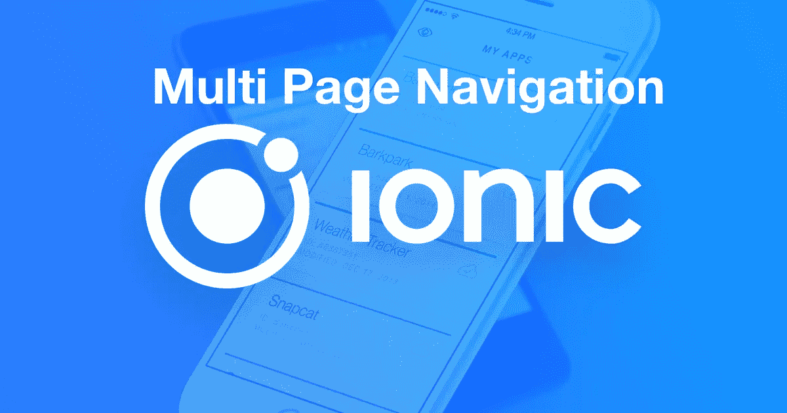
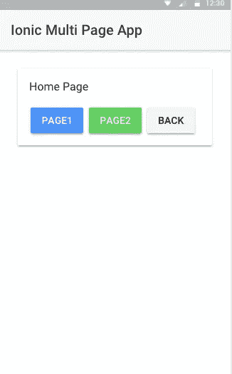
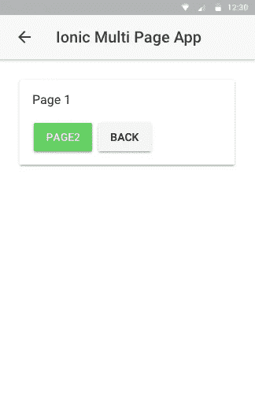
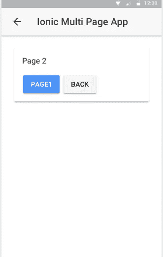

# Ionic 应用程序中的多页面导航

> 原文：<https://medium.com/hackernoon/multi-page-navigation-in-an-ionic-app-8b008f616cdb>

Ionic 使用`NavController`作为导航栈的起源，使得创建多页面导航变得容易。在这个小应用中，我会尽量把概念给你讲清楚。

# 生成应用程序和页面

首先，让我们为这个展示创建一个新的 Ionic 应用程序。跟我来。首先，我们必须搭建一个新项目，我最喜欢的一步到位的 Ionic CLI 命令:

`cd`进入上述 Ionic CLI 命令创建的新项目，运行`ionic serve`查看空白模板，只有一个主页可用。我们将在这个应用程序中创建两个新页面来展示我们的动机。

要了解 Ionic 应用程序中的基本导航，请参见此处。

现在，在 Ionic CLI 的帮助下，让我们在划分代码库之前生成两个新页面。

我将这两个新页面命名为通用页面，但您可以随意命名。导入模块时只需遵循惯例。在`app/pages`中，您可以看到，有两个新文件夹，它们的名称都是我们生成的。每一个都有自己的`.ts`、`.html`和`.scss`文件，这样就完成了一个 web 组件，每一个 Ionic 和 Angular 应用都基于这个 web 组件。

为了继续，我们需要在我们的`app.module.ts`中添加两个页面:

# 基本导航的设置主页

随着`app.module.ts`的更新，整个应用程序的范围现在可以访问这两个新页面。为了实现它们之间的导航，我们必须首先用按钮更新我们的`home.html`，这些按钮将导航到特定的页面和`home.ts`中那些事件背后的业务逻辑。

让我们也更新一下`home.ts`。

`goTo()`功能将帮助我们导航至所需页面，而`back`按钮将带我们进入导航堆栈中的上一页。这很重要！我提到的是上一页，不是主页。如果你熟悉离子 1，这将是如何工作的状态。

# 更新第 1 页和第 2 页

为了继续开发我们的演示应用程序，我们需要更新我们的`Page1`和`Page2`组件。

类似于`Page2`:

# 运行应用程序

如果我们保存所有文件并再次从终端运行:

显示的输出可以在这些屏幕截图中得到最好的描述:

这只是对 Ionic 中多页面导航工作原理的一个粗略介绍，可能有助于您开始开发。

*要获得完整代码，可以访问* [**这个 Github 资源库**](https://github.com/amandeepmittal/ionic-multi-page-nav)

想要收到更多像这样的文章吗？订阅我 [**这里**](https://patreon.us17.list-manage.com/subscribe?u=ad4c168a6d5bb975f2f282d54&id=39e959cecd) **。有时，我会向我的订户发送“从未见过”的内容。**

**我也在推特上**

 [## 阿曼·米塔尔·🖖(@阿曼本人)|推特

### 阿曼·米塔尔·🖖的最新推特(@阿曼本人)。# book blogger @ https://t.co/UQvyNf1OTC |开发者| #Nodejs |…

twitter.com](https://twitter.com/amanhimself)