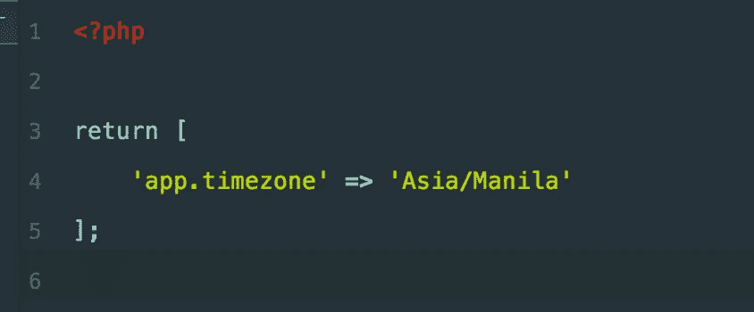
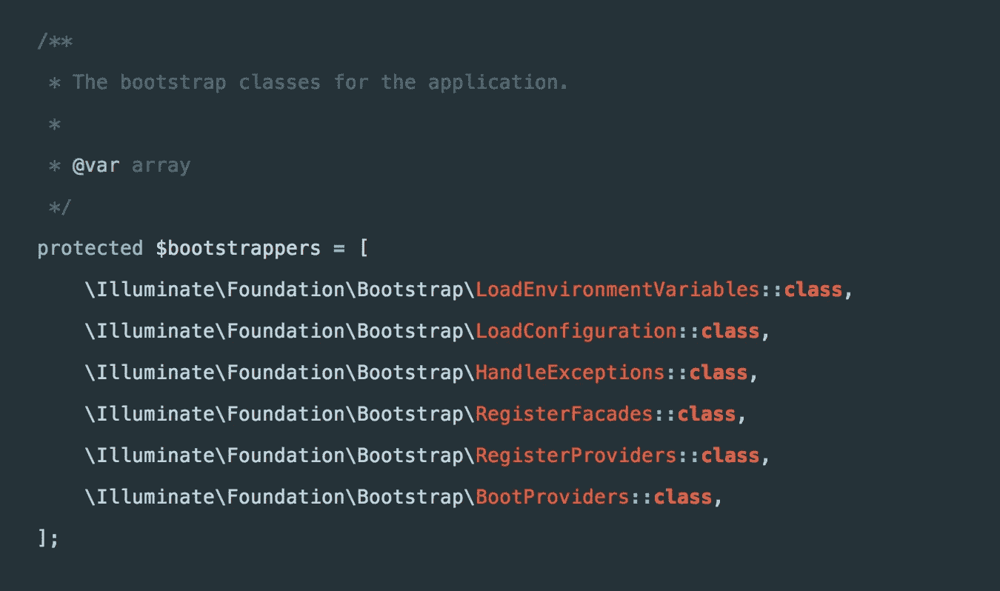
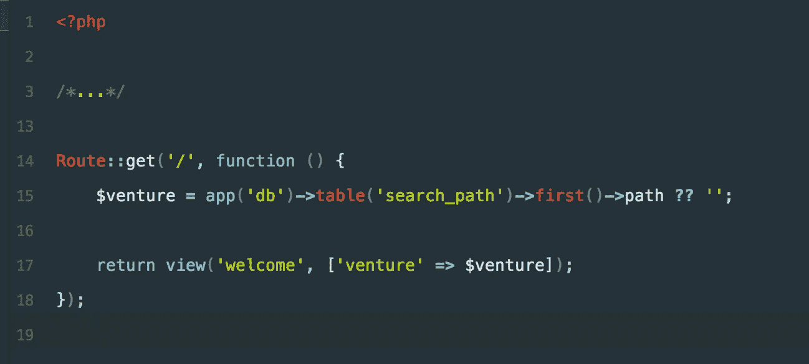
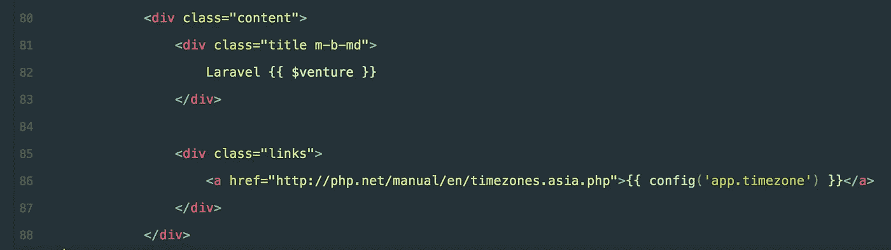
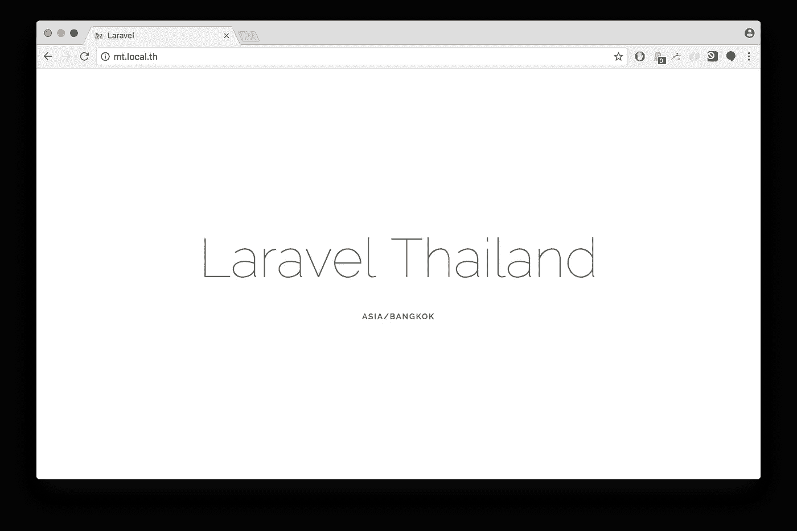
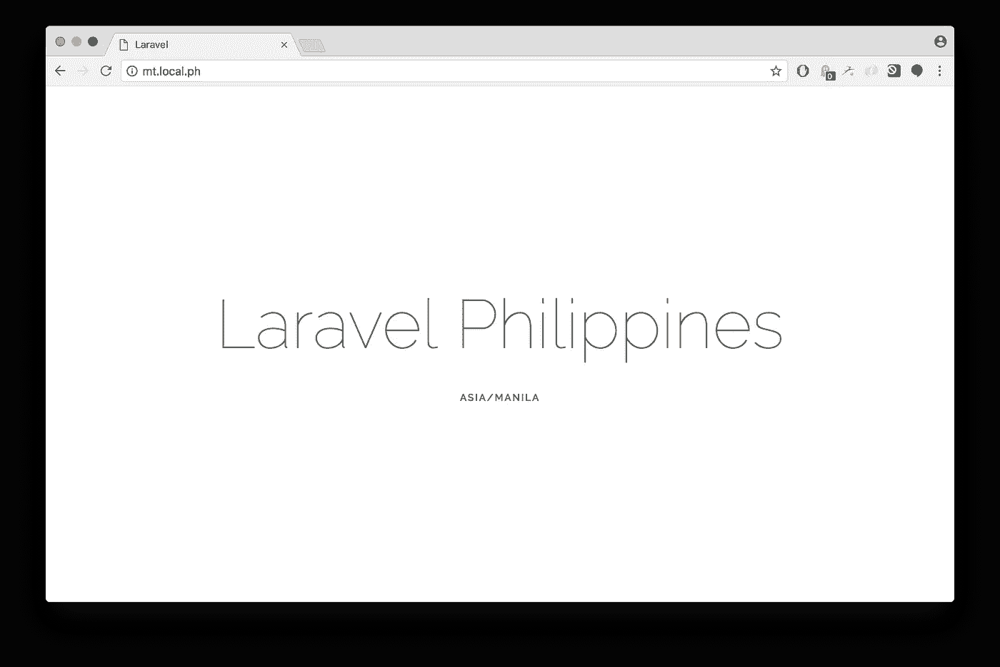

# 具有 Laravel 和 Postgres 的多租户应用程序

> 原文：<https://medium.com/hackernoon/multi-tenant-application-with-laravel-and-postgres-abbb137bdbc8>


比方说，我们有一个 web 应用程序，由 [Laravel](https://hackernoon.com/tagged/laravel) 和 [Postgres](https://hackernoon.com/tagged/postgres) 提供支持，在东南亚的不同国家运行。每个企业都有自己的用户、产品、类别等。因此，为了使它更易于管理，我们希望每个企业都有一个单独的数据库。但是由于我们使用 Postgres，我们可以利用模式，我将很快描述。

> 我使用 Laravel 5.5 和 PostgreSQL 9.5 进行设置。你会发现我会交替使用`Tenant`或`Venture`来代表这个国家。

# 首要任务—租户识别

在我们的多租户 web 应用程序中，我们要做的第一件事是识别发出请求的企业/租户。

在`config`文件夹中创建一个名为`ventures.php`的文件，并为你的冒险添加一个映射。左边是域名，右边是各个域的模式。

现在，在`app/Library`文件夹中创建一个名为`Venture.php`的文件(或者你可以使用任何你喜欢的文件夹；根据需要调整名称空间)。这个类将有一个所有可用的 venture 和 helper 方法的列表，用于从请求 URL &解析 venture 以加载 venture 配置。

上面这段代码中的方法从请求 URL 中解析风险。该方法的第一行获取没有协议的请求 URL([example.com](http://example.com/)而不是[https://example.com](http://example.com/))。然后我们得到所有我们之前添加的有效的风险投资领域来进行比较。最后，如果数据库模式可用，我们返回它，否则，我们默认切换到`public`(或者在`.env`中定义的任何其他值)。

方法加载或替换特定于 venture 的配置。我们将把所有特定于 venture 的配置放在根级别的一个名为`venture_configs`的文件夹中。 *loadVentureConfigs* 方法将检查配置文件是否可用于给定的风险，并加载它。我们使用第二个参数`Repository $config`，因为我们不想覆盖全局配置库对象。如果提供了第二个参数，我们将设置各自的配置对象，而不是全局对象。这将帮助我们*获得*和*设置*风险特定配置。

> 按照我们的设计，全球配置存储库将始终保存来自当前企业的配置。


Venture specific configurations

在这些文件中，我们将使用 Laravel 提供的点符号来覆盖配置值。您的 venture 特定配置文件中的条目如下所示:



venture_configs/ph.php

> 注意:您也可以使用 venture name 作为前缀来分隔同一个文件中的配置。我更喜欢把它分开。

# 配置加载程序

接下来我们需要的是配置加载器。当 Laravel 第一次加载配置时，我们需要告诉它加载当前风险的配置。我们可以通过覆盖负责加载配置文件的`Illuminate\Foundation\Bootstrap\LoadConfiguration`类来做到这一点。

在`app/Bootstrap`目录下创建一个名为`ConfigLoader.php`的文件，并添加以下代码。

这里我们扩展了`Illuminate\Foundation\Bootstrap\LoadConfiguration`类来覆盖`loadConfigurationFiles`方法。注意第 19 行，它通过调用我们之前添加的`loadVentureConfigs`方法来加载特定于 venture 的配置。

困惑`$app['venture']`在这里是怎么工作的？嗯，我只是在`bootstrap/app.php`中添加了一个别名，使其可读性更好。

```
$app**->**alias(\App\Library\Venture**::class**, 'venture');
```

最后剩下的事情是告诉 Laravel 使用我们的 *ConfigLoader* 类，而不是*Illuminate \ Foundation \ Bootstrap \ load configuration*。我们可以通过使用 *ServiceProvider* 来做到这一点。不，不是真的！如果您深入研究 Laravel 的代码，您会注意到配置是在服务提供者之前加载的。



Illuminate\Foundation\Http\Kernel.php

因此，为了覆盖 *LoadConfiguration* 类，我们需要使用应用引导程序(`bootstrap/app.php`)，它在应用引导过程的最开始就被加载。

bootstrap/app.php

上述语句出现在`bootstrap/app.php`文件中的`return $app;`语句之前。

# 数据库隔离

由于我们现在可以识别租户和特定租户的负载配置，剩下的唯一事情就是数据库隔离。对于多租户应用程序，有不同的方法来隔离数据。我们可以为每个租户使用不同的数据库，或者在每个表中使用键值对来表示租户，或者使用不同的模式。每种方法都有自己的优点和缺点，我不会在本教程中详细介绍。

因为我们使用 Postgres，所以我们可以利用 Postgres 模式。模式就像文件夹一样，可以保存表、视图、函数、序列和其他关系。通过利用模式，我们将在保持性能和数据安全性的同时限制成本和复杂性。因此，我们可以为所有运行该应用程序的企业创建一个数据库和不同的模式，而不是创建多个数据库。

创建`VentureServiceProvider`并在`config/app.php`中注册。

在`register`方法中，我们将识别风险并根据需要创建数据库实例。在第一行(第 18 行),我们扩展了数据库对象以使用我们提供的自定义数据库对象。第二行将`pgsql`模式配置更改为我们基于 URL 解决的风险。最后，我们创建并返回一个新的 *DatabaseManager* 对象，它指向当前风险的模式。

> db *别名指向* `*Illuminate\Database\DatabaseManager*` *对象。所以覆盖* db *也将覆盖* DatabaseManager *。*

此时，当您使用带有`app('db')`或`DB::`facade 的数据库对象或 Laravel 提供的任何其他方法时，您将始终获得当前租户或企业的连接。

# 风险特定数据库和配置

那么，我们如何访问特定于风险的数据库模式呢？比方说，当我们连接到`vn`模式时，我们需要在`th`模式中执行一些操作？或者我们需要使用命令行运行一些作业？

在`VentureServiceProvider`中，我们可以为所有模式创建一个数据库对象，并将其推入一个服务容器。我们也可以对配置进行同样的操作。

您可能会认为，在上面的实现中，我们应该在切换第 9 行之后的数据库时也更改 venture 的配置，而不是将其设置在一个新的键中。举个例子，

现在，当我们做`app('db.th')`时，它也将切换到各自企业的配置。但是不，我们不能这样做，因为它会改变你的应用程序的状态，甚至没有意识到这会导致错误。此外，每次我们在另一个合资企业上做一些数据库操作时，我们都需要重置合资企业的配置。

> 在任何给定的执行点，应用程序的状态应该是可预测的。

继续我们的第一个实现，我们可以获得全局或风险特定的数据库和/或配置，如下面的代码片段所述。

请注意，在这一点上，我们只能使用 Laravel 提供的`config()`助手或`app('config')`来获取当前企业的配置。

这使我们的应用程序处于更可预测的状态。

# 测试我们的多租户应用

我有一个数据库与所有 6 家企业的模式。我创建了一个名为`search_path`的表，表中有一列`path`用于所有的风险投资。路径列将具有代表国家的风险值。例如，`th`模式将在`path`列中有值`Thailand`。



routes/web.php

这里，我们使用 Laravel 的默认`welcome.blade.php`文件作为视图。唯一改变的是，我们已经为我们在路线中获得的风险增加了价值。并增加了各自企业的时区配置。



welcome.blade.php

让我们打开`mt.local.th`，这是我们为*泰国*投资的本地域名。我们应该从数据库中获得正确的风险名称，并从配置中获得正确的时区。



mt.local.th

现在，让我们尝试使用另一个域`mt.local.ph`，它是*菲律宾*的本地域。注意风险企业的名称和时区。



mt.local.ph

就是这样！您已经使用 Laravel 和 PostgreSQL 成功创建了一个多租户应用程序。它可能还没有做很多事情，但是它为您的多租户应用程序创建了一个强大的基础。编码快乐！

> 在[下一部分](/@ankitpokhrel/extending-laravels-migration-command-to-add-new-options-90b5a0fc4ef4)中，我们将看到如何扩展 Laravel 的迁移实现，以优雅地处理我们的多租户应用程序的所有模式的迁移。